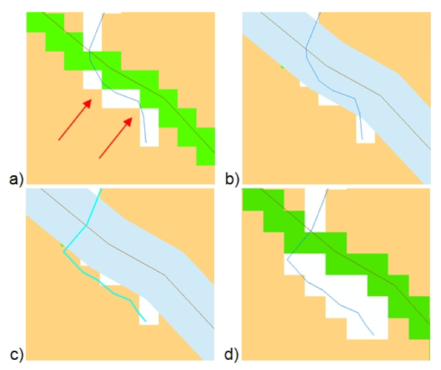
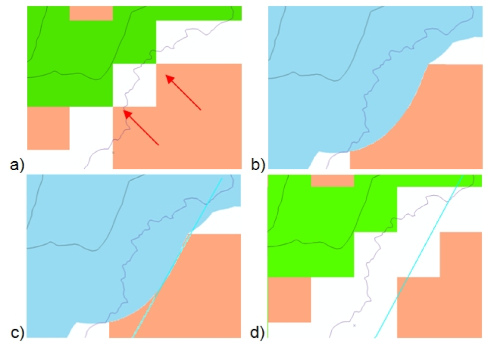
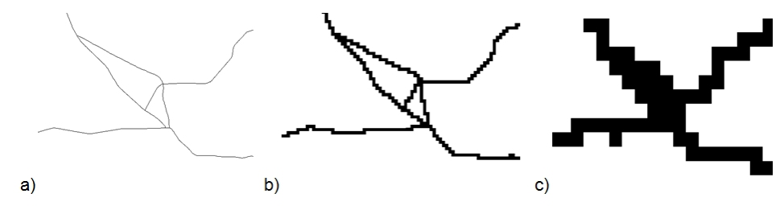
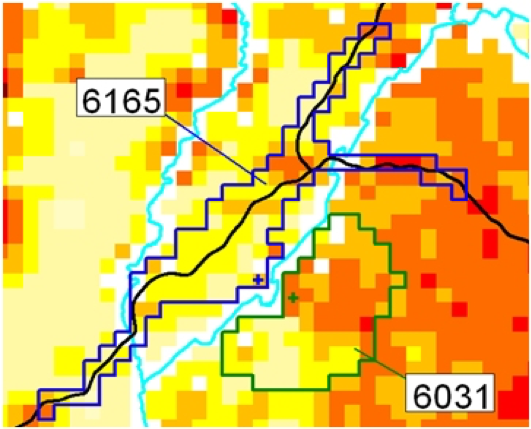

[Units and projection]{.underline} 

AccessMod uses formulae that works with variables expressed in the metric system. To avoid any potential consistency issue, it is necessary for all the geospatial data (raster and vector) to be projected in the same metric coordinate system before importing them in AccessMod.

::: {.callout-warning title="Note"}
AccessMod will not import a DEM that is not in a metric coordinate system. An error message will appear in this case.

An error message will also appear in case you are trying to import a raster format layer that does not present the same coordinate system as the one of the DEM.

For vector format layers, the GRASS engine used in AccessMod automatically reprojects the data sets to fit the DEM coordinate system if this is not already the case.

Users are strongly encouraged to ensure consistency of the projection parameters across all the input layers before uploading them in AccessMod.
:::

In addition, it is recommended that the projection used be an equal-area projection to avoid strong biases in the calculation of surface of the catchment areas and biases in distance along least-cost paths. Examples of equal-area projections can include Albers, cylindrical equal-area projection, Gall-Peters, Lambert cylindrical equal-area, Mollweide, and Werner projections.

[Extent and resolution]{.underline}

All the raster format data used in AccessMod should present the same **extent** in terms of min/max Easting and Northing. If this is not the case, AccessMod will use the extent of the input DEM, and will not consider any data outside of this extent.

In addition**,** all input raster format layers must present the same **resolution** as the one of the DEM.

::: {.callout-note title="Note"}
The GRASS engine used in AccessMod will resample raster format layers presenting a different resolution than the DEM to make it match the DEM’s resolution.

The resampling technique used by the GRASS engine is similar to a "nearest neighbor" one (i.e.. assigning the value in each "new" pixel based on the value stored in the nearest "previous" pixel). However, GRASS is not using a dedicated "nearest neighbor" function in that case, but rather applies a "pixel mask" of the resolution of the DEM over any other raster, and assign the values of the other raster to match the resolution of the DEM. We were not able to specify exactly how GRASS proceeds to do that, so we should not assume the process is a clean "nearest neighbor" attribution. It is therefore strongly encouraged to always ensure that the input raster files have the exact same resolution.

While change of raster resolution may likely be correct for categorical raster such as the the landcover, this is not the case for the population distribution layer as this transformation will not conserve the original total population and can therefore translate in wrong output statistics.
:::

It is important to bear in mind that input vector data sets such as the road network and barriers to movement (e.g., rivers, bodies of water) are converted to grids when generating the merged land cover distribution grid. This conversion is done using the same resolution as the original land cover distribution grid. Depending on this resolution, the conversion can have a direct impact on the spatial relationship between the roads and the barriers in the merged land cover layer.

As a first example, the figure below shows the result of the conversion (rasterization) of a road (black) and river (blue) layer for different resolutions. As we can see, the lower the resolution (i.e. larger raster grid size), the higher the risk to generate an overlap between roads and the rivers, therefore creating artificial “bridges” (red arrows) that do not exist in reality.

AccessMod 5 contains a new function which aims to clean most of these artifacts (see Section 5.5.2). Even so, it is important to be aware of this issue and to check the result of such cleaning because the existence of these artificial “bridges” (passage in the merged land cover layer that does not exists in real life) can greatly influence the result of the accessibility analysis.

In case too many artificial bridges remain after the application of the above mentioned function, two approaches are possible. The approach chosen will depend on the original hydrographic network layer:

1.  ***A situation in which the density of artificial bridges to be corrected is low*** (as indicated in red in the figure below, road in green and river in white). In this case, the user should open the merged land cover, the road and the hydrographic network layers in a GIS software and:

    1.  Generate a buffer with a radius equivalent to 1.75 time the resolution of the original land cover grid (in light blue in figure b below);
    2.  Put the hydrographic network layer in the editing mode and move the concerned segments outside of the buffer area as presented in figure c below (highlighted blue line). You might also want to adjust the way the hydrographic network cuts the road network by placing them perpendicularly as also shown in figure c below;
    3.  Save your edits, import the new layer in AccessMod and run the merge land cover tool once again. The new resulting merged land cover should then look like presented in figure d below. 

    

    2\. ***A situation in which the density of vertex on the segments to be corrected is dense*** (indicated in red in figure a below, road in green and river in white). In this case, open the merged land cover, the road and the hydrographic network layers in a GIS software and:

    1.  Generate a buffer with a radius equivalent to 1.75 time the resolution of the original land cover grid (in blue in figure b below)
    2.  Put the hydrographic network layer in the editing mode and add a new river segment outside of the buffer area as presented in figure c below (light blue line)
    3.  Save your edits and run the first module of AccessMod. The new resulting merged land cover should then look like presented in figure d below

It is important to be aware that the choice of a coarse resolution can generate the merging of separate road segments that are close to each other. This is shown in the figure below where there are artificial intersections between road segments at low resolution (larger grid size). Unfortunately, no correction can be made in this case.

Users also need to be conscious of the impact that the change in resolution has on the travel time in cell where patients are reaching the road network.

More specifically, as roads segments get converted into a raster layer during the creation of the merged land cover, any cell containing a road segment will be considered as fully covered by a road in the merged land cover. As such, the travel speed over these cells will correspond to that of the road segment crossing it.

While the above process does not have much impact when working with high resolution grids (up to 100 meters), working with lower resolution grids does produce an impact because the travel time required to walk between the border of the cell and the road is not taken into account.

For example, consider a patient walking at a speed of 3 km/h to reach a road passing through the middle of the cell on which you can drive at a speed of 100 km/h:

1.  When working at a resolution of 500 meters, the patient would have walked during 5 minutes to reach the road and then 9 seconds to exit it using the road, while in AccessMod this path will be modelled to only take 18 seconds to reach the road network and exit the cell (17 times faster). The error here is therefore equivalent to 4 minutes and 51 seconds
2.  When working at a resolution of 1 kilometer, the patient would have walked during 10 minutes to reach the road and then be on the road during 18 seconds while in AccessMod this will be modelled to only take 36 seconds (16 times faster). The error in this case is equivalent to an underestimate of 9 minutes and 42 seconds.

Once the patient is on the road network in the resulting merged land cover layer then the above remarks no longer applies, since passing from one cell to another is done using the road itself. The error is therefore applied only once and not repeated along the full network. 

In conclusion, as the resolution of the dataset decreases, the extension of the catchment areas tends to be over-estimated and more patients are assumed to reach the corresponding facilities by “saving time” at the transition between the road network and the areas where they have to walk.

Unfortunately, it is not possible to adjust for the above errors. The recommendation is therefore to use the highest resolution possible taking the RAM consumption issue into account (see section 3.2.5).

In addition to the above, the rasterization of elongated water body polygons (and other barriers to movement stored as polygons) does not always generate continuous surfaces, unlike when rasterizing vector lines. Figure 5 below provides an illustration of such a problem. As we can see in figure c below, working with lower resolution (larger grid sizes) will create discontinuities, therefore generating artificial bridges in these areas.

The solution to address this problem is to:

1.  Convert your polygon water body layer into polyline.
2.  Merge the polyline resulting from step 1 with your line format barrier layer (see section 3.3.1.8 for details).
3.  Use both the original polygon layer and the merged line layer as barrier when creating the merged land cover layer in AccessMod.

At the same time, working with low resolution raster format data might lead to some health facilities to be located in a “No Data” area (river network for example). If this happens, the user will have to manually move the facility to the nearest cell. The user should be very careful to move the facility to the correct side of the river/water body. This modification of the location can be considered as an adjustment to the resolution used in the analysis, and its impact on the results of the modelling should typically be very small.

[Accuracy]{.underline}

It is important to have a clear understanding of the level of accuracy of the different geospatial data used for the analysis. As can be seen in the figure below, a facility located on the wrong side of a river will lead to the design of a completely different catchment area and therefore contribute to a different population coverage.

In view of the above, working at the highest resolution possible would seem to be the best option. Nonetheless, it is important to remember that increasing the resolution of the raster layers results in an increase of the size of the files and the required computational time (see section 3.2.5).

Accuracy is also a function of scale (i.e. the ratio of a distance on the map to the corresponding distance on the ground), which is itself directly linked to the resolution of the raster format data used in the analysis (Ebener, 2016). It is therefore important to ensure consistency from an accuracy perspective among the different layers being used in the analysis.
