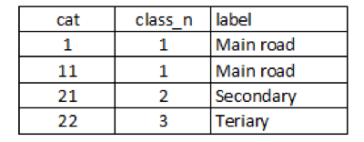

The road network is a key GIS data layer for an accessibility analysis. Because the speed of travel is usually higher on roads, the road network will allow a catchment area to extend much further outward from a health facility and therefore to potentially “capture” a larger part of the target population for a given maximum travel time.

\
An appropriate road network GIS data layer (vector format) should cover the whole network for the study area. The attribute table of this layer should contain at least two columns (see example below):

-   Unique classes (numeric) for each road type (*class_n* field in the example below)
-   Label (text) for each road type (*label* field in the example below)

 {width="300"}

Example of attribute table for the road network layer

A specific travelling speed needs to be attributed to each road type in the “travelling scenario” table (see Section 3.3.2.2).

::: callout-warning
**AccessMod does not make any speed correction due to topographical constraints on roads when the mode of transportation is “MOTORIZED” (see section 3.3.2.2), because it assumes that a negative or a positive slope does not have a significant influence on the speed of motor vehicles.**
:::
