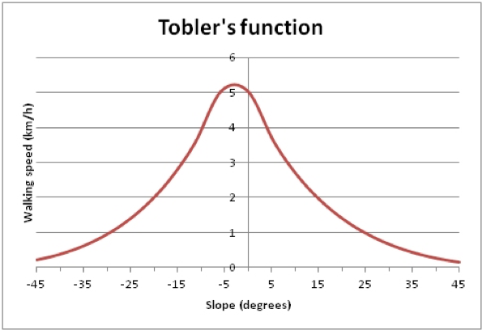

Travelling modes and speeds have a large impact on the results obtained through the different analyses implemented in AccessMod. It is therefore important to take the time to decide on the mode(s) and speed(s) to be used. When available, household and/or health facility surveys that are collecting information about patient movement can be useful, especially if they are capturing patients’ point of origin, destination, the transportation media used, and the time taken to reach their destination.

Examples of travel speed values while walking or driving on a flat surface are presented in the following two tables. 

|                         |                  |
|-------------------------|------------------|
| **Land cover type**     | **Speed (km/h)** |
| Urban and built-up area | 5                |
| Low dense vegetation    | 4                |
| Medium dense vegetation | 3                |
| Dense vegetation        | 2                |
| Bare soil               | 5                |

Example of travel speed estimation on a flat surface per land cover type for walking scenario

|                            |                  |
|----------------------------|------------------|
| **Roads type**             | **Speed (km/h)** |
| Motorway or Highway        | 100              |
| Dual lane roads            | 80               |
| Track, trails or footpaths | 20               |

Example of maximum travel speed for different types of roads (extracted from Toxopeus (1996) and Nelson (2000))

In AccessMod, the scenario table allows for the attribution of a traveling mode (walking, motorized, and bicycling) and speed to each of the classes, and therefore each cell in which movement is allowed, contained in the merged land cover distribution grid (see Section 5.5.2).

The user can easily capture and change scenario and/or speed values in this table to investigate the changes it produces on the output results. Moreover, corrections for different modes of transportation can be applied in this file.

The travelling scenario table can either be created in Excel and then imported in AccessMod (see Section 5.4.1) or manually, created in AccessMod (see Sections 5.5.3, 5.5.4, 5.5.2 and 5.5.7). In both cases, the table is composed of the following four columns (see example in the Table below):

1.  **class:** Merged land cover class
2.  **label:** Merged land cover label
3.  **speed:** Travel speed (in km/h) on flat surfaces. The value must be greater or equal to zero (see below for the latter)
4.  **mode:** transportation mode considered for the given land cover class to be chosen from the following list:

-   **MOTORIZED:** the mode being applied to motorized vehicles when no corrections are being applied on the travelling speed, even if a DEM is used in the analysis.
-   **WALKING:** the mode applied when the population walks. In this case, a slope-based correction is applied to the indicated speed. This correction is based on Tobler’s formula (Tobler, 1993), which basically decreases or increase the effective walking speed depending on the steepness of the slope and this differently for up or down movements.
-   **BICYCLING:** the mode applied when the population uses bikes. A slope-based correction is applied to the indicated speed. See below for details.

|       |                  |       |           |
|-------|------------------|-------|-----------|
| class | label            | speed | mode      |
| 1     | Cropland         | 3.0   | WALKING   |
| 2     | Bare soil        | 5.0   | WALKING   |
| 4     | Dense forest     | 3.0   | WALKING   |
| 6     | Pasture          | 4.0   | WALKING   |
| 1016  | Highway          | 120.0 | MOTORIZED |
| 1017  | National road    | 80.0  | MOTORIZED |
| 1018  | Secondary road   | 40.0  | MOTORIZED |
| 1019  | Residential road | 30.0  | MOTORIZED |

Example of a travelling scenario excel file

Starting from AccessMod version 5.2.1, speeds of zero are allowed in the scenario table. A speed of zero translates into a full barrier status for all concerned cells. However, when a facility falls into a "Zero speed" cell, it will not be taken into consideration in the analysis, in a similar way than facilities falling on barriers (NoData) cells. In this case, such facilities will have a “Yes” label in the “amOnZero” column of the "Selected facilities" table. These facilities will either have to be unselected or their coordinates modified before being able to run the analysis.

Speed corrections due to topography for walking and bicycling modes are computed through the following steps in AccessMod:

1.  Slopes between a given cell and its eight neighbors are computed first.
2.  A correction based on slope and on the transportation mode (walking or bicycling) is computed using the functions reported in the following sub-sections.
3.  This correction is applied to the speed attributed to travelling between any two neighboring cells, as inputted by the user in the travelling scenario table.

::: callout-warning
**Each land cover category (class) found in the merged land cover distribution grid (see Section 3.3.1.4) must have a corresponding entry in the travelling scenario table. If this is not the case, an on-screen warning message asking the user to revise the table will appear in the validation section of the analysis window. The user will not be able to start the analysis until a speed is attributed to each class. Such change can be performed directly in AccessMod.**

**WALKING and BICYCLING corrections are only applied when a DEM, and therefore an anisotropic (slope-dependent) approach, is used in the analysis (see section 3.3.1.2**).
:::

[Speed correction for the walking model]{.underline}

This correction uses Tobler's formula (Tobler, 1993) that links walking speed with the slope of the terrain through the following formula:

{width="200"}

where *V* is the corrected walking speed in kilometers per hour (Km/h), *V~F~* is the walking speed on a flat surface (given by the user-defined travelling scenario delineated here above), and *S* is the slope in hundredth of percent.

A graphical representation of this relation is shown in the figure below, assuming the speed of walking is 5 km/h on flat ground.

[Speed correction for the bicycling model]{.underline}

This correction uses a physical biking model based on air resistance, gravity and frictional force. If the user selects the travelling mode "bicycling" within an anisotropic analysis, AccessMod estimates the power needed to achieve the velocity (and therefore, speed) entered by the user in the travelling scenario. Using this power, along with the slope derived from the DEM, AccessMod can predict the final speed at which the cyclist will cross a given cell.

The model implemented in AccessMod assumes that the increased speed due to negative slope does not exceed twice the speed obtained on a flat surface. A realistic mean value for the speed on flat surface can be around 12 km/h, but note that this can vary greatly with physical condition of the biker, the type of bike, and the road conditions.

The bicycle formula is based on a complex physical model in which several parameters were fixed in AccessMod (which cannot be changed by the user), as follows:

-   Weight of the cyclist : 80 kg
-   Weight of the bicycle : 15 kg
-   Rolling resistance coefficient : 0.012
-   Frontal area : 0.445 m2
-   Wind velocity : 0 km/h
-   Temperature : 20°C
-   Elevation : 500m
-   Transmission resistance coefficient : 0.9

A simplified description of the formula used can read as follows:

*power = (velocity \* resistanceBike + velocity \* velocityTotal \* velocityTotal \* resistanceAir) / efficiencyTransmission*

With:

-   velocity =  velocity of the cyclist on a flat surface
-   velocityTotal = velocity of the wind + velocity
-   resistanceBike = Resistance of the tires and the gravity
-   resistanceAir = Frontal area \* air density
-   efficiencyTransmission = Transmission resistance coefficient
-   power = power necessary to have the bike move at the given velocity on flat surface

The final velocity (Velocity, below) is estimated by resolving a non-linear equation with the Newton's method. The non-linear equation is defined with the following: 

Tv = Velocity + Wind velocity

F   = Velocity \* (resistanceAir \* Tv^2^ + resistanceBike) – efficiencyTransmission \* power

F'  = resistanceAir \* (3.0\* Velocity + Wind velocity) \* Tv + resistanceBike

For the Newton technique, we used a maximum tolerance of 0.05 and maximum 10 iterations. If there is no convergence, the result is set to 0.0 km/h. A graphical example of the corrected speeds in function of the slope for that particular speed is shown in the figure below.

::: callout-warning
**See <https://en.wikipedia.org/wiki/Newton%27s_method> for details on this technique.**

**Please read the documentation at <http://bikecalculator.com/what.html> for a more complete description of the formula implementation.**
:::
