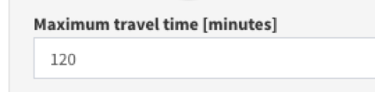

In addition to the maximum population coverage capacity (see previous section), AccessMod also considers the maximum possible travelling time as a limit for determining the maximum extent of the catchment area attached to each health facility.

This figure is being set by the user in the analysis setting tab of the concerned analysis (see Sections 5.5.3, 5.5.4, 5.5.6, 5.5.7).

{width="300"}

The maximum travel time for a patient needing to access a health facility would typically depend on the severity of the patient’s condition. For example, a specific emergency might require the patient to arrive to the health facility within one hour, while a planned preventive care visit (outpatient care) or a scheduled surgical operation (inpatient care) would allow more time for the patient to reach the same facility.

The variables for maximum travel time will therefore have to be carefully determined and based on evidence, for example, in the context of a patient exit survey or through consultation with experts in this area. If this information is not available, a potential approach is to apply AccessMod for different travel times (e.g. 1, 2, or 3,… hours) and look at the resulting population coverage accordingly (USAID, 2016).

When WALKING or BICYCLING, speed corrections are applied to some of the land cover categories if the underlying analysis is set to be anisotropic. This means that the time it takes for a patient to reach a health facility from her or his household is not necessarily equal to the time it takes for that same person to perform the return journey. For this reason, the user is given the choice when doing an anisotropic analysis to select the “FROM” or “TOWARD” the health facilities option (“FROM” facilities indicates that the patient is going from a health facility to their home, while “TOWARD” indicates that the patient is going from their home to the health facility). The output of an analysis therefore always reflects the direction of travel chosen by the user. Note that the differences of outputs between the “FROM” or “TOWARD” modes are likely to be substantial in areas where the topography is pronounced (e.g., mountains/hills, significant slopes, significant barriers to movement).

------------------------------------------------------------------------
