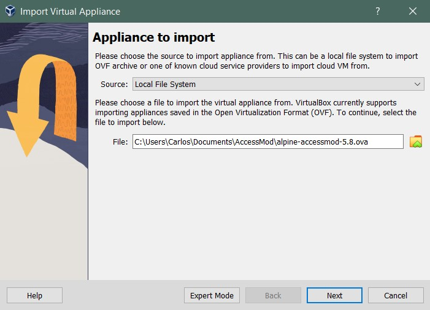
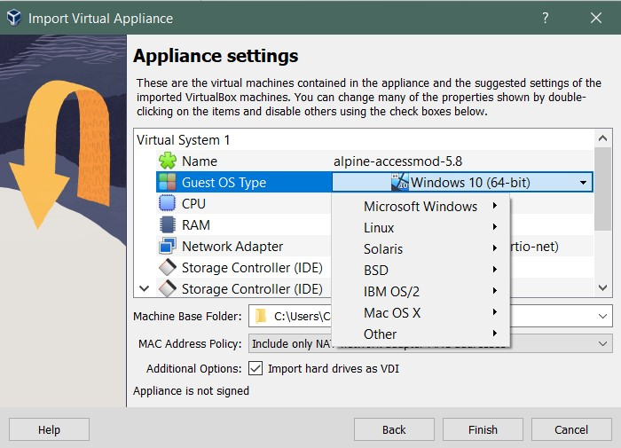
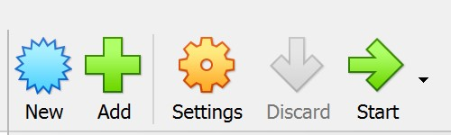
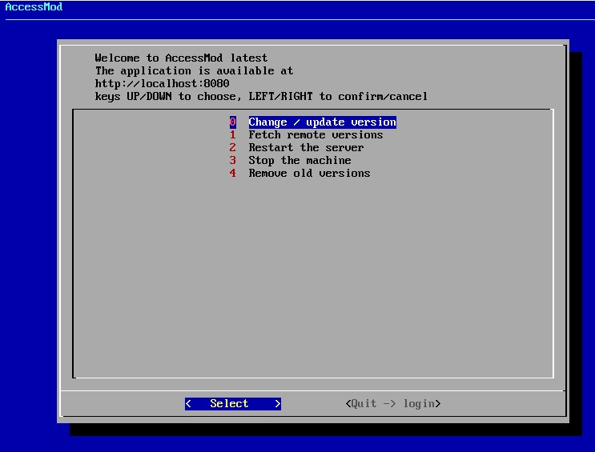
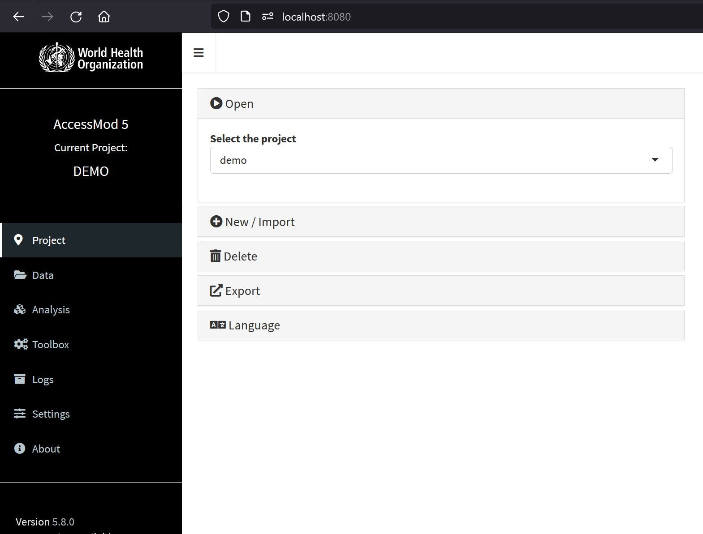
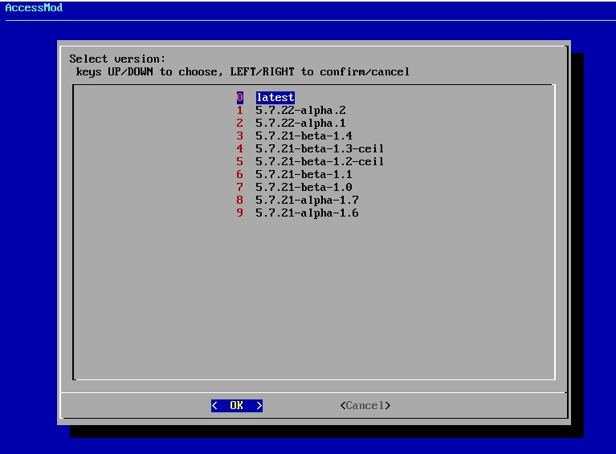
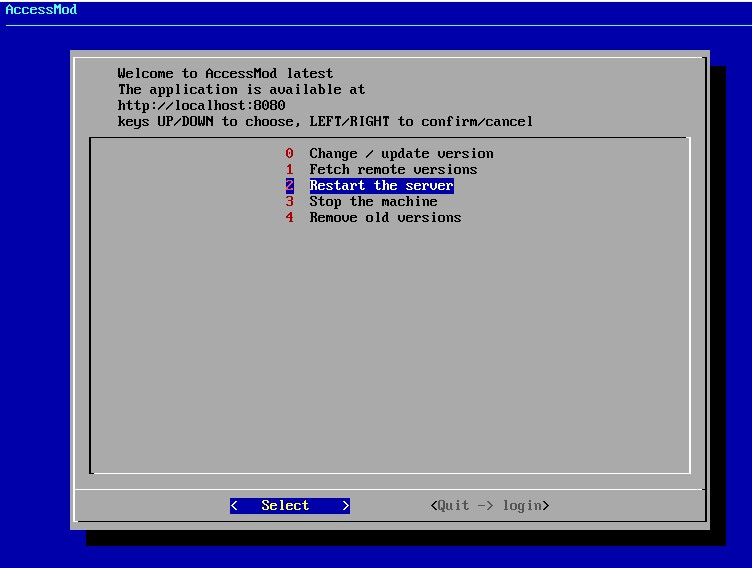

**⭐ This installation process applies to most hardware configurations and operative systems.**

## Installation of VirtualBox {#id-4-2-installationprocessviavirtualbox-installationofvirtualbox}

### Requirements {#id-4-2-installationprocessviavirtualbox-requirements}

Virtual Box is compatible with:

1.  Windows 64-bit (8.1, 10, 11 21H2, Server 2012, Server 2012R, Server 2016, Server 2019, Server 2022)
2.  Mac OS 64-bit (10.15 Catalina, 11 Big Sur, and 12 Monterey. An installer package is available for macOS/Arm64 as a Developer Preview release (look for updates).
3.  Linux distributions 64-bit (Ubuntu 18.04 LTS, 20.04 LTS and 22.04, Debian GNU/Linux 10 and 11, Oracle Linux 7, 8 and 9, CentOS/Red Hat Enterprise Linux 7, 8 and 9, Fedora 35 and 36, Gentoo Linux, SUSE Linux Enterprise server 12 and 15, and openSUSE Leap 15.3).
4.  Oracle Solaris 11.4 (64-bit only)

### Installation {#id-4-2-installationprocessviavirtualbox-installation}

1.  Visit <https://www.virtualbox.org/wiki/Downloads> and get the latest version of the software according to your OS and infrastructure.
2.  Launch the installation of the software as usual for your OS and open it.

For further details and documentation on the use of VirtualBox, please visit the site <https://www.virtualbox.org/wiki/User_HOWTOS>.

## Installation of AccessMod {#id-4-2-installationprocessviavirtualbox-installationofaccessmod}

### Importing and installing the virtual machine {#id-4-2-installationprocessviavirtualbox-importingandinstallingthevirtualmachine}

1.  Download the latest release of AccessMod with extension **`.ova`** from the site <https://github.com/unige-geohealth/accessmod/releases>.
2.  Open VirtualBox
3.  In the menu '*File*' select '*Import virtual appliance***'**, and in the pop-up window find the directory and **`.ova`** file you just downloaded. Hit 'Next'\
    \
    \
    \
4.  Allow time for the virtual machine to load.
5.  When the virtual machine is loaded, it offers the possibility of modifying final appliance settings:
    1.  Modify any of the categories defining the virtual system by double clicking the argument in front.
    2.  You can also set the base folder where this virtual machine will be stored.
    3.  You can increase the default allocated memory and number of processors.\
        \
        \
        \
6.  Click 'Finish' to import the virtual machine
7.  Start the virtual machine by selecting it and clicking on the start icon.\
    \
    {width="400"}\
    \
8.  The user interface will open in a separate window and offer a menu with five options that can be selected and accepted with the arrow keys\
    \
     \
    \
9.  If you have downloaded and installed the latest version you can now open your internet browser and type in the address bar: **localhost:8080\
    \
    \
    \
    **
10. If you installed an older version, you can select option '**0**' in the user interface, where you will be offered the possibility of selecting other versions or upgrading to the latest.\
    \
    \
    \
11. From the same user interface menu, it is always possible to fetch remote versions from GitHub (1), restart the server e.g. after changing the version of AccessMod (2), stop a currently running virtual machine (3), and remove old versions of AccessMod (4)\
    \
    
