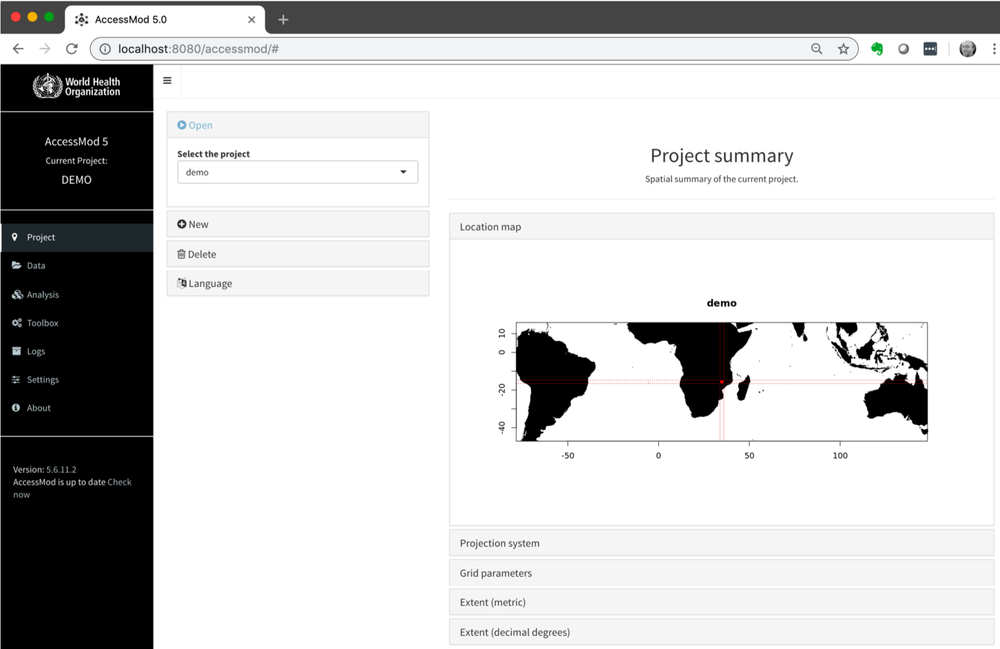

Once the AccessMod Virtual Machine is installed and running in VirtualBox (see previous chapter), you are now ready to use AccessMod.

To do so, open your favorite browser and point to the following URL: <http://localhost:8080>

The following window should appear:

If it is the first time you are running AccessMod, it is important to check if a new version of AccessMod is available, and if so to update AccessMod before continuing. You can do so by going to the "Settings" module and opening the "Show advanced settings" box. In there, if a new version of AccessMod is available you will see an “Install update” button available. When you click on it, the update will take place and will inform you when the update is finished. AccessMod will restart automatically after the update. Additional details on the update panel are found under section 5.9.2.
