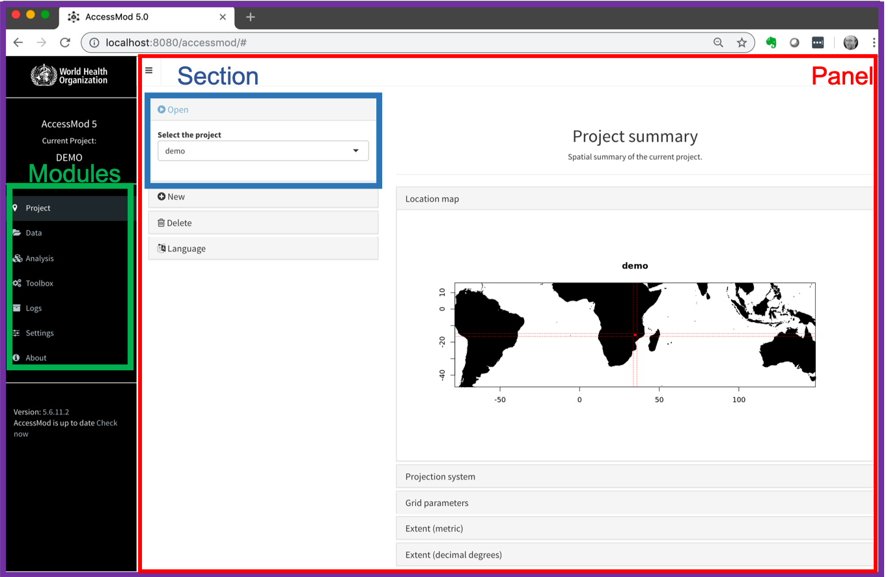

The AccessMod window comports different elements (see Figure below):\
1. The name of the project currently opened (upper left corner)\
2. Modules accessed through the main menu on the left side of the window\
3. Each module gives access to one or several panels\
Each panel is organized into sections

AccessMod is composed of 7 modules detailed in Section 5.3 to 5.9:\
1. Projects: to create new projects or open/delete already created projects.\
2. Data: to import, filter, rename, archive, export or delete data from the current project.\
3. Analysis: to perform the different analyses included in AccessMod.\
4. Toolbox: to perform the different operations included in AccessMod.\
5. Logs: to consult and export the logs (major events) occurring during an AccessMod session.\
6. Settings: to enable advanced options in the modules, and show advanced settings for each tab.\
7. About: contains information about AccessMod’s license and acknowledgements

