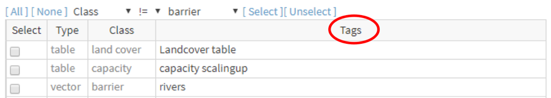
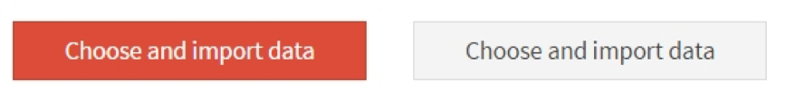

AccessMod uses tags in order for the user to easily identify, filter, export, select, rename or delete the data imported or generated in AccessMod through the use of the different tools.

{width="500"}

Note that these tags can be composed of any text string (letters and numbers), and more than one tag can be given to a given data set. While any tags can be used, the recommendation is to keep tag names as short as possible in order to reduce the length of the file names when exporting outputs from AccessMod. 

Buttons are used to launch operations in AccessMod. These buttons appear in red as long as something remains to be fixed (see the warnings in the validation section/field to identify the problem) and will turn grey as soon as all the necessary information has been provided, as shown in the example presented here:

|  |  |
|----|----|
| {width="500"} |  |
| Something remains to be fixed | Operation ready to be launched |
