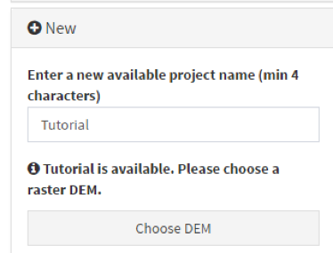

You can create a new project simply by entering a name not already attributed to another project (a warning message will appear if the name in question is already being used) in the *“New”* section as illustrated here:

{width="328"}

You then need to select the digital elevation model (DEM) for the study area by clicking on the “Choose DEM” button and selecting the corresponding files on your hard drive (See Section 3.3.1 for more details on the DEM).

 **The extent and resolution of the DEM will condition the resolution and extent of all raster format layers uploaded in your project or created by AccessMod through the use of the different analysis** (see Section 3.3.1.2).

 This means that the import of other raster format layers presenting a different resolution and/or extent than the ones of the DEM might result in automatic adjustments by GRASS. Such adjustments might have an impact on the analysis. **It is therefore strongly recommended that you check and ensure consistency in terms of projection, resolution and extent across the different raster format layers you are about to import in AccessMod.**

 For this exercise, choose the name “Tutorial”, and upload the DEM file called "rDem\_\_dem.img" from the "DATA/rDem\_\_dem" folder that you have downloaded with AccessMod.

 AccessMod will both upload, and check, the file. During that process, you will see several information messages appearing on the screen.
