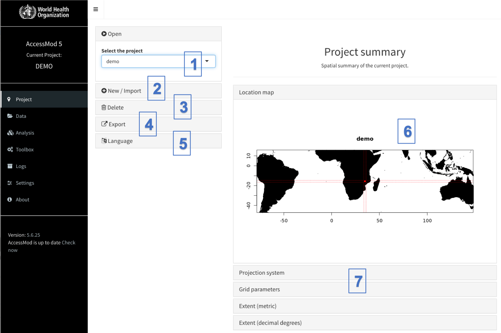

By default, the panel of the “Projects” module is visible when you open AccessMod:

{width="600"}

This panel contains seven sections (numbered in the above figure):

(1)  Open an existing project (Open)

(2)  Create a new project by selecting a project name, and then uploading the Digital Elevation Model layer (New), or import a previously exported project (a \*am5p file)

(3)  Delete an existing project and all its associated data (Delete)

(4)  Export the project (settings and data) in a \*am5p file

\(5\) Choose the interface language, this choice will be kept even when you restart AccessMod

\(6\) Visualize the project summary (Project Summary) that has a map indicating the location and the extent of the project

\(7\) Several pieces of information on the project data: projection system used, grid parameters, extent (in metric and decimal degrees). This information is the raw information coming from GRASS (included in the AccessMod VM).

## In this section

- [5.3.1. Open a project](5-3-1-open-a-project.qmd)
- [5.3.2. Create a new project](5-3-2-create-a-new-project.qmd)
- [5.3.3. Delete a project](5-3-3-delete-a-project.qmd)
