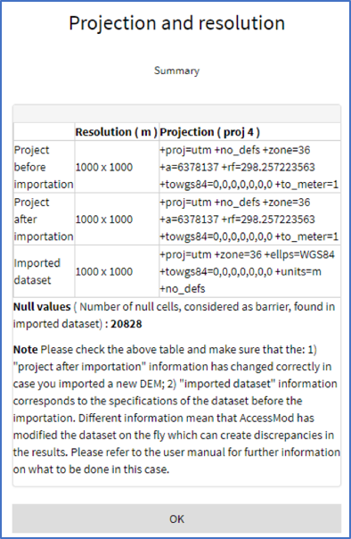

To import data using the “Import” section, you must first decide on the “data class”. Data class in AccessMod defines both the type of data (raster, vector, or table) and the type of content (e.g. land cover, population,...). This allows AccessMod to pre-fill various text fields in the user interface with the correct type of information, which prevents (in many cases) the users to use inappropriate data sets for the analyses.

The various data classes are as follows (with “(r)”=“raster”, “(t)”=“table”, and “(v)”=“vector):

|  |  |  |
|----|----|----|
| **Data class** | **Data type** | **Data content** |
| \(r\) dem | *raster* | digital elevation model (see Section 3.3.1.2) |
| \(r\) land cover | *raster* | land cover distribution (see Section 3.3.1.4) |
| \(r\) land cover merged | *raster* | land cover distribution after the merging with the road network and barriers layers (output of the merge land cover tool - see Section 0) |
| \(r\) population | *raster* | spatial distribution of the target population (see Section 3.3.1.3) |
| \(r\) population residual | *raster* | spatial distribution of the residual population (output of the geographic coverage analysis - see Section 5.5.4) |
| \(r\) imported travel time | *raster* | travel time distribution (obtained through a previous accessibility analysis (see Section 5.5.3) that one wants to reimport into AccessMod |
| \(r\) priority | *raster* | spatial distribution of priority areas used in the scaling up analysis (see Section 3.3.1.10) |
| \(r\) exclusion | *raster* | exclusion zone(s) (see Section 3.3.1.5) |
| \(t\) exclusion | *table* | exclusion criteria used during the scaling up analysis (output of the scaling up analysis - see Section 5.5.7) |
| \(t\) land cover | *table* | link between each land cover categories and their corresponding label (see Section 3.3.1.4) |
| \(t\) scenario | *table* | speed and mode of transport for each class in the merged land cover layer (see Section 3.3.2.2) |
| \(t\) capacity | *table* | types and coverage capacities of new health facilities to locate during the scaling up analysis (see Section 3.3.2.3) |
| \(t\) suitability | *table* | suitability criteria used during the scaling up analysis (output of the scaling up analysis - see Section 5.5.7) |
| \(v\) barrier | *vector* | barriers to movements (polygons, lines, points) (see Section 3.3.1.8) |
| \(v\) road | *vector* | road network, with information on road categories (see Section 3.3.1.7) |
| \(v\) facility | *vector* | health centers location (points) (see Section 3.3.1.6) |
| \(v\) zone for stat | *vector* | zones (polygons), typically administrative units, for used to extract statistics during the zonal statistics analysis (see Sections 3.3.1.9 and 5.5.6) |
| \(v\) exclusion | *vector* | exclusion zone(s) (polygons) in which no new health facility can be located during the scaling up analysis (see Sections 3.3.1.5) |

Next, you are asked to provide a tag and to check the validation information for the data you are about to upload. Once all is good, the “Choose and import data" button will turn grey and you will be able to select the corresponding file(s).

Please look at the beginning of Section 3.3.1 for more information regarding the file(s) that needs to be selected depending on the format used for geospatial data, and at the beginning of Section 3.3.2 for the list of tabular formats supported by AccessMod.

After the importation process, a window specific to the data format will appear:

-   In the case of an upload of a vector or tabular data set, the window will either display a message indicating that the upload was done without any problem or an error message. Please address the issues reported in the error message when applicable. It is a good practice NOT to import twice a shape file that has the same filename during a given session, and this even if the tag is changed. In this case, it is better to first change the filename of the shape file before importing it
-   In the case of an upload of a raster data set, the window will display some information on projection and resolution as shown in the following example:

The table in this window contains three rows:

-   The **first row** of the table provides the resolution (in meters) and the projection parameters of your project [before]{.underline} the data set is imported. These projection and parameters are set in the GRASS environment of AccessMod and conditions all results in your project (i.e. all output raster data sets will adhere to these resolution and projections). The number and type of the projection parameters come directly from the GRASS environment and can differ from one projection to another. In the example above, one can see that the projection is UTM ("+proj=utm"), the UTM zone is 36 ("+zone=36"), and the projection is a metric one ("+to_meter=1")
-   The **second row** of the table provides the same information after importation. In most cases, these should be identical to the first line, and therefore confirm that there have been no changes. In the case where you import a new DEM in your project with a different resolution than the original DEM, you will see here a different resolution in the second line, which implies that the resolution of your project has now changed and that all output raster created in any subsequent analysis will have this new resolution. This implies that all the previously imported raster format layer will be resampled according to the resolution of the new imported DEM. This operation might generate discrepancies an and errors in output. The recommended approach if you modify your DEM is to also adjust all the raster format layers in a GIS software for all of them to be consistent with the new DEM (projection, resolution, snapping) before re-importing them in AccessMod.
-   The **third row** of the table provides the resolution and projection parameters of the data sets that you have imported. In this line, the way the projection parameters are indicated might differ slightly compared to the first two lines. This is due to the function AccessMod is using to fetch this information from within R-Shiny (in this case the projection information function from the "gdal" library, and not from the GRASS library as in the first two rows of this table). You can see this difference in the screenshot above, although the imported data set has got the same projection parameters as the project. The information reported here should correspond to those attached to your data set before the importation. A different set of information on the projection parameters means that GRASS has modified the dataset on the fly (i.e. automatically), which can create discrepancies in the results. In this case, we recommend to modify the layer to match the specification of the project inside a GIS software and to re-import the modified layer into AccessMod.

In future versions of AccessMod, the intent is to develop an advanced projection verification module that should be able to warn the user if there is any important mismatches among the imported data sets in term of resolution and projection.
