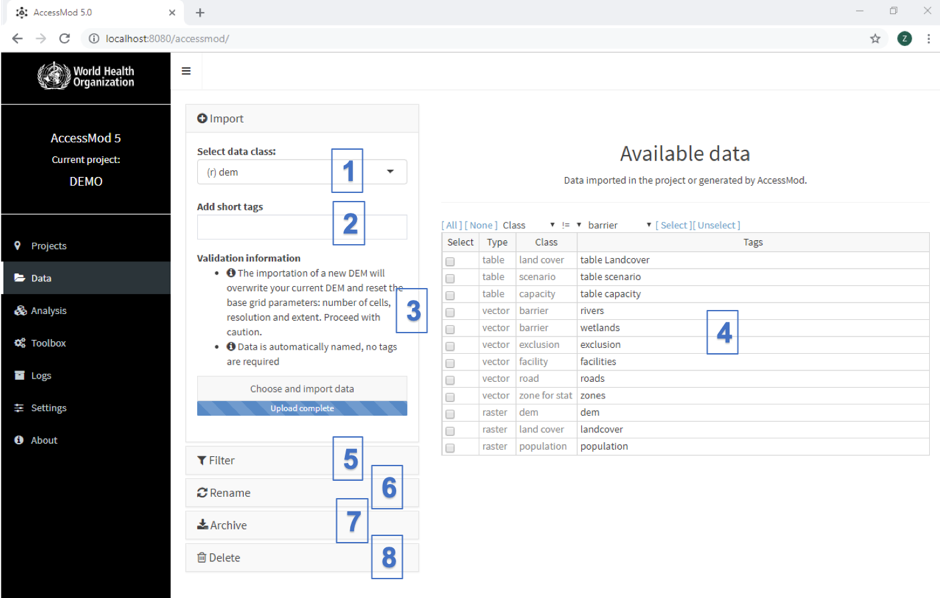

The Data module allows you to import your data sets into AccessMod, to rename and delete them, and to export your results outside of AccessMod (i.e. outside the virtual machine) for further analysis or display in a GIS software (e.g. QGIS, ArcGIS, GRASS,...).

The data module panel is composed of the following eight sections (numbered in the above Figure):

(1)  Drop-down menu to select the data class to be imported.

(2)  Text field to enter tag(s) to the data sets to be imported.

(3)  Validation information about the import process. Possible format issues are listed here. By clicking on the button "Choose and import data", you will upload each selected data set in the project.

(4)  Table listing all data sets currently in the project, including inputs and outputs.

(5)  Filter data sets from the table by data type (vectors, rasters, or tables), and/or any piece of text through a search across all fields and/ or specific tags.

(6)  Rename one or several tags by modifying them directly in the table and saving the changes.

(7)  Archive (zip) the selected data set(s) in the table and export this archive from the AccessMod Virtual Machine to your computer's operating system disk space (see Sections 3.3.1 and 3.3.2 for more information regarding the exporting formats).

(8)  Permanently delete selected data sets.

## In this section

- [5.4.1. Import data](5-4-1-import-data.qmd)
- [5.4.2. Filter the data](5-4-2-filter-the-data.qmd)
- [5.4.3. Rename the data](5-4-3-rename-the-data.qmd)
- [5.4.4. Archive and export the data](5-4-4-archive-and-export-the-data.qmd)
- [5.4.5. Delete the data](5-4-5-delete-the-data.qmd)
