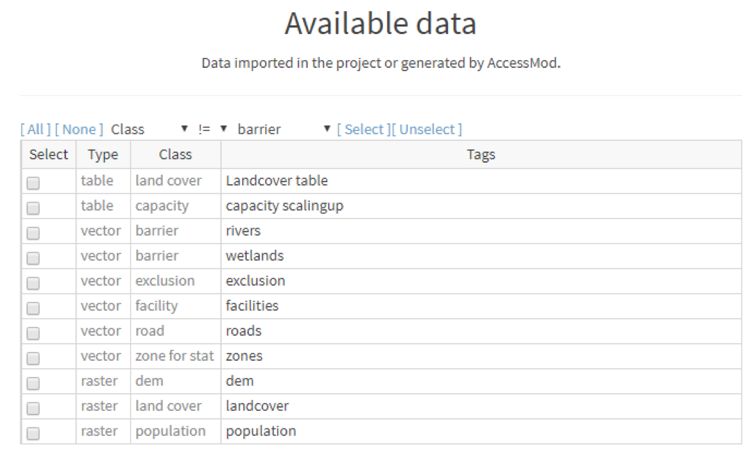

In this section, we import the sample data for a region in Malawi. This data will be used in the following exercises to model accessibility to a small (fake) health center network. The data sets are found in the folder “sample” that comes with the zip archive of the user manual.

 In this particular dataset:

-   The "raster" format files are stored as GeoTIFF files (\*.img extension). The files presenting this extension should be selected during the import
-   The vector format files are stored as "shapefiles". All the four basic files that constitute a “shapefile”, namely the files with extensions \*.dbf (attribute format), \*.prj (projection format), \*.shp (shape format), \*.shx (shape index format), should be selected during the import

 Import the following files in AccessMod, using the indicated data class and tags.

|  |  |  |
|----|----|----|
| **Data class** | **File (/DATA/…)** | **Tags** |
| \(r\) landcover | *rLandCover\_\_start/rLandCover\_\_start.img* | landcover |
| \(r\) population | *rPopulation\_\_start/rPopulation\_\_start.img* | population |
| \(t\) land cover | *tLandCover\_\_ldcv/tLandCover\_\_ldcv.xlsx* | Landcover table |
| \(t\) capacity | *tCapacity\_\_ScaUp/tCapacity_scalingUp.xlsx* | capacity scalingup |
| \(v\) barrier | *vBarrier\_\_rivers/vBarrier\_\_rivers.shp* | rivers |
| \(v\) barrier | *vBarrier\_\_wetlands/vBarrier\_\_wetlands.shp* | wetlands |
| \(v\) road | *vRoad\_\_start/vRoad\_\_start.shp* | roads |
| \(v\) facility | *vFacility\_\_start/vFacility\_\_start.shp* | facilities |
| \(v\) zone for stat | *vZone\_\_start/vZone\_\_start.shp* | zones |
| \(v\) exclusion | *vExclusion_area/Exclusion_area.shp* | exclusion |

Once the files are imported in AccessMod, the “Available data” table should contain the following rows in the panel of the data module:

