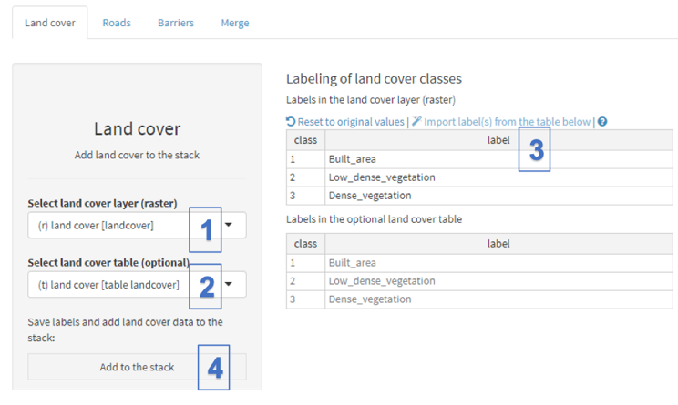
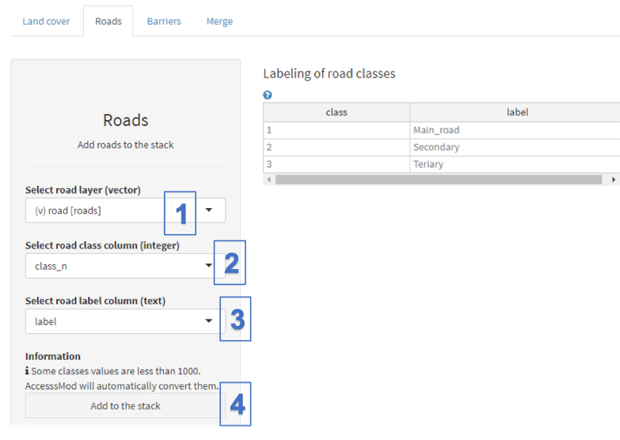
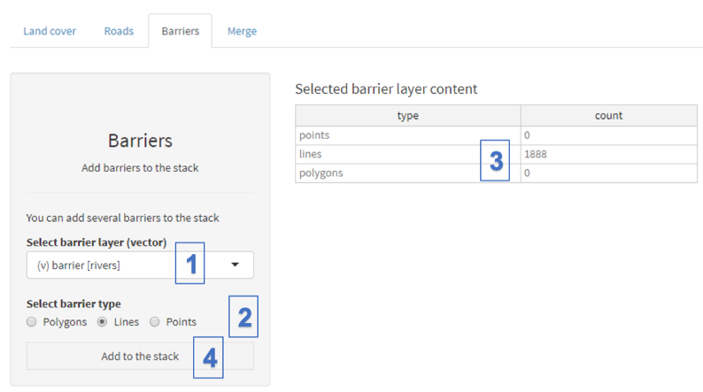
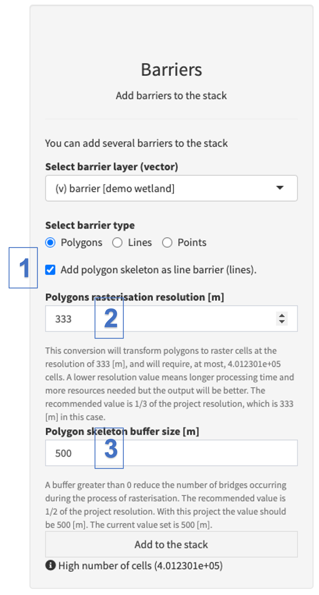
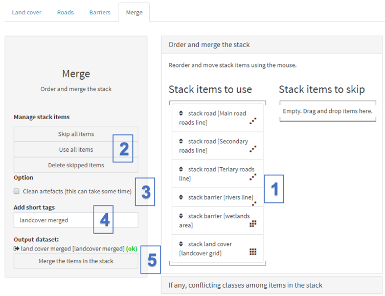
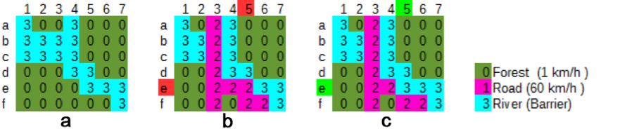
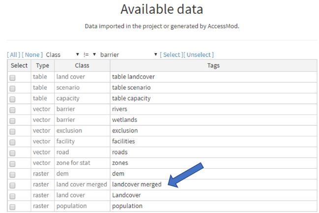
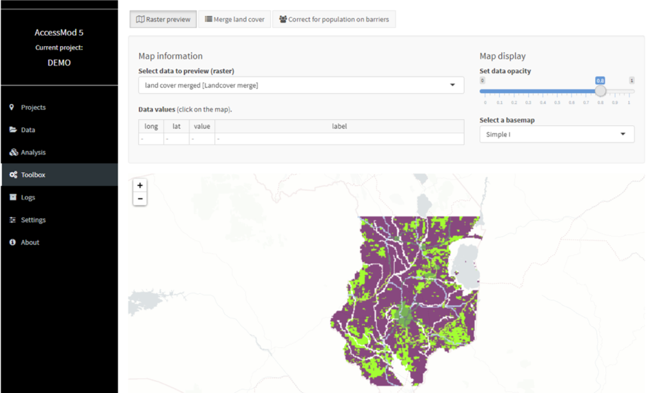

The first necessary step is to obtain the raster format land cover layer used in AccessMod by merging the road network, the hydrographic network (rivers and water bodies) and background land cover layers together. This is done using the tool “Merge land cover” found in the Toolbox module of AccessMod.

 Merging these different layers can be done outside AccessMod using a GIS software that handles raster format data, but the process can be quite complicated, and therefore time consuming, especially if priorities need to be attributed to the different road types and/or if artifacts generated by the merging need to be cleaned (see Section 3.3.1.1). This is why AccessMod offers a simple, yet comprehensive, way to perform the merging process effectively, while taking the above into account.

In the following exercise, we are going to use AccessMod to merge the different layers previously imported, in order to obtain the final raster format land cover used in the subsequent analyses.

 The merging takes place through the implementation of the following steps:

1.  Adding the different layers into the stack
2.  Ordering the different layers included in the stack
3.  Merging the ordered layers to obtain the final land cover layer

 These steps are described in more detail in the following sub sections.

 [Adding the different layers into the stack]{.underline}

 Start by selecting the "Merge Land cover" tool from the "Toolbox" module. Add the original land cover layer to the stack using the "Land cover" tab and the following steps:

(1)  Select the available original land cover layer from the drop-down list.

(2)  Choose the land cover classification table (see Section 3.3.2.1) that makes the link between each land cover class (integer numbers) and the corresponding label (text strings). If a table is selected (as shown in the above figure), its content is loaded and shown in the bottom table of the "Labeling of land cover classes" section.

\(3\) Select "Import label(s) from the below table" in order to copy the values from the bottom table to the upper table. This upper table is editable, and therefore allows you to modify the label of each category if needed. However, the class IDs cannot be changed.

(4)  Click "Add to the stack" to add this layer to the "stack" of layers to be merged.

 Add the road layer to the stack using the dedicated "Roads" tab, through the following steps:

(1)  Select the road class vector layer from the drop-down list; this should pre-populate the attribute table on the right-hand side of the screen

(2)  Select the field from the attribute table of the road layer that contains the different road classes (INTEGER value).

\(3\) Select the column from the attribute table of the road layer that contains the labels for the different road classes.

(4)  Click "Add to the stack" to add each road type as a separated layer in the stack.

::: callout-warning
**AccessMod will automatically reclassify road classes that present a value below 1000. This is done in order to avoid any overlap with classes that could be used in the original land cover layer. This situation is illustrated in the above figure where the road classes being used are 1, 2, and 3.**

**This is the reason why the above image includes a message just above the "Add to the stack" button "Some classes values are less than 1000. AccessMod will automatically convert them." **
:::

The next step is to add barriers to movements (i.e. areas that cannot be crossed by the population). In the present exercise, two layers are added through the use of the "Barriers" tab: rivers and wetlands (water bodies):

To add rivers as barriers in the stack:

\(1\)  Select the "barriers" class vector layer that contains rivers from the drop-down list.

\(2\)  Verify that the barrier type corresponds to "Lines" in this case (note that the selection is automatic based on the majority of feature types (lines, polygons, points) in the vector data set, as displayed in the table (3)).

\(3\) The content table here does not allow for editing and indicates the number of objects contained in the selected barrier layer based on the type (points, lines and polygons).

\(4\)  Click on "Add to the stack" to add this layer to the stack.

Then add the wetlands as barriers, by using the "barriers" class vector layer that contains the wetlands.

When adding polygon barriers, there is an option to "Add polygon skeleton as line barrier (lines)" (see below). If checked, this option ensures that the full surface of an elongated barrier polygon is rasterized without any "fake bridge" through which movement could happen (see examples and discussion in [Github issue #259](https://github.com/unige-geohealth/accessmod/issues/259)). The two parameters "Polygons rasterisation resolution \[m\]" and "Polygon skeleton buffer size \[m\]" in special cases where default values are not satisfactory. Description of this parameters are given in the interface. It is recommended to use this option with the default parameter values, especially if you have thin and elongated polygon barriers (e.g. rivers as polygons). Beware that the precessing time for this skeleton process can take a long time if you have a lot of barriers polygons and are working at high resolution.  

{width="320"}

\(1\)  Select the option "Add polygon skeleton as line barrier (lines)"

(2)  Leave the default value for the parameter "Polygons rasterisation resolution \[m\]"

\(3\) Leave the default value for the parameter "Polygon skeleton buffer size \[m\]"

You can the add the polygone barrier to the stack.

Once lines and polygons barriers have been added to the stack, the different layers in the stack can be ordered and merged to obtain the merged land cover layer.

[Ordering and merging the different layers the stack]{.underline}

The "Merge" tab allows users to order the layers before merging them.

The objective of the ordering is to define which layers from the stack will be overlaid on top of the others. This is important to define, for example, if the roads are allowed to cross rivers (bridge) or need to be considered as under water (i.e., flooded).

At the same time, the possibility to order the different road classes in the stack allows users to define which road class will have the priority over other road classes when there are cross-roads. This is of particular importance when the datasets used are at low resolution.

**Note that starting with version 5.6 of AccessMod, the stack items will first be located under "Stack items to skip". You first need to drag-and-drop them to the "Stack items to use".**

The ordering will be performed as follows in the context of the present exercise considering that roads allows crossing barriers (bridges):

\(1\)  Place the road layers **on top** of the two barrier layers, and with the landcover layer **at the bottom** of the stack to simulate roads passing over the rivers and wetlands (bridges), and rivers and wetlands representing natural barriers to movement in the landcover. You can order each layer by clicking on it, holding the left button of the mouse and moving it to the desired place in the list.

\(2\)  You can use the buttons on the left-hand side to:

-   Define items to be skipped during the merge after dragging and dropping them in the "Stack items to skip" part of the section. These items will not be included in the merged land cover layer. This option could for example be used to temporarily remove one particular type of roads from the stack and therefore the resulting merged land cover layer
-   Skip all the items from the stack by clicking on the "Skip all items" button on the left. However, doing this would not allow creating a merged land cover layer as the stack would be empty.
-   Delete the items placed in the "Stack items to skip" part of the section by clicking on the "Delete skipped items" button on the left. However, this action cannot be reversed; the layer in question will have to be added once again to the stack if needed
-   Bring all the items placed in the "Stack items to skip" list back into the stack by clicking the "Use all items" button on the left

\(3\)  The "Clean artefacts (this can take some time)" option allows users to make topological corrections after adding roads to the stack. In Figure 1 we can see that adding the layer of roads produced an artificial bridge (artefact) between cell e5 and cell d6, which appears to cross the river, while the road actually does not cross it. AccessMod can automatically remove these kinds of artificial bridges.

If you choose this option, AccessMod will output an additional raster data set that will show the locations of the cells that were identified as artificial bridges and that were removed by transforming them to barrier cells. The name of this additional data set is the name of the merged landcover, plus "bridge" (in our case here, it will be called "landcover merged bridge"). In this data set, cells that were artificial bridges have a value of 1, while all other cells have "No Data" values.

You can see this data set in the Data table (after the land cover merge process) only if you have selected "Enable advanced options in modules" in the AccessMod "Settings module" (see Section 5.9.1 below), and if you have selected “Show internal data" in the "Filter" section of the "Data" module. Please note that applying this topological correction process can significantly increase calculation time especially on big datasets, because each cell has to be processed by the algorithm.

\(4\) Give tags to the final merged land cover layer, "landcover merged" in the present example.

\(5\) Hit "Merge the items in the stack" to merge all layers that are listed in the "Stack items to use" list.

 A transparent window with some text and a progress bar will appear in front of the panel while the merging is occurring. Please wait until this window disappears to continue using AccessMod. Once the merging process has finished, go back to the "Data" module where you will see the new layer "landcover merged" appearing in the list, ready to be used for the different analyses:

To verify that this merged land cover layer is the desired one, you can visualize it by going in the "Raster Preview" tool of the Toolbox module, and by selecting this layer in the drop-down menu:

Please refer to Section 5.6 for more details on this tool.

Note that the "Raster preview" module is not intended to be a fully-fledged GIS visualization tool, and its functionalities are limited. If you want to check more thoroughly if this layer has got the intended raster values, it is highly recommended to export it from AccessMod using the data module, import it in your GIS software and check its content before using it for the different analysis offered by AccessMod.
