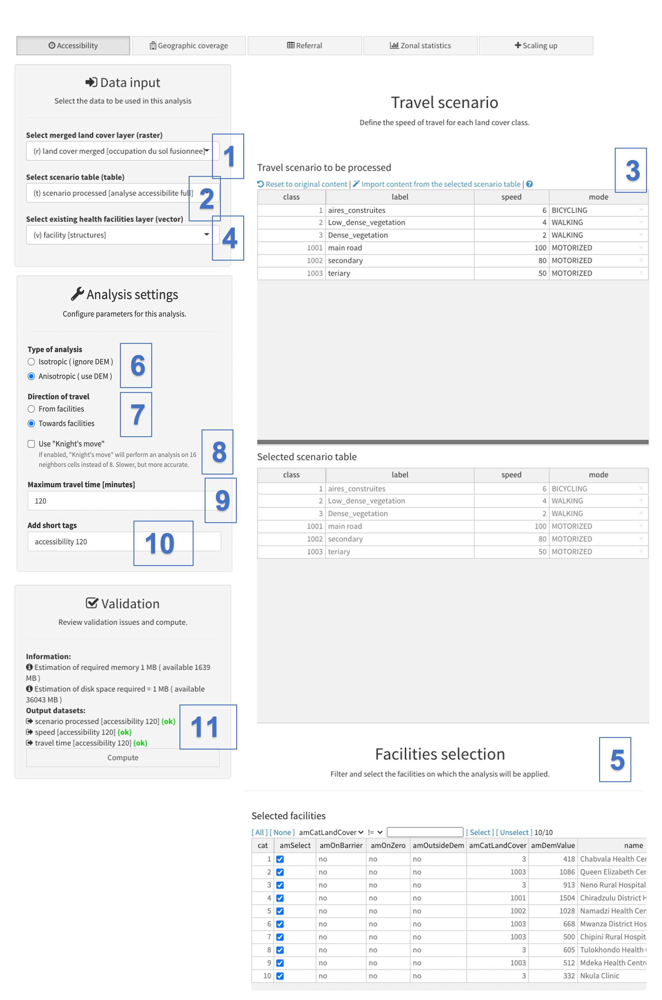
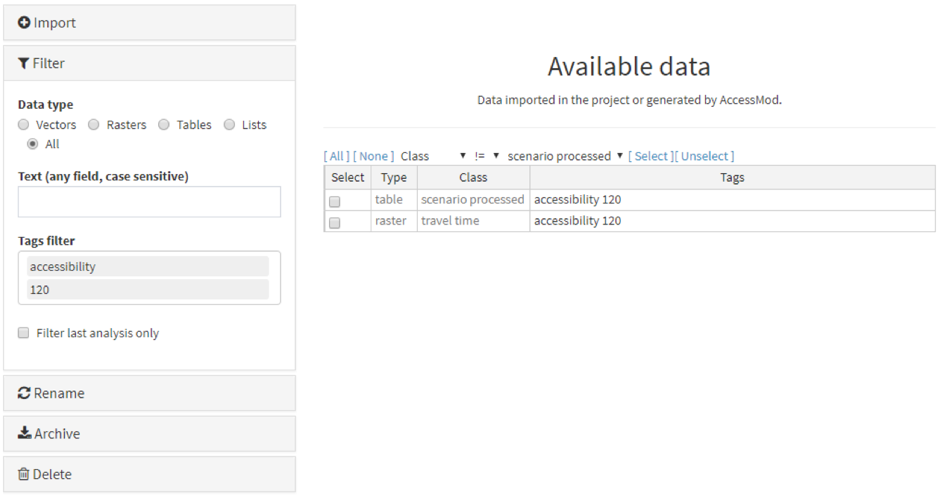
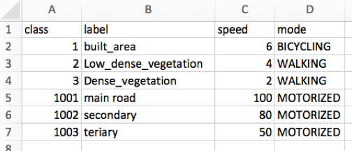

The Accessibility analysis allows you to compute the spatial distribution of travel time to or from the nearest health facility(ies) considered in the analysis, taking into account a specified maximum travel time.

 This analysis also takes into account landscape constraints and the travelling scenario table that defines the travel speeds for each of the merged land cover classes. The spatial distribution of the target population is nevertheless not taken into account in this analysis as not having an influence on travel time.

 To learn about this analysis, you are going to create a two-hour travel time distribution grid for 10 health facilities located over the demo area, by using the merged landcover layer created in the previous chapter.

 As a next step, select the "Accessibility" analysis from the "Analysis" module, and fill the various fields as indicated here:

{width="700"}

[Data inputs:]{.underline}

 Under:

\(1\) “Select merged land cover layer (raster)”: Select here the merge land cover layer ("land cover merged \[landcover merged\]") that you have produced as outlined in the previous section above.

\(2\) “Select scenario table (table)”: Use the drop-down menu to select an existing travel scenario table if imported in the project. An empty drop-down list indicates that no such table has been imported (example shown here above). 

\(3\) “Travel scenario to be processed”: Use this section to define the travel speed and mode of transportation (walking, bicycling, motorized) attached to each class in the merged land cover layer by:

-   Importing the content from the selected scenario table if such a table has been imported in the project (see point (2)), by clicking on the "Import content from the selected scenario table" option.
-   Manually editing the information reported in the "label", "speed" and/or "mode" columns by just double clicking on the relevant cell. This is a handy way to quickly create, modify speed and/or mode of transport without the need to modify an external Excel table. Please note that the final information entered in this table at the time of running the analysis will be saved in a new scenario table with the "scenario processed" class and the same tags as the ones entered under point (9)

\(4\) “Select existing health facilities layer (vector)”: Use this field to select the layer that contains the location of the health facilities to be used in the analysis.

\(5\) "Selected facilities": The content of the attribute table of the selected health facilities location layer will appear in the section of the panel. This table allows you to select the health facilities that you want to consider in the analysis. All the facilities are selected by default but this can be changed either by un-checking facilities using the check buttons from the "amSelect" column or by using filtering/selection rules using one or several filters using the filter tool at the top of the table. This filter tool is straight forward to use: one can construct a filter rule by combining any of the attribute column with operators and associated values (e.g. "capacity \>= 1000", "hf_type == Health Centre").

::: callout-warning
**The columns presenting a label starting with “am” are not coming from the attribute table, but have been generated by AccessMod. These particular columns are the following:**

**- "amSelect": allows you to select/unselect the facilities to be run in the analysis**

**- "amOnBarrier": informs whether the health facility is located (“yes”) or not (“no”) on a barrier. The analysis cannot be performed if health facilities are located on barriers. If one or several of the health facility(ies) is/are located on a barrier, you can do one of two options:**

-   **Decide to proceed without the facility(ies) in question by un-selecting them from the "amSelect" column and proceed. However, beware that in this case the results from the analysis will not consider the entire health facility network.**
-   **Correct the health facility layer to move those located on barriers. This can be done either using the dedicated AccessMod tool (see Section 5.6) or in your GIS software outside of AccessMod (in this case the new updated layer must be imported in AccessMod).**

**- "amOnZero": informs whether the health facility is located (“yes”) or not (“no”) on a landcover category that has a speed of zero set in the travel scenario table. In this case the analysis cannot be performed, and you can do one of two options:**

-   **Decide to proceed without the facility(ies) in question by un-selecting them from the "amSelect" column and proceed. However, beware that in this case the results from the analysis will not consider the entire health facility network.**
-   **Correct the corresponding speed(s) of travel in the travel scenario table, by giving them a value greater than zero.**

**- "amOutsideDEM": informs whether the health facility is located (“yes”) or not (“no”) outside of the DEM extent (i.e. outside of the extent of the project). Facilities that are outside the DEM extend cannot be considered in the analysis and their coordinates must be corrected if there are supposed to be within the DEM extent.**

**- "amCatLandCover": provides information on the land cover category, i.e. the pixel value in the land cover raster layer. **

**- "amDemValue": provides information on the DEM, i.e. the pixel value in the DEM raster layer.**
:::

\(6\) “Type of analysis”: Select the type of analysis you want to conduct: isotropic (ignores the DEM and is slope-independent) or anisotropic (uses the DEM and is slope-dependent). In this exercise, we will select “Anisotropic” under "Type of analysis". This implies that the DEM is used to compute slopes, that are in turn used to modify the speed of travel indicated in the travel scenario table when either the "walking" or "bicycling" travel modes have been chosen for at least one landcover category. Refer to Section 3.3.2 for details on how the slope affects speeds of travel. If the "isotropic" type of analysis is chosen, slopes have no effects and the speeds of travel are not corrected.

\(7\) “Direction of travel”: Choose the direction of movement considered for the patients, either "From facilities" or "Towards facilities". This choice is only visible when an anisotropic mode has been chosen, because the direction of travel can influence the time of travel. To do the exercise, choose "Towards facilities".

\(8\) The option to use "knight's move" allows one to perform an analysis on 16 neighbors cells instead of 8. It is slower, but more accurate and tends to give more rounded catchments in area of uniform landcover. We will not use this option for the exercise.

\(9\) “Maximum travel time (minutes)": Specify the maximum travel time (in minutes) after which the analysis stops. For the exercise, specify 120 minutes. Specify “0” in this field if you want to compute travel time for the full extent of the study area, i.e. with no limit of travel time.

::: {.callout-warning title="Important note on maximum travel times"}
Starting with version 5.2.4 of AccessMod, travel times are only given in integer numbers of minutes in all output with travel times (raster and tables). This was done to minimize the size of travel time raster files. If you specify "0" for the "maximum travel time", the maximum travel times that can be computed is actually 32'767 minutes (i.e. 22 days, 18 hours and 7 minutes), which should cover the countries in the vast majority of cases. If output travel times exceed this limit, the corresponding cell values in the output travel time raster will be encoded with\
"-1" in order to be easily identified when the raster is displayed in a GIS. However, if you need to compute travel times beyond the limit of 32'767 minutes, you can specify a higher maximum travel time (e.g. 50'000), which will change the format of the output travel time raster, and the maximum upper limit will become 2'147'483'647 (about 4085 years). But note that in this latter case the size of the output raster will increase.
:::

\(10\) “Add short tags”: Give short tags to be attached to the different outputs of the analysis. We will use "accessibility 120" for the present exercise.

[Validation:]{.underline}

\(11\)  The validation section tells you if everything is fine for you to start the analysis. First it gives you an estimation of the required memory and disk space necessary to run your analysis. Note that these estimations are indicative, and the real requirements may vary. If the memory requirements are close to the memory allocation you gave to the Virtual machine, it is a good idea to increase the latter (see Section 4.2 for how to do that). If anything is wrong in the settings, the "Compute button" will be red and a warning/error message will appear in the list, indicating errors that you will need to address prior to running the analysis. If everything is fine and all the fields have been correctly filled, a green “OK” will appear next to each item in the list and the "Compute button" will be grey (example here above). When this is the case, you can hit the button to launch the analysis.

 A transparent window with some text and a progress bar will appear in front of the panel while the analysis is being conducted. Please wait until this window disappears to continue using AccessMod. Once this is the case, go back to the Data module to check the two output data sets that have been generated:

{width="700"}

::: callout-warning
**A filter is automatically applied in the Data module when you return after using one of the tools. The application of this filter results in having only the latest output datasets appearing in the list of available data. This simplifies the check of these data as well as their selection for exporting them outside AccessMod.**

**If you want to see the complete list of data currently stored in the virtual machine, just remove the tags appearing in the filter section on the left-hand side.**
:::

The accessibility analysis generates the following two datasets:

1.  [scenario processed class:]{.underline} Table containing the travel scenario that has been processed.
2.  [travel time class]{.underline}: Raster format layer containing the spatial distribution of the travel time to the nearest facility, expressed in minutes.

Before being able to open and look at these datasets you need to archive and export them outside AccessMod (i.e. outside the AccessMod virtual machine). To do that, do the following steps in the "Data" module:

-       Check the four datasets in the "Available data" section of the panel.

-       Go to the "Archive" section, enter a prefix name for the archive, and hit the "Create archive" button.

-       Once the archive is created, select it from the dropdown list below (your most recent archive will be at the top of the list), and hit the "Export archive" button.

-       The archive (in zip format) is then automatically downloaded in the default Download folder used by your browser. Your browser may ask you to specify the location where to save the archive.

-       Go to that folder and unzip the archive to access its content.

 We are now going to open these different output datasets. Start by opening the Excel file that is inside the "table_scenario_processed_accessibility_120m" folder that has been unzipped from your archived ZIP file.

 This is the table containing the travel scenario that has been applied during the analysis:

{width="300"}

If needed, it is possible to modify this table in Excel and re-import it in AccessMod as a new scenario table (we are not going to do that now).

The exported raster layer (travel time) is stored in ERDAS Imagine format in the corresponding folders that you have just unzipped. To visualize it you need to use a GIS software (QGIS, ArcGIS, GRASS).

 Importing the .img file containing the travel times to the nearest facility (stored in the "raster_travel_time_accessibility_120m" folder) would result in the following layer in QGIS:

This raster format layer is the result of the accessibility analysis and shows zones in which the population can reach the nearest health facility in two hours or less. Pixel values are the travel times in minutes and the colors in the Figures are the ones by default in QGIS to visualize them. Colors can vary depending on your default color scheme. Note that this screenshot also contains the location of the health facilities used in the context of this analysis (red dots).

::: callout-warning
**The .img file exported by AccessMod might need to be converted into a raster format grid before you can use it to perform other types of analysis in the GIS software you are using. Please refer to the user manual of the GIS software in question to find out how to perform such a conversion.**

** This layer can be used in the zonal statistics tool to measure accessibility coverage at the zone level. Please see Section 5.5.6 for more information.**
:::
