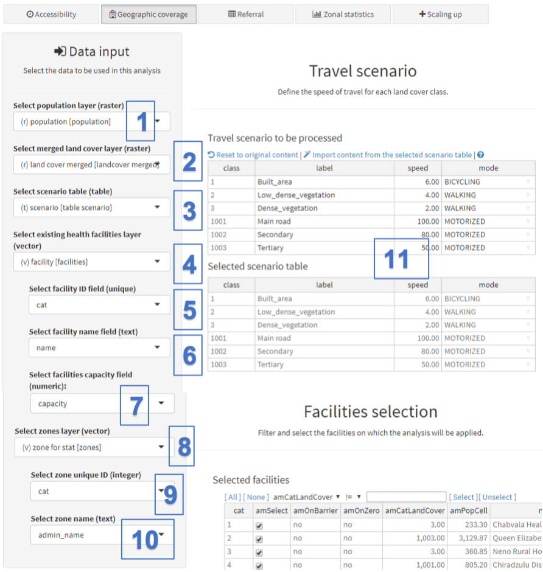
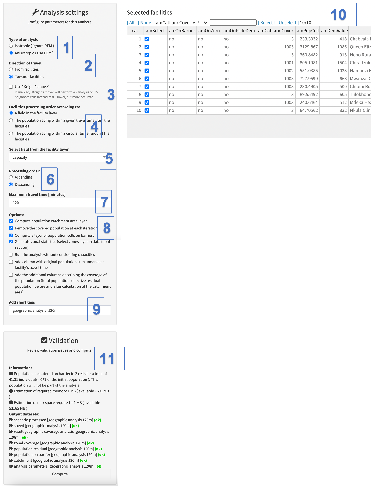
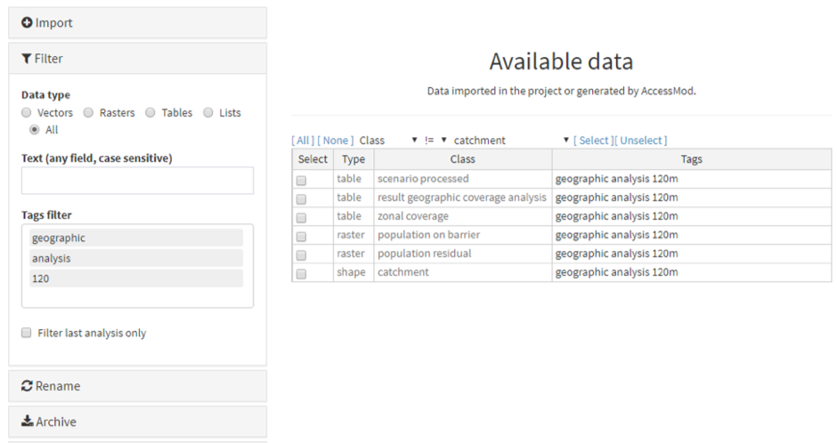
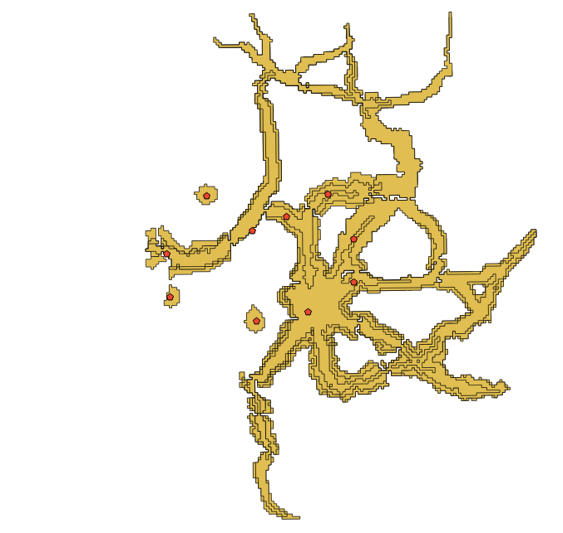
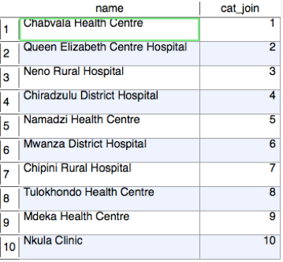
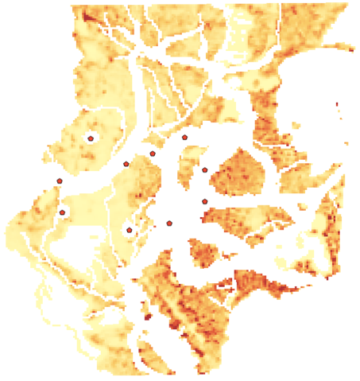
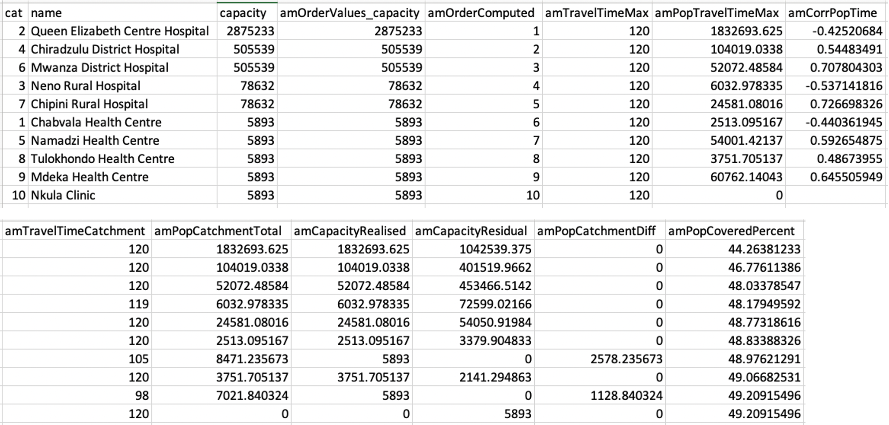

The geographic coverage analysis allows you to take into account the availability of services (i.e. the capacity of health facilities to attend to patients) and to consider this in addition to the physical accessibility constraints, in order to define the catchment area associated with each health facility.

In other words, the catchment area will:

-   extend until the maximum travel time (e.g. 120 minutes) has been reached, if the population within that catchment is smaller than or equal to the estimated capacity of the health facility.
-   not reach the maximum travel time (e.g. 120 minutes) if the population within that catchment exceeds the estimated capacity of the health facility. In such a case, the catchment will be smaller and will cover the population size corresponding to the estimated capacity of the health facility.

 The maximum coverage capacity of individual health facilities must be included in a separated field (column) of the attribute table of the health facility shapefile (see Section 3.3.1.6). Once this is the case, this information can be directly used by AccessMod during the analysis.

 The following two screenshots illustrate how to enter data and set parameters for the analysis:

{width="500"}

[Data input:]{.underline}

Under:

\(1\) “Select population layer (raster)”, select the raster format layer containing the spatial distribution of the target population that you want to use from the scroll down list (the one named "population" in the present exercise).

\(2\) “Select merged land cover layer (raster)”, select the raster format layer containing the merged land cover resulting from the use of the first tool (see Section 5.5.2) - named "land cover merged".

\(3\) “Select scenario table (table)" select the travel scenario table you want to use (for the exercise we recommend that you select the scenario table created during the previous analysis (see Section 5.5.3).

\(4\) "Select existing health facilities layer (vector)”, select the existing health facilities layer vector layer named "facility" in the sample dataset

\(5\) “Select facility ID field (unique)”, select the field from the health facility layer attribute table that contains the unique identifier for each health facility.

\(6\) “Select facility name field (text)”, select the field from the health facility attribute table that contains the name of each health facility.

\(7\) “Select facilities capacity field (numeric)”, select the field from the health facility layer attribute table that contains the maximum coverage, capacity of each health facility.

\(8\) "Select zones layer", If you have checked the "Generate zonal statistics (select zones layer in data input panel)" option in the "Analysis settings" section (see point 7 in the next screenshot), select here the layer containing the boundaries of the zones to be used for extracting relevant statistics. For the purpose of the exercise, the layer is called "zones".

\(9\)  "Select zone unique ID (integer)", select the field from the attribute table of the zone boundaries layer that contains the unique identifier of each zone.

\(10\) "Select zone name (text), select the field from the attribute table of the zone boundaries layer that contains the name of each zone

[Travel scenario:]{.underline}

 (11) With respect to the accessibility analysis (see Section 5.5.3), this section is used to either import the content of an external scenario table and/or to manually modify the information reported in the columns for label, speed and/or mode.

 Next, data can be entered for the second part of the analysis panel, as follows:

{width="700"}

[Analysis settings:]{.underline}

Under:

\(1\) Type of analysis: Similar to the previous analysis, select whether you want an “anisotropic” or “isotropic” approach to be taken for the analysis. We choose “anisotropic” in the present exercise, in order to take into account the impact of slope on the speed for the WALKING and BICYCLING modes of transportation.

\(2\) Direction of travel: Select the direction of travel of the patients. Please note that this field will only appear if the "anisotropic" option has been selected above. For the purpose of the exercise, choose "Towards facilities".

\(3\) [The option to use "knight's move" allows one to perform an analysis on 16 neighbors cells instead of 8. It is slower, but more accurate and tends to give more rounded catchments in area of uniform landcover. We will not use this option for the exercise.]{.c-blue}

\(4\) Facilities processing order: The geographic coverage analysis is done in a sequential processing order: one health facility is considered and processed, and then the next facility is considered, and so on, until all health facilities have been processed. At each iteration, the population identified as belonging to the computed catchment of a specific health facility is subtracted from the overall population layer. Such a processing order allows AccessMod to simulate both the saturation of services in populated areas and/or potential patient preferences when patients are within reach of many different health facilities. For this reason, the order in which individual health facilities are considered within the analysis can influence the results (although it is very difficult to predict how). Please see Annex 4 for details of how this analysis is done.

 Several choices are available to determine the order in which health facilities are considered. For the purpose of the exercise, you can select the first option:  "A field in the health facility layer". The goal here is to start with the center that has the largest capacity, and then to continue in a decreasing order.

 Two other possible choices for the processing order are currently available:

\- "The population living within a given travel time from the facilities": by giving a maximum travel time (in minutes), AccessMod will first compute the catchment for that given time around each health facility, then determine the population living in each of these catchments, and use these estimates to determine the processing order for the health facilities. This approach would give precedence to facilities located in densely populated areas with easy travel access.

\- "The population living within a circular buffer around the facilities": by giving a circular buffer radius (in meters), AccessMod will first compute a circular buffer around each health facility, determine the population living in each of these buffers, and use these figures to determine the processing order for the health facilities. Again, this approach would give precedence to facilities located in densely populated areas.

\(5\) The field appearing in this step will change depending on the processing order option selected under step 3, namely:

-   "Select field from the facility layer": this field appears if you have selected "A field in the health facility layer" option under step (3). In this case, select the field from the health facility layer that contains the integer values you want to use for defining the processing order - this option is being used for the exercise followed here and the field containing the maximum coverage capacity has been chosen in this case.
-   "Given travel time \[minutes\]": this field appears if you have selected "The population living within a given travel time from the facilities" option under step (3). In this case, enter the travel time in minutes to be used by AccessMod to compute the extent of the catchment area for each health facility.
-   "Buffer radius \[meters\]": this field appears if you have selected "The population living within a circular buffer around the facilities" option under step (3). In this case, enter the radius in meters to be used by AccessMod to compute the extent of the buffer for each health facility.

\(6\) "[Processing order"]{.underline}: Select here the processing order based on the option that has been selected under point 3. For the purpose of the exercise, select a descending order, in order for AccessMod to first process facilities with the highest maximum coverage capacity.

\(7\) "[Maximum travel time \[minutes\]"]{.underline}: specify the maximum travel time (in minutes) that should be used by AccessMod to define the maximum reach of the catchment area attached to each health facility. For the exercise, specify 120 minutes.

\(8\)  "[Options"]{.underline}: Several additional options are available:

-   "Compute catchment area layer": Select this option if you wish to obtain a vector layer containing the individual catchment areas (polygons) attached to each facility during the analysis. This option is checked by default.
-   "Remove the covered population at each iteration": Select this option to remove the population attached to the health facility from the population distribution grid at each iteration. This option is checked by default and should remain as such to avoid that the same population is attached to more than one facility. Un-selecting this option is nevertheless useful if you want to estimate the population located within a given travel time of a set of facilities without account for the overlap between catchment areas.
-   "Compute map of population cells on barriers": Select this option to create an output raster file containing the cells in which a population resides but where the cells fall on a barrier. This population will [not]{.underline} be taken into account in the analysis, and it is therefore often necessary to modify the input population distribution layer in raster format prior to the analysis to avoid this issue (see Appendix 1). This option is selected by default and you can keep it that way for the present exercise
-   "Generate zonal statistics (select zones layer in data input panel"): Select this option to automatically obtain the percentage of population being covered by sub national level zones through the analysis. This option is unselected by default. Once selected, a new field labeled "Select zones layer (vector)" appears in the "Data input" section (see point 8 attached to the previous screenshot) for you to select the layer in question. For the purpose of the exercise, check the box, (select the "zone for stat" layer, "cat" as the field containing the unique ID and "admin_name" as the field containing the zone names).
-   "Run the analysis without considering capacities": Select this option to avoid attributing a maximum capacity to centers and to obtain catchments that are only limited by the maximum travel time. This option is unselected by default.
-   "Add column with original population sum under each facility's travel time". Select this option to output an additional column named "amPopOrigTravelTime" in the output table "health facility statistics" (see below). This column will give the full population within a facility's catchment, i.e. the population from the original population raster and without any of it being attributed to another catchment.
-   "Add the additional columns describing the coverage of the population (total population, effective residual population before and after calculation of the catchment area)". This option adds five additional columns in the output table "health facility statistics" (see below). These can be used to check that the total population and residual population after each iteration are what is expected.

\(9\) [Add short tags]{.underline}:  Indicate short tags to be attached to the different outputs of the analysis. We will use "geographic analysis 120m" for the present analysis. Avoid very long name as it has been found to sometime prevent Excel to open the output generated xls files.

[Facility selection]{.underline}

 (10)  As in the previous analysis, you can select the set of facilities for which the analysis will be performed. Keep all facilities selected for the exercise.

[Validation:]{.underline}

 (11) The validation module should indicate that all fields have been correctly filled in (with a green “OK”). If this is the case, you can hit the "Compute" button to launch the analysis. If this is not the case, the "Compute" button will still be in red and you will have to go through the warning and error message to find out what needs to be adjusted.

A transparent window with some text and a progress bar will appear in front of the panel while the analysis is being conducted. Please wait until this window disappears to continue using AccessMod. You will notice that the analysis is slower than the previous one, because of the iterative way of processing each health facility.

Once this is done, go back to the Data module to check the six output datasets that have been generated:

{width="800"}

The geographic coverage analysis generates the following datasets:

1.  [scenario processed class]{.underline}: Table containing the travel scenario that has been processed.
2.  [result geographic coverage analysis class]{.underline}: Table containing the results of the geographic coverage analysis.
3.  [zonal coverage class]{.underline}: Table containing the results of the zonal statistics analysis in case this option has been checked.
4.  [population on barriers class]{.underline}: Raster format layer containing the spatial distribution of the target population on barriers.
5.  [population residual class]{.underline}: Raster format layer containing the spatial distribution of the residual population.
6.  [catchment class]{.underline}: Vector format layer containing the extent of the catchment area for each facility.

Next, just as you did above for the first part of the exercise, you now need to archive the results, export and unzip them in order to open and visualize the results. All of this can be done in the "Data" module (see Section 5.4).

We will describe here only the new types of output generated by AccessMod compared to the previous analytical step. Let us start with the geospatial data that have been generated.

The first type of data is the vector format layer containing the extent of the catchment areas (polygon) attached to each health facility. This layer, found in the "shape_catchment_geographic_analysis_120m" folder, should be opened in a GIS software and would appear as below:

Each catchment area can be linked to the corresponding health facility through the unique identifier indicated in the attribute table of both layers. Please just note that the header of the column containing the unique identifier in the attribute table of the catchment area layer contains "\_join" at the end of it ("cat_join" in the case of the present exercise as per the screenshot below) compare to the header of the column containing that same identifier in the attribute table of the health facility layer ("cat" in the case of the present exercise).

{width="300"}

The raster format residual population layer stored in the "raster_population_residual_geographic_analysis_120m" folder contains the spatial distribution of the target population that remains uncovered after performing of the analysis. This layer can, for example, be used as an input for the scaling up analysis (see Section 5.5.7), and it looks like this once open in a GIS software:

The geographic analysis also generates two additional Excel files compared to the accessibility analysis, namely:

 [Health facility specific statistics]{.underline}

 The health facility statistics file is named: "table_result_geographic_coverage_analysis_geographic_analysis_120m.xlsx". This file contains the columns shown below (note that the table is split in two in the below screenshot, and that we have sorted the data by decreasing value in the column "amRankComputed" - 5th column from the left in the upper part of the screenshot):

{width="800"}\
\

-   **cat:** unique identifier of the health facility as per to the field selected from the attribute table of the health facility layer.
-   **name**: name of the health facility as per the field selected from the attribute table of the health facility layer
-   **capacity:** maximum coverage capacity of the health facility expressed as the number of people that the facility can serve (as per the field selected from the attribute table of the health facility layer).
-   **amOrderValues_x**: with "x" being the name of the parameter used to define the processing order. The values of this column are the values of this parameter. In the present exercise, this column is named "amOrderValues_capacity" and contains the maximum coverage capacity of each facility as this is the option that was selected above. Please see the boxed note below for more information regarding the label and content of this column when using the other options.
-   **amOrderComputed**: processing order applied during the analysis based on the content of the "amOrderValues_capacity" field and the direction of processing (ascending or descending), as selected by the user.
-   **amTravelTimeMax:** maximum travel time in minutes, as set by the user for the analysis.
-   **amPopTravelTimeMax:** total population located within the maximum travel time set for the analysis (amTravelTimeMax).
-   **amCorrPopTime:** Pearson correlation coefficient between the set of travelling times (t, from 0 to the maximum travel time) and the corresponding covered population within this time step (i.e. the sum of population in all cells that are located between t and t+1 of travelling time). This correlation measure gives a rough estimate of how the population is distributed through space as we move outward from the health facility. As an example, a large positive value (e.g. 0.707 in the third line of the above table) means that the population is relatively uniformly distributed as you expand outwards from the facility. A strong negative correlation would mean that there is more population close to the health facility than there is far away from it. A correlation close to zero means that there is no specific tendency in how the population is spread within the catchment. This correlation should really just be used as a relative indicator, as we do not provide the statistical significance of the correlation (you should use proper GIS analysis outside AccessMod if you need statistical insights about how the population is spatially located within the catchments).
-   **amTravelTimeCatchment:** travel time to reach the maximum extent of the catchment area attached to the health facility. This value is either:
    -   Equal to the maximum travel time set for the analysis (amTravelTimeMax) when the maximum coverage capacity of the facility has not been reached within the set time (120 minutes in this example). In the current exercise, this is the case for the Queen Elizabeth Hospital.
    -   Smaller than the maximum travel time set for the analysis (amTravelTimeMax) when the maximum coverage capacity of the facility is reached before reaching amTravelTimeMax. This is the case of The Medka Health Centre in the exercise.
-   **amPopCatchmentTotal:** population located within the catchment area for the travel time reported in the amTravelTimeCatchment field
-   **amCapacityRealised**: part of the maximum coverage capacity of the health facility that is being used (realized) based on the total population located in the catchment area for the given travel time. This value is:
    -   Equal to the maximum coverage capacity of the health facility (capacity) when this value is reached before the maximum travel time (amTravelTimeMax). An example is the Mdeka Health Centre in the present exercise.
    -   Smaller than the maximum coverage capacity of the health facility (capacity) when such capacity is not reached within the maximum travel time (amTravelTimeMax). An example is the Chiradzulu District Hospital is in this the present exercise.
-   **amCapacityResidual:** part of the maximum coverage capacity of the health facility that is not being used. This value is calculated by making the difference between the maximum coverage capacity (capacity) and the realized capacity (amCapacityRealised). This value is therefore equal to 0 when the maximum coverage capacity is being reached within the given travel time.
-   **amPopCatchmentDiff**: Part of the total population located in the final catchment area (amPopCatchmentTotal) which does not experience facility coverage by lack of sufficient coverage capacity in the health facility. This value is calculated by making the difference between the total population in the catchment area (amPopCatchmentTotal) and the realized capacity (amCapacityRealised). This value is therefore:
    -   Equal to 0 when the maximum coverage capacity is not reached within the given travel time
    -   Greater than 0 when the maximum coverage capacity is reached within the given travel time
-   **amPopCoveredPercent:** cumulative geographic coverage expressed as a percentage. This value corresponds to the percentage of the initial population distribution grid (i.e. the layer selected in the "Select population layer (raster)" field) that has been covered after having processes the health facility in question.\
    \
    **Additional columns**
-   If you have selected the option "Add column with original population sum under each facility's travel time", an additional column named "**amPopOrigTravelTime**" is found in the output table. This column contains the full population within a facility's catchment, i.e. the population from the original population raster and without any of it being attributed to another catchment.
-   If you have selected the option "Add the additional columns describing the coverage of the population (total population, effective residual population before and after calculation of the catchment area)", five additional columns are found in the table:\
    **amPopTotal**: contains the total population within the extent of the area considered. It should not change between each iteration. \
    **amPopTotalNotOnBarrier**: contains the total population found outside of barriers. It should not change between each iteration. \
    **amPopTotalOnBarrier**: contains the total population found in barriers. It should not change between each iteration. \
    **amPopResidualBefore**: contains the residual population before the start of the iteration.\
    **amPopResidualAfter**: contains the residual population after the iteration. The loss of population with what is found in the previous column is the population "caught" by the facility's catchment.

::: callout-warning
**The header of the columns containing the unique identifier, the name, and the maximum coverage capacity of each health facility in the resulting table will be the same as the header of the field you have selected from the attribute table of the health facility layer.**

** The spelling of the header and content of the column containing the values used for defining the processing order will be as follows:**

-   **amRankValues\_*X* with "X" being the label of the field selected when using the defining the processing order according to the "A field in the health facility layer" option**
-   **amRankValues_popTravelTime*X*min with "X" being the travel time expressed in minutes when using the defining the processing order according to the "The population living within a given travel time from the facilities" option**
-   **amRankValues_popDistance*X*m with "X" being the distance expressed in meters when using the defining the processing order according to the "The population living within a circular buffer around the facilities" option**
:::

This table provides a set of important information that can be used to analyze and improve the performance of the health service delivery network being considered. More specifically, this table identifies the health facilities that:

1.  Could cover a larger population within a set travel time (e.g, 2 hours) if their coverage capacity was extended. In our example, this applies to Namadzi Health Centre and Mdeka Health Centre.
2.  See their coverage capacity being underutilized because of limited population residing within e.g., 2 hours of travel time. This is the case for all the facilities for which the maximum coverage capacity is not being reached within the maximum considered travel time.
3.  See their neighboring population being already covered by other health facilities based on the selected processing order. This is the case of the Nkula Clinic in the present exercise for which none of the coverage capacity has been utilized. This could present evidence in favor of reallocating resources between facilities (on the assumption that patient preferences are indifferent).

In addition to that, the cumulative geographic coverage reported in the "amPopCoveredPercent" columns provides the percentage of the population covered for the given travel time when taking the coverage capacity of the health facilities into account (in the example above, this percentage amounts to 49.21%), and by subtraction the percentage of the population not covered (50.79%). The cumulative geographic coverage also allows you to evaluate how coverage expands after each iteration in the analysis.

[Zonal Statistics Results]{.underline}

If you checked the "Generate zonal statistics (select zones layer in data input section)" in the "Analysis settings", then the analysis will generate one last table containing the distribution of geographic coverage obtained at the zone level after conducting the analysis.

Once opened in Excel, this file (named “table_zonal_coverage_geographic_analysis_120m.xlsx”) in the present exercise, contains the following columns:  

-   **cat:** unique identifier of the zone, as per the field selected from the attribute table of the zone layer.
-   **name**: name of the zone, as per the field selected from the attribute table of the zone layer
-   **amPopSum:** Total population located in the zone
-   **amPopCovered:** Population being covered through the geographic coverage analysis, therefore attached to the existing health facilities
-   **amPopCoveredPercent:** Percentage of the total population being covered through the geographic coverage analysis

This table is particularly useful to identify potential inequities in geographic coverage at the sub-national level. In the current exercise, for example, we can observe important disparities in coverage between zones. One of them even has 0% of geographic coverage (North West).

::: callout-warning
**The header for the columns containing the unique identifier and the name of the zones will match the label for the field you have selected from the attribute table of the zones layer.**

**Thanks to the unique identifier included in the table, it is possible to join its content to the attribute table of the zones layer, using a GIS software, to obtain a map showing the spatial distribution of the target population or percentages it contains.**
:::
