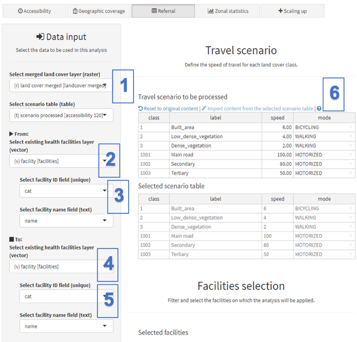
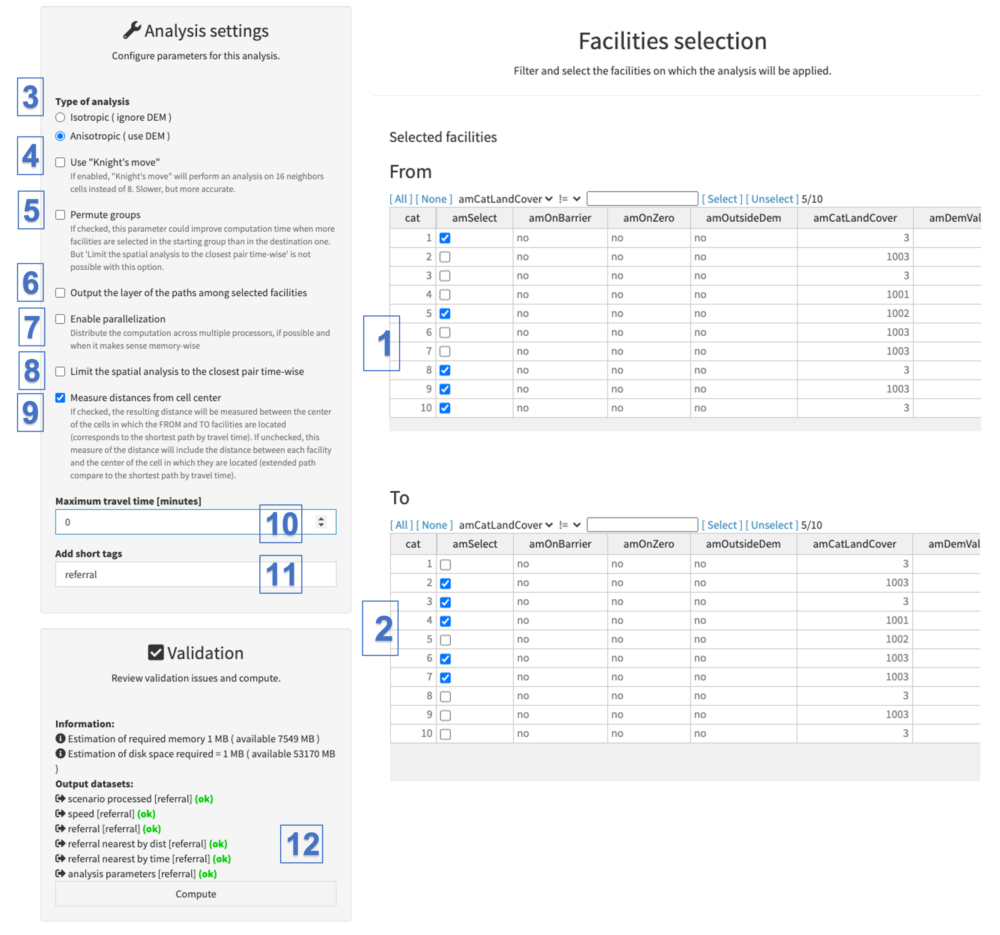

The referral analysis allows one to compute the travelling times and/or the distances along the least-cost paths (i.e. path between two locations that minimizes the total travel duration for those travelling along it, see Ray and Ebener, 2008) between two groups of health centers. Such path is different from a straight line as it does take into account the landscape constraints together with the modes and speeds of travel of the population.

For example, one would want to know the distance and travel time between each primary health care facility and the nearest referral hospital in a given Province, or make sure that the travel time between each Basic Emergency Obstetric Care facilities (BEmOC) and the nearest Comprehensive Emergency Obstetric Care facilities (CEmOC) is below 2 hours in a given country.

Starting with version 5.3.2 of AccessMod, the Referral module has been improved to run in parallel mode, which means it can take advantage of all CPUs that are allocated to the AccessMod Virtual Machine. This speeds up the referral computation (see details in Appendix 5).\
If you are running a referral analysis with a large number of facilities, it is therefore better to first set up your Virtual machine with a maximum of CPUs and memory (see Section 4.2).

 In the following exercise, you are going to compute the travel times and distances between the "Health centers" and the "hospitals" from the demo dataset.

 The following two screenshots explain how to fill the sections used to input the different layers and parameters to run the analysis:

{width="500"}

[Data inputs:]{.underline}

\(1\)  Under “Select merged land cover layer (raster)”, select the raster format layer containing the merged land cover, "land cover merged". Under “Select scenario table (table)”, select the travel scenario table you want to use. The one created in the previous module in the present case

\(2\)  In the "From:” menu, under “Select existing health facilities layer (vector)”, select the vector layer containing the location of the health facility to be used as points of departure (*From*). In this exercise, this is "health centers".

\(3\)  In the same menu, under “Select facility ID field (unique)” and “Select facility name field (text)", select the field from the attribute table of the "From" health facility layer that contains the unique identifiers, as well as the field containing the name of each health center.

\(4\)  In the "To:” menu, under “Select existing health facilities layer (vector)”, select the vector layer containing the location of the health facilities to be used as points of arrival ("To"). In this exercise, this is "hospitals". In our case, both types of health facilities are found in the same layer, so we select the same layer as for point (2) here above (please note that it is possible to select a different health facility layer if the points of arrival are stored in a separated layer).

\(5\)  In the same menu, under “Select facility ID field (unique)” and “Select facility name field (text)", Select the field from the attribute table of the "To" health facility layer that contains the unique identifiers as well as the field containing the name of each hospital.

[Travel scenario:]{.underline}

\(6\)  Like for the accessibility analysis (see Section 5.5.3), this section is used to either import the content of the external scenario table and/or manually modify the information reported in the label, speed and/or mode columns. We will just keep the same values as before for this exercise.

The sections in the second part of the analysis panel can then be filled as follow:

{width="800"}

[Facilities selection]{.underline}

\(1\) In the “From” table, select the facilities you want to serve as points of departure *("From"*). You can either do it “by hand”, by checking the records that have the value “Health Centre” in the column “hf_type”, or you can use the filter tool at the top of the table to automatically select these centers. The second option is particularly useful when there is a large number of facilities in the layer and/or to be selected.

\(2\)  Similarly, in the “To” table, select the facilities you want to serve as points of arrival ("To"*)*. That means that those facilities that have the “Hospital” type in the column “hf_type”, are selected for the present exercise.

[Analysis settings:]{.underline}

\(3\)  Under “Type of Analysis”, select the option to do an anisotropic analysis as you did for the previous analysis

(4)  The option to use "knight's move" allows one to perform an analysis on 16 neighbors cells instead of 8. It is slower, but more accurate and tends to give more rounded catchments in area of uniform landcover. We will not use this option for the exercise.

(5)  The "Permute group" option allows one to improve computation time when more facilities are selected in the starting group than in the destination one. But if this option is selected, 'Limit the spatial analysis to the closest pair time-wise' is not possible. We will not use this option for the exercise.

(6)  The option "Output the layer of the paths among selected facilities", if checked, will output a polyline shapefile with all least-cost paths among all the start-destination pairs of points. We will not use this option for the exercise.

(7)  The "Enable parallelization" option, if checked, allows the referral analysis to be parallelized on all available CPUs/cores that your AccessMod instance has access to, if it is possible, and if it is worth doing it with the available memory. If you are using Virtual box, the numbers of available cores can be changed in the settings of VirtualBox (see [section 4.2](4-2-installation-process-via-virtualbox.qmd)). Using this option can drastically decrease the overall computation time for this analysis. We will not use this option for the exercise.

\(8\)  Select the “Limit the spatial analysis to the closest pair time-wise” option if you want to restrict the analysis and the output table to the closest health facility, in term of travelling time. We will not use that restriction in the present exercise.

(9)  If "Measure distances from cell center" is checked, the resulting distance will be measured between the center of the cells in which the FROM and TO facilities are located (this corresponds to the shortest path by travel time). If unchecked, this measure of the distance will also include the (small) distance between each facility and the center of the cell in which they are located (this corresponds to an extended path compared to the shortest path by travel time). We can check this option for the exercise.

\(10\)  If you want to limit the travel time for the analysis, you can specify this maximum travel time here under "Maximum travel time (minutes)". If you do so, those health facilities that can be reached in a time that is greater than this specified maximum travel time will not appear in the output tables. We will not use a maximum travel time in the present exercise, and you can therefore specify "0" in the entry field.

\(11\) Under “Add short tags”, give short tags to be attached to the different outputs of the analysis. We will use "referral" for the present exercise.

[Validation:]{.underline}

\(12\)  The validation module should indicate that all fields have been correctly filled in (with a green “OK”). If this is the case, you can hit the "Compute" button to launch the analysis. If this is not the case, the "Compute" button will still be in red, and you will have to go through the warning and error message to find out what needs to be adjusted.

A model window with some text and a progress bar will appear in front of the panel while the analysis is being conducted. Please wait until this window disappears to continue using AccessMod. This analysis can take a lot of time to completed especially if the number of health facilities to be processed is high.

In addition to the processed scenario table, as well as the speed and friction spatial distribution layers, this analysis will generate three output tables that will now be listed in the Available Layers section of the Data module, namely:

-   [referral nearest by dist class:]{.underline} Table indicating which one of the selected “Hospitals” ("To" facility) is the closest by distance from each of the selected “health centers” ("From" facility).
-   [referral nearest by time class:]{.underline} Table indicating which one of the selected “Hospitals” ("To" facility) is the closest by travel time from each of the selected “health centers”
-   [referral class:]{.underline} Table containing all pair-wise results, i.e., the distances and travelling times for each “health facility” - "Hospital" pair

 You can archive these three tables, export them, and open them in Excel to visualize the results. The three tables present the same 6-column structure as presented in the following example (referral nearest by time class):

-   **from_cat:** unique identifier of the "From" health facility, as per the field selected from the attribute table of the health facility layer.
-   **from_name**: name of the "From" health facility, as per the field selected from the attribute table of the health facility layer.
-   **to_cat:** unique identifier of the "To" health facility identified through the analysis, as per the field selected from the attribute table of the health facility layer. In this case, this column contains code of the closest hospital by time from the "From" health facility.
-   **to_name**: name of the "To" health facility identified through the analysis, as per the field selected from the attribute table of the health facility layer. In this case, this column contains the code of the closest hospital, by time, from the "From" health facility.
-   **distance_km:** distance in kilometers between the two health facilities ("From" and "To")
-   **time_m:** travel time in minutes between the two health facilities ("From" and "To")

Note that, while both the distance and the travel time columns are included in the 3 tables, it is important to remember that the content of these columns is only significant for the analysis that each of these files is covering (i.e., closest by distance, closest by time or all possible combinations). In other words, the table shown as an example here above contains the indication of the hospital being the closest by time of each of the 5 selected health centers. The mention of the distance between the two facilities is therefore only included for extra information.

In the above table, for example, you can notice that reaching the *Queen Elizabeth Centre Hospital* from the *Chabvala Health Centre* requires about 700 minutes of travel, but these two facilities are separated by only 50 km. If you look at the geographic locations of these two centers in a GIS software, you will see that a river (i.e., a barrier to movement) and the lack of roads in this area require a long travel time before reaching the hospital. If you want to visualize the path between the two facilities, you can re-launch the analysis, but this time by selecting the option "Output the layer of the paths among selected facilities". The resulting shapefile can then be displayed in your GIS software.

This particular pair of health facilities also illustrates the impact that a barrier to movement can have on the output results. This calls for careful considerations when choosing the input layers and defining barriers to movements. For example, it that particular case considering the use of boats to cross the river at some point could have considerably reduced the travel time between the two facilities.

::: callout-warning
**The header for the columns containing the unique identifier and the name of the health facilities will match the label for the field you have selected from the attribute table of the "FROM" and "TO" health facility layers.**

**As mentioned here above, the distance and the travel time columns are included in each of the 3 tables, but their content is only significant for the analysis that each of the resulting file covers (closest by distance, closest by time or all possible combinations). In other words:**

-   **The "distance_km" column is only mentioned for information in the Excel file containing the results for the closest by time analysis (referral nearest by time class)**
-   **The "time_m" column is only mentioned for information in the Excel file containing the results for the closest by distance analysis (referral nearest by dist class)**
-   **Both columns are significant in the Excel file containing all the possible combinations (referral class)**

**AccessMod generates only two tables when checking the "Limit the analysis to the closest destination point in time" option, namely:**

**1. The one containing the nearest facility within the given time for each "FROM" health facility (referral nearest by time class)**

**2. The one containing all pair-wise results (referral class)**

**In both tables:**

-   **Empty cells for the " to_cat ", "to  name ", "distance_km" and "time_m" columns indicate that there is no health facility within the given travel time for the "FROM" health facility.**

-   **A distance is only reported "distance_km" for the pair(s) corresponding to the nearest health facility by time.**

    **Starting with version 5.3.2. of AccessMod (that output only integer numbers for travel times), the probability of having two (or more) facilities with the same travel time has increased. If this is the case, the two (or more) facilities will be kept in the output tables, and it is the decision of the user to keep all of them or choose only one.\
    \
    **

**What happens if two facilities are equally "closest by time" ?\
**Starting with version 5.3.2. of AccessMod (which outputs only integer numbers for travel times), the probability of having two (or more) facilities with the same travel time has increased. If this is the case, the two (or more) facilities will be kept in the output tables, and it is the decision of the user to keep all of them or choose only one.
:::
