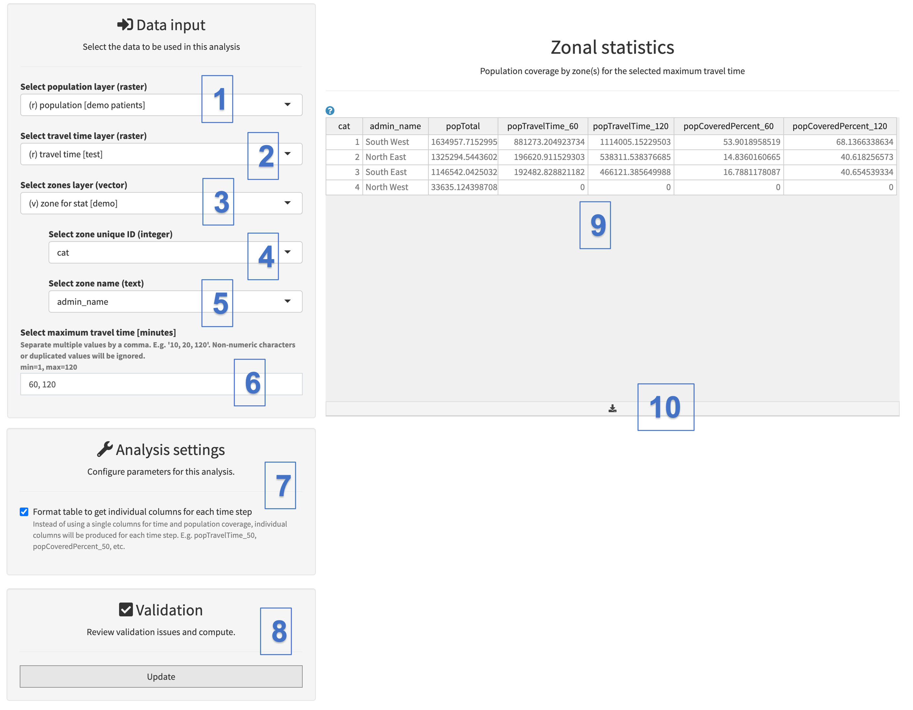

The zonal statistics allows one to obtain the population accessibility coverage (expressed in the percentage of the total population) at the level of the zones that have been uploaded in the project (see Section 3.3.1.9), by combining the travel time distribution grid obtained through the use of the "accessibility analysis" tool, with the spatial distribution of the target population and the boundaries of the zones.

This tool is particularly interesting, as it allows one to interactively get the coverage for different travel time as long as this travel time is within the maximum travel time specified when performing the accessibility analysis (see Section 5.5.3). This means that you cannot obtain the zonal statistics for 3-hour travel time if the accessibility analysis has been performed for a maximum travel time of 2 hours.

If you want maximum flexibility in exploring the evolution of the accessibility coverage for different travel time, you should perform an accessibility analysis with no restriction on the maximum travel time (i.e., put “0” in the "maximum travel time*"* field) and use the resulting travel time distribution grid in the present zonal statistics tool. For the following exercise, we will just use the 120 minutes travel time distribution grid obtained previously when using the "Accessibility analysis" tool (see Section 5.5.3).

The following screenshots explains how to fill the sections used to input the different layers and parameters to perform the zonal statistics:

{width="700"}

[Data input:]{.underline}

\(1\)  Under “Select population layer (raster)”, select the raster format layer containing the spatial distribution of the target population - "population" - on which the zonal statistic will be applied.

\(2\) Under “Select travel time layer (raster)”, select the raster format layer containing the spatial distribution of the travel time resulting from the accessibility analysis. In the context of the current exercise, please use the one labeled "travel time \[accessibility 120m\]".

\(3\) Under “Select zones layer (vector)”, select the vector format layer containing the boundaries of the zones that will be used for zonal statistics.

\(4\) Under “Select zone unique ID”, select the field from the zone boundaries layer attribute table that contains the unique identifier attributed to zone.

\(5\) Under “Select zone name (text)", select the field from the zone boundaries layer attribute table that contains the name attributed to each zone.

\(6\) Under “Select maximum travel time (minutes), select the maximum travel time(s) for which you want to obtain the zonal statistics. You can separate several travel times with commas. For the exercise, use the two maximum travel times "60, 120". (**Warning: you cannot enter a number greater than the maximum travel time found in the travel time raster)**

\(7\) The setting "Format table to get individual columns for each time step" allows the output table to be formatted with dedicated columns for each specified maximum travel time (E.g. popTravelTime_60, popCoveredPercent_60, etc.). This is the default option to consider. If you uncheck this option, the output of all different travel times will be found in the same column. 

[Validation and results]{.underline}

\(8\) You can then click the "Update" button, in case there are no issues to obtain the results in the Zonal Statistics section table on the right-hand side of the panel (9)

 This table contains the following columns:

-   **cat:** unique identifier of the zone, as per the field selected from the attribute table of the zone boundary layer.
-   **admin_name**: name of the zone, as per the field selected from the attribute table of the zone boundary layer.
-   **popTotal:** total population located in the zone, as extracted from the population distribution grid.
-   **popTravelTime\_\*:** population located within the maximum travel time(s) indicated in the data inputs.
-   **popCoveredPercent\_\***: accessibility coverage for the maximum travel time(s) indicated in the data inputs. Obtained by dividing **popTravelTime** by **popTotal.**

 (10) The content of the zonal statistics table can then be exported as a \*.csv file by clicking on the "down arrow". The \*.csv file can be imported in Excel if needed.\
Alternatively, the content of the table can be copy-pasted (Ctrl-C/Ctrl-V in Windows, ⌘-C/ ⌘-V in Mac) as follow:

1.  Select the content of the zonal statistics table by clicking, and holding down the button while dragging across the entire table
2.  Copying the selected content (Ctrl-C in Windows, ⌘-C in Mac)
3.  Pasting the copied cells into an excel spreadsheet (Ctrl-V in Windows, ⌘-V in Mac)
4.  Adding an extra row at the top, then adding the column headers manually in the Excel spreadsheet, as they unfortunately do not get copied during the operation\
    \

::: callout-warning
**The header for the columns containing the unique identifier and the name of the zone will match the label for the field you have selected from the attribute table of the zone boundaries layer.**

**Obtaining the zonal statistics for different sub-national levels (or at national level) requires to upload a separated zone boundaries layer for each level into the project before proceeding.**
:::
