The scaling up analysis allows one to test different scenarios aiming to scale up an existing service delivery network, or generates a complete service delivery network if none is already in place.

 The scenarios that can be tested through the use of this tool take into account:

1.  Exclusion areas in which new health facilities are not allowed to be located (see Section 3.3.1.5)
2.  Different geographically-distributed suitability factors that are combined together in a suitability index to define the most suitable sites for locating a new health facility. These factors can be based on the distance to/from specific features, travel time to/from features, the population density, or the definition of areas where health facilities should be placed in priority compare to other ones (see Section 3.3.1.10)

A physical accessibility analysis is then performed on all the raster cells presenting the highest value, outside of the exclusion areas, in the suitability distribution layer.

 The site (cell) covering the largest population is the one selected for location of a new health facility. The type of facility placed on this site is then decided based on the content of the new health facility information table (see Section 3.3.2.3).

 The above is repeated until:

1.  Either the number of new health facilities set by the user have been located; or,
2.  The population coverage set by the user has been reached.

 The above description is only a summary of the overall process which is applied during this analysis. Please refer to Appendix 7 for more details.

::: callout-warning
**There is currently no function in AccessMod to automatically change and/or optimize the maximum coverage capacity of some of the health facilities, or to simulate the impact of these changes on population coverage. This might be part of future AccessMod functionalities.**

** In the meantime, this approach can be implemented through the following steps:**

1.  **Changing the maximum coverage capacity values in the attribute table of the health facility location layer**
2.  **Running a geographic coverage analysis based on the newly modified health facility layer **
:::

The following set of screenshots explains how to fill the sections used to input the different layers and parameters to perform the scaling up analysis:

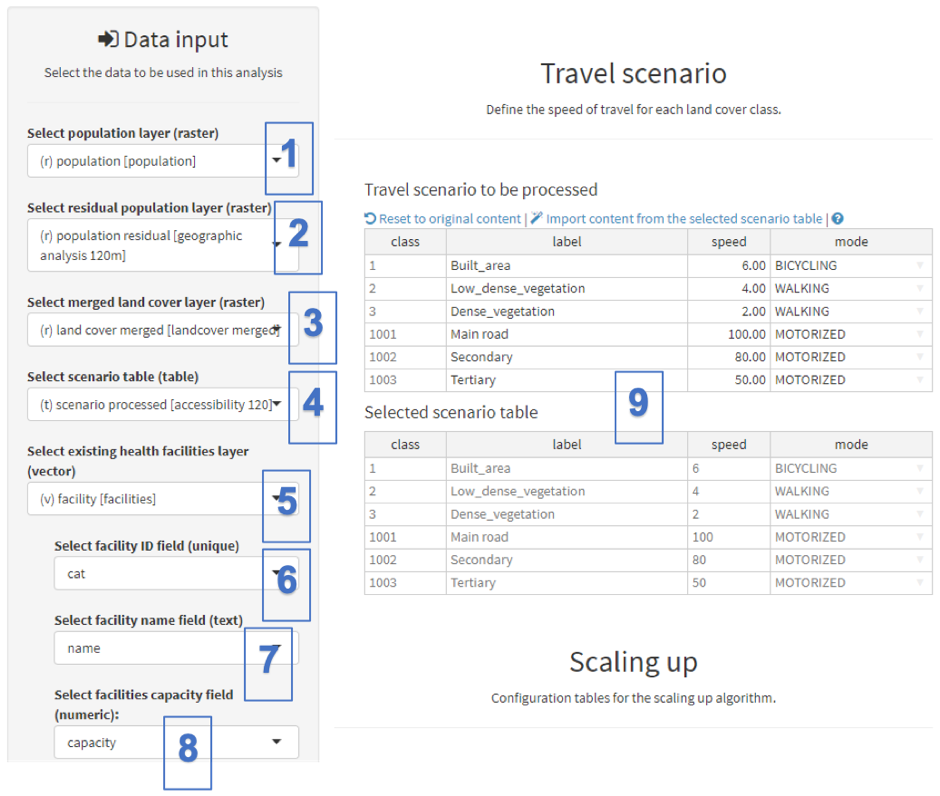{width="700"}

[Data input:]{.underline}

 (1)  Under “Select population layer (raster)”, select the raster format layer containing the spatial distribution of the original target population - "population". This layer will be used as the denominator for calculating the population coverage reached through the scaling-up analysis.

(2)  Under “Select residual population layer (raster)”, select the raster format layer containing the target population to be covered through the scaling-up analysis. This layer will also be used as the numerator for calculating the population coverage reached at each iteration of the scaling up analysis. For the exercise, please select the raster format layer containing the spatial distribution of the residual population obtained after running the geographic coverage analysis - "\[geographic analysis 120m\]”.

::: callout-warning
**The population coverage value is larger than 0% at the beginning of the process when selecting a residual population layer which is different from the spatial distribution of the original target population as, in this case, part of the target population is already being covered by the existing health facility network.**

** It is nevertheless possible to select the same population distribution layer in the above two fields. This would for example correspond to a situation where you want to establish a new service delivery network. In this case the population coverage value at the beginning of the process is equal to 0% as none of the target population has been covered at the time of conducting the analysis.**
:::

(3)  Under “Select merged land cover layer (raster)”, select the raster format layer containing the merged landcover resulting from the use of the first tool (see Section 0) - named "landcover merged".

(4)  Under “Select scenario table (table)”, select the travel scenario table you want to use. In the present example, this is the same as the one used for the previous analysis.

(5)  Under “Select existing health facilities layer (vector)”, select the vector layer containing the location of the already existing health facilities - here, named "facility". Please note that this field, as well as the following fields in this tool, will not appear in the list if you have checked the "Start with empty layer" option under "Options for the output layer \[OUTPUT FACILITIES\]" in the "Analysis settings" (see after the next figure here below).

(6)  In “Select facility ID field (unique)”, select the field from the health facility layer attribute table that contains the health facility unique identifiers.

(7)  In “Select facility name field (text)”, select the field from the health facility attribute table that contains the name of each health facility.

(8)  In “Select facilities capacity field (numeric)”, select the field from the health facility layer attribute table that contains the maximum coverage, capacity of each health facility.

 [Travel scenario:]{.underline}

 (9) Like for the accessibility analysis (see Section 5.5.3), the “Selected scenario table” section, on the right-hand side of the panel, is used to either import the content of the external scenario table and/or manually modify the information reported in the label, speed and/or mode columns.

 The rest of the "data input" section as well as the "Scaling up" sections of the panel can then be filled out as follows:

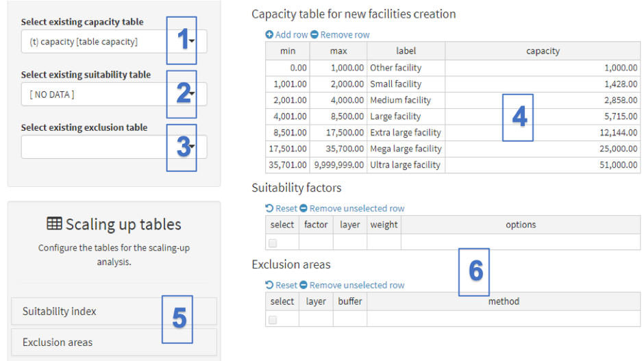{width="700"}

[Data input:]{.underline}

(1)  Under “Select existing capacity table”, select the new health facility information table (see Section 3.3.2.3) you imported in the project, the one tagged as "capacity scaling up". Please note that the content of this table can be created manually, if not already imported in the project (see point (4) below).

(2)  The “Select existing suitability table” field can be used to select a table containing suitability factors used in a previous scaling-up analysis. This field indicates \[NO DATA\] right now as we have not performed any scaling up analysis for the moment.  

(3)  The “Select existing exclusion table” field can be used to select a table containing the list of the exclusion areas used in a previous scaling up analysis. This field is empty right now, as no scaling-up analysis has been performed for the moment. 

(4)  The tables within the “Capacity table for new facilities creation” section displays the content of the new health facility information table selected under point (1) above – "capacity scaling up". You can either create or edit this table by clicking in each table cell. Rows can also be added or removed through the buttons "Add row" and "Remove row".

 [Scaling up tables:]{.underline}

 (5) The “Scaling up tables” section is used to define the suitability factors and exclusion areas to be used in the analysis. The use of this section is described in more details below.

\(6\) The two tables, in the lower-right hand corner of the above figure (empty now), contain the list of the suitability factors and exclusion areas set by the user. The method to fill these tables is explained in the following two sections.

**Using the "Scaling up tables" section**

 This section allows one to define the suitability factors and the exclusion areas in which no new facilities will be located during the scaling up analysis (see Section 3.3.1.5). The following describes in detail how to define these factors and areas.

 *Suitability index*

 AccessMod defines the most suitable site for locating a new health facility by combining the spatial distributions of different suitability factors into a single suitability index layer.

 The suitability factors accessible to the user are as follow:

-     *Sum of population within a radius* (in kilometers): this option will create a new layer in which the sum of the target population (original or residual) located within a given radius of each cell will be attributed to the cell in question. This suitability factor allows one, for example, to consider sites with the highest neighbouring population density as being the most suitable for locating a new facility.

-     *Euclidean distance from features* (e.g., roads, *existing* facilities): this option will create a new layer containing the spatial distribution of the Euclidean distance from features stored in a vector layer (point, line or polygon). This allows one, for example, to consider the sites close to roads as being the most suitable for locating a new facility.

-     *Travel time to/from features:* this option is similar to the previous one, but uses travel time instead of the Euclidean distance. This allows one, for example, to consider sites located far away from already-existing health facilities as being the most suitable for locating a new facility.

-     *Generic priority map*: raster format layers containing integer values can be directly integrated into the index (see Section 3.3.1.10). This gives a high degree of flexibility, as the priority for scaling up can come from any other external spatially-distributed parameters, such as sub-national disease prevalence or income inequality data. This allows one, for example, to consider that districts with a particular prevalence are the most suitable for locating a new facility.

 For each of these factors, it is possible to define if higher values in the factor distribution layer are to be considered as more or less suitable for locating a new facility. This option allows one, for example, to ensure for the sites being the closest to the road network to be considered as being the most suitable when using the *Euclidean distance from features* factor. In this case, such sites would present the lowest values in the resulting factor distribution layer.

 AccessMod does also allow for the attribution of a specific weight to each of the suitability factor to be considered in the final index. This possibility gives an additional level of flexibility to the user who wants to combine several suitability factors together while considering that some of them play a more important role than others when defining the most suitable sites for locating a new health facility.

 The table below describes the interface and input parameters associated to each of the above-mentioned suitability factors.

+----------------------------------------------------------------------------------------------------------------------------------------------------------------------------------+----------------------------------------------------------------------------------------------------------------------------------------------------------------------------------+------------------------------------------------------------------------------------------------------------------------------------------------------------------------------------------------------------------------------------------------------------------------------------------------------+--------------------------------------------------------------------------------------------------------------------------------------------------------------------------------------------+
| **Sum of population within a radius**                                                                                                                                            | **Euclidean distances from features**                                                                                                                                            | **Travel time\                                                                                                                                                                                                                                                                                       | **Generic priority\                                                                                                                                                                        |
|                                                                                                                                                                                  |                                                                                                                                                                                  | from/to features**                                                                                                                                                                                                                                                                                   | map**                                                                                                                                                                                      |
| **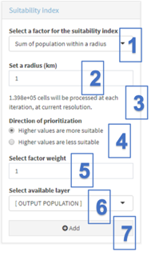\                                                                                                                                               | 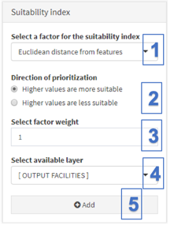                                                                                                                                                  |                                                                                                                                                                                                                                                                                                      |                                                                                                                                                                                            |
| **                                                                                                                                                                               |                                                                                                                                                                                  | **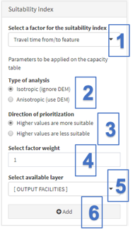\                                                                                                                                                                                                                                                                   | **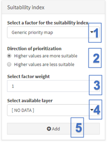\                                                                                                                                                         |
|                                                                                                                                                                                  |                                                                                                                                                                                  | **                                                                                                                                                                                                                                                                                                   | **                                                                                                                                                                                         |
+----------------------------------------------------------------------------------------------------------------------------------------------------------------------------------+----------------------------------------------------------------------------------------------------------------------------------------------------------------------------------+------------------------------------------------------------------------------------------------------------------------------------------------------------------------------------------------------------------------------------------------------------------------------------------------------+--------------------------------------------------------------------------------------------------------------------------------------------------------------------------------------------+
| \(1\) Under “Select a factor for the suitability index”, select the "Sum of the population within a radius" option from the pull-down list.                                      | \(1\)  Under “Select a factor for the suitability index”, select the "Euclidean distances to features" option from the pull-down list.                                           | \(1\) Under “Select a factor for the suitability index”, select the "travel time from/to feature" option from the pull-down list.                                                                                                                                                                    | \(1\) The “Select suitability analysis” factor takes into account a raster data set with priorities as values                                                                              |
|                                                                                                                                                                                  |                                                                                                                                                                                  |                                                                                                                                                                                                                                                                                                      |                                                                                                                                                                                            |
| \(2\) Set the radius (in kilometers) to be used.                                                                                                                                 | \(2\) “Direction of prioritization” allows the analyst to define if higher values for this factor are **more** suitable or **less** suitable for locating a new health facility. | \(2\) The “Type of analysis” field allows the analyst to specify if the travel time will be based on an isotropic or anisotropic approach. Selecting the anisotropic approach will result in a new field to open, in order to indicate the direction of travel (from, or to, the selected features). | \(2\) The “Direction of Prioritization” field allows the analyst to define if higher values for this factor are **more** suitable or **less** suitable for locating a new health facility. |
|                                                                                                                                                                                  |                                                                                                                                                                                  |                                                                                                                                                                                                                                                                                                      |                                                                                                                                                                                            |
| \(3\) A message indicating how many cells will be processed at each iteration will appear.                                                                                       | \(3\) “Select factor weight” allows for the attribution of a relative weight to the factor.                                                                                      | \(3\) The “Direction of prioritization” field allows the analyst to define if higher values for this factor are **more** suitable or **less** suitable for locating a new health facility.                                                                                                           | \(3\) “Select factor weight” field allows for the attribution a relative weight to the factor.                                                                                             |
|                                                                                                                                                                                  |                                                                                                                                                                                  |                                                                                                                                                                                                                                                                                                      |                                                                                                                                                                                            |
| \(4\) “Direction of prioritization” allows the analyst to define if higher values for this factor are **more** suitable or **less** suitable for locating a new health facility. | \(4\) “Select available layer” selects the vector format layer that will be used to generate the factor distribution layer (see below).                                          | \(4\) “Select factor weight” allows for the attribution of a relative weight to the factor.                                                                                                                                                                                                          | \(4\) “Select available layer” selects the raster format layer containing the generic priority map                                                                                         |
|                                                                                                                                                                                  |                                                                                                                                                                                  |                                                                                                                                                                                                                                                                                                      |                                                                                                                                                                                            |
| \(5\) “Select factor weight” allows for the attribution of a relative weight to the factor.                                                                                      | \(5\) The “Add” button allows you to add the factor to the list of suitability factors that will be used in the final index                                                      | \(5\) “Select available layer” allows selecting the vector format layer used to generate the factor distribution layer.                                                                                                                                                                              | \(5\) The “Add” button allows you to add the factor to the list of suitability factors that will be used in the final index.                                                               |
|                                                                                                                                                                                  |                                                                                                                                                                                  |                                                                                                                                                                                                                                                                                                      |                                                                                                                                                                                            |
| \(6\) “Select attribution layer” field selects the raster format population distribution that will be used to generate the factor distribution layer (see below).                |                                                                                                                                                                                  | \(6\) The “Add” button allows you to add the factor to the list of suitability factors that will be used in the final index.                                                                                                                                                                         |                                                                                                                                                                                            |
|                                                                                                                                                                                  |                                                                                                                                                                                  |                                                                                                                                                                                                                                                                                                      |                                                                                                                                                                                            |
| \(7\) The “Add” button allows you to add the factor to the list of suitability factors that will be used in the final index.                                                     |                                                                                                                                                                                  |                                                                                                                                                                                                                                                                                                      |                                                                                                                                                                                            |
+----------------------------------------------------------------------------------------------------------------------------------------------------------------------------------+----------------------------------------------------------------------------------------------------------------------------------------------------------------------------------+------------------------------------------------------------------------------------------------------------------------------------------------------------------------------------------------------------------------------------------------------------------------------------------------------+--------------------------------------------------------------------------------------------------------------------------------------------------------------------------------------------+

Each of the suitability factors defined by the user is stored as a separate record in the "suitability factors" table appearing in the Scaling up section of the module panel (middle part of the panel). This table looks like the following figure and contains the following fields:

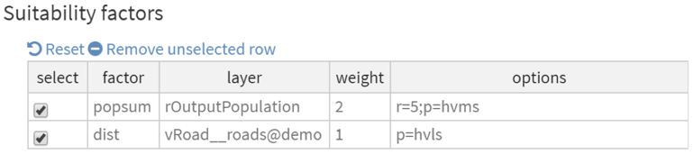{width="600"}

-   **select**: the checked entries in this column indicate the list of suitability factors being taken into account when creating the suitability index distribution layer. Any unchecked factor will not be taken into account.
-   **factor:** suitability factor that has been selected, as follows:
    -   popsum: Sum of population within a radius
    -   dist: Euclidean distances from features
    -   traveltime: Travel time from/to features
    -   priority: Generic priority map
-   **layer:** information identifying the layer used to spatially distribute the suitability factor. The information reported in this field can either be:
    -   "rOutputPopulation", when selecting the target population that will be updated at each iteration (see the box below for more information)
    -   "vOutputFacility", when selecting the health facility location layer that will be updated at each iteration (see the box below for more information)
    -   xxx_yyy@zzz with xxx=data class (see Section 5.4.1); yyy= data tag and zzz= project name
-   **weight:** weight attributed to this particular suitability factor. The higher the value the higher the influence of the factor compare to the other ones. For example, the weight of "2" applied to the sum of population within a radius (popsum) factor in the figure here above means that the influence of this factor is twice more important in the final index than the influence of the other factor considered here, the Euclidean distances from features (dist)
-   **options:** list of the options set by the user, with:
    -   "r": Value of the radius set for the sum of population within a radius suitability factor
    -   "t": Type of analysis set for the travel time from/to features factor (iso= isotropic; aniso=anisotropic)
    -   "d": Direction of travel set for the travel time from/to features factor (to= towards feature; from= from feature)
    -   "p": direction of prioritization (hvms = higher values are more suitable; hvls= higher values are less suitable)

 *Exclusion areas*

* *The exclusion areas are defined using the "Exclusion Areas" sub-section of the "Scaling up tables" section of the module panel, shown below:

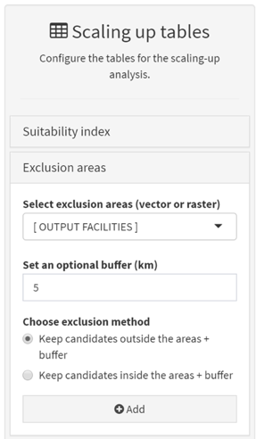

The exclusions areas, used in the context of the scaling up analysis, can be defined in two ways, namely by using:

-   The vector or raster format layers imported as exclusion areas in the project (see Section 3.3.1.5).
-   The location of the health facilities, including the new ones being located at each iteration during the analysis.

 Please note that, in both cases, the user can define:

1.  An optional buffer (expressed in kilometers) to be set around the exclusion areas
2.  If new candidates should be kept inside or outside the final exclusion areas (i.e., the exclusion areas contained in the selected vector or raster layer, together with the defined buffer)

 The above can, for example, avoid locating new health facilities within a certain distance of already existing facilities - one of the constraints used in Burkina Faso.

 Each of the exclusion areas defined by the user is being stored as a separated record in the "Exclusion areas" table appearing in the Scaling up section of the module panel. This table looks like the following figure and contains the following fields:

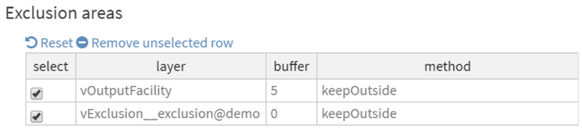{width="600"}

-   **select**: the checked entries in this column indicate the list of suitability factors being taken into account when creating exclusion area layer. Any unchecked factor will not be taken into account.
-   **layer:** information identifying the layer used to define the exclusion area(s). The information reported in this field is the same as for the suitability factors table (see above).
-   **buffer:** size of the buffer, expressed in kilometers, set around the selected exclusion area(s)
-   **method**: indicate if the new facilities should be located outside (“keepOutside”) or inside (“keepInside”) the defined exclusion areas

::: callout-warning
**Part of the population to be covered might be living in exclusion areas, or travelling through them. The population in question, as well as its movements, will be taken into account during the analysis (i.e., the extent of catchment area will take into account these populations), but no new health facility will be located in these areas through the implementation of the analysis.**

** The** **\[OUTPUT POPULATION\]** **option accessible in the "Scaling up tables" sections of this module corresponds to the raster-format residual population distribution layer that is updated at each iteration of the analysis to account for the population that has been attached to the newly located health facility.**

** The \[OUTPUT FACILITIES\] option accessible in the "Scaling up tables" sections of this module corresponds to the vector format layer containing the location of the health facilities that is updated at each iteration of the analysis to account for the new health facilities being located through** **the analysis. Such a layer:**

-   **contains the already existing facilities if the "Start using selected existing facilities" option has been checked in the "analysis settings";**
-   **is empty before starting the analysis in case the "Start with empty layer" option has been checked in the "analysis settings"**.
:::

For the purpose of the current exercise, we will consider two suitability factors and two exclusion layers as follows:

 *Suitability factor 1:*

For the first suitability factor, we would like for new facilities to be located in the most highly populated areas from the residual population distribution layer. For the sake of the exercise, we also consider that this factor is twice as important as the other suitability factor (see below).

 For this priority, we will be using the "Sum of population within a radius" suitability factor, and set the different parameters as follows in the "Suitability index" sub-section:

-       We will use a radius of 5 kilometers

-       For the "Direction of prioritization", choose "Higher values are more suitable"

-       Give a value of "2" for the "Select factor weight"

-       Under "Select available layer", choose \[OUTPUT POPULATION\] in order to use the residual population distribution layer updated after each iteration

 You can then press the "Add" button to add this combination of parameters as a suitability factor into the "Suitability factors" table.

 *Suitability factor 2:*

 For the second suitability factor, we also would like for new facilities to be located as close as possible to the road network. For this priority, we will be using the "Euclidean distances from features" suitability factor.

 To enter these settings through the "Suitability index" sub-section, please do the following:

-       For the "Direction of prioritization", choose "Higher values are less suitable"

-       Give a value of "1" for the "Select factor weight" weight

-       Under "Select available layer", choose the "roads" vector layer

 You can then press the "Add" button to add this combination of parameters as a suitability factor into the "Suitability factors" table.

 The "Suitability factors" table should then summarize the factors and parameters that you have chosen, as shown below:

{width="600"}

We now turn to the "Exclusion areas" section to define the excluded zones in which no new health facilities should be located.

*Exclusion area 1:*

 First, we would like to exclude new health facilities from being located within 5 kilometers from an already-existing health facility.

 Set the parameters as follows, in the "Exclusion areas" sub-section of the Scaling up tables section, to include these exclusion areas in the scaling up analysis:

-       "Select exclusion areas": Choose \[OUTPUT FACILITIES\] in order to account for each new health facility being located after each iteration

-       "Set an optional buffer (km)": Enter "5"

-       "Choose exclusion method": Choose "Keep candidates outside the areas + buffer"

 You can then press the "Add" button to add this combination of parameters, and therefore include these exclusion areas, in the "Exclusion areas" table.

 It is important to emphasize the use of the \[OUTPUT FACILITIES\] option here, as the exclusion area attached to each new facility placed will have an influence on the location of the next newly-placed facility. 

*Exclusion area 2:*

 We then would like to exclude any new heath facility from being located within the polygon included in the vector format "exclusion" layer that we previously imported in the project (see Section 5.5.1).

 Set the parameters as follows, in the "Exclusion areas" sub-section of the "Scaling up tables section", to include this exclusion area in the scaling up analysis:

-       "Select exclusion areas": Choose the vector layer "exclusion"

-       "Set an optional buffer (km)": Enter "0"

-       "Choose exclusion method": Choose "Keep candidates outside the areas + buffer"

 You can then press the "Add" button to add this exclusion area in the "Exclusion areas" table.

 The "Exclusion areas" table should then summarize the factors and parameters that you have chosen, as shown below:

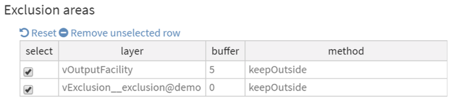{width="600"}

The following screenshots describe how the analysis settings and facilities selection sections are to be filled in order to run the scaling-up analysis:

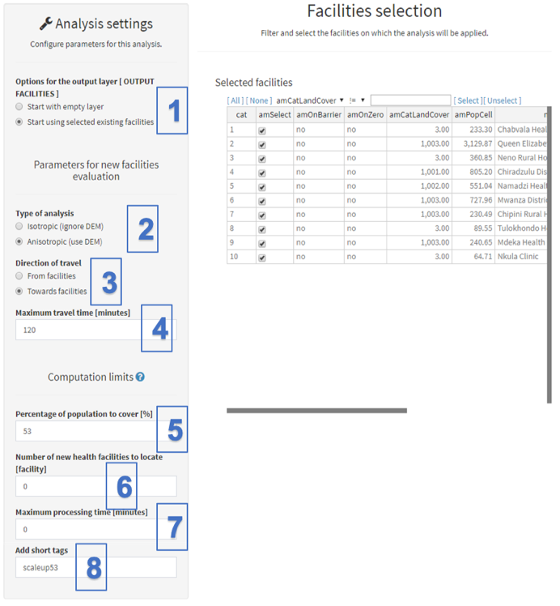

[Analysis settings]{.underline}

 (1) Select, under “Options for the output layer \[OUTPUT FACILITIES\]”, if you want to start the scaling up analysis using selected existing facilities or with an empty health facility layer. The former is checked by default when starting the scaling up tool. Selecting the later will result in the "Select existing health facilities layer (vector)" field and the other associated ones to disappear from the data inputs section.

::: callout-warning
**For the analysis to be consistent, the residual population layer should not contain the population covered by the existing health facilities in case the "Start using selected existing facilities" option is selected.**
:::

[Parameters for new facilities evaluation]{.underline}

\(2\) In “Type of analysis”, select whether you want an “anisotropic” or “isotropic” approach to be applied when identifying which type of facility should be placed in the most suitable site. We will choose “anisotropic” in the present exercise to take the impact of slope upon speed into account for the WALKING and BICYCLING modes of transportation.

\(3\) In “Direction of travel”, select the direction of travel of the patients. As in for the previous tools, this field will only appear if the "anisotropic" option has been checked in the previous point. As this is the case, for the exercise, choose "Towards facilities" to consider travel time in the direction of the health facilities.

\(4\) Under “Maximum travel time \[minutes\]”, specify the maximum travel time (in minutes) that AccessMod will use to draw the catchment area(s) for the most suitable site(s) identified at each iteration. The population located within the catchment area attached to the final suitable site will be used to define the type of health facility to be located on that site. We use 120 minutes for this exercise.

[Computation limits]{.underline}

 The computation will stop as soon as one of the values set here are reached. Please note that a value needs to be indicated in each of these fields in order for AccessMod to run and that a value of zero indicated in any of these fields will be considered as 'no limit'.

 (5) Within “Percentage of population to cover (%)”, indicate the percentage of the population (expressed in %) you would like the new updated health facility network to cover through the scaling up analysis. Such percentages are calculated at each iteration over the study by dividing the new residual population distribution layer by the original population layer. A "0" value means "no limit". For the exercise, we wish to extend our facility network so that it covers at least 53% percent of the population, so you can specify "53" in this field. (Remember, our current facility network covers about 48% of the population within a 2-hour travel time. See the end of Section 5.5.4 for details.)

\(6\) Within “Number of new health facilities to locate \[facility\]”, indicate the number of new health facilities to locate during the analysis. This number corresponds to the maximum number of iterations that AccessMod will perform before stopping the analysis. A "0" value means "no limit", which is what we will be using for this exercise.

\(7\) Under “Maximum processing time (minutes)”, indicate the maximum processing time (in minutes) for the analysis. This parameter is being provided to allow for the user to fix a certain limit of time to the overall computation. A "0" value means "no limit", which is what we will be using for the exercise.

\(8\) Under “Add short tags”, give short tags to be attached to the different outputs of the analysis. We will use "scaleup53" for the present analysis.

[Facilities selection]{.underline}

 (9) As in the previous analysis, you can select in this section the facilities on which the analysis will be performed. Please note that:

-   such selections will only be used if the "Start using selected existing facilities" option has been checked earlier (Step 1)
-   the table will still appear in the panel, even if the "Start with empty layer" option was checked

 Keep all the facilities selected for the purpose of the present exercise.

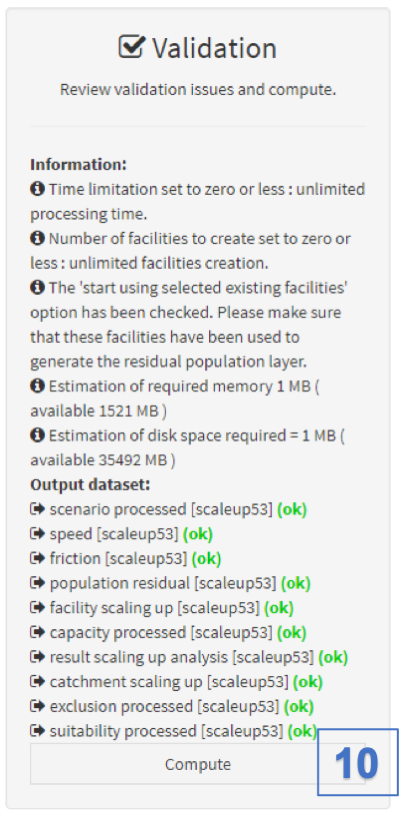{width="300"}

[Validation]{.underline}

\(10\) The validation section (indicated to the right) should indicate that all fields have been correctly filled in (with a green “OK”). If this is the case you can hit the "Compute" button to launch the analysis. If this is not the case, the "Compute" button will still be red and you will have to go through the warning and error message to find out what needs to be adjusted.

A transparent window with some text and a progress bar will appear in front of the panel while the analysis is being conducted. Please wait until this window disappears to continue using AccessMod. This analysis can take a large amount of time to be performed because of the iterative way of processing each health facility, and depends on the number of suitability factors and exclusion areas that have been selected, as well as the size of the study area.

 Once the window disappears and the analysis is done, go back to the Data module to check that the eight output datasets that have been generated are as follows:

1.  [scenario processed class:]{.underline} Table containing the travel scenario that has been processed.
2.  [population residual time class:]{.underline} Raster format layer containing the residual population. This is the population still not covered by the scaled-up network obtained in this analysis.
3.  [facility scaling up class:]{.underline} Vector format layer containing the new health facilities that have been computed, and located, plus the original ones in case the "start using selected existing facilities" option has been checked in the analysis settings.
4.  [capacity processed class:]{.underline} Table containing the values of the processed capacity table.
5.  [result scaling up analysis class:]{.underline} Table containing the results of the scaling up analysis.
6.  [catchment scaling up class:]{.underline} Vector format layer containing the extent of the catchment area for each newly located facility.
7.  [exclusion processed class:]{.underline} Table containing the parameters and parameter values included in the exclusion table.
8.  [suitability processed class:]{.underline} Table containing the parameters and parameter values included in the suitability table.

 As you did for the previous analysis, archive all these results, export and unzip them in order to open and visualize the results.

 We will concentrate here on the main results of this scale up analysis, namely the location and types of the new located health facilities, and the statistics associated with the scaling-up analysis.

First, open in your GIS software:

-   The vector format layer containing the locations of the new health facilities located during the analysis plus the original ones in case the "start using selected existing facilities" option has been checked in the analysis settings. This layer is found in the output folder named "vector_facility_scaling_up_scaleup53".
-   The vector format layer containing the catchment areas for the new health facilities located through the analysis. It is found in the folder named "shape_catchment_scaling_up_scaleup53".

In the figure below, we show a layer composition (made in QGIS) showing the resulting health facility layer containing the 10 original health facilities (in red) and the new 7 health facilities (in blue), together with their respective catchment areas (light blue). The road network and the exclusion area used during the analysis have also been added here to facilitate the visualization of the results. We can see in this Figure that seven new health facilities have been located in the south-eastern part of the area, and one health facility has been located in the northern part. For the last facility, we can see that it is has been located outside of the exclusion area, yet its catchment extends over this exclusion area. 

{width="500"}

If you open the attribute table of the new health facility vector file in your GIS software, you will get the following table (here displayed in QGIS):

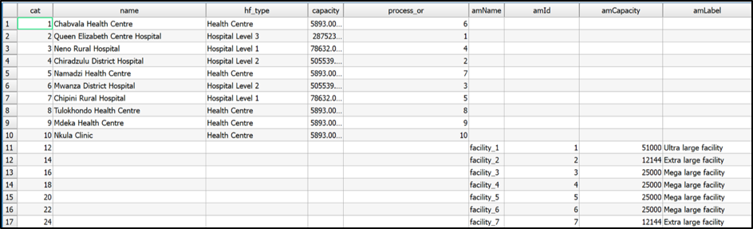

In this table, you can see that the first 10 lines contain the information for the existing health facilities, while the next 7 lines contain the information for the new health facilities that have been located through the analysis. Compared to the original attribute table of the existing health facility layer, there are 4 new columns that have been added, which are the 4 right-most columns in the screenshot above:

-   **amName**: Temporary name attributed to each new health facilities by AccessMod.
-   **amid**: Unique identifier attributed to each new health facility by AccessMod. Please note that this identifier does also correspond to the order in which the new health facilities have been located during the analysis.
-   **amCapacity**: Maximum coverage capacity attached to the new health facility through the analysis, based on the field selected from the new health facility information table (see Section 3.3.2.3).
-   **amLabel**: The health facility type attached to the new health facility through the analysis, based on the field selected from the new health facility information table (see Section 3.3.2.3).

 The statistical results from the scaling up analysis are found in the Excel file named "table_result_scaling_up_analysis_scaleup53.xlsx". This table contains the following columns. (Note that the table is split in two parts in the following screenshot.)

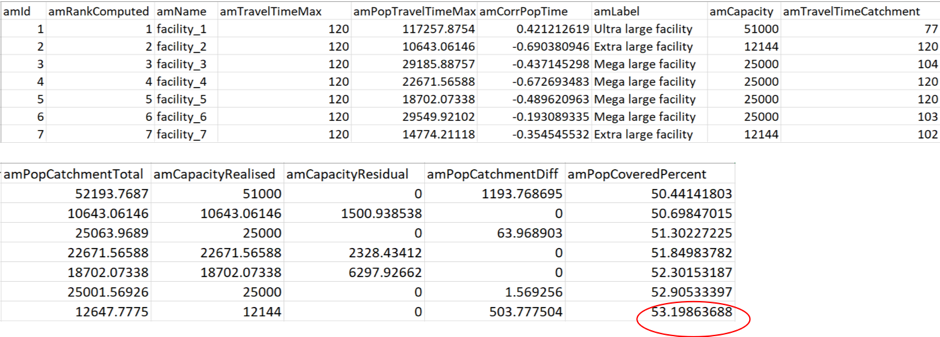

-   **amid:** Unique identifier attributed to each new health facility by AccessMod. Please note that this identifier corresponds to the one reported in the "amid" column of the resulting health facility layer
-   **amRankComputed:** Order in which the new health facilities have been located during the scaling-up analysis
-   **amName**: Temporary name of the new health facility attributed by AccessMod and corresponding to the name reported in the "amName" column of the resulting health facilities layer
-   **amTravelTimeMax:** Maximum travel time, in minutes, set for the analysis
-   **amPopTravelTimeMax:** Total population located within the maximum travel time set for the analysis (amTravelTimeMax)
-   **amCorrPopTime:** Pearson correlation coefficient between the set of travelling times (t, from 0 to the maximum travel time) and the corresponding covered population within this time step (i.e., the sum of population in all cells that are located between t and t+1 of travelling time). The correlation can give a rough estimate of how to population is distributed through space as we move outward from the health facility. As an example, a large positive value (e.g. 0.421 in the first line of the above table) means that the population is relatively uniformly distributed as you expand outwards from the facility. A strong negative value would mean that there is more population closer to the health facility than there is far away from it. A correlation close to zero means that there is no tendency in how the population is spread within the catchment area. Therefore, this correlation should really just be used as a relative indicator, as we do not provide the significance of the correlation in AccessMod (You should use proper GIS analysis outside AccessMod if you need statistical insights about how the population is spatially spread within the catchments).
-   **amLabel:** Health facility type attached to the new health facility through the analysis, based on the field selected from the new health facility information table. This field contains the same information as the "amLabel" column of the resulting health facilities layer.
-   **amCapacity:** Maximum coverage capacity attached to the new health facility through the analysis, based on the field selected from the new health facility information table. This field contains the same information as the "amCapacity" column of the resulting health facilities layer.
-   **amTravelTimeCatchment:** Travel time to reach the maximum extent of the catchment area attached to the health facility. This value is either:
    -   Equal to the maximum travel time set for the analysis (amTravelTimeMax) when the maximum coverage capacity of the facility has not been reached within that given time (120 min in this case); or,
    -   Smaller than the maximum travel time set for the analysis (amTravelTimeMax) when the maximum coverage capacity of the facility is reached before reaching amTravelTimeMax.
-   **amPopCatchmentTotal:** Population located within the catchment area for the travel time reported in the amTravelTimeCatchment field
-   **amCapacityRealised**: Part of the maximum coverage capacity of the health facility that is being realized (used) based on the total population located in the catchment area for the travel time. This value is:
    -   Equal to the maximum coverage capacity of the health facility (capacity) when this value is reached before the maximum travel time (amTravelTimeMax).
    -   Smaller than the maximum coverage capacity of the health facility (capacity) when such capacity is not reached within the maximum travel time (amTravelTimeMax).
-   **amCapacityResidual:** Part of the maximum coverage capacity of the health facility that is not being used. This value is calculated by finding the difference between the maximum coverage capacity (capacity) and the realized capacity (amCapacityRealised). This value is therefore equal to 0 when the maximum coverage capacity is being reached within the given travel time.
-   **amPopCatchmentDiff**: Part of the total population located in the final catchment area (amPopCatchmentTotal), which is not covered by the facility due to lack of coverage capacity. This value is calculated by finding the difference between the total population in the catchment area (amPopCatchmentTotal) and the realized capacity (amCapacityRealised). This value is therefore:
    -   Equal to 0 when the maximum coverage capacity is not reached within the given travel time; or
    -   Greater than 0 when the maximum coverage capacity is reached within the given travel time
-   **amPopCoveredPercent**: Cumulative geographic coverage expressed in percent. This value corresponds to the percentage of the initial population distribution grid that is being covered after each iteration (i.e., after each new health facility is located)

Of particular interest after the scaling-up analysis are the values of the cumulative geographic coverage reported in the "amPopCoveredPercent" column. The content of this column allows for the identification of the percentage of the population covered after each iteration, i.e., after having located an additional health facility in the study area, taking the suitability factors and exclusion areas into account.

 As we specified that we wanted to reach 53% percent of geographic coverage of the total population in this analysis, the scaling-up analysis had to locate 7 new health facilities before reaching 53%. With these 7 new health facilities, the updated network of health facilities now covers 53.19% of the population (circled in red in the previous figure).
