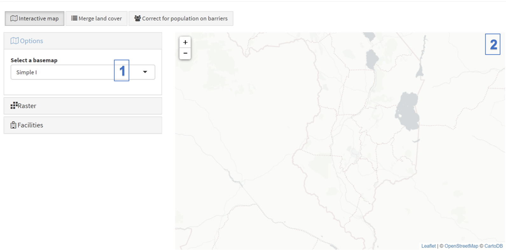
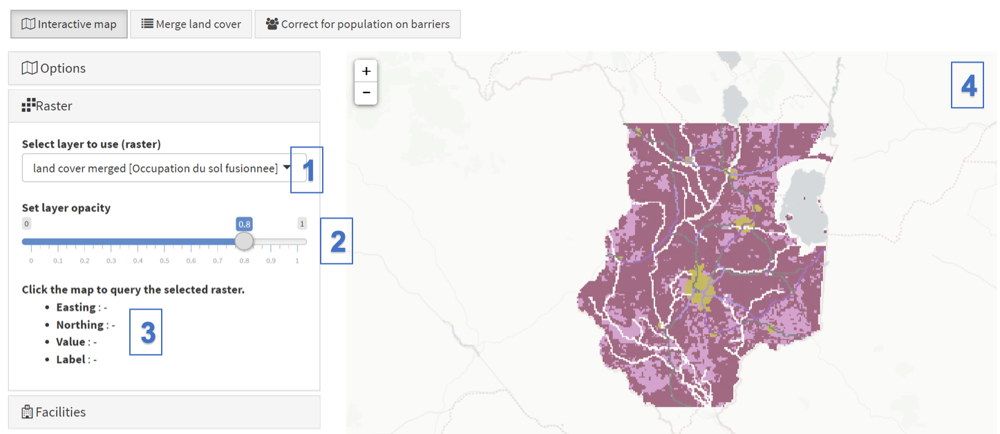
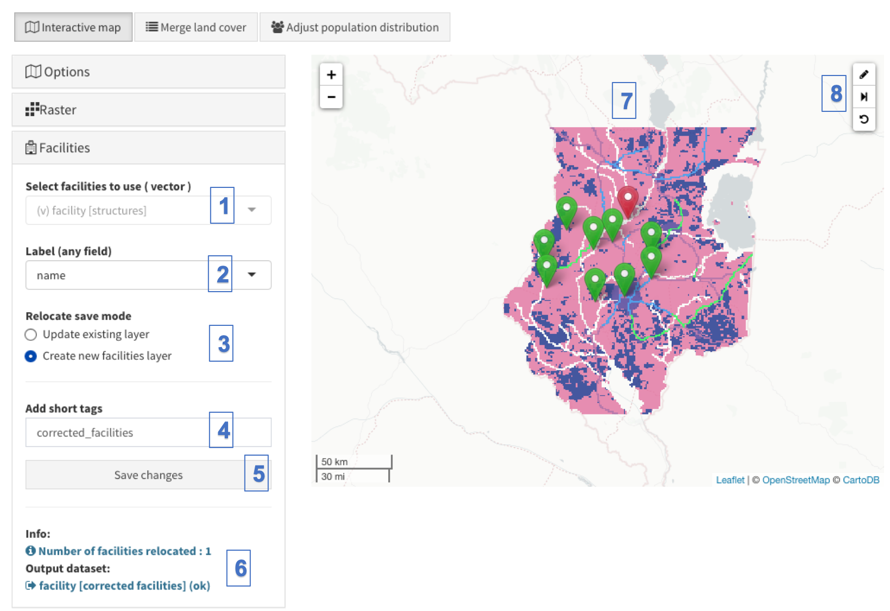
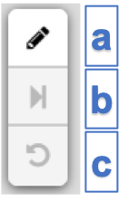

The "Interactive map" tool is found in the Toolbox module, and it is useful to **preview raster format layers** uploaded or created through the use of the different tools in AccessMod. With this tool, the selected raster format layer can be explored using zooming and panning functionalities, and raster values can be queried on a mouse click. Different options are also offered to the user to have remotely sensed images or light-colored layer base maps appearing as background maps.

With this tool, you can also **change the locations of facilities**, for example to avoid that they fall on barriers. 

There are three panels associated to this tool and their functionalities are as follows:

[Options:]{.underline}

(1) Under “Select a basemap”, you can select the base map that you want to see being displayed in the background of the map area. You have the following choices: Simple 1 (OSM simple cartography), Dark (OSM dark theme), Outdoors (OSM outdoors), Terrain (Terrain from ESRI), Satellite 1 (satellite image service from ESRI), Empty (no information).

(2) Thee main map area displays the selected base map and the raster layer selected in the next panel, with the raster shown on top of the base map. 

[Raster]{.underline}:

(1) The "Select layer to use (raster)” drop-down menu allows you to select the raster layer to be displayed (in this example, the output raster of 120 minutes accessibility analysis)

\(2\) Under “Set layer opacity”, this slider allows you to set the opacity level for the selected raster format layer. Setting the value to a smaller value will result in making the raster layer more transparent, in order to better see the underlying background map. 

(3) This area contains information about the raster cell that the user has clicked on in the display area (4). That information contains the coordinates longitude (Easting), latitude (Northing), the value of the raster of the clicked cell (Value) and, when it applies, the associated label (Label). Please note that clicking outside of the area covered by the selected raster layer will still result in the display of the coordinates but will provide neither a value nor a label.

::: callout-warning
**The base maps are accessed from freely available map services/imagery. However, they require an Internet connection to work properly. Without an Internet connection, the background of the map area will remain blank. The color ramp is selected automatically by GRASS and it is not possible to change it.**
:::

[Facilities]{.underline}

The Facilities sub-tool is used to display a vector layer of class "facility", and if needed **to correct the locations of facilities that fall on barrier cells**, because on such cases those facilities cannot be taking into consideration in any of the analyses. You can either decide to update an existing facility layer already imported in AccessMod, or to save your corrections in a new facility layer. As shown in the example in the Figure below, the facilities located on barrier pixels (NoData pixels in the landcover merged raster) appear with a red location icon, while the facilities that are outside barriers appear green. You can then easily spot the facilities on barriers and correct their locations. A "next" button allows you to iterate through all remaining "red" facilities, which is very useful if your facility layer contains a large set of facilities on barriers.

{width="650"}

(1) The "Select facilities to use ( vector )" drop-down menu allows you to select the facility layer that you would like to visualise on top of any raster layer selected in the "Raster" sub-tool.

[(2) The "Label (any field)" drop-down menu allows you to select a column in the attribute table of the facility layer in order to display the value in the column when you mouse hover on an icon on the map.]{.c-blue}

(3)  The "Relocate save mode" allows you to choose wether the modified facility layer will overwrite your selected facility layer ("Update existing layer") or if you modified layer will be saved in AccessMod as a new facility layer ("Create new facilities layer").

\(4\) The "Add short tags" box allows you to name the output facility layer.

\(5\) The "Save changes" button allows you to save your changes. In the case where you are updating an existing facility layer, this button can be clicked several times during the process of correcting facility locations.

\(6\) The info area gives information, error, and warnings. 

\(7\) The map area is where you can interact with the facility locations and change their coordinates by drag-and-dropping a facility icon to a new location. In the example above, one facility if located on barriers (the red icon). You can therefore choose to move its location by first clicking on the "edit" button in the small map toolbox (7), then by clicking-and-dragging the red facility icon to a new location. If this new location is not a barrier pixel in your selected raster layer, the icon will turn green. You can either continue to change locations of the same facility or other ones, or save your changes.

\(8\) The description of the map toolbox is as follows:

\(a\) "Edit" button to toggle the edit mode for changing the locations of facilities

\(b\) "Next" button that allows you to automatically move and zoom to the next remaining facility located on barrier

\(c\) "Undo" button that allows you to undo your last facility relocation action. By clicking on it the facility will be back to the previous location where you dropped the facility. You can click several times on it to undo a series of moves, but only until the latest state where you saved the file for the last time.

::: callout-warning
**Changing the locations of facilities needs to be done with great caution. The typical case is when a facility falls on a river, which is usually set as a barriers in the landcover merged layers. In this case, you need to decide on which side of the river the facility needs to be relocated. This choice can influence your results. A way to help this decision is to have the satellite image in the background of the map, to see with more details the situation of the facility coordinates before moving it. **
:::
