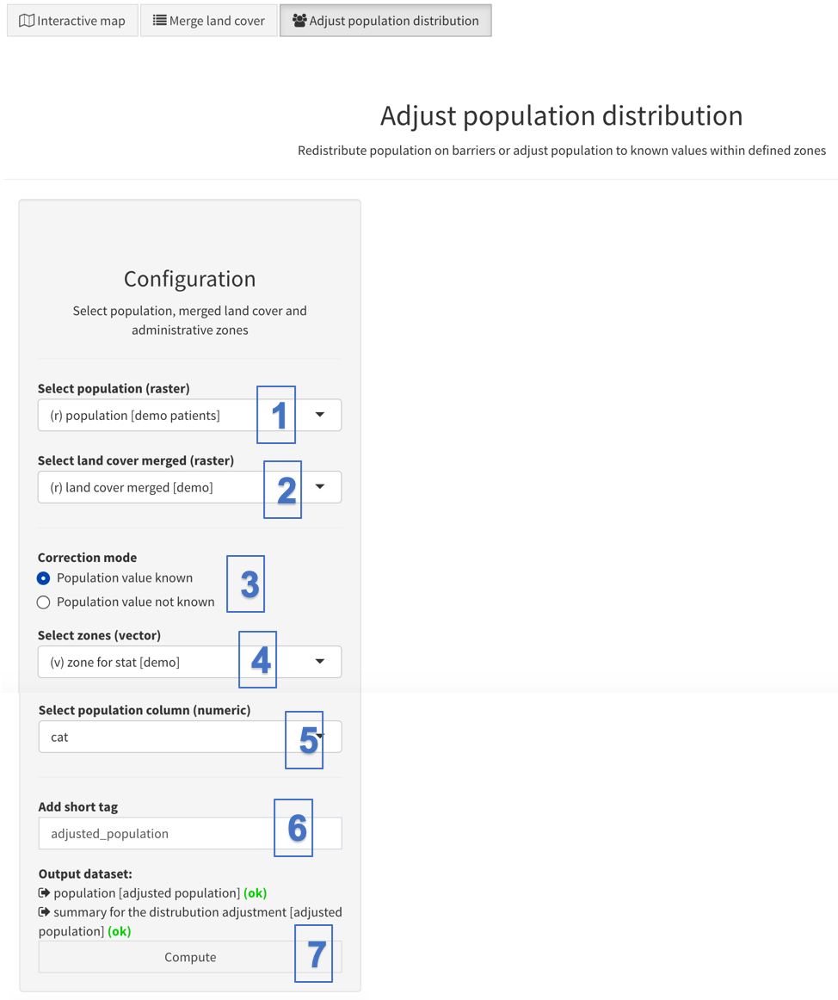

This tool is found in the Toolbox and allows one to adjust the population distribution raster so that the population found in barrier pixels (as specified in the merged landcover) is redistributed outside of these barriers. The redistribution is done uniformly over all non-barrier pixels found within each of the user-specified sub-administrative units. The correction of the population on barriers is important when you want to ensure that your statistics (e.g. percentage of coverage, number of populations found in each catchment, etc.) account for it.

The underlying hypothesis when using this tool is that the methodology used to obtain the population density raster has wrongly distributed some population in places where there should not be any population (e.g. on some rivers, airport, wetlands, etc.).

Please see Appendix 1 for the details of the algorithm implemented in this tool.

There are two correction modes available (since version 5.6.25):

-   "Population value known": for this, it is assumed the attribute table of the administrative unit shapefile has a column informing about the official number of population in each administrative unit. AccessMod will therefore ensure, in each administrative unit, that the population redistributed outside barriers sum up to the official population number of that unit. Note that this option can also be used when one simply want to correct the whole population by a factor (e.g. to obtain the population of pregnant women, by multiplying the total population in each administrative zone by 5%).
-   "Population value not known": for this, it is assumed you do not know the official total distribution of each administrative unit. AccessMod therefore assumes that the sum of population in each administrative unit is the correct one and redistribute this total population outside barriers. 

Before running the tool, it is assumed that the following three layers are already uploaded into AccessMod and that all of them have the same projection system, extent and resolution than the DEM :

-   Population distribution raster;
-   The land cover merge raster;
-   The shapefile of the Administrative boundaries down to the sub-national level (with an attribute column holding the official population number, if needed).

 The steps that are automatically applied by the tool to correct the population are the following ones:

1.  The population distribution grid (“total population“) is first masked with the landcover merge grid in order to extract the population outside of the barriers, which gives a “partial population” grid, whose sum of pixels values gives the “partial population”.
2.  The ratio between total and partial population is computed.
3.  The “partial population” grid is multiplied by this ratio. This process produces a “corrected population“ grid that has no population in barrier pixels, but whose sum of population is equal to the sum of population of the original population distribution grid. If the correction mode "Population value known" was chosen, an additional factor is applied to ensure that the sum of population now matches the population value found in the attribute table.

These three steps are done for each administrative unit found in the input administrative boundaries shapefile. It is therefore recommended to use administrative level 3 or 4 (rather than 1 or 2) so that the population on barriers will be redistributed close to the barriers within a small administrative unit.

The panel for this tool and its functionalities is as follow:

{width="600"}

\(1\) “Select population (raster)”: select the raster format layer containing the spatial distribution of the target population

\(2\) “Select merged land cover layer (raster)”, select the raster format layer containing the merged land cover resulting from the use of the first tool (see Section 5.5.2) - named "land cover merged"

\(3\) Under "Correction mode", select the correction mode to be applied

\(4\) Under “Select zone name (text)", select the field from the zone boundaries layer

\(5\) Select the population column that holds the population number to match, if the correction mode "Population value known" was selected

\(6\) Under “(Add short tags)”, give short tags, we will use “adjusted_population" for the present exercise

\(7\) You can then click the “Compute" button, in case there are no issues, to launch the calculation
