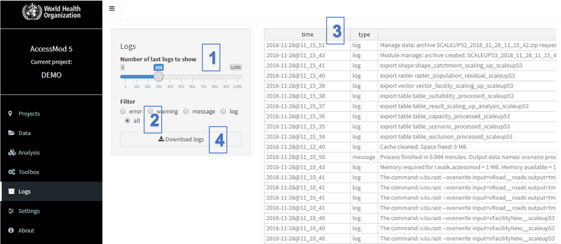

The logs module stores all major events (logs) occurring during an AccessMod session, such as opening a project, importing data or performing analyses. This log is an excellent source of information for the AccessMod team in the event of a problem, and should therefore be included in any email reporting a problem in AccessMod.

Four types of log can be displayed:

1.  *Errors*. This kind of log reports critical events that stopped AccessMod to run properly. It could be linked to a bug or an unexpected event. Given the high level of complexity of spatial data, this can happen from time to time. Usually, this is an error from the user, and looking at the text of the log can help the user to fix it. In case you think this is a bug in AccessMod, you can report it in GitHub (see below).
2.  *Warning*. This kind of log represents events that could lead to unexpected behavior, such as upgrading AccessMod, importing non-standard data or doing something in an unexpected way. It lists also unexpected events, such as missing internal data or wrong metadata parameters, that do not prevail the application to continue running.
3.  *Message*. This is a special kind of log, used mainly for debugging the application and can represent many different events. Its purpose is to emphasize infrequent events.
4.  *Log*. This kind of log is where all the routine messages of what is happening in AccessMod are listed. It is like a "verbose mode" in most computer systems.

The Logs module and its functionalities are as follow:

{width="800"}

(1)  Within, “Number of last logs to show”, you can select how many of the latest logs you would like to see with the moving slider.

(2)  The Filter radio button allows you to choose the type of logs you would like to display (error, warning, message, or log. See above for explanations)

(3)  The Log table, on the right-hand side of the screen, shows where the time, type and content of each log for the selection defined under Steps 1 and 2 are being displayed

(4)  The "Download logs" button allows you to download a table (\*.csv), with all the logs (error, warning, message, log).

 Users can report potential bugs by adding a new issue or updating an existing one in AccessMod Github repository at this URL: <https://github.com/fxi/AccessMod_shiny/issues>. Please note that you will first need to have a free Github account before using this website.

 When reporting a bug, please:

-   Indicate the local revision number of the version you were using when the bug happened (see Section 5.9.2 on where to find this number).
-   Be as specific as possible by indicating the module, and tool(s) when applicable, the exact problem in the title of the issue, and report as much information as possible in the free-text section of the issue.
-   Copy the last few lines of all logs into the issue report, as this could greatly facilitate the solving of the issue.
-   Include a link to the dataset you were using at the time of the bug. If the dataset is too big to be shared or access is restricted, a sample of it would already be very useful.

 The AccessMod Github repository can also be used to share desired functionalities with the AccessMod team.

 When submitting a request for a new functionality to be considered for a next version of AccessMod, please:

-   Indicate that this is a request for improvement in the title of the issue.
-   Be as specific as possible, and indicate the context in which such improvements would be useful in the free text section of the issue.
