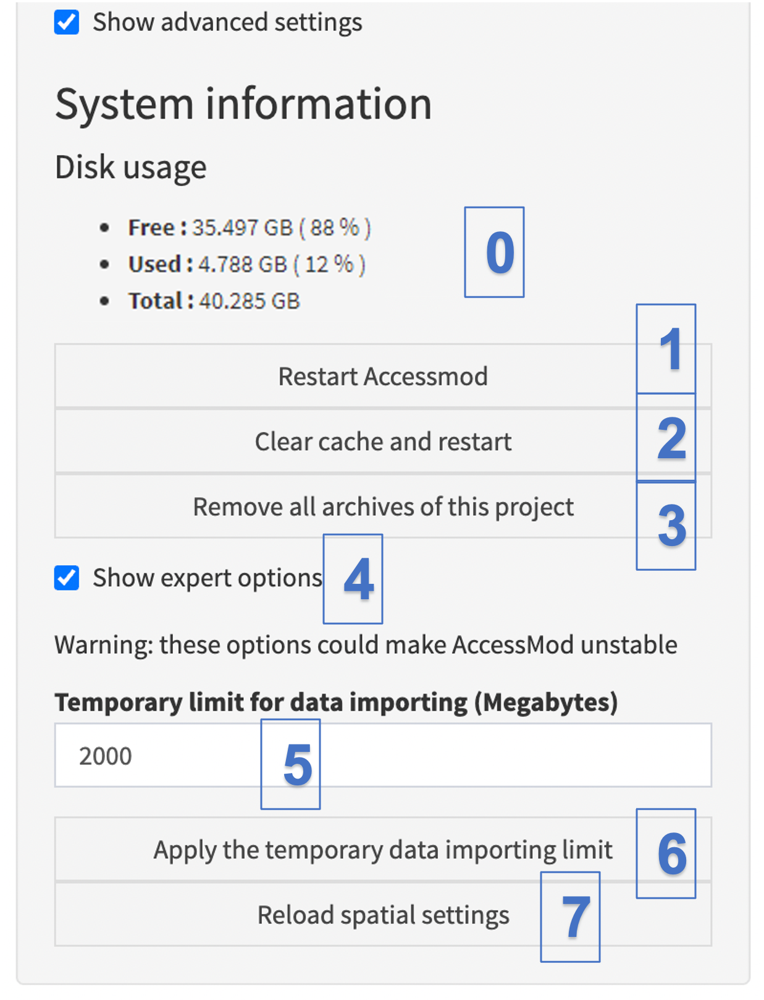

Checking the "Show advanced settings" box in the Settings module allows you to access the following information and capabilities:

{width="320"}

\(0\) The “System information” part of the panel lists useful metrics of disk usage:

-   [“Free”:]{.underline} available disk space in the AccessMod Virtual Machine (VM), in GB and percentage of total available
-   [“Free”:]{.underline} currently used disk space in the VM, in GB and percentage of total available
-   “Total”: Total disk space in the VM, in GB. The default disk space allocated to the AccessMod VM when importing it in VirtualBox is 40 GB.

In the Docker version of AccessMod, these metrics may be scrambled.

\(1\) The “Restart AccessMod” button restarts AccessMod. Clicking on it will restart AccessMod in the virtual machine, and will therefore reload AccessMod in your browser. This can be useful in some rare instances when AccessMod becomes unstable (i.e., crashes easily).

\(2\) The “Clear cache and restart” button clears the cache and restarts AccessMod. Compared to the previous button, this one will delete the cached (stored) images that were previously generated by the "Raster Preview" module. This will free some disk space and can resolve issues where the displayed images in the "Raster Preview" do not correspond to the latest results (for example, when you have performed the same analysis, with the same associated tags, twice). In some rare instances, clearing the cache can also stop erratic behavior of the data module.

\(3\) The “Remove all archives of the project" removes all archives that have been generated in the Data module. Archives files, while small, could fill up the disk and it is useful to remove them all if too numerous.

\(4\) The “Show expert options” check box allows for the opening of the expert options of AccessMod. These options complement the advanced ones and are dedicated to users who have a good level of understanding of AccessMod.

\(5\) The “Temporary limit for data importing (Megabytes)” field allows for the expansion of the data importing limit. By default, this limit is set to 300 Megabytes (per individual imported layer), but it can be extended to a larger number (up to 1’000 Megabytes) if you need to import a larger file. It is nevertheless important to note that increasing this limit and importing a very large file may result in making AccessMod slow or unstable (depending on the hardware characteristics of your machine, and especially if you have a limited amount of RAM).

\(6\) The “Apply the temporary data importing limit” button applies the temporary data importing limit set under point 6.

\(7\) The “Reload spatial settings” button to reload the spatial data settings. Clicking on this button will allow resetting the projection, resolution, and extent of GRASS based on the DEM. This can be useful in the unlikely event when GRASS will crash in the middle of a function that changes resolution. In such case, GRASS can temporarily have the wrong resolution, and reloading the spatial data settings will correct for that.
