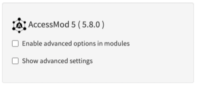

The settings module allows you to:

1.  Enable the advanced options in the different modules
2.  Access the advanced settings and expert options

{width="300"}

These functionalities are unchecked by default. Therefore, you will have to access the Settings module and check these options to have access to their respective information and capabilities.

Note that AccessMod version number appears in the screenshot above ("5.6.0"). You might get a different version number in your installation of AccessMod as it is updated regularly.

The following section describes the content for these two options in more details.

## In this section

- [5.9.1. Enable advanced options in modules](5-9-1-enable-advanced-options-in-modules.qmd)
- [5.9.2. Advanced settings and expert options](5-9-2-advanced-settings-and-expert-options.qmd)
