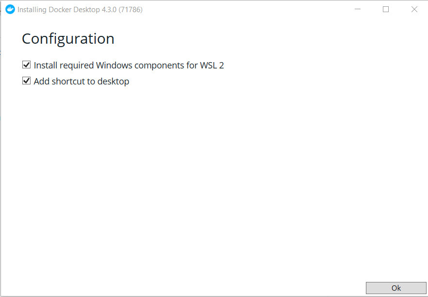

------------------------------------------------------------------------

## Windows {#id-9-1-installationofdockerdesktop-windows}

#### Requirements {#id-9-1-installationofdockerdesktop-requirements}

1.  Windows version:
    1.  Windows 11 64-bit: Home or Pro version 21H2 or higher.
    2.  Windows 10 64-bit: Home or Pro 21H1 (build 19043) or higher.
    3.  Verify by opening the **Windows** **menu,** then type: '*system information*' and search in the **version** line, there you will find the build number. Update Windows if necessary.
2.  Enable the WSL 2 (Windows Subsystem for Linux) backend:
    1.  In the PowerShell terminal type: `wsl --install -d ubuntu-20.04` This will install the Windows subsystem for Linux with the Ubuntu 20.04 distro.
    2.  After installing WSL, it will be necessary to restart your computer. Then there will be a short installation and activation process that will ask you to set a user name and an administrator password.
3.  Your system must have at least 4GB of RAM
4.  Hardware virtualization must be active in the BIOS
    1.  Enter the BIOS at start up and there access CPU configurations, then enable virtualization (e.g. VT-x, AMD-V, SVM, Vanderpool)
    2.  Open the Windows menu and type '*Turn Windows Features on or off'.* There, check that '*Virtual Machine Platform*' and '*Windows Subsystem for Linux*' are selected.

For further details, please visit <https://learn.microsoft.com/en-us/windows/wsl/install-manual>

#### Installation {#id-9-1-installationofdockerdesktop-installation}

1.  Download Docker for Windows (<https://desktop.docker.com/win/main/amd64/Docker%20Desktop%20Installer.exe>)
2.  Execute the `Docker Desktop Installer.exe` file to install the software as usual.
3.  If requirement 2. above was not done or did not worked well, it is possible that during the installation Docker asks to install the WSL 2 components. Please select this option.\
    \
    

[**Note**: If there is a Firewall warning asking to allow Docker to connect to private and/or public networks, please allow both connections.]{.c-orange}

More details in <https://docs.docker.com/desktop/install/windows-install/>

------------------------------------------------------------------------

## Apple {#id-9-1-installationofdockerdesktop-apple}

### For Mac (Intel) {#id-9-1-installationofdockerdesktop-formac-intel}

#### Requirements {#id-9-1-installationofdockerdesktop-requirements-1}

-   MacOS must be version 10.15 or newer. That is, Catalina, Big Sur, or Monterey.
-   [**If you have VirtualBox**]{.c-orange} with a version lower than 4.3.30, you have to uninstall it or upgrade it.

#### Installation {#id-9-1-installationofdockerdesktop-installation-1}

1.  Download Docker for Mac (Intel): <https://desktop.docker.com/mac/main/amd64/Docker.dmg?utm_source=docker&utm_medium=webreferral&utm_campaign=docs-driven-download-mac-amd64>
2.  Install the `Docker.dmg`{.language-plaintext .highlighter-rouge} file as with any other application, and accept the subscription agreement.

### For Mac (M1) {#id-9-1-installationofdockerdesktop-formac-m1}

#### Requirements {#id-9-1-installationofdockerdesktop-requirements-2}

-   To get the best experience, Docker recommends to install Rosetta 2. To install Rosetta 2, open the Terminal and type: `softwareupdate --install-rosetta`

#### Installation {#id-9-1-installationofdockerdesktop-installation-2}

1.  Download Docker for Mac (M1 chip): <https://desktop.docker.com/mac/main/arm64/Docker.dmg?utm_source=docker&utm_medium=webreferral&utm_campaign=docs-driven-download-mac-arm64>
2.  Install the `Docker.dmg`{.language-plaintext .highlighter-rouge} file as with any other application, and accept the subscription agreement.

More details in <https://docs.docker.com/desktop/install/mac-install/>

------------------------------------------------------------------------

## Linux {#id-9-1-installationofdockerdesktop-linux}

This example uses the **Ubuntu** distro. For specific instructions on other distros please visit: <https://docs.docker.com/desktop/install/linux-install/>

#### Requirements {#id-9-1-installationofdockerdesktop-requirements-3}

-   Have a 64-bit version of either Ubuntu Jammy Jellyfish 22.04 (LTS) or Ubuntu Impish Indri 21.10. Docker Desktop is supported on `x86_64`{.language-plaintext .highlighter-rouge} (or `amd64`{.language-plaintext .highlighter-rouge}) architecture.
-   For non-Gnome Desktop environments, `gnome-terminal`{.language-plaintext .highlighter-rouge} must be installed:

``` applescript
sudo apt install gnome-terminal
```

#### Installation {#id-9-1-installationofdockerdesktop-installation-3}

⚠️ [**IMPORTANT:** ]{.c-orange}**Docker Desktop on Linux runs a Virtual Machine (VM). This means images and containers deployed on the Linux Docker Engine (before installation) are not available in Docker Desktop for Linux.**

This is a simplified, step-by-step version of the required commands to install Docker from the terminal. For further details and additional commands see the [detailed instructions](https://docs.docker.com/desktop/install/ubuntu/).

Uninstall the tech preview or beta version of Docker Desktop:

``` applescript
sudo apt remove docker-desktop
```

For a complete cleanup, remove configuration and data files at `$HOME/.docker/desktop`, the symlink at `/usr/local/bin/com.docker.cli`, and purge the remaining system service files with:

``` applescript
rm -r $HOME/.docker/desktop sudo rm /usr/local/bin/com.docker.cli sudo apt purge docker-desktop
```

##### Set up the repository {#id-9-1-installationofdockerdesktop-setuptherepository}

Update the apt package index and install packages to allow apt to use a repository over HTTPS:

``` applescript
sudo apt-get update sudo apt-get install \ ca-certificates \ curl \ gnupg \ lsb-release
```

Add Docker’s official GPG key:

``` applescript
sudo mkdir -p /etc/apt/keyrings curl -fsSL https://download.docker.com/linux/ubuntu/gpg | sudo gpg --dearmor -o /etc/apt/keyrings/docker.gpg
```

Set up the repository:

``` applescript
echo \ "deb [arch=$(dpkg --print-architecture) signed-by=/etc/apt/keyrings/docker.gpg] https://download.docker.com/linux/ubuntu \ $(lsb_release -cs) stable" | sudo tee /etc/apt/sources.list.d/docker.list > /dev/null
```

##### Install Docker {#id-9-1-installationofdockerdesktop-installdocker}

Download the latest DEB package from <https://docs.docker.com/desktop/install/linux-install/>.

Update the package index:

``` applescript
sudo apt-get update
```

Navigate to the folder where the file is stored, e.g.:

``` text
cd Downloads
```

Run the command `sudo apt-get install ./` writing afterwards the exact *name* and *extension* of the file downloaded, e.g.:

``` applescript
sudo apt-get install ./docker-desktop-4.14.1-amd64.deb
```

Launch Docker with:

``` applescript
systemctl --user start docker-desktop
```
