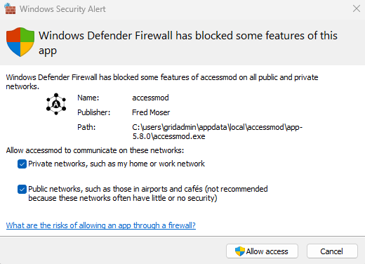
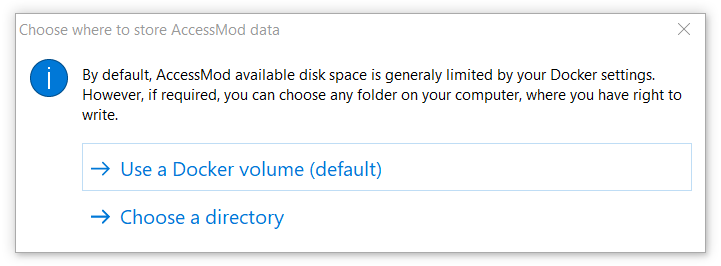
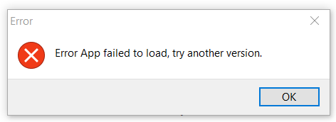
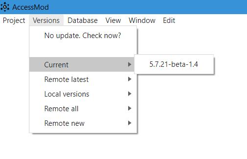

------------------------------------------------------------------------

+--------------------------------------------------+------------------------------------------------------------------------------------------------------------------------------------------+
| {width="50"} | [The electron launcher is a User Interface designed to facilitate the interaction with AccessMod and its baseline functions.\            |
|                                                  | In the menu banner the following functions are available:\                                                                               |
|                                                  | 1. **Project**: This is a more stable way of importing full projects into AccessMod\                                                     |
|                                                  | 2. **Versions**: This function allows to update, delete, and change AccessMod versions\                                                  |
|                                                  | [3. **Database**:]{.c-orange} This function let you change the default data storage location in Docker and choose a different folder in\ |
|                                                  |     your computer (see installation point 3.)\                                                                                           |
|                                                  | [4. **View**:]{.c-orange} This allows you to refresh the view, zoom in and out, set full screen, and access development tools \          |
|                                                  | [5. **Window**: This are additional to minimize and close AccessMod main window, even if you are in full screen mode.\                   |
|                                                  | [6. **Edit**:]{.c-orange}]{.c-orange} This menu contains basic editing functions like copy and paste.\                                   |
|                                                  | ]{.c-orange}                                                                                                                             |
+--------------------------------------------------+------------------------------------------------------------------------------------------------------------------------------------------+

⚠️ [**IMPORTANT:** There could be a conflict between the installation of AccessMod [via the command line](9-3-accessmod-via-docker-compose-command-line.qmd) (Docker compose) and this one. The former will always work, but the access through the electron launcher could get jammed. Ideally, chose one of the two methods to install, run, and update AccessMod.]{.c-orange}

------------------------------------------------------------------------

## In Windows {#id-9-2-accessmodviaelectronlauncher-inwindows}

#### Requirements {#id-9-2-accessmodviaelectronlauncher-requirements}

1.  [Install](9-1-installation-of-docker-desktop.qmd) and start Docker desktop.
2.  Download the installer file for AccessMod from GitHub: <https://github.com/unige-geohealth/accessmod/releases/tag/5.8.0>.
3.  Additional settings:\
    -   From the Windows menu, type '*Settings*' and select '*Apps*'. Then in the first option '*Choose where to get apps*', select '*Anywhere*'.

#### Installation {#id-9-2-accessmodviaelectronlauncher-installation}

1.  Run the `accessmod-5.8.0.Setup.exe` file.
2.  [If there is a Firewall warning asking to allow AccessMod to connect to private and/or public networks, please allow both connections.\
    \
    {width="400"}\
    ]{.c-orange}
3.  An additional message will ask you to select either the default Docker volume or another directory for AccessMod to store files. An different directory in your computer should be writable, but it should **not** be modified afterwards.\
    \
    {width="500"}
4.  AccessMod will open.

------------------------------------------------------------------------

## In Apple {#id-9-2-accessmodviaelectronlauncher-inapple}

### For Mac (Intel) {#id-9-2-accessmodviaelectronlauncher-formac-intel}

#### Requirements {#id-9-2-accessmodviaelectronlauncher-requirements-1}

1.  [Install](9-1-installation-of-docker-desktop.qmd) and start Docker desktop.
2.  Download the installer file for AccessMod from [GitHub](https://github.com/unige-geohealth/accessmod/releases/tag/5.8.0).

#### Installation {#id-9-2-accessmodviaelectronlauncher-installation-1}

1.  Add the installer to the applications, and from there right-click the app and select open. Direct activation is by default rejected by Apple.
2.  A possible error message for invalid version can we waived with OK\
    
3.  An additional message will ask you to select either the default Docker volume or another directory for AccessMod to store files. An different directory in your computer should be writable, but it should **not** be modified afterwards.
4.  AccessMod will open.

### For Mac (M1) {#id-9-2-accessmodviaelectronlauncher-formac-m1}

#### Requirements {#id-9-2-accessmodviaelectronlauncher-requirements-2}

1.  [Install](9-1-installation-of-docker-desktop.qmd) and start Docker desktop.
2.  Download the installer file for AccessMod from GitHub: <https://github.com/unige-geohealth/accessmod/releases/tag/5.8.0>. **Currently, this image only works for x86/intel Apple computers, but will allow you to download through the launcher a version (\>5.7.20) that works with the M1 chips.**

#### Installation {#id-9-2-accessmodviaelectronlauncher-installation-2}

1.  The installation steps 1 to 3 for Intel Mac also apply for M1. However, only the menu banner will open, and a possible error message could pop-up reporting that the App fail to load. Accept with OK.\
    \
    {width="392"}
2.  From the menu banner, select *Versions* and from the sub-menu *Remote all* select any version higher than 5.7.20. If your current version is 5.8.0, you can install one lower or higher and then delete the 5.8.0 image from Docker and re-install it later through this method. \
    
3.  AccessMod will open.

------------------------------------------------------------------------

## In Linux {#id-9-2-accessmodviaelectronlauncher-inlinux}

To install AccessMod follow the steps in the [command line tutorial](9-3-accessmod-via-docker-compose-command-line.qmd).
