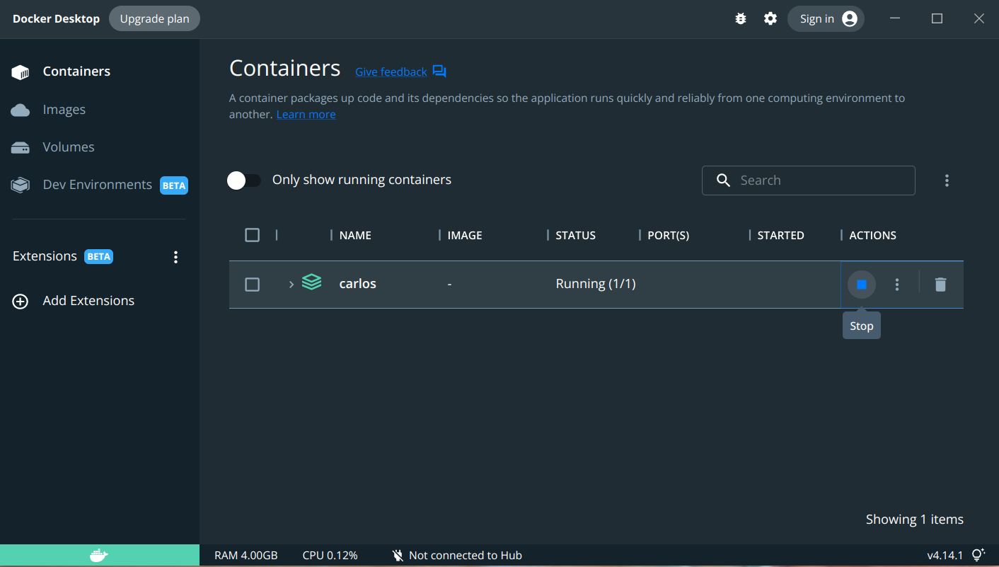
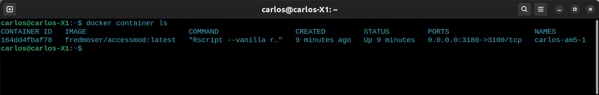

⚠️ [**IMPORTANT:** There could be a conflict between the installation of AccessMod [via the electron launcher](9-2-accessmod-via-electron-launcher.qmd) and this one. This method will always work, but the access through the electron launcher could get jammed. Ideally, chose one of the two methods to install, run, and update AccessMod.]{.c-orange}

## In Windows {#id-9-3-accessmodviadockercompose-commandline-inwindows}

#### First use: {#id-9-3-accessmodviadockercompose-commandline-firstuse}

This procedure can be done either in the **Command Prompt** or in Windows **PowerShell**. Both programs are installed by default in Windows.

The prerequisites for this procedure are:

-   Download and install Docker Desktop, which includes by default the Docker Compose.
-   Download a pre-configured ‘`docker-compose.yml`’ file from <https://www.dropbox.com/s/m7ddlvjvs2rpzzu/docker-compose.yml?dl=0>. This file commands the download and use of the latest version of AccessMod.
-   Optionally you can create the ‘`docker-compose.yml`’ yourself by copying the following text into a code text editor such as **Notepad++** keeping the exact *file name*, *extension*, and *language* (YAML):
    -   By default this code requests the latest version in '`image: fredmoser/accessmod:latest`', but you can also load one of the previous available versions replacing 'latest' for: `5.7.0`, `5.7.17`, `5.7.18`, or `5.8.0`

``` yaml
version: "3.8"

services:
  am5:
    image: fredmoser/accessmod:latest
    ports:
      - "3180:3100"
    command: ["Rscript", "--vanilla", "run.r", "3100", "5100", "5180"]
    volumes: 
      - am5_dev_tmp:/tmp
      - am5_dev_data:/data/dbgrass
      - am5_dev_cache:/data/cache
      - am5_dev_logs:/data/logs

volumes:
  am5_dev_tmp:
  am5_dev_data:
  am5_dev_cache:
  am5_dev_logs:
```

Follow the next steps to pull (download) and run AccessMod from the command line:

1.  Place the ‘`docker-compose.yml`’ file you downloaded or created in a folder easy to locate (**ideally not inside a long series of sub-folders**).
2.  **Start Docker desktop**.
3.  Open Windows ‘**PowerShell**’ or the **Command Prompt** app, e.g. by opening the Windows menu and typing ‘**PowerShell**’.
4.  From the command line navigate to the folder where you placed the ‘`docker-compose.yml`’ file using the following commands:
    -   Typing ‘`cd..`’ followed by enter, to go to an upper level in the file tree, namely towards your main drive C:
    -   Typing ‘`ls`’ followed by enter, to show a list of the files and folders contained in your current folder. This gives you information regarding the folders you can go into.
    -   Typing ‘`cd NameOfFolder`’ followed by enter, to access one of the folders (if any available) inside your current folder. For example: `cd Documents`
5.  When you reach the folder where the ‘`docker-compose.yml`’ file is stored, type in the command line: ‘`docker compose up`’, followed by enter. The pull and compilation will start showing a screen similar to this one (example with **PowerShell**):\
    {width="600"}\
    -   This will create an image in Docker, and a container where your data will be stored.
    -   For this first run do not close **PowerShell**, as it controls the running image.
6.  To start working in AccessMod, open your browser and type in the address bar: ‘`localhost:3180`’ followed by enter. The latest version of AccessMod will open.
7.  To finalize your work and close the virtual machine correctly, go to your **PowerShell** command line and type the key combination **ctrl** + **c**, wait for a few seconds until the process closes up, then type: ‘`exit`’ or close the window.

#### Second and continuous use {#id-9-3-accessmodviadockercompose-commandline-secondandcontinuoususe}

The previous process can be run every time, and Docker compose will only download and update the necessary files, in case there is a minor or major update. If there is no update, it will start the container immediately.

⭐ However, after the first installation, the image downloaded before with **PowerShell** can now be run directly from Docker following the next steps:

1.  **Start Docker desktop.**
2.  Go to ‘**Containers**’ on the left side list of the main screen. There you will find the container created before.
    1.  Start AccessMod by clicking the *start icon* in the actions column.\
        \
         
    2.  Open your browser and type: `localhost:3180`
    3.  After you finished, close the browser and stop the image using the *stop icon* in the action column for the container you started before.

------------------------------------------------------------------------

## In Apple {#id-9-3-accessmodviadockercompose-commandline-inapple}

#### AccessMod installation and running {#id-9-3-accessmodviadockercompose-commandline-accessmodinstallationandrunning}

1.  Download the pre-configured ‘`docker-compose.yml`’ file from <https://www.dropbox.com/preview/Public/docker-compose.yml>, and save the file in a known location.
2.  Alternatively, open a text editor e.g. the TextEdit app, create the YAML file by typing: `touch docker-compose.yml`. Then edit the file and copy/paste the content in the Windows section [above](9-3-accessmod-via-docker-compose-command-line.qmd).
3.  In the Terminal, navigate to location of your ‘`docker-compose.yml`’ file and type: `docker compose up`
4.  The data pull and compilation will start.
5.  To start working in AccessMod, open your browser and type in the address bar: ‘`localhost:3180`’ followed by enter. The latest version of AccessMod will open.
6.  To finalize your work and close the virtual machine correctly, go to your Terminal and type the key combination **ctrl** + **c**, wait for a few seconds until the process closes up, then type: ‘`exit`’ or close the window.

#### Second time and continuous use {#id-9-3-accessmodviadockercompose-commandline-secondtimeandcontinuoususe}

1.  After the first installation, the image downloaded before with the Terminal can now be run directly from Docker.

    1.  **Start Docker Desktop**.
    2.  Go to ‘**Containers**’ on the left side list of the main screen. There you will find the container created before, with the name of the folder from where it was created.
    3.  Start AccessMod by clicking the *start icon* in the actions column.
    4.  Open your browser and type: `localhost:3180`
    5.  After you finished, close the browser and stop the image using the *stop icon* in the action column for the container you started before.

------------------------------------------------------------------------

## In Ubuntu {#id-9-3-accessmodviadockercompose-commandline-inubuntu}

#### AccessMod installation and running {#id-9-3-accessmodviadockercompose-commandline-accessmodinstallationandrunning-1}

1.  Download the pre-configured ‘`docker-compose.yml`’ file from <https://www.dropbox.com/preview/Public/docker-compose.yml>, and save the file in a known location.
2.  Alternatively, open the text editor in Ubuntu and copy/paste the `docker-compose.yml` content in the Windows section [above](9-3-accessmod-via-docker-compose-command-line.qmd). Then select the language as YAML and save the file in a known location with the name: ‘`docker-compose.yml`’.
3.  In the Terminal, navigate to location of your ‘`docker-compose.yml`’ file and type: `docker compose up`
4.  The data pull and compilation will start.
5.  To start working in AccessMod, open your browser and type in the address bar: ‘`localhost:3180`’ followed by enter. The latest version of AccessMod will open.
6.  To finalize your work and close the virtual machine correctly, go to your Terminal and type the key combination **ctrl** + **c**, wait for a few seconds until the process closes up, then type: ‘`exit`’ or close the window.

#### Second time and continuous use {#id-9-3-accessmodviadockercompose-commandline-secondtimeandcontinuoususe-1}

1.  After the first installation, the image downloaded before with the Terminal can now be run directly from Docker.

    1.  **Start Docker Desktop**.
    2.  Go to ‘**Containers**’ on the left side list of the main screen. There you will find the container created before, with the name of the folder from where it was created.
    3.  Start AccessMod by clicking the *start icon* in the actions column.\
        \
        \
    4.  Open your browser and type: `localhost:3180`
    5.  After you finished, close the browser and stop the image using the *stop icon* in the action column for the container you started before.\
         \
        \

2.  From the Terminal, follow these simple steps (more details in this <https://docs.docker.com/engine/reference/commandline/container_start/>):
    1.  Start Docker with: `$systemctl --user start docker-desktop`

    2.  Find the name of the container you want to start with: `$docker container ls`\
        \

    3.  Start your container with: `$docker container start <ContainerName>` e.g. carlos-am-5-1

    4.  Open your browser and type: `localhost:3180`

    5.  Finally, stop your container with: `$docker container stop <ContainerName>`
