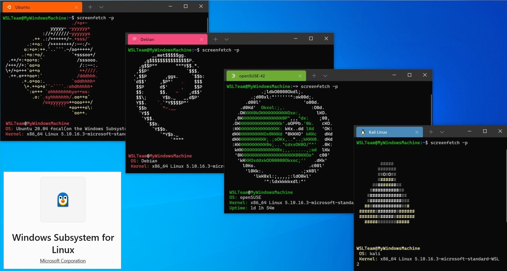
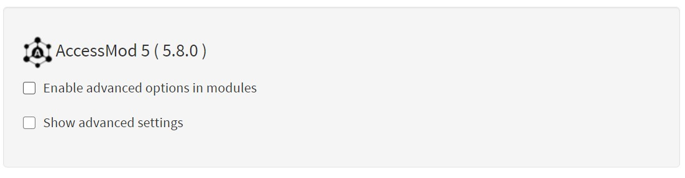
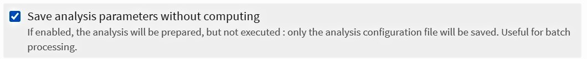
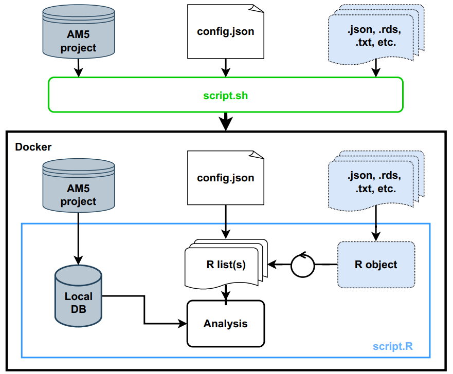

## For experts: straight to the point {#appendix8-replayfunctionality-forexperts-straighttothepoint}

``` applescript
# Clone the repo:
git clone git@gitlab.unige.ch:geohealth/accessmod_replay_demo.git
cd accessmod_replay_demo
# Launch the script:
./script.sh
# Check the result:
gdalinfo -stats out/1_120/raster_travel_time_original/raster_travel_time_original.img
```

## Step-by-step procedure {#appendix8-replayfunctionality-step-by-stepprocedure}

### Requirements {#appendix8-replayfunctionality-requirements}

-   To use the Replay function it is advisable to have a solid knowledge of R and a basic knowledge of Bash.
-   The replay function requires a bash command to run. A language that can be used in **Linux-based** and **Mac OS** only. To use it in Windows, the easiest approach is to install a **Linux-based distro** from the Microsoft Store, e.g. Ubuntu 20.04 LTS, or the Windows Subsystem Linux (WSL), which is anyway required to run Docker desktop. Then, you can use the command line in this distro to run the Replay bash commands.

After installing any of the distros, there will be a short installation and activation process that will ask you to set a user name and an administrator password.

{width="1000"}

-   It is necessary to have **Docker desktop** and **AccessMod** installed. For further instructions in how to install Docker desktop, go [here](9-1-installation-of-docker-desktop.qmd), and for AccessMod either via the command line look [here](9-3-accessmod-via-docker-compose-command-line.qmd), or via the electron launcher, [here](9-2-accessmod-via-electron-launcher.qmd).

### **Preparation of the files ** {#appendix8-replayfunctionality-preparationofthefiles}

To use the Replay function, it is necessary first to prepare the baseline data and the general analysis configuration in AccessMod.

1.  Start Docker desktop
2.  Start AccessMod
3.  In the left panel, go to Settings and select ‘*Enable advanced options in modules*’\
    
4.  To prepare your configuration file, load the required layers and prepare the analysis as usual, in the selected tool. To avoid double computations, select the advanced option ‘*Save analysis parameters without computing*’. This will save your file names and analysis parameters in a` .JSON` configuration file.\
    {width="650"}
5.  Finally, export your individual configuration file and the whole project from AccessMod.

**The Replay: files**

The Replay function uses at least two files as input: the **AccessMod project** (`.am5p`) as input data, and the **configuration file** (`config.json`) as analysis parameters. However, its real value comes from using **additional files** (`.json`, `.``rds`, `.txt`, etc.) to automatically modify the analysis parameters.

### **Files description** {#appendix8-replayfunctionality-filesdescription}

The bash file (**`script.sh`**) acts as a coordinator of the whole process. It starts by identifying the AccessMod image, the output folder, and the files involved (`.am5p`, `.R`, `.json`). It then checks if those files are really present, to finally proceed to run Docker with those files as input and run the R script.

Specifically the bash script calls Docker and runs commands inside a Docker container created from a specific image of AccessMod. It mounts into the container the previous input files (`project.am5p`, `config.json`, etc.), as well as the R script (**`script.R`**) that includes all the instructions for the analysis. The bash script eventually calls an R session to run the R script, which uses the AccessMod project as a **local database**, the **`config.json`** as information source to create a **list of default parameters**, as well as any additional input files as **R objects** that provide new parameters for the analysis. The R script also exports the results into the outputs folder (`/out`), and write down a summary file (`summary.json`).

Finally, the output folder (**`/out`**) is originally an empty folder where all output results will be stored in individual folders for each sequential run according to the parameters described by the` `**`config.json`** file in R.

*Currently, all files and folders need to be in the same directory, but future modifications should allow to work on multi-project runs, keeping only the required inputs in a dedicated directory and later storing there the specific outputs.*

{width="800"}

### **Single use: manual update of parameters** {#appendix8-replayfunctionality-singleuse-manualupdateofparameters}

If you are **not** interested in running a sequential analysis that changes parameters automatically, but instead run one or a few models, it is possible to manually modify the parameters in the **`config.json`** file (example below), which appear as arguments (`"args"`). Make any changes from a text editor such as **Notepad++**. In such case, it will not be necessary to include an additional input file. If the type of analysis (accessibility, geographic coverage, referral, etc.) changes, it is highly recommended to generate a new `config.json` file in AccessMod.

``` applescript
"args": {
    "inputMerged": "rLandCoverMerged__demo",
    "inputPop": "rPopulation__demo_patients",
    "inputHf": "vFacility__demo",
    "inputZoneAdmin": null,
    "outputPopResidual": "rPopulationResidual__batch",
    "outputHfCatchment": "vCatchment__batch",
    "outputPopBarrier": "rPopulationOnBarrier__batch",
    "outputTableCapacity": "tCapacityStat__batch",
    "outputTableZonal": "tZonalStat__batch",
    "outputSpeed": "rSpeed__batch",
    "outputFriction": "rFriction__batch",
    "typeAnalysis": "anisotropic",
    "knightMove": false,
    "removeCapted": true,
    "vectCatch": true,
    "popOnBarrier": false,
    "towardsFacilities": true,
    "radius": 5000,
    "maxTravelTime": 120,
    "maxTravelTimeOrder": 120,
    "useMaxSpeedMask": false,
    "hfIdx": "cat",
    "nameField": "name",
    "capField": "capacity",
    "orderField": "capacity",
    "ignoreCapacity": false,
    "addColumnPopOrigTravelTime": false,
    "addColumnsPopCoverageExtended": false,
    "zonalCoverage": false,
    "zoneFieldId": null,
    "zoneFieldLabel": null,
    "hfOrder": "tableOrder",
    "hfOrderSorting": "hfOrderDesc",
    "tableScenario": [
      { "class": 1, "label": "Built_area", "speed": 6, "mode": "BICYCLING" },
      { "class": 2,
        "label": "Low_dense_vegetation",
        "speed": 4,
        "mode": "WALKING" },
      { "class": 3,
        "label": "Dense_vegetation",
        "speed": 2,
        "mode": "WALKING" },
      { "class": 1001,
        "label": "Main road",
        "speed": 100,
        "mode": "MOTORIZED" },
      { "class": 1002, "label": "Secondary", "speed": 80, "mode": "MOTORIZED" },
      { "class": 1003, "label": "Tertiary", "speed": 50, "mode": "MOTORIZED" }
```

### **Sequential use: automatic update of parameter** {#appendix8-replayfunctionality-sequentialuse-automaticupdateofparameter}

For sequential use, the **`config.json`** file serves as template and baseline to establish the parameters to use in each sequential analysis, so it is not necessary to modify it. Instead, a file (`.json`, `.rds`, `.txt`, etc.) that includes new parameters and can be easily read in R is imported as a list to be looped and modify the default parameter, e.g.:

``` applescript
{
  "scenarios": {
    "MIXED": [
      { "class": 1, "speed": 6, "mode": "BICYCLING" },
      { "class": 2, "speed": 4, "mode": "WALKING" },
      { "class": 3, "speed": 2, "mode": "WALKING" },
      { "class": 1001, "speed": 100, "mode": "MOTORIZED" },
      { "class": 1002, "speed": 80, "mode": "MOTORIZED" },
      { "class": 1003, "speed": 50, "mode": "MOTORIZED" }
    ],
    "MOTORIZED": [
      { "class": 1, "speed": 15, "mode": "MOTORIZED" },
      { "class": 2, "speed": 10, "mode": "MOTORIZED" },
      { "class": 3, "speed": 5, "mode": "MOTORIZED" },
      { "class": 1001, "speed": 100, "mode": "MOTORIZED" },
      { "class": 1002, "speed": 80, "mode": "MOTORIZED" },
      { "class": 1003, "speed": 50, "mode": "MOTORIZED" }
    ],
    "BICYCLING": [
      { "class": 1, "speed": 15, "mode": "BICYCLING" },
      { "class": 2, "speed": 4, "mode": "BICYCLING" },
      { "class": 3, "speed": 2, "mode": "BICYCLING" },
      { "class": 1001, "speed": 15, "mode": "BICYCLING" },
      { "class": 1002, "speed": 15, "mode": "BICYCLING" },
      { "class": 1003, "speed": 15, "mode": "BICYCLING" }
    ],
    "WALKING": [
      { "class": 1, "speed": 5, "mode": "WALKING" },
      { "class": 2, "speed": 4, "mode": "WALKING" },
      { "class": 3, "speed": 2, "mode": "WALKING" },
      { "class": 1001, "speed": 5, "mode": "WALKING" },
      { "class": 1002, "speed": 5, "mode": "WALKING" },
      { "class": 1003, "speed": 5, "mode": "WALKING" }
    ]
  }
}
```

### **Running the analysis** {#appendix8-replayfunctionality-runningtheanalysis}

From your Terminal in Mac OS, Linux OS, or Linux-based distro in Windows, navigate to the directory where your files are stored. From there, run the bash script by typing its name:

`$ ./script.sh`

Find a complete example including the files and code presented before <https://github.com/unige-geohealth/accessmod/tree/main/replay/examples/loop_accessibility_simple>**.**

## **Important notes:** {#appendix8-replayfunctionality-importantnotes}

-   It is fundamental to verify the names of the files to be used, and that those names agree with the way they are called in the different files (bash, .R, .JSON, etc.).
-   It is possible to make as many modifications as possible, as long as you know what you are doing. The input .R file is particularly suited to include additional commands to modify the output rasters, vectors, and tables. The following is the current list of R packages already included in the AccessMod image for Docker:

[`assertthat, base, base64enc, bit, dplyr, bit64, blob, bslib, cachem, cellranger, cli, clipr, Codetools, colorspace, commonmark, compiler, cpp11, Crayon, Crosstalk, curl, data.table, datasets, DBI, digest, ellipsis, fansi, farver, fastmap, fontawesome, forcats, foreach, foreign, fs, future, gdalUtils, generics, ggplot2, globals, glue, graphics, grDevices, grid, gridExtra , gtable, haven, hms, htmltools, htmlwidgets, httpuv, isoband, iterators, jquerylib, jsonlite, labeling, later, lattice, lazyeval, leaflet, leaflet, lifecycle, listenv, magrittr, markdown, MASS, Matrix, memoise, methods, mgcv, mime, munsell, nlme, openxlsx, parallel, parallelly, pillar, rlang, pkgconfig, plogr, plyr, png, pool, prettyunits, progress, promises, providers, purrr, R.methodsS3, R.oo, R.utils, R6, rappdirs, raster, RColorBrewer, Rcpp, readr, readxl, rematch, rgdal, rgeos, rgrass7, rio, RSQLite, sass, scales, semver, shiny, shinydashboard, sourcetools, sp, splines, stats, stats4, stevedore, stringi, stringr, tcltk, terra, tibble, tidyselect, tools, tzdb, utf8, utils, vctrs, viridis, viridisLite, vroom, withr, xfun, XML, xml2, xtable, yaml, zip`]{.c-blue}

-   This is a framework and not a recipe to do analyses, thus all scripts (including the bash) can be modified according to the users’ needs.

------------------------------------------------------------------------
