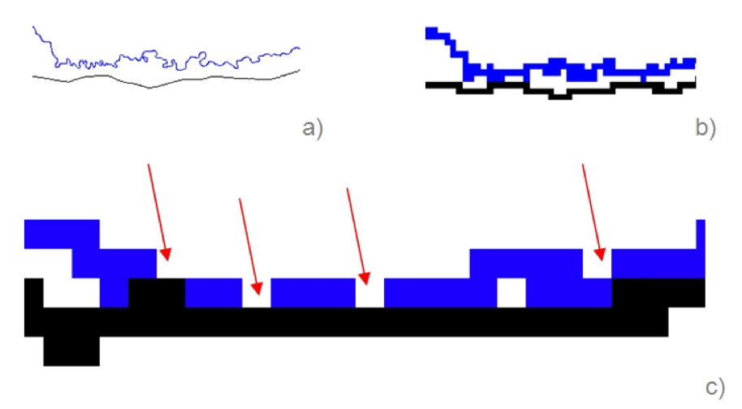
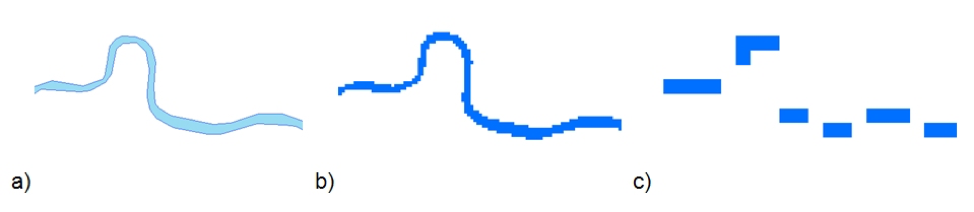

[Unités et projection]{.underline} 

AccessMod utilise des formules qui fonctionnent avec des variables exprimées dans le système métrique. Pour éviter tout problème de calcul, il est nécessaire que toutes les données géospatiales (raster et vecteur) soient projetées dans le même système de coordonnées métriques avant de les importer dans AccessMod.

::: callout-warning
AccessMod n'importera pas un DEM qui ne se trouve pas dans un système de coordonnées métriques. Un message d'erreur apparaîtra dans ce cas.

Un message d'erreur apparaîtra également si vous essayez d'importer une couche au format raster qui ne présente pas le même système de coordonnées que celui du DEM.

Pour les couches au format vectoriel, le moteur GRASS utilisé dans AccessMod re-projete automatiquement les jeux de données pour s’adapter au système de coordonnées du DEM, si ce n’est pas déjà le cas.

Les utilisateurs sont vivement encouragés à s'assurer de la cohérence des paramètres de projection sur toutes les couches en entrée avant de les télécharger dans AccessMod.
:::

En outre, il est recommandé d’utiliser une projection équivalente (d'aires égale, *equal-area*) afin d’éviter de forts biais dans le calcul de la surface des airs de captage et des biais en distance le long des chemins de moindre coût. Des exemples de telles projections incluent les projections Albers, projection cylindrique équivalente, Gall-Peters, Lambert cylindrique équivalente, Mollweide et Werner.

[Étendue et résolution]{.underline}

Toutes les données au format raster utilisées dans AccessMod doivent présenter la même étendue en termes de min/max Est et Nord. Si ce n'est pas le cas, AccessMod utilisera l'étendue du DEM en entrée et ne considérera aucune donnée en dehors de cette étendue.

En outre, toutes les couches au format raster en entrée doivent présenter la même résolution que celle du DEM.

::: callout-warning
Le moteur GRASS utilisé dans AccessMod ré-échantillonnera les couches au format raster présentant une résolution différente de celle du DEM afin de les faire correspondre à la résolution du DEM.

La technique de ré-échantillonnage utilisée par le moteur GRASS est similaire à celle du "voisin le plus proche" (c.-à-d. affectant la valeur dans chaque "nouveau" pixel en fonction de la valeur stockée dans le pixel "voisin" le plus proche). Cependant, GRASS n’utilise pas de fonction dédiée "voisin le plus proche" dans ce cas, mais applique plutôt un "masque de pixels" de la résolution du DEM sur tout autre raster et attribue les valeurs de l’autre raster à la résolution du DEM. Nous n’avons pas été en mesure de préciser la façon dont GRASS procède pour ce faire. Il n'est donc pas sûr que le processus est une application classique du «voisin le plus proche». Il est donc vivement recommandé de toujours s'assurer que les fichiers raster en entrée ont exactement la même résolution.

Bien que le changement de résolution  puisse probablement être correct pour un raster catégoriel tel que l'occupation du sol, ce n'est pas le cas pour la couche de densité de population, car cette transformation ne conservera pas la population totale d'origine et peut donc se traduire par des statistiques de sortie erronées.
:::

Il est important de garder à l'esprit que les jeux de données vectorielles en entrée tels que le réseau routier et les barrières aux mouvements (par exemple, les rivières, les étendues d'eau) sont convertis en raster lors de la génération du raster d'occupation du sol fusionné. Cette conversion est effectuée en utilisant la même résolution que le raster d'occupation du sol d'origine. En fonction de cette résolution, la conversion peut avoir un impact direct sur la relation spatiale entre les routes et les barrières dans la couche d'occupation du sol fusionnée.

Comme premier exemple, la figure ci-dessous montre le résultat de la conversion (pixellisation) d'une couche routière (noire) et fluviale (bleue) pour différentes résolutions. Comme nous pouvons le constater, plus la résolution est basse (c’est-à-dire si la taille des pixels est grande), plus le risque de chevauchement des routes et des rivières est élevé, ce qui crée des «ponts» artificiels (flèches rouges) qui n’existent pas en réalité.

AccessMod 5 contient une nouvelle fonction qui vise à nettoyer la plupart de ces artefacts (voir la section 5.5.2). Même dans ce cas, il est important de prendre conscience de ce problème et de vérifier le résultat d'un tel nettoyage, car l'existence de ces «ponts» artificiels (passage dans la couche de couverture terrestre fusionnée inexistante en réalité) peut grandement influencer le résultat de l'analyse d'accessibilité.

Dans le cas où il resterait trop de ponts artificiels après l'application de la fonction susmentionnée, deux approches sont possibles. L'approche choisie dépendra de la couche de réseau hydrographique d'origine:

1.  ***Une situation dans laquelle la densité des ponts artificiels à corriger est faible*** (comme indiqué en rouge dans\
    la figure a ci-dessous, les routes en vert et les rivières en blanc). Dans ce cas, l'utilisateur doit ouvrir les couches d'occupation du sol fusionnée, des route et du réseau hydrographique dans un logiciel SIG et:

    1.  Générer une zone tampon avec un rayon équivalent à 1,75 fois la résolution de la grille d'occupation du sol d'origine (en bleu clair dans la figure b ci-dessous;
    2.  Mettre la couche du réseau hydrographique en mode édition et déplacer les segments concernés en dehors de la zone tampon, comme indiqué dans la figure c  ci-dessous (lignes bleues). Vous pouvez également vouloir ajuster la manière dont le réseau hydrographique coupe le réseau routier en les plaçant perpendiculairement, comme indiqué également dans la figure c ci-dessous;
    3.  Enregistrer ses modifications, importer la nouvelle couche dans AccessMod et exécuter à nouveau l'outil de fusionnement de l'occupation du sol. La nouvelle couche d'occupation du sol fusionnée devrait alors ressembler à celle présentée dans la figure d ci-dessous. 

    

    2. ***Une situation dans laquelle la densité de vertex sur les segments à corriger est dense*** (indiquée en rouge dans la figure a ci-dessous, routes en vert et rivières en blanc). Dans ce cas, ouvrez les couches d'occupation du sol fusionnée, de route et du réseau hydrographique dans un logiciel SIG et:

    1.  Générer une zone tampon avec un rayon équivalent à 1,75 fois la résolution de la grille d'occupation du sol d'origine (en bleu dans la figure b ci-dessous);
    2.  Placer la couche de réseau hydrographique en mode édition et ajoutez un nouveau segment de rivière en dehors de la zone tampon, comme illustré à la figure c ci-dessous (ligne bleu clair);
    3.  Enregistrer ses modifications et exécuter le premier module d'AccessMod. La nouvelle couche d'occupation du sol fusionnée devrait alors ressembler à celle présentée dans la figure d ci-dessous.

Il est important de savoir que le choix d'une basse résolution peut générer la fusion de segments de route distincts proches les uns des autres. Ceci est illustré dans la figure ci-dessous, où il existe des intersections artificielles entre des segments de route à faible résolution (grille plus grande). Malheureusement, aucune correction ne peut être apportée dans ce cas.

Les utilisateurs doivent également être conscients de l'impact du changement de résolution sur le temps de trajet dans la cellule lorsque les patients atteignent le réseau routier.

Plus précisément, à mesure que les segments de route sont convertis en couche raster lors de la création de l'occupation du sol fusionnée, toute cellule contenant un segment de route sera considérée comme entièrement couverte par une route dans l'occupation du sol fusionnée. Ainsi, la vitesse de déplacement sur ces cellules correspondra à celle du segment de route les traversant.

Bien que le processus ci-dessus n'ait pas beaucoup d'impact lorsque vous travaillez avec des raster à haute résolution (jusqu'à 100 mètres), le fait de travailler avec des grilles à basse résolution peut avoir un impact, car le temps de déplacement requis pour marcher entre la frontière de la cellule et la route n'est alors pas pris en compte.

Par exemple, considérons un patient qui marche à une vitesse de 3 km/h pour atteindre une route passant au milieu de la cellule sur laquelle vous pouvez conduire à une vitesse de 100 km/h:

1.  Lorsqu'on travaille à une résolution de 500 mètres, le patient aurait marché pendant 5 minutes pour rejoindre la route, puis 9 secondes pour en sortir par la route, alors que dans AccessMod, ce chemin ne devrait prendre que 18 secondes pour atteindre le réseau routier et quitter la cellule (17 fois plus rapide). L'erreur ici est donc équivalente à 4 minutes et 51 secondes.
2.  Lorsqu'on travaille à une résolution de 1 kilomètre, le patient aurait marché pendant 10 minutes pour rejoindre la route, puis serait resté sur la route pendant 18 secondes, alors que dans AccessMod, la modélisation ne prend que 36 secondes (16 fois plus rapide). L'erreur dans ce cas équivaut à une sous-estimation de 9 minutes et 42 secondes.

Une fois que le patient est sur le réseau routier dans la couche d'occupation du sol fusionnée qui en résulte, les remarques ci-dessus ne s'appliquent plus car le passage d'une cellule à une autre est effectué à l'aide de la route elle-même. L’erreur est donc appliquée une seule fois et ne se répète pas sur l’ensemble du réseau.

En conclusion, à mesure que la résolution de l'ensemble de données diminue, l'extension des zones de captage a tendance à être surestimée et on suppose que davantage de patients atteignent les installations correspondantes en «gagnant du temps» à la transition entre le réseau routier et les zones où ils doivent marcher.

Malheureusement, il n'est pas possible de corriger les erreurs ci-dessus. Il est donc recommandé d'utiliser la résolution la plus élevée possible en tenant compte du problème de la consommation de RAM (voir section 3.2.5).

En plus de ce qui précède, la pixellisation de polygones de masses d’eau allongés (et d’autres obstacles au mouvement stockés sous forme de polygones) ne génère pas toujours de surfaces continues, contrairement à la pixellisation de lignes vectorielles. La figure ci-dessous illustre ce problème. Comme on peut le voir à la figure c, travailler avec une résolution plus faible (tailles de grille plus grandes) créera des discontinuités, générant ainsi des ponts artificiels dans ces zones.

La solution pour résoudre ce problème consiste à:

1.  Convertir la couche des masses d’eau polygonales en polyligne.
2.  Fusionner la polyligne résultant de l'étape 1 avec votre couche barrière en format ligne (voir la section 3.3.1.8 pour plus de détails).
3.  Utiliser à la fois la couche de polygone d'origine et la couche de ligne fusionnée comme barrière lors de la création de la couche d'occupation du sol fusionnée dans AccessMod.

En même temps, l'utilisation de données au format raster basse résolution peut amener certains établissements de santé à être situés dans une zone «sans données» (*NoData*, réseau fluvial, par exemple). Si cela se produit, l'utilisateur devra déplacer manuellement la structure vers la cellule la plus proche. L'utilisateur devra faire très attention de déplacer l'installation du bon côté de la rivière / du plan d'eau. Cette modification de l'emplacement peut être considérée comme un ajustement de la résolution utilisée dans l'analyse et son impact sur les résultats de la modélisation devrait généralement être très faible.

[Précision]{.underline}

Il est important de bien comprendre le niveau de précision des différentes données géospatiales utilisées pour l'analyse. Comme le montre la figure ci-dessous, une installation située du mauvais côté d'une rivière générera une aire de captage complètement différente et contribuera donc à une couverture différente de la population.

Compte tenu de ce qui précède, travailler à la plus haute résolution possible semble être la meilleure option. Néanmoins, il est important de garder à l'esprit que l'augmentation de la résolution des couches raster entraîne une augmentation de la taille des fichiers et du temps de calcul requis (voir la section 3.2.5).

La précision est également fonction de l’échelle (c’est-à-dire du rapport entre une distance sur la carte et la distance au sol correspondante), elle-même directement liée à la résolution des données raster utilisées dans l’analyse (Ebener, 2016). Il est donc important d'assurer la cohérence des différentes couches utilisées dans l'analyse du point de vue de la précision.
