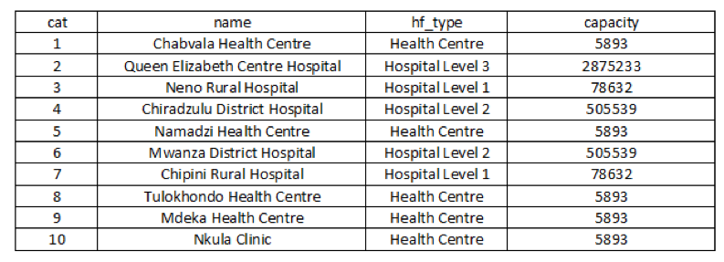

AccessMod a besoin d'une couche SIG au format vectoriel contenant les localisations géographiques des structures de santé à prendre en compte dans l'analyse de l'accessibilité physique, de la couverture géographique et des références, ainsi que dans l'analyse de mise à l'échelle (lorsqu'elles sont prises en compte). Ces localisations doivent être exprimées dans le même système de projection que le DEM (voir la section 3.3.1.1).

En fonction de l'analyse à effectuer, les structures en question peuvent toutes être placées dans la même couche ou dans des couches séparées.

La table attributaire de cette/ces couche(s) SIG doit au moins contenir:

1.  Identificateur unique à afficher dans les tables résultantes générées par AccessMod (champ "cat" dans l'exemple ci-dessous).
2.  La capacité de couverture maximale de la structure de santé lors de l'analyse de la couverture géographique (voir section 5.5.4). L'Annexe 2 fournit plus d'informations sur ce paramètre et décrit une approche pour le calculer (champ "capacity" dans l'exemple ci-dessous).

En plus de ce qui précède, il est également recommandé de conserver le nom officiel de l'installation dans la table attributaire, comme dans l'exemple présenté ci-dessous.

Exemple de table attributaire pour la couche établissement de santé

It is important to remember that the accuracy of the health facility coordinates can have an impact on the result of the analysis (see Section 3.3.1.1). Priority should therefore be given to coordinates that have been collected using methods providing a high accuracy. A guidance document on primary data collection methods for facility geographic coordinates is provided by the Health GeoLab Collaborative (Ebener *et al.*, 2016). Future guidance documents are planned to cover the extraction of coordinates from other sources, and these will be made available through the Health GeoLab Collaborative website.

Il est important de se rappeler que la précision des coordonnées des structures de santé peut avoir une incidence sur les résultats de l'analyse (voir section 3.3.1.1). La priorité devrait donc être donnée aux coordonnées collectées à l'aide de méthodes offrant une grande précision. Un document d'orientation sur les méthodes de collecte de données primaires pour les coordonnées géographiques des installations est fourni par le *Health GeoLab Collaborative* (Ebener et al., 2016). Les futurs documents d'orientation devraient couvrir l'extraction des coordonnées d'autres sources et seront disponibles sur le site Web du *Health GeoLab Collaborative*.

::: callout-warning
**Les structures de santé ne peuvent tomber sur des barrières aux mouvements (c'est-à-dire des valeurs *NoData* dans la couche d'occupation du sol fusionnée) ou sur des cellules à  vitesse zéro (considérées comme des obstacles). Ces structures porteront respectivement une étiquette «Oui» dans la colonne «amOnBarrier» et une étiquette «Oui» dans la colonne «amOnZero» de la table «*Structures sélectionnées*». Elles devront soit être désélectionnées, soit leurs coordonnées modifiées avant de pouvoir exécuter l'analyse.**

**L'importance de la modification à appliquer dépendra de la résolution des jeux de données au format raster. Plus la résolution est basse, plus l'ajustement à appliquer aux coordonnées d'origine est élevé. Même si cette approche entraîne une erreur dans les coordonnées utilisées, les résultats obtenus seront eux-mêmes cohérents à l'échelle, et donc à la résolution, de l'analyse effectuée.**

**Limiter les champs de la table attributaire de la couche des structures de santé à ceux nécessaires pour effectuer l'analyse peut réduire considérablement la taille du fichier et faciliter l'analyse, en particulier lorsque vous utilisez un grand nombre de structures.**
:::
