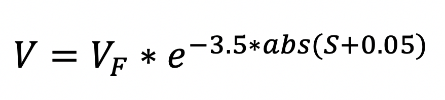
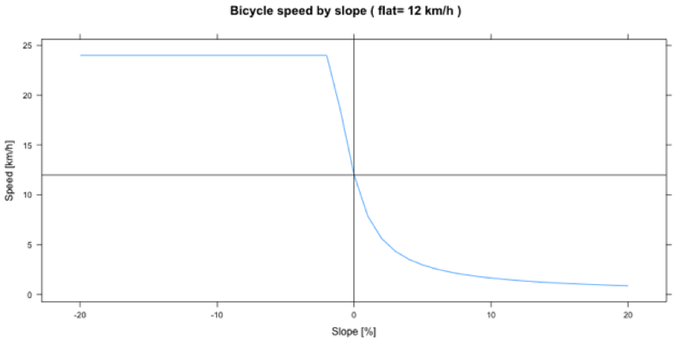

Les modes et les vitesses de déplacement ont un impact important sur les résultats obtenus au travers des différentes analyses à disposition dans AccessMod. Il est donc important de prendre le temps de décider du, ou des, mode(s) et de la (des) vitesse(s) à utiliser. Lorsque disponibles, les enquêtes auprès des ménages et/ou des établissements de santé collectant des informations sur les mouvements des patients peuvent être utiles, en particulier si elles capturent le point d’origine du patient, sa destination, le moyen de transport utilisé et le temps mis pour arriver à sa destination.

Des exemples de valeurs de vitesse de déplacement lorsqu'on marche ou conduit sur une surface plane sont présentés dans les deux tableaux suivants.

|                              |                    |
|------------------------------|--------------------|
| **Type d'occupation du sol** | **Vitesse (km/h)** |
| Urban and built-up area      | 5                  |
| Low dense vegetation         | 4                  |
| Medium dense vegetation      | 3                  |
| Dense vegetation             | 2                  |
| Bare soil                    | 5                  |

Exemple d'estimation de la vitesse de déplacement sur une surface plane par type d'occupation du sol pour un scénario de marche

|                            |                    |
|----------------------------|--------------------|
| **Type de route**          | **Vitesse (km/h)** |
| Motorway or Highway        | 100                |
| Dual lane roads            | 80                 |
| Track, trails or footpaths | 20                 |

Exemple de vitesses maximales de déplacement pour différents types de routes (extrait de Toxopeus (1996) et de Nelson (2000))

Dans AccessMod, la table de scénarios permet d’attribuer un mode de déplacement (marche, motorisé et vélo) et une vitesse à chacune des classes, et donc à chaque cellule dans laquelle le mouvement est autorisé, contenues dans la couche d'occupation du sol fusionnée (voir Section 5.5.2).

L'utilisateur peut facilement capturer et modifier les valeurs de scénario et/ou de vitesse dans ce tableau pour tester les modifications qu'il produit sur les résultats de sortie. De plus, des corrections pour différents modes de transport peuvent être appliquées dans ce fichier.

La table du scénario de voyage peut être créée dans Excel, puis importée dans AccessMod (voir section 5.4.1) ou manuellement, créée dans AccessMod (voir sections 5.5.3, 5.5.4, 5.5.2 et 5.5.7). Dans les deux cas, la table est composée des quatre colonnes suivantes (voir l'exemple dans le tableau ci-dessous):

1.  **class**: classe de l'occupation du sol fusionnée
2.  **label**: étiquette de l'occupation du sol fusionnée
3.  **speed**: vitesse de déplacement (en km/h) sur surfaces plane. La valeur doit être supérieure ou égale à zéro (voir ci-dessous pour ce dernier)
4.  **mode**: mode de transport considéré pour la classe d'occupation du sol, à choisir dans la liste suivante:

-   **MOTORIZED**: mode appliqué aux véhicules motorisés lorsqu'aucune correction n'est appliquée à la vitesse de déplacement, même si un DEM est utilisé dans l'analyse.
-   **WALKING**: mode appliqué lorsque la population marche. Dans ce cas, une correction basée sur la pente est appliquée à la vitesse indiquée. Cette correction est basée sur la formule de Tobler (Tobler, 1993), qui diminue ou augmente la vitesse de marche effective en fonction de la pente et ceci de manière différente pour les mouvements ascendants et descendants.
-   **BICYCLING**: mode appliqué lorsque la population utilise un vélo. Une correction basée sur la pente est appliquée à la vitesse indiquée. Voir ci-dessous pour plus de détails.

|       |                  |       |           |
|-------|------------------|-------|-----------|
| class | label            | speed | mode      |
| 1     | Cropland         | 3.0   | WALKING   |
| 2     | Bare soil        | 5.0   | WALKING   |
| 4     | Dense forest     | 3.0   | WALKING   |
| 6     | Pasture          | 4.0   | WALKING   |
| 1016  | Highway          | 120.0 | MOTORIZED |
| 1017  | National road    | 80.0  | MOTORIZED |
| 1018  | Secondary road   | 40.0  | MOTORIZED |
| 1019  | Residential road | 30.0  | MOTORIZED |

Exemple de fichier excel de scénario de voyage

À partir de la version 5.2.1 d’AccessMod, des vitesses de zéro sont autorisées dans les tables de scénario. Une vitesse de zéro se traduit par un statut de barrière complet pour toutes les cellules concernées. Cependant, lorsqu'une structure tombe dans une cellule "vitesse zéro", elle ne sera pas prise en compte dans l'analyse, de la même manière que les structures se trouvant sur des cellules barrières (*NoData*). Dans ce cas, ces installations auront une étiquette "Oui" dans la colonne "amOnZero" du tableau "Structures sélectionnées". Ces installations devront soit être désélectionnées, soit leurs coordonnées modifiées avant de pouvoir exécuter l'analyse.

Les corrections de vitesse dues à la topographie pour les modes marche et vélo sont calculées à l'aide des étapes suivantes dans AccessMod:

1.  Les pentes entre une cellule donnée et ses huit voisines sont calculées en premier.
2.  Une correction basée sur la pente et sur le mode de transport (marche ou vélo) est calculée à l'aide des fonctions décrites dans les sous-sections suivantes.
3.  Cette correction est appliquée à la vitesse attribuée au déplacement entre chaque pairs cellule-cellules voisine, telle que saisie par l'utilisateur dans le tableau de scénarios de voyage.

::: callout-warning
**Chaque catégorie d'occupation sol (*class*) trouvée dans la grille d'occupation du sol fusionnée (voir la section 3.3.1.4) doit avoir une entrée correspondante dans le tableau des scénarios de voyage. Si ce n'est pas le cas, un message d'avertissement demandant à l'utilisateur de réviser le tableau apparaît dans la section de validation de la fenêtre d'analyse. L'utilisateur ne pourra pas lancer l'analyse tant qu'une vitesse n'est pas attribuée à chaque classe. Ce changement peut être effectué directement dans AccessMod.**

**Les corrections avec WALKING et BICYCLING ne sont appliquées que si un DEM, et donc une approche anisotropique (dépendant de la pente), est utilisée dans l'analyse (voir la section 3.3.1.2).**
:::

[Correction de vitesse pour le modèle de marche]{.underline}

Cette correction utilise la formule de Tobler (Tobler, 1993) qui lie la vitesse de marche à la pente du terrain grâce à la formule suivante:

{width="200"}

où *V* est la vitesse de marche corrigée en kilomètres par heure (km/h), *V~F~* est la vitesse de marche sur une surface plane (donnée par le scénario de voyage défini par l'utilisateur défini ci-dessus) et *S* est la pente en centièmes de pour cent.

Une représentation graphique de cette relation est montrée dans la figure ci-dessous, en supposant que la vitesse de marche est de 5 km/h sur un terrain plat.

[Correction de vitesse pour le modèle de vélo]{.underline}

Cette correction utilise un modèle de vélo physique basé sur la résistance à l'air, la gravité et la force de friction. Si l'utilisateur sélectionne le mode de déplacement "vélo" dans une analyse anisotropique, AccessMod estime la puissance nécessaire pour atteindre la vélocité (et donc la vitesse) saisie par l'utilisateur dans le scénario de déplacement. En utilisant cette puissance, ainsi que la pente dérivée du DEM, AccessMod peut prédire la vitesse finale à laquelle le cycliste traversera une cellule donnée.

Le modèle implémenté dans AccessMod suppose que la vitesse accrue due à la pente négative ne dépasse pas le double de la vitesse obtenue sur une surface plane. Une valeur moyenne réaliste pour la vitesse sur une surface plane peut être d'environ 12 km/h, mais notez que cela peut varier considérablement en fonction de la condition physique du cycliste, du type de vélo et des conditions de route.

La formule de vélo est basée sur un modèle physique complexe dans lequel plusieurs paramètres ont été fixés dans AccessMod (qui ne peuvent pas être modifiés par l'utilisateur), comme suit:

-   Weight of the cyclist : 80 kg
-   Weight of the bicycle : 15 kg
-   Rolling resistance coefficient : 0.012
-   Frontal area : 0.445 m2
-   Wind velocity : 0 km/h
-   Temperature : 20°C
-   Elevation : 500m
-   Transmission resistance coefficient : 0.9

Une description simplifiée de la formule utilisée peut se lire comme suit::

*power = (velocity \* resistanceBike + velocity \* velocityTotal \* velocityTotal \* resistanceAir) / efficiencyTransmission*

Avec:

-   velocity =  velocity of the cyclist on a flat surface
-   velocityTotal = velocity of the wind + velocity
-   resistanceBike = Resistance of the tires and the gravity
-   resistanceAir = Aire frontale \* air density
-   efficiencyTransmission = Transmission resistance coefficient
-   power = power necessary to have the bike move at the given velocity on flat surface

La vitesse finale (Velocity, ci-dessous) est estimée en résolvant une équation non linéaire avec la méthode de Newton. L'équation non linéaire est définie comme suit:

Tv = Velocity + Wind velocity

F   = Velocity \* (resistanceAir \* Tv^2^ + resistanceBike) – efficiencyTransmission \* power

F'  = resistanceAir \* (3.0\* Velocity + Wind velocity) \* Tv + resistanceBike

Pour la technique de Newton, nous avons utilisé une tolérance maximale de 0,05 et un maximum de 10 itérations. S'il n'y a pas de convergence, le résultat est défini sur 0,0 km/h. Un exemple graphique des vitesses corrigées en fonction de la pente pour cette vitesse particulière est présenté dans la figure ci-dessous.

::: callout-warning
**Voir <https://en.wikipedia.org/wiki/Newton%27s_method> pour les détails de cette technique.**

**Lisez la documentation <http://bikecalculator.com/what.html> pour une description plus complète de l'implémentation de cette formule.**
:::
