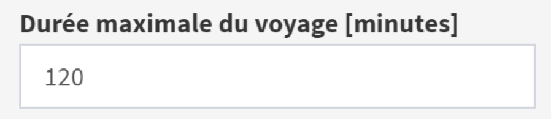

En plus de la capacité de couverture maximale de la population (voir la section précédente), AccessMod considère également le temps de voyage maximal possible comme une limite pour déterminer l'étendue maximale de l'aire de captage rattachée à chaque structure de santé.

Ce chiffre est défini par l'utilisateur dans l'onglet de configuration d'analyse de l'analyse concernée (voir les sections 5.5.3, 5.5.4, 5.5.6, 5.5.7).

{width="300"}

La durée maximale du voyage d’un patient devant accéder à une structure de santé dépend généralement de la gravité de son état. Par exemple, une urgence spécifique peut obliger le patient à se rendre au centre de santé en moins d’une heure, alors qu’une visite de soins préventifs planifiée (soins ambulatoires) ou une intervention chirurgicale programmée (soins hospitaliers) donnerait plus de temps au patient pour atteindre cette même structure.

Les variables relatives au temps maximal du voyage devront donc être déterminées avec soin et fondées sur des preuves, par exemple dans le cadre d'une enquête de sortie des patients ou à travers des consultations avec des experts dans ce domaine. Si ces informations ne sont pas disponibles, une approche potentielle consiste à appliquer AccessMod à différentes durées de voyage (par exemple, 1, 2 ou 3,… heures) et à examiner la couverture de population résultante en conséquence (USAID, 2016).

Lors de la marche (WALKING) ou de l'utilisation du vélo (BICYCLING), des corrections de vitesse sont appliquées à certaines catégories de couverture du sol si l'analyse sous-jacente est définie pour être anisotrope. Cela signifie que le temps nécessaire à un patient pour se rendre à un centre de santé depuis son ménage n'est pas nécessairement égal au temps nécessaire pour que cette même personne effectue le voyage de retour. C’est pourquoi, lors d’une analyse anisotrope, l’utilisateur a le choix de choisir l’option "DEPUIS" ou "VERS" les structures de santé ("DEPUIS" indique que le patient se rend d’une structure de santé à son domicile, alors que "VERS" indique que le patient va de son domicile à la structure de santé). Le résultat d'une analyse reflète donc toujours le sens de déplacement choisi par l'utilisateur. Notez que les différences de sortie entre les modes «DEPUIS» et «VERS» seront probablement substantielles dans les zones où la topographie est prononcée (par exemple, les montagnes/collines, les pentes importantes, les obstacles importants à la circulation).

------------------------------------------------------------------------
