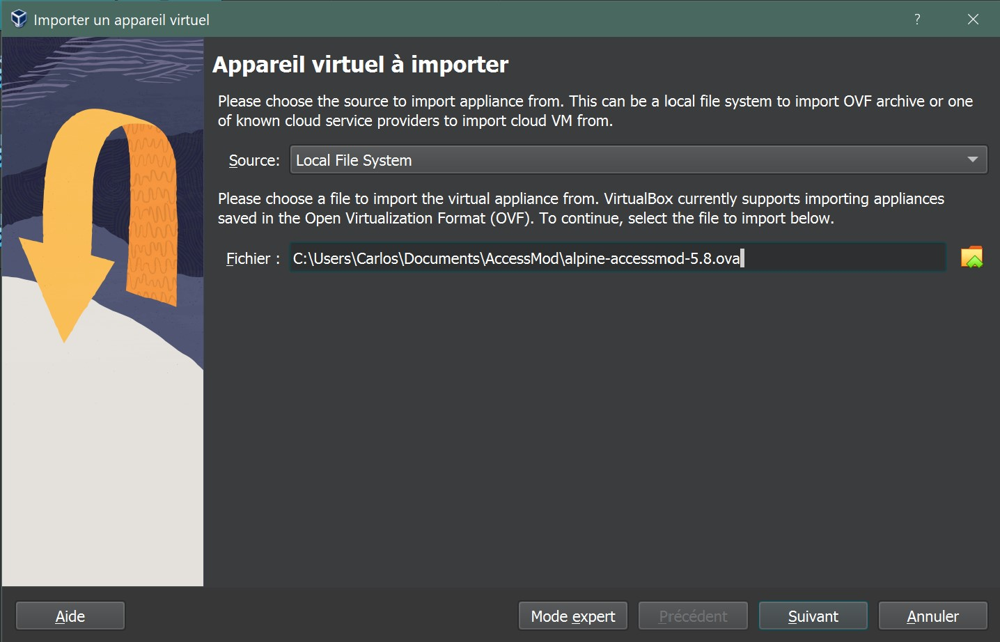
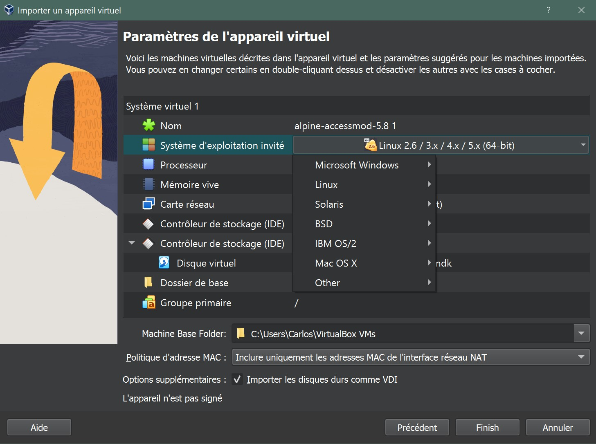
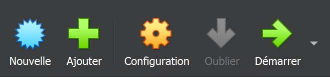
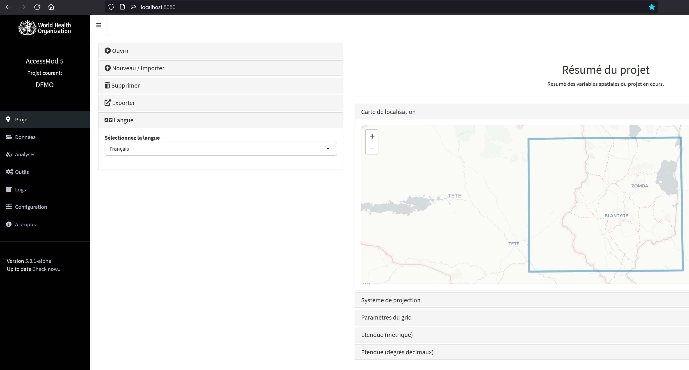

**⭐ Ce processus d'installation s'applique à la plupart des configurations matérielles et des systèmes opérationnels.\
**

## Installation de VirtualBox {#id-4-2-processusd-installationviavirtualbox-installationdevirtualbox}

### Conditions requises {#id-4-2-processusd-installationviavirtualbox-conditionsrequises}

VirtualBox est compatible avec :

1.  Windows 64 bits (8.1, 10, 11 21H2, Server 2012, Server 2012R, Server 2016, Server 2019, Server 2022)
2.  Mac OS 64 bits (10.15 Catalina, 11 Big Sur, et 12 Monterey. Un paquet d'installation est disponible pour macOS/Arm64 en tant que version Developer Preview (recherchez les mises à jour).
3.  Distributions Linux 64 bits (Ubuntu 18.04 LTS, 20.04 LTS et 22.04, Debian GNU/Linux 10 et 11, Oracle Linux 7, 8 et 9, CentOS/Red Hat Enterprise Linux 7, 8 et 9, Fedora 35 et 36, Gentoo Linux, SUSE Linux Enterprise server 12 et 15, et openSUSE Leap 15.3).
4.  Oracle Solaris 11.4 (64 bits seulement)

### Installation {#id-4-2-processusd-installationviavirtualbox-installation}

1.  Visitez <https://www.virtualbox.org/wiki/Downloads> et obtenez la dernière version du logiciel en fonction de votre système d'exploitation et de votre infrastructure.
2.  Lancez l'installation du logiciel comme d'habitude pour votre système d'exploitation et ouvrez-le.

Pour plus de détails et de documentation sur l'utilisation de VirtualBox, veuillez consulter le site <https://www.virtualbox.org/wiki/User_HOWTOS>.

## Installation d'AccessMod {#id-4-2-processusd-installationviavirtualbox-installationd-accessmod}

### Importation et installation de la machine virtuelle {#id-4-2-processusd-installationviavirtualbox-importationetinstallationdelamachinevirtuelle}

1.  Téléchargez la dernière version d'AccessMod avec l'extension**`.ova`** depuis le site <https://github.com/unige-geohealth/accessmod/releases>.
2.  Ouvrez **VirtualBox**
3.  Dans le menu '*Fichier*', sélectionnez '*Importer un appareil virtuelle*', et dans la fenêtre qui s'ouvre, trouvez le répertoire et le fichier **`.ova`** que vous venez de télécharger. Cliquez sur '*Suivant*'.\
    \
    {width="537"}\
    \
4.  Laissez le temps à la machine virtuelle de se charger.
5.  Lorsque la machine virtuelle est chargée, elle offre la possibilité de modifier les paramètres finaux de l'appareil :\
    1.  Modifiez l'une des catégories définissant le système virtuel en double-cliquant sur l'argument en face.
    2.  Vous pouvez également définir le dossier de base dans lequel cette machine virtuelle sera stockée.
    3.  Vous pouvez augmenter la mémoire allouée par défaut et le nombre de processeurs.\
        \
        \
        \
6.  Cliquez sur "Terminer" pour importer la machine virtuelle.
7.  Démarrez la machine virtuelle en la sélectionnant et en cliquant sur l'icône de démarrage.\
    \
    {width="400"}\
    \
8.  The user interface will open in a separate window and offer a menu with five options that can be selected and accepted with the arrow keys (image uniquement disponible en anglais).\
    \
     \
    \
9.  If you have downloaded and installed the latest version you can now open your internet browser and type in the address bar: **localhost:8080\
    \
    {width="1016"}\
    \
    **
10. If you installed an older version, you can select option '**0**' in the user interface, where you will be offered the possibility of selecting other versions or upgrading to the latest (image uniquement disponible en anglais).\
    \
    \
    \
11. From the same user interface menu, it is always possible to fetch remote versions from GitHub (1), restart the server e.g. after changing the version of AccessMod (2), stop a currently running virtual machine (3), and remove old versions of AccessMod (4) (image uniquement disponible en anglais).\
    \
    
