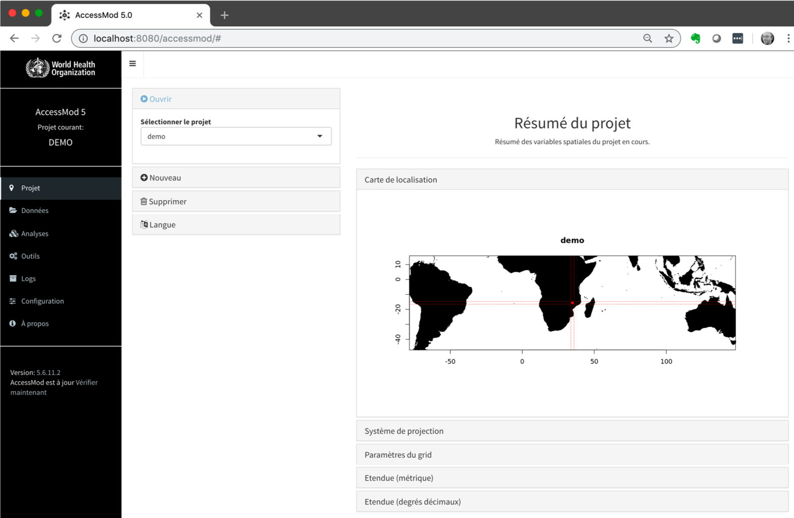

Une fois la machine virtuelle AccessMod installée et exécutée dans VirtualBox (voir le chapitre précédent), vous êtes maintenant prêt à utiliser AccessMod.

Pour ce faire, ouvrez votre navigateur favori et pointez sur l'URL suivante: [http://localhost:8080](http://localhost:8080/)

La fenêtre suivante devrait apparaître:

Si vous exécutez AccessMod pour la première fois, il est important de vérifier si une nouvelle version d'AccessMod est disponible et, le cas échéant, de mettre à jour AccessMod avant de continuer. Vous pouvez le faire en allant dans le module "Configuration" et en ouvrant la boîte "Afficher les paramètres avancés". Si une nouvelle version d’AccessMod est disponible, un bouton «Installer la mise à jour» est disponible. Lorsque vous cliquez dessus, la mise à jour aura lieu et vous informera de la fin de la mise à jour. AccessMod redémarrera automatiquement après la mise à jour. Des détails supplémentaires sur le panneau de mise à jour se trouvent dans la section 5.9.2.
