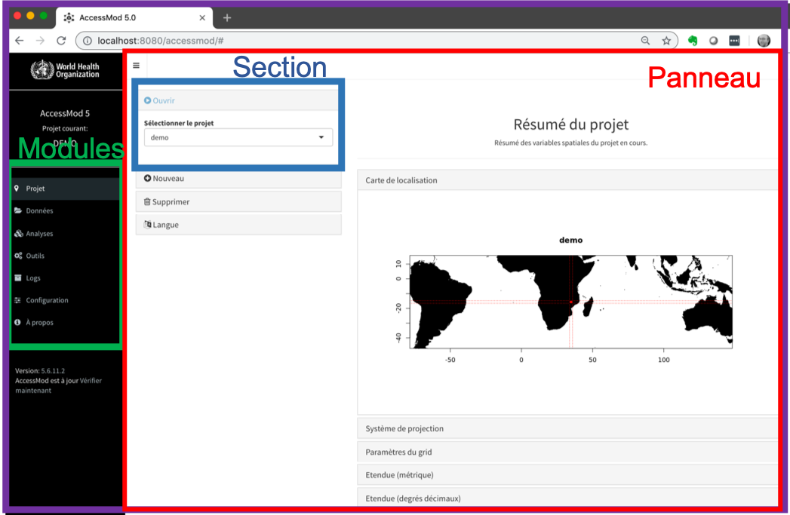

La fenêtre AccessMod comprend différents éléments (voir la figure ci-dessous):\
1. Le nom du projet actuellement ouvert (coin supérieur gauche)\
2. Modules accessibles via le menu principal dans la partie gauche de la fenêtre\
3. Chaque module donne accès à un ou plusieurs panneaux\
Chaque panneau est organisé en sections

AccessMod est composé de 7 modules détaillés dans les sections 5.3 à 5.9:\
1. Projet: pour créer de nouveaux projets ou pour ouvrir/supprimer des projets déjà créés.\
2. Données: pour importer, filtrer, renommer, archiver, exporter ou supprimer des données du projet en cours.\
3. Analyses: pour effectuer les différentes analyses incluses dans AccessMod.\
4. Outils: pour effectuer les différentes opérations incluses dans AccessMod.\
5. Logs: pour consulter et exporter les logs (événements majeurs) se produisant pendant une session AccessMod.\
6. Configuration: pour activer les options avancées dans les modules et afficher les paramètres avancés pour chaque onglet.\
7. A propos: contient des informations sur la licence d’AccessMod et les remerciements 

