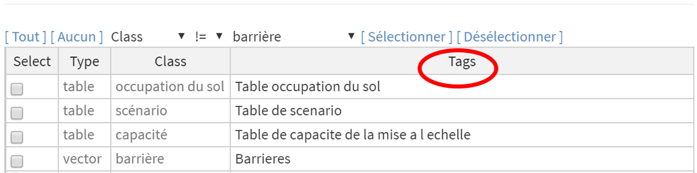

AccessMod utilise des tags pour permettre à l'utilisateur d'identifier, de filtrer, d'exporter, de sélectionner, de renommer ou de supprimer facilement les données importées ou générées dans AccessMod à l'aide des différents outils.

{width="600"}

Notez que ces tags peuvent être composés de n'importe quelle chaîne de texte (lettres et chiffres) et que plusieurs tags peuvent être attribuée à un ensemble de données donné. Bien que toutes les tags puissent être utilisés, il est recommandé de garder les noms de tags aussi courts que possible afin de réduire la longueur des noms de fichiers lors de l'exportation de sorties à partir d'AccessMod.

Les boutons sont utilisés pour lancer des opérations dans AccessMod. Ces boutons apparaissent en rouge tant qu'il reste quelque chose à ajouter/modifier (voir les avertissements dans la section de validation pour identifier le problème) et sont gris dès que toutes les informations nécessaires ont été fournies, comme indiqué dans l'exemple suivant:

|  |  |
|----|----|
| {width="600"} |  |
| Il reste quelque chose à régler | L'opération est prête à être lancée |
