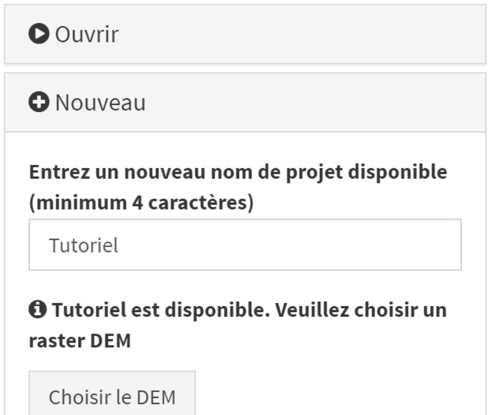

Vous pouvez créer un nouveau projet en saisissant simplement un nom non attribué à un autre projet (un message d'avertissement apparaîtra si le nom en question est déjà utilisé) dans la section "Nouveau", comme illustré ici:

{width="328"}

Vous devez ensuite sélectionner le modèle numérique de terrain (DEM) de la zone d'étude en cliquant sur le bouton «Choisir le DEM» et en sélectionnant les fichiers correspondants sur votre disque dur (voir la section 3.3.1 pour plus de détails sur le DEM).

**L'étendue et la résolution du DEM conditionnent la résolution et l'étendue de toutes les couches de format raster téléchargées dans votre projet ou créées par AccessMod grâce à l'utilisation de différentes analyses** (voir la section 3.3.1.2).

Cela signifie que l'importation d'autres couches de format raster présentant une résolution et/ou une étendue différentes de celles du DEM pourrait entraîner des ajustements automatiques par GRASS. De tels ajustements pourraient avoir un impact sur l'analyse. **Il est donc fortement recommandé de vérifier et d’assurer la cohérence en termes de projection, de résolution et d’étendue entre les différentes couches de format raster que vous êtes sur le point d’importer dans AccessMod.**

Pour cet exercice, choisissez le nom «tutoriel», puis téléchargez le fichier DEM appelé «rDem\_\_dem.img» à partir du dossier «Data/rDem\_\_dem» que vous avez téléchargé avec AccessMod.

AccessMod téléchargera et vérifiera le fichier. Au cours de ce processus, plusieurs messages d’information apparaissent à l’écran.
