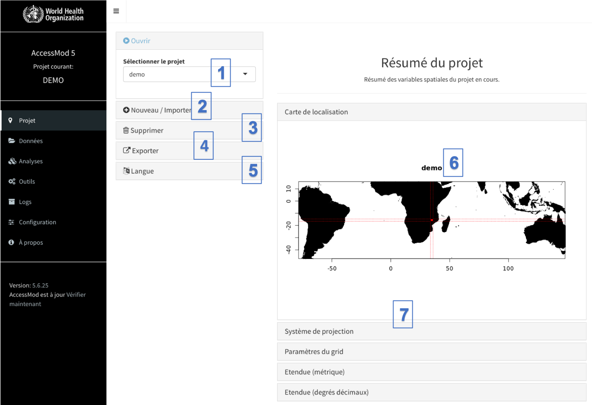

Par défaut, le panneau du module «Projet» est visible lorsque vous ouvrez AccessMod:

{width="600"}

Ce panneau contient sept sections (numérotées dans la figure ci-dessus):

\(1\) Ouvrir un projet existant (Ouvrir)

\(2\) Créer un nouveau projet en sélectionnant un nom de projet, puis en téléchargeant la couche de modèle d'altitude numérique (Nouveau), ou importer un projet précédemment exporté au format \*am5p

\(3\) Supprimer un projet existant et toutes ses données associées (Supprimer)

\(4\) Exporter le project (paramètres et données) dans un fichier \*am5p

\(5\) Choisir la langue de l'interface, ce choix sera maintenu même si vous redémarrez AccessMod

\(6\) Visualiser le résumé du projet (Résumé du projet) comportant une carte indiquant l'emplacement et l'étendue du projet

\(7\) Plusieurs informations sur les données du projet: système de projection utilisé, paramètres du grid, étendue (en degrés métriques et décimaux). Ces informations sont les informations brutes provenant de GRASS (incluses dans la machine virtuelle AccessMod).

## Contenu de cette section

- [5.3.1. Ouvrir un projet](5-3-1-ouvrir-un-projet.qmd)
- [5.3.2. Créer un nouveau projet](5-3-2-creer-un-nouveau-projet.qmd)
- [5.3.3. Supprimer un projet](5-3-3-supprimer-un-projet.qmd)
