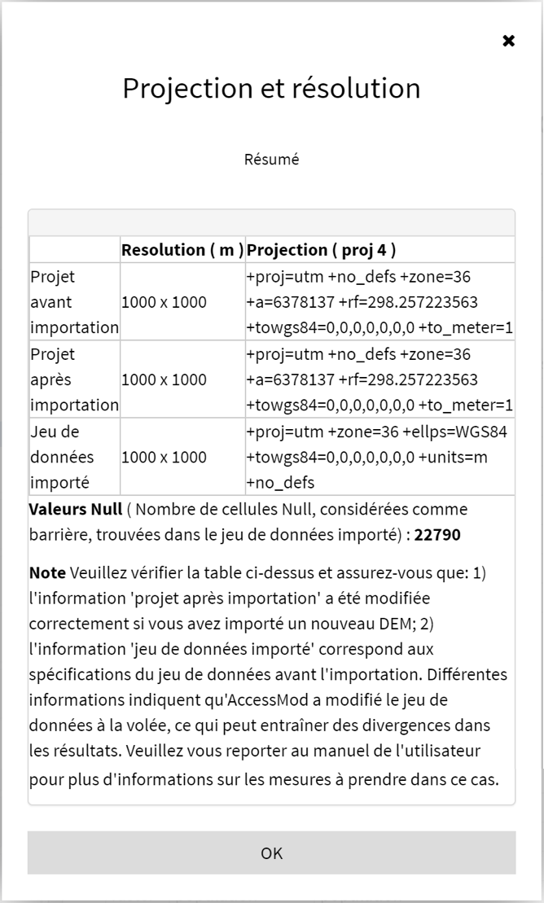

Pour importer des données à l'aide de la section "Importer", vous devez d'abord choisir la "classe de données". La classe de données dans AccessMod définit à la fois le type de données (raster, vecteur ou table) et le type de contenu (par exemple, occupation du sol, population, ...). Cela permet à AccessMod de pré-remplir divers champs de texte dans l'interface utilisateur avec le type correct d'informations, ce qui empêche (dans de nombreux cas) les utilisateurs d'utiliser des jeux de données non appropriés pour les analyses.

Les différentes classes de données sont les suivantes (avec “(r)” = “raster”, “(t)” = “table” et “(v)” = “vecteur”):

| **Classe de données** | **Type de données** | **Contenu des données** |
|----|----|----|
| \(r\) dem | *raster* | [modèle numérique d'altitude - DEM ]{.c-blue}(voir Section 3.3.1.2) |
| \(r\) occupation du sol | *raster* | occupation du sol (voire Section 3.3.1.4) |
| (r) occupation du sol fusionnée | *raster* | occupation du sol après le fusionnement avec le réseau routier et les couches de barrières (résultat de l'outil "fusionnement de l'occupation du sol" voir Section 5.5.2) |
| \(r\) population | *raster* | distribution spatiale de la population cible (voir Section 3.3.1.3) |
| \(r\) population résiduelle | *raster* | distribution spatiale de la population résiduelle (résultat de l'analyse de couverture géographique - voir Section 5.5.4) |
| \(r\) temps de voyage importé | *raster* | distribution du temps de voyage (obtenue par une analyse d'accessibilité (voir Section 5.5.3) que l'on aimerait réimporter dans AccessMod |
| \(r\) priorité | *raster* | distribution spatiale des zones prioritaires utilisées dans l'analyse de la mise à l'échelle (voir Section 3.3.1.10) |
| \(r\) exclusion | *raster* | zone(s) d'exclusion (voir Section 3.3.1.5) |
| \(t\) exclusion | *table* | critères d'exclusion utilisés pendant l'analyse de la mise à l'échelle (résultats de l'analyse de la mise à l'échelle - voir Section 5.5.7) |
| \(t\) occupation du sol | *table* | lien entre chaque occupation du sol et son étiquette correspondante (voir Section 3.3.1.4) |
| \(t\) scénario | *table* | vitesse et mode de transport pour chaque classe de la couche d'occupation du sol fusionnée (voir Section 3.3.2.2) |
| \(t\) capacité | *table* | types et capacités de couverture des nouvelles structures de santé à localiser pendant l'analyse de mise à l'échelle (voir Section 3.3.2.3) |
| \(t\) pertinence | *table* | critères de pertinence utilisés pendant l'analyse de mise à l'échelle (résultats de l'analyse de la mise à l'échelle - voir Section 5.5.7) |
| \(v\) barrière | *vector* | barrières aux movements (polygones, lignes, points) (voir Section 3.3.1.8) |
| \(v\) route | *vector* | réseau routier, avec information sur les catégories de routes road network (voir Section 3.3.1.7) |
| \(v\) structure | *vector* | localisations des structures de santé (points) (voir Section 3.3.1.6) |
| \(v\) zone pour stat | *vector* | zones (polygones), généralement des unités administratives, utilisées pour extraire des statistiques lors de l'analyse de statistiques zonales (voir Sections 3.3.1.9 and 5.5.6) |
| \(v\) exclusion | *vector* | zone(s) d'exclusion (polygones) dans laquelle aucun nouvelle structure de santé ne peut être localisée pendant l'analyse de la mise à l'échelle (voir Sections 3.3.1.5) |

Ensuite, vous êtes invité à fournir un tag et à vérifier les informations de validation des données que vous êtes sur le point de télécharger. Une fois que tout va bien, le bouton «Choisir et importer les données» deviendra gris et vous pourrez sélectionner le ou les fichiers correspondants.

Veuillez vous reporter au début de la section 3.3.1 pour plus d’informations sur le(s) fichier(s) à sélectionner en fonction du format utilisé pour les données géospatiales, et au début de la section 3.3.2 pour la liste des formats tabulaires pris en charge par AccessMod.

Après le processus d'importation, une fenêtre spécifique au format de données apparaîtra:

-   Dans le cas du téléchargement d'un fichier de données vectoriel ou tabulaire, la fenêtre affichera soit un message indiquant que le téléchargement a été effectué sans problème, soit un message d'erreur. Veuillez résoudre les problèmes signalés dans le message d'erreur, le cas échéant. Il est recommandé de NE PAS importer deux fois un fichier vectoriel ayant le même nom de fichier au cours d’une session donnée, même si le tag est modifiée. Dans ce cas, il est préférable de changer le nom du fichier avant de l'importer
-   Dans le cas d'un téléchargement d'un jeu de données raster, la fenêtre affichera des informations sur la projection et la résolution, comme indiqué dans l'exemple suivant:

{width="394"}

La table dans cette fenêtre contient trois lignes:

-   La **première ligne** de la table fournit la résolution (en mètres) et les paramètres de projection de votre projet avant l'importation du jeu de données. Ces projections et paramètres sont définis dans l’environnement GRASS d’AccessMod et conditionnent tous les résultats de votre projet (c’est-à-dire que tous les jeux de données raster en sortie respecteront ces résolutions et projections). Le nombre et le type des paramètres de projection proviennent directement de l'environnement GRASS et peuvent différer d'une projection à l'autre. Dans l'exemple ci-dessus, on peut voir que la projection est UTM ("+ proj = utm"), la zone UTM est 36 ("+ zone = 36") et la projection est métrique ("+ to_meter = 1" )
-   La **deuxième ligne** de la table fournit les mêmes informations après l'importation. Dans la plupart des cas, elles doivent être identiques à celles de la première ligne et confirment par conséquent qu’il n’ya eu aucun changement. Dans le cas où vous importez un nouveau DEM dans votre projet avec une résolution différente de celle du DEM d'origine, vous verrez ici une résolution différente dans la deuxième ligne, ce qui implique que la résolution de votre projet a maintenant été modifiée et que tous les rasters en sortie créés dans toute analyse ultérieure auront cette nouvelle résolution. Cela implique que toutes les couches de format raster précédemment importées seront rééchantillonnées en fonction de la résolution du nouveau DEM importé. Cette opération peut générer des incohérences et des erreurs dans les résultats. Si vous modifiez votre DEM, l’approche recommandée consiste également à ajuster toutes les couches de format de raster avec un logiciel SIG afin de les rendre cohérentes avec le nouveau DEM (projection, résolution, étendue) avant de les réimporter dans AccessMod.
-   La **troisième ligne** de la table fournit les paramètres de résolution et de projection des jeux de données que vous avez importés. Sur cette ligne, la manière dont les paramètres de projection sont indiqués peut différer légèrement des deux premières lignes. Cela est dû à la fonction utilisée par AccessMod pour extraire ces informations de R-Shiny (dans ce cas, la fonction d’information de projection de la bibliothèque "gdal" et non de la bibliothèque GRASS, comme dans les deux premières lignes de cette table). Vous pouvez voir cette différence dans la capture d'écran ci-dessus, bien que l'ensemble des jeux de données importé ait les mêmes paramètres de projection que le projet. Les informations rapportées ici doivent correspondre à celles attachées à votre jeu de données avant l'importation. Un ensemble différent d’informations sur les paramètres de projection signifie que GRASS a modifié le jeu de données à la volée (c’est-à-dire automatiquement), ce qui peut créer des divergences dans les résultats. Dans ce cas, nous vous recommandons de modifier la couche pour qu'elle corresponde aux spécifications du projet dans un logiciel SIG et de réimporter la couche modifiée dans AccessMod.

Dans les futures versions d'AccessMod, le but est de développer un module de vérification de projection avancé qui devrait pouvoir avertir l'utilisateur en cas de disparité importante entre les jeux de données importés en termes de résolution et de projection.
