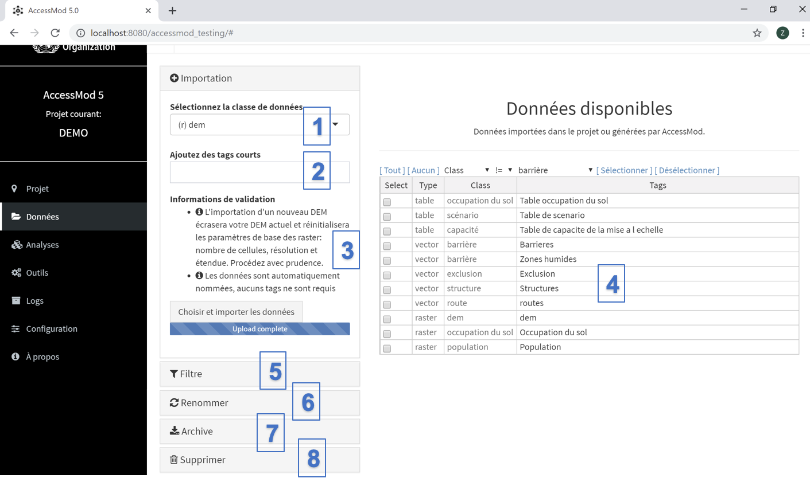

Le module "Données" vous permet d'importer vos jeux de données dans AccessMod, de les renommer et de les supprimer, et d'exporter vos résultats en dehors d'AccessMod (c'est-à-dire en dehors de la machine virtuelle) pour une analyse ultérieure ou l'affichage dans un logiciel SIG (par exemple, QGIS, ArcGIS, GRASS).

Le panneau "Données" est composé des huit sections suivantes (numérotées dans la figure ci-dessus):

\(1\) Menu déroulant pour sélectionner la classe de données à importer.

\(2\) Champ de texte permettant de saisir un ou plusieurs tags pour les jeux de données à importer.

\(3\) Informations de validation concernant le processus d'importation. Les problèmes  possibles de format sont listés ici. En cliquant sur le bouton "Choisir et importer les données", vous téléchargerez chaque jeu de données sélectionné dans le projet.

\(4\) Table répertoriant tous les jeux de données actuellement dans le projet, y compris les données importées et exportées.

\(5\) Filtrer les jeux de données de la table par type de données (vecteurs, rasters ou tables) et/ou toute chaine de caractères en effectuant une recherche dans tous les champs et/ou tags spécifiques.

\(6\) Renommer un ou plusieurs tags en les modifiant directement dans le table et en enregistrant les modifications.

\(7\) Archiver (zip) le ou les jeux de données sélectionnés dans la table et exporter cette archive de la machine virtuelle AccessMod vers l’espace disque du système d’exploitation de votre ordinateur (voir Sections 3.3.1 et 3.3.2 pour plus d’informations sur les formats d’exportation).

\(8\) Supprimer définitivement les jeux de données sélectionnés.

## Contenu de cette section

- [5.4.1. Importation des données](5-4-1-importation-des-donnees.qmd)
- [5.4.2. Filtrer les données](5-4-2-filtrer-les-donnees.qmd)
- [5.4.3. Renommer les données](5-4-3-renommer-les-donnees.qmd)
- [5.4.4. Archiver et exporter les données](5-4-4-archiver-et-exporter-les-donnees.qmd)
- [5.4.5. Supprimer les données](5-4-5-supprimer-les-donnees.qmd)
