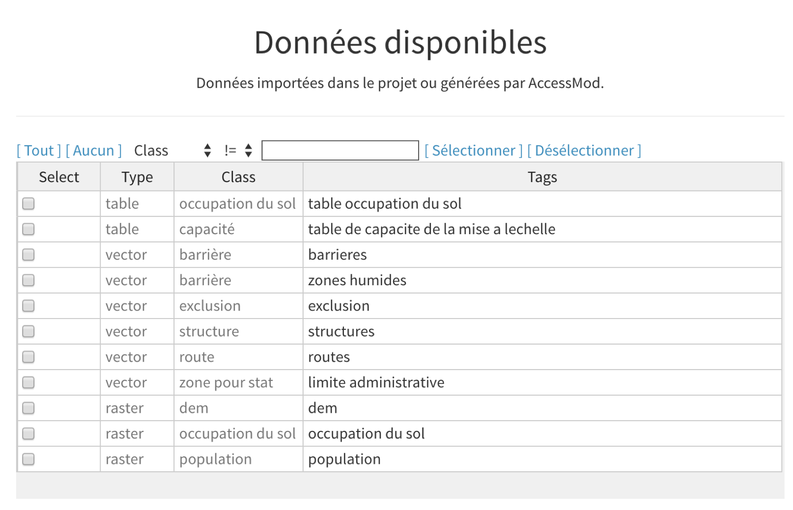

Dans cette section, nous importons les données (sample) pour la région du Malawi. Ces données seront utilisées dans les exercices suivants pour modéliser l’accessibilité à un petit réseau (fictif) de structures de santé. Les jeux de données se trouvent dans le dossier "DATA" fourni avec l’archive zip du manuel d’utilisation d'AccessMod.

Dans cet jeu de données particulier:

-   Les fichiers au format "raster" sont stockés en tant que fichiers GeoTIFF (extension \*.img). Les fichiers présentant cette extension doivent être sélectionnés lors de l'importation

-   Les fichiers au format vectoriel sont stockés en tant que "shapefiles". Les quatre fichiers de base qui constituent un "shapefile", à savoir les fichiers avec les extensions \*.dbf (format d'attribut), \*.prj (format de projection), \*.shp (format de forme), \*.shx (format d'indice de forme), doivent être sélectionnés lors de l'importation.

Importez les fichiers suivants dans AccessMod, en utilisant la classe de données et les tags indiquées.

|  |  |  |
|----|----|----|
| **Classe de données** | **Fichier (/DATA/…)** | **Tags** |
| \(r\) occupation du sol | *rLandCover\_\_start/rLandCover\_\_start.img* | occupation du sol |
| \(r\) population | *rPopulation\_\_start/rPopulation\_\_start.img* | population |
| (t) occupation du sol | *tLandCover\_\_ldcv/tLandCover\_\_ldcv.xlsx* | table occupation du sol |
| \(t\) capacité | *tCapacity\_\_ScaUp/tCapacity_scalingUp.xlsx* | table de capacité de la mise à l'echelle |
| \(v\) barrière | *vBarrier\_\_rivers/vBarrier\_\_rivers.shp* | barrieres |
| (v) barrière | *vBarrier\_\_wetlands/vBarrier\_\_wetlands.shp* | zones humides |
| \(v\) route | *vRoad\_\_start/vRoad\_\_start.shp* | routes |
| \(v\) structure | *vFacility\_\_start/vFacility\_\_start.shp* | structures |
| \(v\) zone pour stat | *vZone\_\_start/vZone\_\_start.shp* | limite administrative |
| \(v\) exclusion | *vExclusion_area/Exclusion_area.shp* | exclusion |

Une fois les fichiers importés dans AccessMod, le tableau "Données disponibles" doit contenir les lignes suivantes dans le panneau du module de données:

{width="600"}
