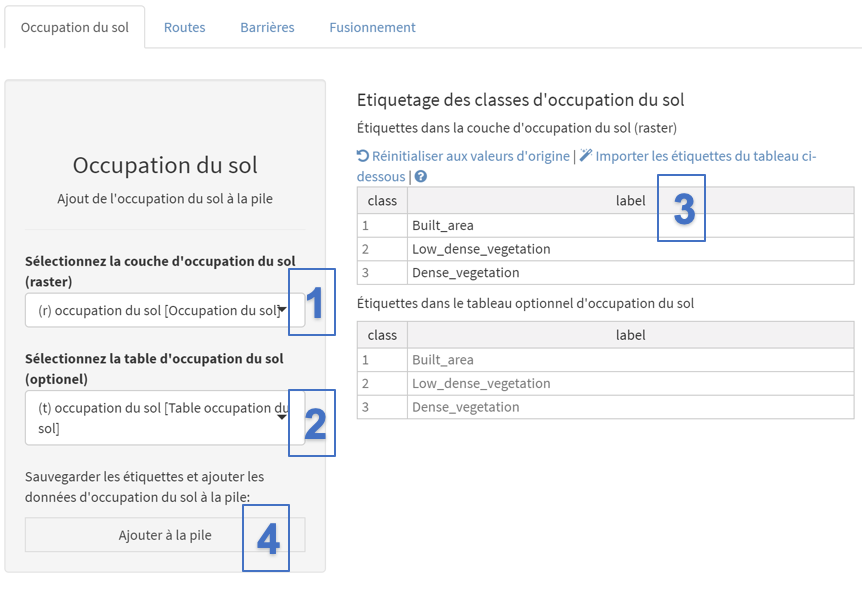
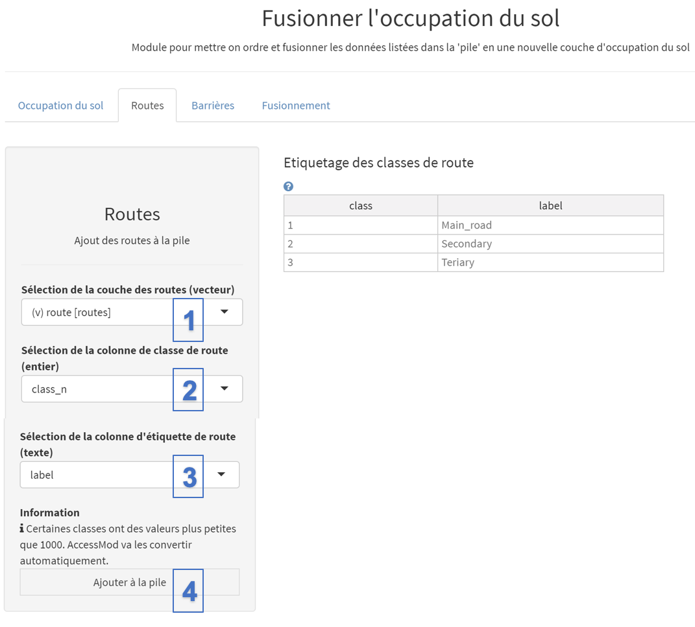
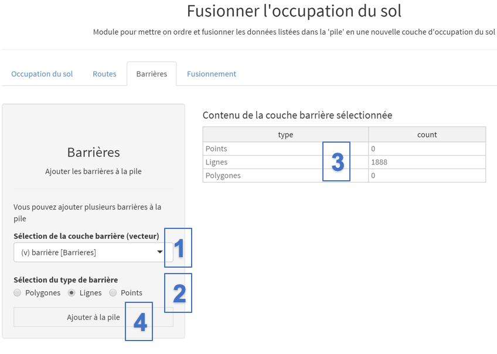
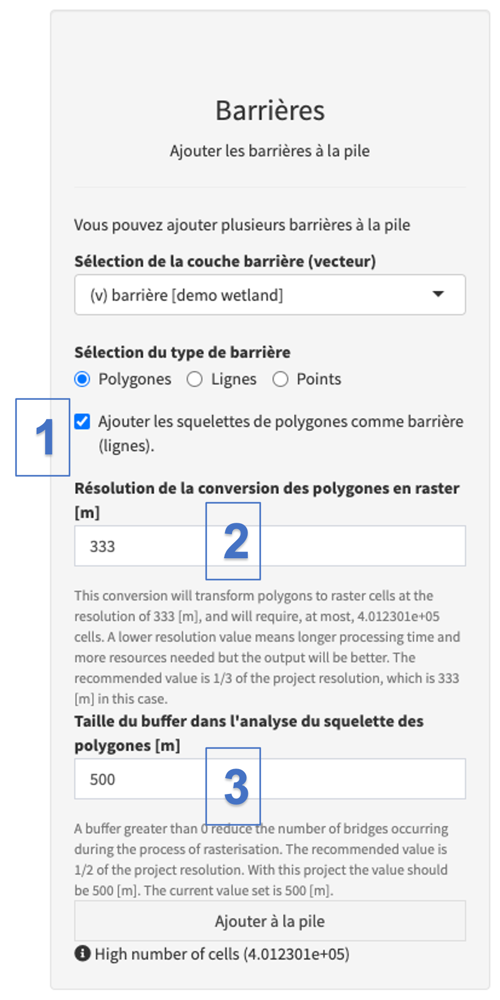
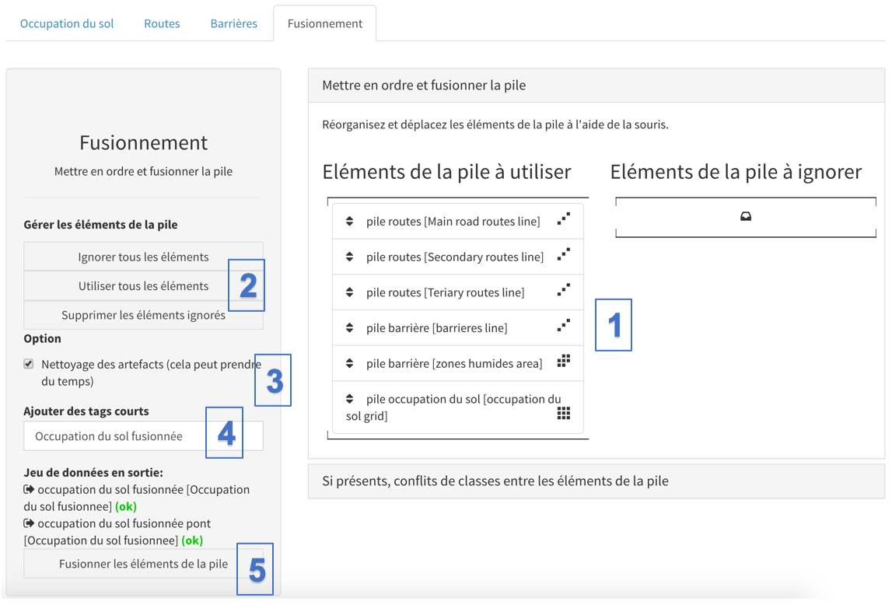
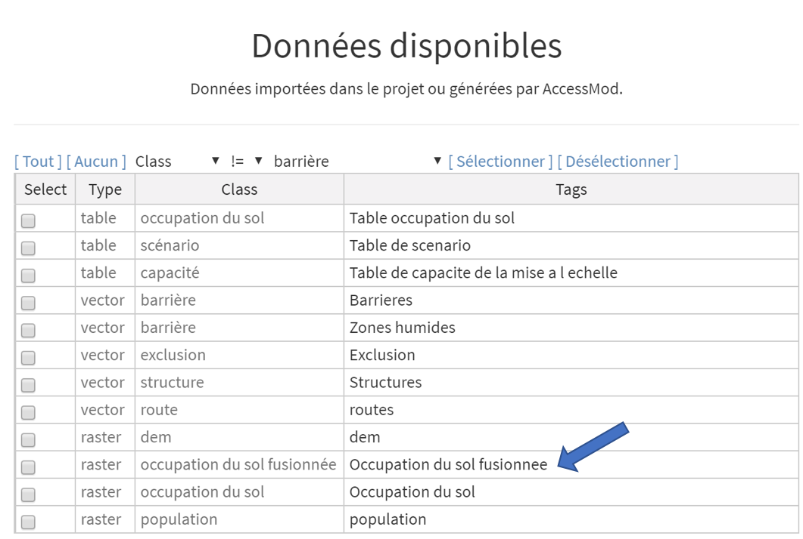
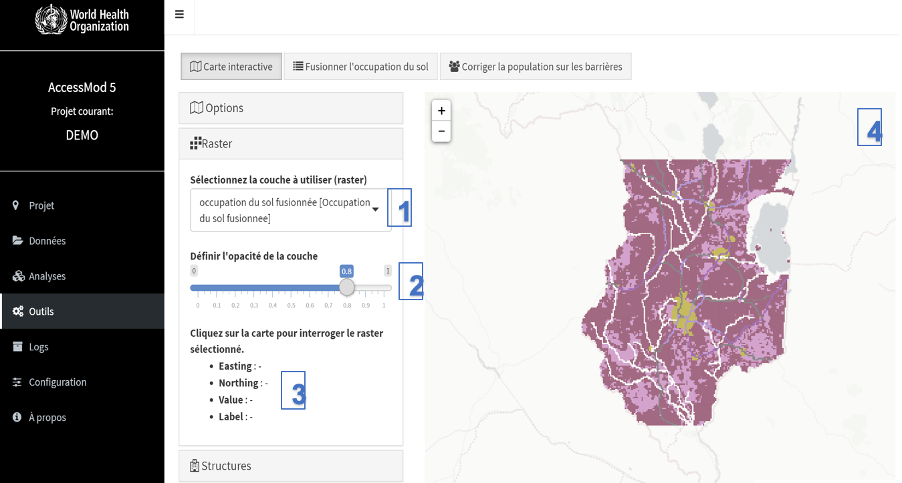

La première étape nécessaire consiste à obtenir la couche d'occupation du sol au format raster utilisée dans AccessMod en fusionnant le réseau routier, le réseau hydrographique (rivières et plans d'eau) et la couche d'occupation du sol de base. Ceci est fait en utilisant l’outil “Fusionner l'occupation du sol” présent dans le module *Outils* d’AccessMod.

La fusion de ces différentes couches peut être réalisée en dehors d'AccessMod à l'aide d'un logiciel SIG prenant en charge des données au format raster, mais le processus peut être relativement compliqué, et donc fastidieux, en particulier si des priorités doivent être attribuées aux différents types de route et/ou si des artefacts générés par le fusionnement doivent être nettoyés (voir Section 3.3.1.1). C'est pourquoi AccessMod offre un moyen simple, mais complet, d'exécuter efficacement le processus de fusionnement, tout en tenant compte de ce qui précède.

Dans l'exercice suivant, nous allons utiliser AccessMod pour fusionner les différentes couches précédemment importées, afin d'obtenir l'occupation du sol raster finale utilisée dans les analyses suivantes.

Le fusionnement se fait par la mise en œuvre des étapes suivantes:

1.  Ajouter les différentes couches dans la pile
2.  Mettre dans le bon ordre les différentes couches incluses dans la pile
3.  Fusionner les couches ordonnées pour obtenir la couche d'occupation du sol finale

Ces étapes sont décrites plus en détail dans les sous-sections suivantes.

[Ajouter les différentes couches dans la pile]{.underline}

Commencez par sélectionner l'outil "Fusionner l'occupation du sol" dans le module "Outils". Ajoutez la couche d'occupation du sol d'origine à la pile à l'aide de l'onglet "Occupation du sol" et suivez les étapes suivantes:

{width="744"}

\(1\) Sélectionnez la couche d'occupation du sol d'origine disponible dans la liste déroulante.

\(2\) Choisissez la table de classification de la couverture du sol (voir la section 3.3.2.1) qui fait le lien entre chaque classe d'occupation du sol (nombres entiers) et l'étiquette correspondante (chaînes de caractères). Si une table est sélectionnée (comme illustré dans la figure ci-dessus), son contenu est chargé et affiché dans le tableau du bas de la section "Etiquetage des classes d'occupation du sol".

\(3\) Sélectionnez "Importer les étiquettes du tableau ci-dessous" afin de copier les valeurs de la table inférieure dans la table supérieure. Cette table supérieure est modifiable et vous permet donc de modifier le libellé de chaque catégorie si nécessaire. Cependant, les identifiants de classe ne peuvent pas être modifiés.

\(4\) Cliquez sur "Ajouter à la pile" pour ajouter cette couche à la "pile" de couches à fusionner.

Ajoutez ensuite la couche de route à la pile à l'aide de l'onglet "Routes" dédié, en procédant comme suit:

{width="700"}

\(1\) Sélectionnez la couche vectorielle de classe de route dans la liste déroulante; cela devrait pré-remplir la table attributaire sur le côté droit de l'écran.

\(2\) Sélectionnez le champ dans la table attributaire de la couche de route contenant les différentes classes de route (valeur ENTIERE).

\(3\) Sélectionnez la colonne dans la table attributaire de la couche de route contenant les étiquettes pour les différentes classes de route.

\(4\) Cliquez sur "Ajouter à la pile" pour ajouter chaque type de route en tant que couche séparée dans la pile.

**AccessMod reclassera automatiquement les classes de route présentant une valeur inférieure à 1000. Ceci afin d'éviter tout chevauchement avec les classes pouvant être utilisées dans la couche de d'occupation du sol d'origine. Cette situation est illustrée dans la figure ci-dessus où les classes de route utilisées sont 1, 2 et 3.**

**C'est la raison pour laquelle l'image vous aurez un message juste au-dessus du bouton "Ajouter à la pile" comme suit: "Certaines classes ont des valeurs plus petites que 1000. AccessMod va les convertir automatiquement."**

La prochaine étape consiste à ajouter des barrières aux mouvements (c'est-à-dire des zones que la population ne peut pas traverser). Dans le présent exercice, deux couches sont ajoutées à l’aide de l’onglet "Barrières": rivières et zones humides (plans d’eau):

{width="700"}

Pour ajouter des rivières comme barrières dans la pile:

\(1\) Dans la liste déroulante, sélectionnez la classe vecteur "barrières" contenant les rivières.

\(2\) Vérifiez que le type de barrière correspond dans ce cas à "Lignes" (notez que la sélection est automatique en fonction de la majorité des types d'entités (lignes, polygones, points) du jeu de données vectorielles, comme indiqué dans la table (3).

\(3\) La table ne permet pas ici l'édition et indique le nombre d'objets contenus dans la couche barrière sélectionnée en fonction du type (points, lignes et polygones).

\(4\) Cliquez sur "Ajouter à la pile" pour ajouter cette couche à la pile.

Ajoutez ensuite les zones humides en tant que barrières, en utilisant la couche vectorielle de classe "barrières" qui contient les zones humides.

Lors de l'ajout de barrières polygones, il existe une option pour "Ajouter les squelettes de polygones comme barrière (lignes)" (voir ci-dessous). Si elle est cochée, cette option garantit que toute la surface d'un polygone barrière allongé est pixellisée sans aucun "faux pont" à travers lequel un mouvement pourrait se produire (voir les exemples et la discussion dans l'issue Github #259). Les deux paramètres "Résolution de la conversion des polygones en raster \[m\]" et "Taille du buffer dans l'analyse du squelette des polygones \[m\]" peuvent être modifiés dans des cas particuliers où les valeurs par défaut ne sont pas satisfaisantes. La description de ces paramètres est donnée dans l'interface d'AccessMod. Il est recommandé d'utiliser cette option avec les valeurs de paramètre par défaut, en particulier si vous avez des barrières polygonales fines et allongées (par exemple, des rivières sous forme de polygones). Attention, le temps de traitement de ce processus de squelette peut prendre beaucoup de temps si vous avez beaucoup de polygones barrières et que vous travaillez en haute résolution.

{width="320"}

\(1\)  Sélectionnez l'option "Ajouter les squelettes de polygones comme barrière (lignes)"

\(2\) Laissez la valeur par défaut pour le paramètre "Résolution de la conversion des polygones en raster \[m\]"

\(3\) Laissez la valeur par défaut pour le paramètre "Taille du buffer dans l'analyse du squelette des polygones \[m\]"

Vous pouvez ensuite ajouter cette couche barrière polygone à la pile.

Une fois que les barrières lignes et polygones ont été ajoutées à la pile, les différentes couches de la pile peuvent être ordonnées et fusionnées pour obtenir la couche d'occupation du sol fusionnée.

[Ordonner et fusionner les différentes couches de la pile]{.underline}

L'onglet "Fusionnement" permet aux utilisateurs d'ordonner les couches avant de les fusionner.

L'objectif de la commande est de définir quelles couches de la pile seront superposées par-dessus les autres. Ceci est important pour définir, par exemple, si les routes sont autorisées à traverser des rivières (pont) ou si elles doivent être considérées comme étant sous l'eau (c'est-à-dire, inondées).

Dans le même temps, la possibilité de classer les différentes classes de routes de la pile permet aux utilisateurs de définir quelle classe de route aura la priorité sur les autres classes de routes en cas de croisement de routes. Ceci est particulièrement important lorsque les jeux de données utilisés sont à basse résolution.

**Notez qu'à partir de la version 5.6. d'AccessMod, les éléments à fusionner sont d'abord trouvés sous "Eléments de la pile à ignorer". Vous devez d'abord les glisser-déposer dans la partie "Eléments de la pile à utiliser".**

La commande sera effectuée comme suit dans le contexte du présent exercice en considérant que les routes permettent le franchissement de barrières (ponts):

{width="700"}

\(1\) Placez les couches de route **au-dessus** des deux couches de barrière et avec la couche d'occupation du sol au bas de la pile pour simuler les routes passant sur les rivières et les zones humides (ponts), et les rivières et les zones humides constituant des barrières naturels aux mouvements dans les occupations du sol. Vous pouvez changer l'ordre de chaque couche en cliquant dessus, en maintenant le bouton gauche de la souris enfoncé et en la déplaçant à l'endroit souhaité dans la liste.

\(2\) Vous pouvez utiliser les boutons situés à gauche pour:

-   Définir les éléments à ignorer lors du fusionnement après les avoir glissés et déposés dans la partie "Eléments de la pile à ignorer" de la section. Ces éléments ne seront pas inclus dans la couche d'occupation du sol fusionnée. Cette option pourrait par exemple être utilisée pour supprimer temporairement un type particulier de routes de la pile et donc la couche d'occupation du sol fusionnée
-   Ignorer tous les éléments de la pile en cliquant sur le bouton "Ignorer tous les éléments" sur la gauche. Cependant, cela ne permettrait pas de créer une couche d'occupation du sol fusionnée, car la pile serait vide.
-   Supprimer les éléments placés dans la partie "Eléments de la pile à ignorer" de la section en cliquant sur le bouton "Supprimer les éléments ignorés" sur la gauche. Cependant, cette action ne peut pas être annulée; la couche en question devra être ajoutée à nouveau à la pile si nécessaire
-   Ramener tous les éléments placés dans la liste "Eléments de la pile à ignorer" dans la pile en cliquant sur le bouton "Utiliser tous les éléments" sur la gauche.

\
(3) L'option "Nettoyer des artefacts (cela peut prendre du temps)" permet aux utilisateurs d'apporter des corrections topologiques après avoir ajouté des routes à la pile. Sur la figure ci-dessous, nous pouvons voir que l'ajout de la couche de routes a produit un pont artificiel (artefact) entre la cellule e5 et la cellule d6, qui semble traverser la rivière, alors que la route ne la traverse pas. AccessMod peut supprimer automatiquement ces types de ponts artificiels.

Si vous choisissez cette option, AccessMod générera un jeu de données raster supplémentaire indiquant les emplacements des cellules identifiées comme ponts artificiels et qui ont été supprimées en les transformant en cellules barrière. Le nom de ce jeu de données additionnel est le nom de l'occupation du sol fusionnée, avec "pont" (dans notre cas, il sera appelé "pont fusionné de couverture terrestre"). Dans cet ensemble de données, les cellules qui étaient des ponts artificiels ont une valeur de 1, tandis que toutes les autres cellules ont des valeurs "NoData".

Vous pouvez voir ce jeu de données dans le tableau de données (après le processus de fusion de la couverture du sol) uniquement si vous avez sélectionné "Activer les options avancées dans les modules" dans le module "Configuration" d'AccessMod (voir la section 5.9.1 ci-dessous) et si vous avez activé l'option "Afficher les données internes" dans la section "Filtre" du module "Données". Veuillez noter que l'application de ce processus de correction topologique peut augmenter considérablement le temps de calcul, en particulier pour les grands ensembles de données, car chaque cellule doit être traitée par l'algorithme.

\(4\) Attribuez des étiquettes à la couche d'occupation du sol fusionnée finale, "occupation du sol fusionnée" dans le présent exemple.

\(5\) Cliquez sur "Fusionner les éléments de la pile" pour fusionner tous les couches répertoriés dans la liste "Eléments de la pile à utiliser".

Une fenêtre transparente avec du texte et une barre de progression apparaîtra devant le panneau pendant le fusionnement. Veuillez patienter jusqu'à ce que cette fenêtre disparaisse pour continuer à utiliser AccessMod. Une fois le processus de fusionnement terminé, retournez au module "Données" où vous verrez apparaître la nouvelle couche "occupation du sol fusionnée" dans la liste, prêt à être utilisée pour les différentes analyses:

{width="700"}

Pour vérifier que cette couche d'occupation du sol fusionnée est celle souhaitée, vous pouvez la visualiser en allant dans l'outil "Carte interactive" du module Outils et en sélectionnant cette couche dans le menu déroulant du panneau Raster:

{width="700"}

Veuillez vous référer à la Section 5.6 pour plus d'information sur cet outil.

Notez que le module "Carte interactive" n'est pas un outil de visualisation SIG à part entière et que ses fonctionnalités sont limitées. Si vous souhaitez vérifier plus en détail si cette couche dispose des valeurs raster prévues, il est vivement recommandé de l'exporter à partir d'AccessMod à l'aide du module de données, de l'importer dans votre logiciel SIG et de vérifier son contenu avant de l'utiliser pour les différentes analyses proposées par AccessMod.
