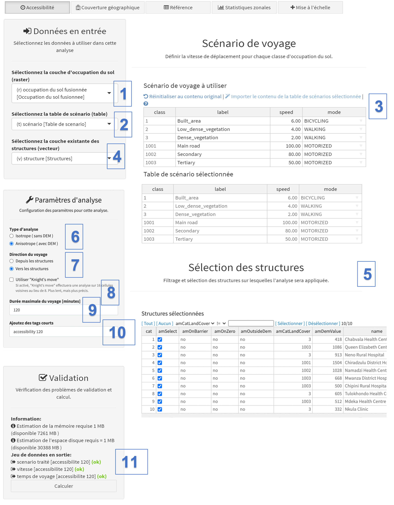
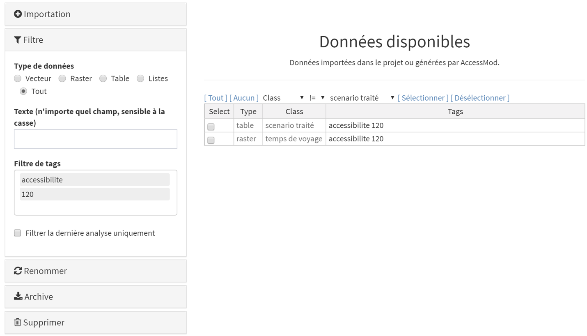
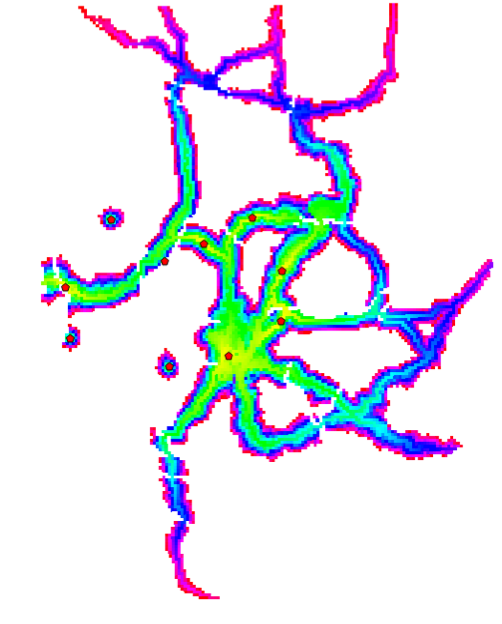

L'analyse d'accessibilité permet de calculer la distribution spatiale du temps de trajet depuis ou vers le ou les établissements de santé les plus proches pris en compte dans l'analyse, en tenant compte si besoin d'un temps de trajet maximal spécifié.

Cette analyse prend également en compte les contraintes et barrières aux mouvements, ainsi que le tableau de scénario de voyage qui définit les vitesses de déplacement pour chacune des classes d'occupation du sol fusionnée. La distribution spatiale de la population cible n'est cependant pas prise en compte dans cette analyse car elle n'a pas d'influence sur le temps de trajet.

Pour en savoir plus sur cette analyse, vous allez créer un raster de distribution du temps de trajet de deux heures pour 10 établissements de santé situés dans une zone du Malawi, en utilisant la couche d'occupation du sol fusionnée créée au chapitre précédent.

Pour cela, sélectionnez l’analyse "Accessibilité" dans le module "Analyses", puis remplissez les différents champs comme indiqué ici:

{width="700"}

[Données en entrée]{.underline}:

\(1\) "Sélectionnez la couche d'occupation du sol (raster)": sélectionnez ici la couche d'occupation du sol fusionnée ("couverture terrestre fusionnée \[couverture terrestre fusionnée\]") que vous avez produit comme indiqué dans la section précédente ci-dessus.

\(2\) "Sélectionnez la table de scénario (table)": utilisez le menu déroulant pour sélectionner une table de scénario de voyage existante importée dans le projet. **Pour le tutoriel, une liste déroulante vide indique qu'aucune table de ce type n'a été importée**, car vous allez la créer dans l'interface.

\(3\) "Scénario de voyage à utiliser": utilisez cette section pour définir la vitesse de déplacement et le mode de transport (à pied, à vélo, à moteur) rattachés à chaque classe de la couche de d'occupation du sol fusionnée en:

-   Important le contenu de la table de scénario sélectionnée si une telle table a été importée dans le projet (voir le point (2)), en cliquant sur l’option "Importer le contenu de la table de scénarios sélectionnée ".
-   Éditant manuellement les informations reportées dans les colonnes "label", "speed" et / ou "mode" en double-cliquant simplement sur la cellule correspondante. C'est un moyen pratique de créer rapidement ou de modifier la vitesse et/ou le mode de transport sans avoir à modifier une table Excel externe. Veuillez noter que les informations finales entrées dans cette table au moment de l'exécution de l'analyse seront enregistrées dans une nouvelle table de scénarios avec la classe "scénario traité" et les mêmes tags que ceux saisies au point (9).

\(4\) "Sélectionnez la couche existante des structures (vecteur)": utilisez ce champ pour sélectionner la couche contenant les localisations des structures de santé à utiliser dans l'analyse.

\(5\) "Structures sélectionnées": le contenu de la table attributaire de la couche des structures de santé sélectionnées apparaît dans la section du panneau. Cette table vous permet de sélectionner les structures de santé que vous souhaitez prendre en compte dans l'analyse. Toutes les structures sont sélectionnées par défaut, mais cela peut être modifié en décochant les installations à l'aide des boutons de vérification de la colonne "amSelect" ou en utilisant des règles de filtrage/sélection utilisant un ou plusieurs filtres à l'aide de l'outil de filtrage situé en haut de la table. Cet outil de filtrage est simple à utiliser: on peut construire une règle de filtrage en combinant n'importe quelle colonne d'attribut avec des opérateurs et des valeurs associées (par exemple, "capacité \>= 1000", "hf_type == Centre de santé").

::: callout-warning
**Les colonnes présentant une étiquette commençant par "am" ne proviennent pas de la table attributaire, mais ont été générées par AccessMod. Ces colonnes particulières sont les suivantes:**

**- "amSelect": permet de sélectionner/désélectionner les structures à exécuter dans l'analyse**

**- "amOnBarrier": indique si la structure de santé est située ("oui") ou non ("non") sur une barrière. L'analyse ne peut pas être effectuée si les structures sont situées sur des barrières. Si un ou plusieurs structure(s) est/sont située(s) sur une barrière, vous pouvez choisir l'une des deux options suivantes:**

-   **Décider de continuer sans les structures en question en les désélectionnant dans la colonne "amSelect" et continuer. Cependant, sachez que dans ce cas, les résultats de l'analyse ne prendront pas en compte l'ensemble du réseau des structures.**
-   **Corriger la couche des structures pour déplacer ceux situés sur des barrières. Cette opération peut être effectuée soit en dehors d'AccessMod dans votre logiciel SIG (et la nouvelle couche doit être importée dans AccessMod), soit en utilisant l'outil de déplacement des structures dans AccessMod (voir Section 5.6).**

**- "amOnZero": indique si la structure de santé est située ("oui") ou non ("non") dans une catégorie d'occupation du sol pour laquelle la vitesse zéro est définie dans le tableau de scénario de voyage. Dans ce cas, l'analyse ne peut pas être effectuée et vous pouvez choisir l'une des deux options suivantes:**

-   **Décider de continuer sans les structures en question en les désélectionnant dans la colonne "amSelect" et continuer. Cependant, sachez que dans ce cas, les résultats de l'analyse ne prendront pas en compte l'ensemble du réseau des structures.**
-   **Corrigez la vitesse de déplacement correspondante dans le tableau du scénario de déplacement en leur attribuant une valeur supérieure à zéro.**

****- "amOutsideDEM": indique si la structure de santé est situé ("oui") ou non ("non") en dehors de l'étendue du DEM (c'est-à-dire en dehors de l'étendue du projet). Les structures situées à l'extérieur de l'étendue du DEM ne peuvent pas être prises en compte dans l'analyse et leurs coordonnées doivent être corrigées si elles sont supposées se trouver dans l'étendue du DEM.****

**- "amCatLandCover": fournit des informations sur la classe d'occupation du sol, c'est-à-dire la valeur du pixel de la couche raster d'occupation du sol.**

**- "amDemValue": fournit des informations sur le DEM, c'est-à-dire la valeur du pixel de la couche raster DEM.**
:::

\(6\) "Type d'analyse": sélectionnez le type d'analyse à effectuer: isotrope (ignore le DEM et est indépendante de la pente) ou anisotrope (utilise le DEM et dépend de la pente). Dans cet exercice, nous allons sélectionner «Anisotrope». Cela implique que le DEM est utilisé pour calculer les pentes, lesquelles sont à leur tour utilisées pour modifier la vitesse de déplacement indiquée dans le tableau de scénarios de déplacement lorsque les modes de déplacement "à pied" ou "à vélo" ont été choisis pour au moins une catégorie de couverture terrestre. Reportez-vous à la Section 3.3.2 pour plus de détails sur l’influence de la pente sur les vitesses de déplacement. Si le type d'analyse "isotrope" est choisi, les pentes sont sans effet et les vitesses de déplacement ne sont pas corrigées.

\(7\) "Direction du voyage": choisissez le sens de déplacement considéré pour les patients, soit «Depuis les structures», soit «Vers les structures». Ce choix n'est visible que lorsqu'un mode anisotrope a été choisi, car la direction du déplacement peut influer sur la durée du trajet. Pour faire l'exercice, choisissez "Vers les structures".

\(8\) [L'option "Knight's move" permet d'effectuer une analyse sur 16 cellules voisines au lieu de 8. L'analyse est alors plus lente, mais plus précise et permet d'obtenir des aires de captage plus arrondies dans les régions avec une occupation du sol uniforme. Nous n'allons pas utiliser cette option pour l'exercise.]{.c-blue}

\(9\) "Durée maximale du voyage (minutes)" : spécifiez la durée maximale (en minutes) après laquelle l'analyse s'interrompt. Pour l'exercice, spécifiez 120 minutes. **Spécifiez “0” dans ce champ si vous souhaitez calculer la durée du voyage sur toute l'étendue de la zone d'étude**, c'est-à-dire sans limite de temps de déplacement.

::: callout-warning
**Note importante sur les temps de trajet maximum**

À partir de la version 5.2.4 d'AccessMod, les temps de trajet ne sont donnés qu'en nombre entier de minutes dans toutes les sorties avec temps de voyage (raster et tableaux). Cela a été fait pour minimiser la taille des fichiers raster de temps de parcours. Si vous spécifiez "0" pour "durée maximale du trajet", la durée maximale du trajet pouvant être calculée est en réalité de 32'767 minutes (soit 22 jours, 18 heures et 7 minutes), ce qui devrait couvrir la très grande majorité des cas. Si les temps de parcours de sortie dépassent cette limite, les valeurs de cellule correspondantes dans le raster de temps de parcours de sortie sont codées avec "-1" afin de pouvoir être facilement identifié lorsque le raster est affiché dans un SIG. Toutefois, si vous devez calculer des temps de déplacement au-delà de la limite de 32'767 minutes, vous pouvez spécifier un temps de trajet maximal plus élevé (50'000, par exemple), ce qui modifiera le format du raster de temps de sortie et la limite supérieure maximale deviendra 2'147'483'647 (environ 4'085 ans). Mais notez que dans ce dernier cas, la taille du raster en sortie augmentera.
:::

\(10\) “Ajouter des tags courts”: Donne des tags courts à associer aux différentes sorties de l'analyse. Nous utiliserons "accessibilité 120" pour le présent exercice.

[Validation:]{.underline}

\(11\) La section de validation vous indique si tout va bien pour que vous puissiez commencer l'analyse. Tout d’abord, il vous donne une estimation de la mémoire et de l’espace disque nécessaires pour exécuter votre analyse. Notez que ces estimations sont indicatives et que les exigences réelles peuvent varier. Si les besoins en mémoire sont proches de l'allocation de mémoire que vous avez attribuée à la machine virtuelle, il est judicieux d'augmenter cette dernière (voir la section 4.2 pour savoir comment procéder). Si quelque chose ne va pas dans les paramètres, le bouton "Calculer" sera rouge et un message d'avertissement/d'erreur apparaîtra dans la liste, indiquant les erreurs que vous devrez résoudre avant d'exécuter l'analyse. Si tout va bien et que tous les champs ont été correctement remplis, un «OK» vert apparaît à côté de chaque élément de la liste et le bouton "Calculer" est gris (exemple ci-dessus). Lorsque c'est le cas, vous pouvez appuyer sur le bouton pour lancer l'analyse.

Une fenêtre transparente avec du texte et une barre de progression apparaîtra devant le panneau pendant l'analyse. Veuillez patienter jusqu'à ce que cette fenêtre disparaisse pour continuer à utiliser AccessMod. Une fois que c'est le cas, retournez dans le module de données pour vérifier les deux fichiers de sortie générés:

{width="700"}

::: callout-warning
**Un filtre est automatiquement appliqué dans le module de données lorsque vous revenez après avoir utilisé l'un des outils. L'application de ce filtre a pour résultat que seuls les derniers jeux de données en sortie apparaissent dans la liste des données disponibles. Cela simplifie le contrôle de ces données ainsi que leur sélection pour les exporter en dehors d'AccessMod.**

**Si vous souhaitez voir la liste complète des données actuellement stockées dans la machine virtuelle, supprimez simplement les balises apparaissant dans la section de filtre sur le côté gauche.**
:::

L'analyse d'accessibilité génère les deux jeux de données suivants:

1.  classe "scénario traité": table contenant le scénario de voyage traité.
2.  classe "temps de voyage": couche au format raster contenant la distribution spatiale du temps de voyage à la structure la plus proche, exprimée en minutes.

\
Avant de pouvoir ouvrir et consulter ces jeux de données, vous devez les archiver et les exporter en dehors de AccessMod (c'est-à-dire en dehors de la machine virtuelle AccessMod). Pour ce faire, procédez comme suit dans le module "Données":

\- Cocher les quatre jeux de données dans la section "Données disponibles" de la table.

\- Allez dans la section "Archive", entrez un préfixe (ou laissez le préfixe par défaut) pour l'archive et cliquez sur le bouton "Créer l'archive".

\- Une fois l'archive créée, sélectionnez-la dans la liste déroulante (votre archive la plus récente se trouvera en haut de la liste) et cliquez sur le bouton "Exporter l'archive".

\- L’archive (au format zip) est automatiquement téléchargée dans le dossier de téléchargement par défaut utilisé par votre navigateur. Votre navigateur peut vous demander de spécifier l’emplacement où sauvegarder les archives.

\- Accédez à ce dossier et décompressez l'archive pour accéder à son contenu.

Nous allons maintenant ouvrir ces différents jeux de données en sortie. Commencez par ouvrir le fichier Excel qui se trouve dans le dossier "table_scenario_processed_accessibility_120m" qui a été décompressé de votre fichier ZIP archivé.

Voici le tableau contenant le scénario de voyage appliqué lors de l'analyse:

{width="300"}

Si nécessaire, il est possible de modifier cette table dans Excel et de la réimporter dans AccessMod en tant que nouvelle table de scénario (nous n'allons pas le faire maintenant).

La couche raster exportée (durée du voyage) est stockée au format ERDAS Imagine dans les dossiers correspondants que vous venez de décompresser. Pour le visualiser, vous devez utiliser un logiciel SIG (QGIS, ArcGIS, GRASS).

L'importation du fichier .img contenant les temps de voyage vers la structure la plus proche (stockée dans le dossier "raster_travel_time_accessibility_120m") se visualiserait de la façon suivante dans QGIS:

Cette couche au format raster est le résultat de l'analyse de l'accessibilité et indique les zones dans lesquelles la population peut atteindre la structure de santé la plus proche en deux heures ou moins. Les valeurs en pixels sont les temps de trajet en minutes et les couleurs des figures sont celles par défaut dans QGIS pour les visualiser. Les couleurs peuvent varier en fonction de votre palette de couleurs par défaut. Notez que cette capture d'écran contient également l'emplacement des établissements de santé utilisés dans le contexte de cette analyse (points rouges).

::: callout-warning
**Le fichier .img exporté par AccessMod peut nécessiter une conversion en raster avant de pouvoir être utilisé pour effectuer d'autres types d'analyse dans le logiciel SIG que vous utilisez. Veuillez vous reporter au manuel d'utilisation du logiciel SIG en question pour savoir comment effectuer une telle conversion.**

**Cette couche peut être utilisée dans l'outil de statistiques zonales pour mesurer la couverture d'accessibilité au niveau des zones. Veuillez consulter la section 5.5.6 pour plus d'informations.**
:::
