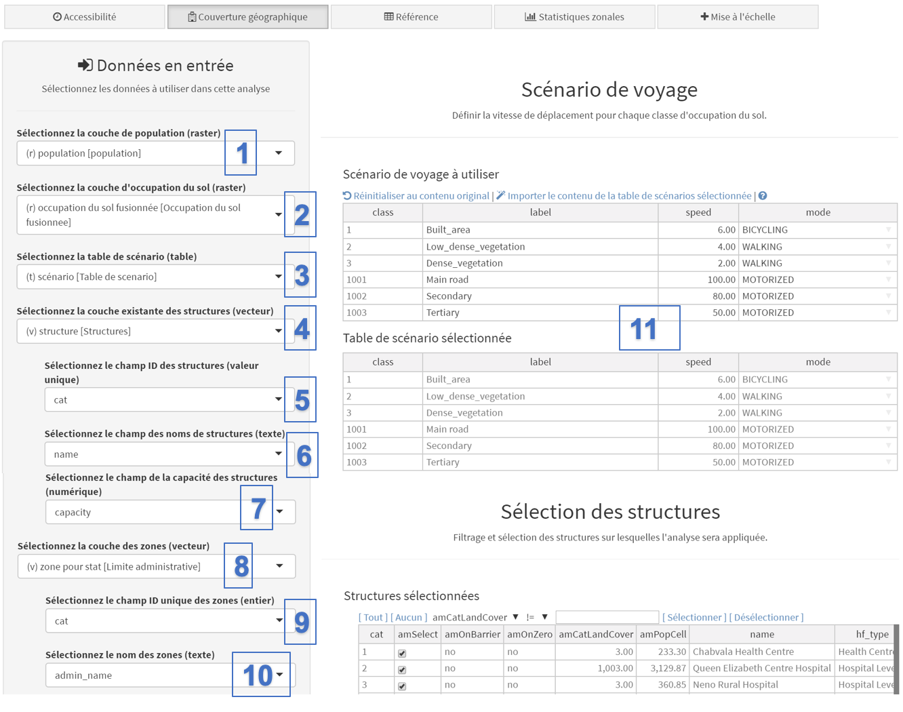
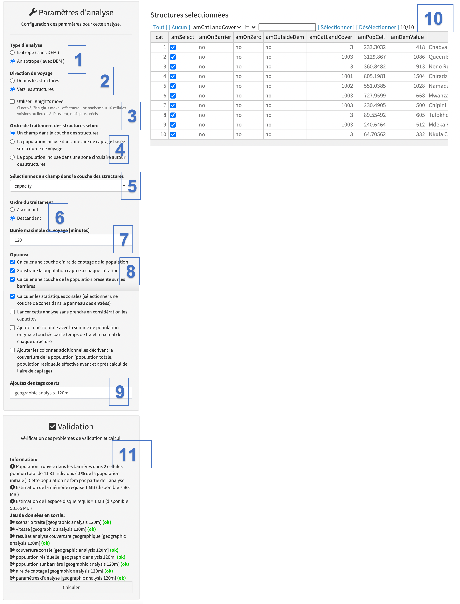
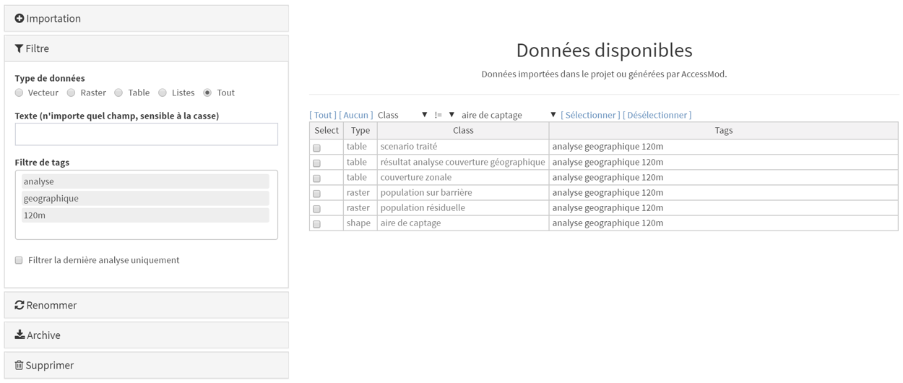
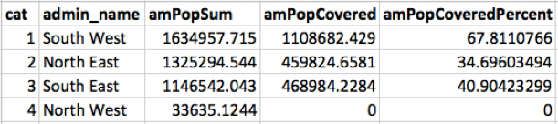

L'analyse de la couverture géographique vous permet de prendre en compte la disponibilité des services (c'est-à-dire la capacité des structures de santé à accueillir des patients) et d'en tenir compte en plus des contraintes d'accessibilité physique, afin de définir l'aire de captage associée à chaque structure de santé.

En d'autres termes, l'aire de captage va:

-   s'étendre jusqu'à ce que la durée maximale du voyage (par exemple 120 minutes) soit atteinte si la population de ce bassin est inférieure ou égale à la capacité estimée du centre de santé.
-   ne pas atteindre le temps de trajet maximal (par exemple, 120 minutes) si la population de ce bassin dépasse la capacité estimée de la structure de santé. Dans un tel cas, l'aire de captage sera plus petite et couvrira la taille de la population correspondant à la capacité estimée de la formation sanitaire.

La capacité de couverture maximale de chaque structure de santé doit être incluse dans un champ (colonne) séparé de la table attributaire du shapefile des structures de santé (voir section 3.3.1.6). Une fois que c'est le cas, ces informations peuvent être directement utilisées par AccessMod lors de l'analyse.

Les deux captures d'écran suivantes expliquent comment entrer des données et définir des paramètres pour l'analyse:

{width="500"}

[Données en entrée:]{.underline}

Sous:

\(1\) “Sélectionnez la couche de population (raster)”, sélectionnez la couche raster contenant la distribution spatiale de la population cible que vous souhaitez utiliser dans la liste déroulante (celle nommée "population" dans le présent exercice).

\(2\) “Sélectionnez la couche d'occupation du sol (raster)”, sélectionnez la couche raster contenant l'occupation du sol fusionnée résultant de l'utilisation du premier outil (voir la section 5.5.2) - nommée "occupation du sol fusionnée".

\(3\) “Sélectionnez la table de scénario (table)", sélectionnez la table de scénario de voyage que vous souhaitez utiliser (pour l'exercice, nous vous recommandons de sélectionner la table de scénario créée lors de l'analyse précédente (voir la section 5.5.3).

\(4\) "Sélectionnez la couche existante des structures (vecteur)”, sélectionnez la couche vectorielle de la couche des structures de santé existantes nommée "Structures" dans le jeu de données d'exemple

\(5\) “Sélectionnez le champ ID des structures (valeur unique)”, sélectionnez le champ de la table attributaire de la couche des structures de santé qui contient l'identificateur unique de chaque structure de santé.

\(6\) “Sélectionnez le champ des noms de structures (texte)”, sélectionnez le champ de la table attributaire de la couche des structures de santé qui contient le nom de chaque structure de santé.

\(7\) “Sélectionnez le champ de la capacité des structures (numérique)”, sélectionnez le champ de la table attributaire de la couche des structures de santé qui contient la capacité de couverture maximale de chaque structure de santé.

\(8\) "Sélectionnez la couche des zones (vecteur)", si vous avez coché l'option "Calculer les statistiques zonales (sélectionner une couche de zones dans le panneau des entrées)" dans la section "paramètres d'analyse" (voir le point 7 dana la capture d'écran suivante), sélectionnez ici la couche contenant les limites des zones à utiliser pour extraire les statistiques pertinentes. Aux fins de l'exercice, la couche s'appelle "zones".

\(9\)  "Sélectionnez le champ ID unique des zones (entier)", sélectionnez le champ dans la table attributaire de la couche de limites de zone qui contient l'identificateur unique de chaque zone.

\(10\) "Sélectionnez le nom des zones (texte)", sélectionnez le champ dans la table attributaire de la couche de limites de zone qui contient le nom de chaque zone.

[Scénario de voyage:]{.underline}

 (11) En ce qui concerne l’analyse de l’accessibilité (voir la section 5.5.3), cette section permet d’importer le contenu d’une table de scénario externe et / ou de modifier manuellement les informations reportées dans les colonnes pour l’étiquette, la vitesse et / ou le mode.

Ensuite, les données peuvent être entrées pour la deuxième partie du panneau d'analyse, comme suit:

{width="700"}

[Paramètres d'analyse:]{.underline}

Sous:

\(1\) [Type d'analyse]{.underline}: Comme pour l'analyse précédente, indiquez si vous souhaitez adopter une approche «anisotrope» ou «isotrope» pour l'analyse. Nous avons choisi «anisotrope» dans le présent exercice afin de prendre en compte l’impact de la pente sur la vitesse pour les modes de transport WALKING et BICYCLING.

\(2\) [Direction du voyage]{.underline}: Sélectionnez le sens de déplacement des patients. Veuillez noter que ce champ n'apparaît que si l'option "anisotrope" a été sélectionnée ci-dessus. Aux fins de l'exercice, choisissez "Vers les structures".

\(3\) [L'option "Knight's move" permet d'effectuer une analyse sur 16 cellules voisines au lieu de 8. L'analyse est alors plus lente, mais plus précise et permet d'obtenir des aires de captage plus arrondies dans les régions avec une occupation du sol uniforme. Nous n'allons pas utiliser cette option pour l'exercise.]{.c-blue}

\(4\) [Ordre de traitement des structures selon]{.underline}: L'analyse de la couverture géographique est effectuée dans un ordre de traitement séquentiel: une structure de santé est prise en compte et traitée, puis la structure suivante est prise en compte, et ainsi de suite, jusqu'à ce que toutes les structures de santé aient été traitées. A chaque itération, la population identifiée comme appartenant au bassin calculé d'une structure de santé spécifique est soustraite de la couche de population globale. Un tel ordre de traitement permet à AccessMod de simuler à la fois la saturation des services dans les zones peuplées et / ou les préférences des patients potentiels lorsque les patients sont à la portée de nombreuses structures de santé différentes. Pour cette raison, l'ordre dans lequel chaque structure de santé est prise en compte dans l'analyse peut influencer les résultats (bien qu'il soit très difficile de prédire comment). Veuillez vous reporter à l’Annexe 4 pour des détails sur la manière dont cette analyse est effectuée.

Plusieurs choix sont disponibles pour déterminer l'ordre dans lequel les structures de santé sont prises en compte. Pour les besoins de l'exercice, vous pouvez sélectionner la première option: "Un champ dans la couche des structures". Le but ici est de commencer par le centre qui a la plus grande capacité, puis de continuer dans un ordre décroissant.

Deux autres choix possibles pour l'ordre de traitement sont actuellement disponibles:

-   "La population incluse dans une aire de captage basée sur la durée du voyage": en donnant un temps de trajet maximal (en minutes), AccessMod calcule d’abord l'aire de captage pour un temps donné autour de chaque structure de santé, puis détermine la population vivant dans chacune de ces aires de captage et utilise ces estimations pour déterminer l’ordre de traitement des structures de santé. Cette approche donnerait la priorité aux structures de santé situées dans des zones densément peuplées et faciles d'accès.
-   "La population incluse dans une zone circulaire autour des structures": en donnant un rayon circulaire de zone tampon (en mètres), AccessMod calculera d’abord une zone tampon circulaire autour de chaque structure de santé, déterminera la population vivant dans chacune de ces zones tampons et utilisera ces chiffres pour déterminer l’ordre de traitement des structures de santé. De nouveau, cette approche donnerait la priorité aux structures de santé situées dans des zones densément peuplées et faciles d'accès.

\(5\) Le champ apparaissant à cette étape changera en fonction de l'option de traitement sélectionnée à l'étape 3, à savoir:

-   "Sélectionnez un champ dans la couche des structures": ce champ apparaît si vous avez sélectionné l'option "Un champ dans la couche des structures" à l'étape (3). Dans ce cas, sélectionnez le champ de la couche des structures de santé contenant les valeurs entières que vous souhaitez utiliser pour définir l'ordre de traitement - cette option est utilisée pour l'exercice suivi ici et le champ contenant la capacité de couverture maximale a été choisi dans ce cas.
-   "Temps de voyage donné \[minutes\]": ce champ apparaît si vous avez sélectionné l'option "La population incluse dans une aire de captage basée sur la durée du voyage" à l'étape (3). Dans ce cas, entrez le temps de parcours en minutes que AccessMod doit utiliser pour calculer l'étendue de l'aire de captage de chaque structure de santé.
-   "Rayon de la zone tampon \[mètres\]": ce champ apparaît si vous avez sélectionné l'option "La population incluse dans une zone circulaire autour des structures" à l'étape (3). Dans ce cas, entrez le rayon en mètres à utiliser par AccessMod pour calculer l'étendue de la zone tampon pour chaque structure de santé.

\(6\) "[Ordre du traitement"]{.underline}: Sélectionnez ici l'ordre de traitement en fonction de l'option sélectionnée au point 3. Pour les besoins de l'exercice, sélectionnez un ordre décroissant pour qu'AccessMod traite en premier lieu les installations avec la plus grande capacité de couverture maximale.

\(7\) "[Durée maximale du voyage \[minutes\]"]{.underline}: spécifiez le temps de trajet maximum (en minutes) devant être utilisé par AccessMod pour définir la portée maximale de l'aire de captage rattachée à chaque structure de santé. Pour l'exercice, spécifiez 120 minutes.

\(8\)  "[Options"]{.underline}: Plusieurs options supplémentaires sont disponibles:

-   "Calculer une couche d'aire de captage de la population": sélectionnez cette option si vous souhaitez obtenir une couche vectorielle contenant les aires de captage individuelles (polygones) rattachées à chaque structure de santé au cours de l'analyse. Cette option est cochée par défaut.
-   "Soustraire la population captée à chaque itération": Sélectionnez cette option pour supprimer la population rattachée à la formation sanitaire de la grille de distribution de la population à chaque itération. Cette option est cochée par défaut et doit rester telle quelle pour éviter que la même population ne soit rattachée à plus d'une structure. Désélectionner cette option est néanmoins utile si vous souhaitez estimer la population située dans un temps de parcours donné d'un ensemble de structures de santé sans tenir compte du chevauchement entre les aires de captage.
-   "Calculer une couche de la population présente sur les barrières": Sélectionnez cette option pour créer un fichier raster en sortie contenant les cellules dans lesquelles une population réside mais où les cellules se trouvent sur une barrière. Cette population [ne sera pas]{.underline} prise en compte dans l'analyse et il est donc souvent nécessaire de modifier la couche de distribution de la population raster en entrée avant l'analyse pour éviter ce problème (voir l'annexe 1). Cette option est sélectionnée par défaut et vous pouvez la conserver ainsi pour le présent exercice.
-   "Calculer les statistiques zonales (sélectionner une couche de zones dans le panneau des entrées)": Sélectionnez cette option pour obtenir automatiquement le pourcentage de la population couverte par les zones de niveau sous-national via l'analyse. Cette option est désélectionnée par défaut. Une fois sélectionnée, un nouveau champ intitulé "Sélectionner une couche (vecteur)" apparaît dans la section "Données en entrée" (voir le point 8 joint à la capture d'écran précédente) pour vous permettre de sélectionner la couche en question. Pour les besoins de l'exercice, cochez la case (sélectionnez la couche "zone pour stat", "cat" comme champ contenant l'identifiant unique et "admin_name" comme champ contenant les noms de zone).
-   "Lancer cette analyse sans prendre en compte les capacités": Sélectionnez cette option pour éviter d'attribuer et capacité maximum aux centre et pour obtenir des aires de captage qui seront limitées seulement par le temps de voyage maximum. Cette option est désélectionnée par défaut.
-   "Ajouter une colonne avec la somme de population originale touchée par le temps de trajet maximal de chaque structure". Sélectionnez cette option pour générer une colonne supplémentaire nommée "amPopOrigTravelTime" dans le fichier de statistiques des structures de santé (voir ci-dessous). Cette colonne donnera la population complète dans l'aire de captage de chaque structure, c'est-à-dire la population du raster de population d'origine sans considérer l'éventuelle population attribuée à une autre aire de captage.
-   "Ajouter les colonnes additionnelles décrivant la couverture de la population (population totale, population residuelle effective avant et après calcul de l'aire de captage)". Cette option ajoute cinq colonnes supplémentaires dans le fichier de statistiques des structures de santé (voir ci-dessous). Celles-ci peuvent être utilisées pour vérifier que la population totale et la population résiduelle après chaque itération correspondent à ce qui est attendu.

\(9\) [Ajoutez des tags courts]{.underline}: Indiquez les tags à attacher aux différentes sorties de l'analyse. Nous utiliserons "analyse_geographique_120m" pour la présente analyse. Évitez le nom très long car il a parfois été établi que Excel ne pouvait pas ouvrir les fichiers xls générés en sortie.

[Sélection de structure de santé]{.underline}

(10)  Comme dans l'analyse précédente, vous pouvez sélectionner l'ensemble des structures de santé pour lesquelles l'analyse sera effectuée. Conservez toutes les structures sélectionnées pour l'exercice.

[Validation:]{.underline}

\(11\) Le module de validation doit indiquer que tous les champs ont été correctement remplis (avec un «OK» vert). Si tel est le cas, vous pouvez cliquer sur le bouton "Calculer" pour lancer l'analyse. Si ce n'est pas le cas, le bouton "Calculer" sera toujours en rouge et vous devrez passer par le message d'avertissement et d'erreur pour savoir ce qui doit être ajusté.

Une fenêtre transparente avec du texte et une barre de progression apparaîtra devant le panneau pendant l'analyse. Veuillez patienter jusqu'à ce que cette fenêtre disparaisse pour continuer à utiliser AccessMod. Vous remarquerez que l'analyse est plus lente que la précédente, en raison de la méthode itérative de traitement de chaque structure de santé.

Une fois que cela est fait, retournez au module Données pour vérifier les six jeux de données qui ont été générés:

L'analyse de la couverture géographique génère les jeux de données suivants:

1.  [classe "scenario traité"]{.underline}: Table contenant le scénario de voyage qui a été traité.
2.  [classe "résultat analyse couverture géographique"]{.underline}: Table contenant les résultats de l'analyse de couverture géographique.
3.  [classe "couverture zonale"]{.underline}: Table contenant les résultats de l'analyse de statistiques zonales au cas où cette option a été cochée.
4.  [classe "population sur barrière"]{.underline}: Couche de format raster contenant la distribution spatiale de la population cible sur des barrières.
5.  [classe "population résiduelle"]{.underline}: Couche de format raster contenant la distribution spatiale de la population résiduelle.
6.  [classe "aire de captage"]{.underline}: Couche de format vectoriel contenant l'étendue de l'aire de captage pour chaque structure de santé.

Ensuite, comme vous l'avez fait ci-dessus pour la première partie de l'exercice, vous devez maintenant archiver les résultats, les exporter et les décompresser afin d'ouvrir et de visualiser les résultats. Tout cela peut être fait dans le module "Données" (voir chapitre 5.4).

Nous décrirons ici uniquement les nouveaux types de sortie générés par AccessMod par rapport à l'étape analytique précédente. Commençons par les données géospatiales générées.

Le premier type de données est la couche de format vectoriel contenant l'étendue des zones de captage (polygones) rattachées à chaque structure de santé. Cette couche, située dans le dossier "shape_aire_de_captage_analyse_geographique_120m", devrait être ouverte dans un logiciel SIG et devrait apparaître comme suit:

Chaque aire de captage peut être liée au centre de santé correspondant via l'identifiant unique indiqué dans la table attributaire des deux couches. Veuillez noter que l'en-tête de la colonne contenant l'identificateur unique dans la table attributaire de la couche des aires de captage contient "\_join" à la fin de celle-ci ("cat_join" dans le cas du présent exercice, comme illustré ci-dessous), semblable à l'en-tête de la colonne contenant ce même identifiant dans la table attributaire de la couche des structures de santé ("cat" dans le cas du présent exercice).

{width="300"}

La couche de population résiduelle au format raster stockée dans le dossier "raster_population_residuelle_analyse_geographique_120m" contient la distribution spatiale de la population cible qui reste non couverte après l'analyse. Cette couche peut, par exemple, être utilisée comme entrée pour l'analyse de mise à l'échelle (voir section 5.5.7). Elle ressemble à ceci une fois ouvert dans un logiciel SIG:

L'analyse géographique génère également deux fichiers Excel supplémentaires par rapport à l'analyse d'accessibilité, à savoir:

[Statistiques spécifiques à la structure de santé]{.underline}

Le fichier de statistiques des structures de santé porte le nom suivant: "table_resultat_analyse_couverture_geographique_analyse_geographique_120m.xlsx". Ce fichier contient les colonnes indiquées ci-dessous (notez que le tableau est divisé en deux dans la capture d'écran ci-dessous et que nous avons trié les données par valeur décroissante dans la colonne "amRankComputed" - 5ème colonne en partant de la gauche dans la partie supérieure de la capture d'écran):

{width="800"}

-   **cat:** identifiant unique de la structure de santé selon le champ sélectionné dans la table attributaire de la couche des structures de santé.
-   **name**: nom de la structure de santé selon le champ sélectionné dans la table attributaire de la couche des structures de santé.
-   **capacity:** capacité de couverture maximale de la structure de santé exprimée en nombre de personnes que l'établissement peut desservir (selon le champ sélectionné dans la table attributaire de la couche des structures de santé).
-   **amRankValues_x**: avec "x" étant le nom du paramètre utilisé pour définir l'ordre de traitement. Les valeurs de cette colonne sont les valeurs de ce paramètre. Dans le présent exercice, cette colonne est nommée "amOrderValues_capacity" et contient la capacité de couverture maximale de chaque structure, car il s'agit de l'option sélectionnée ci-dessus. Veuillez consulter l'encadré ci-dessous pour plus d'informations sur l'étiquette et le contenu de cette colonne lorsque vous utilisez les autres options.
-   **amRankComputed**: ordre de traitement appliqué lors de l'analyse en fonction du contenu du champ "amRankValues_capacity" et du sens du traitement (croissant ou décroissant), sélectionné par l'utilisateur.
-   **amTravelTimeMax:** temps de trajet maximal en minutes, défini par l'utilisateur pour l'analyse.
-   **amPopTravelTimeMax:** population totale située dans la durée de trajet maximale définie pour l'analyse (amTravelTimeMax).
-   **amCorrPopTime:** [Coefficient de corrélation de Pearson entre l'ensemble des temps de parcours (t, de 0 au temps de parcours maximal) et la population couverte correspondante au cours de ce temps (c'est-à-dire la somme de la population de toutes les cellules situées entre t et t + 1 du temps de trajet). La corrélation peut donner une estimation approximative de la répartition de la population dans l’espace lorsque nous sortons du centre de santé. Par exemple, une valeur positive élevée (par exemple, 0.707 dans la troisième ligne de la table ci-dessus) signifie que la population est répartie de manière relativement uniforme à mesure que vous vous développez à partir de la structure de santé. Une forte valeur négative signifierait qu'il y a plus de population plus proche du centre de santé que loin de là. Une corrélation proche de zéro signifie qu'il n'y a pas de tendance dans la répartition de la population dans l'aire de captage. Par conséquent, cette corrélation doit être utilisée comme un indicateur relatif, car nous ne fournissons pas la signification de la corrélation dans AccessMod (vous devez utiliser une analyse SIG appropriée en dehors d'AccessMod si vous avez besoin d'informations statistiques sur la répartition spatiale de la population dans les aires de captage).]{.c-blue}
-   **amTravelTimeCatchment:** [Temps de trajet pour atteindre l'étendue maximale de l'aire de captage rattachée à la formation sanitaire. Cette valeur est soit:]{.c-blue}
    -   Égale au temps de trajet maximal défini pour l'analyse (amTravelTimeMax) lorsque la capacité de couverture maximale de la structure de santé n'a pas été atteinte dans le délai imparti (120 minutes dans ce cas). Dans l'exercice courant, c'est le ca pour l'hôpital Queen Elizabeth.
    -   Plus courte que le temps de trajet maximal défini pour l'analyse (amTravelTimeMax) lorsque la capacité de couverture maximale de la structure est atteinte avant d'atteindre amTravelTimeMax. C'est le cas pour le centre de santé Medka dans cet exercice.
-   **amPopCatchmentTotal:** [Population située dans l'aire de captage pour la durée du trajet indiquée dans le champ amTravelTimeCatchment]{.c-blue}
-   **amCapacityRealised**: [Partie de la capacité de couverture maximale de la structure de santé qui est réalisée (utilisée) sur la base de la population totale située dans l'aire de captage pour la durée du trajet. Cette valeur est:]{.c-blue}
    -   Égale à la capacité de couverture maximale de la structure de santé (capacité) lorsque cette valeur est atteinte avant la durée maximale du trajet (amTravelTimeMax). Un exemple est le centre médical Mdeka dans cet exercice.
    -   Inférieure à la capacité de couverture maximale de la structure de santé (capacité) lorsque cette capacité n'est pas atteinte dans le délai de déplacement maximal (amTravelTimeMax). Un exemple est l'hôpital de district Chiradzulu dans cet exercice.
-   **amCapacityResidual: **[Partie de la capacité de couverture maximale de la structure de santé qui n'est pas utilisée. Cette valeur est définie en calculant la différence entre la capacité de couverture maximale (capacité) et la capacité réalisée (amCapacityRealised). Cette valeur est donc égale à 0 lorsque la capacité de couverture maximale est atteinte dans le délai imparti.]{.c-blue}
-   **amPopCatchmentDiff**: [Partie de la population totale située dans l'aire de captage finale (amPopCatchmentTotal), qui n'est pas couverte par la structure de santé en raison d'un manque de capacité de couverture. Cette valeur est déterminée en calculant la différence entre la population totale dans l'aire de captage (amPopCatchmentTotal) et la capacité réalisée (amCapacityRealised). Cette valeur est donc:]{.c-blue}\
    -   Égale à 0 lorsque la capacité de couverture maximale n'est pas atteinte dans le délai imparti
    -   Supérieure à 0 lorsque la capacité de couverture maximale est atteinte dans le délai imparti
-   **amPopCoveredPercent:** [Couverture géographique cumulative exprimée en pourcentage. Cette valeur correspond au pourcentage de la grille de distribution de la population initiale qui est couverte après chaque itération (c'est-à-dire après la localisation de chaque nouvelle structure de santé).]{.c-blue}

**Colonnes supplémentaires**

-   Si vous avez sélectionné l'option "Ajouter une colonne avec la somme de la population d'origine sous le temps de trajet de chaque établissement", une colonne supplémentaire nommée "amPopOrigTravelTime" se trouve dans le tableau de sortie. Cette colonne contient la population complète dans le bassin versant d'un établissement, c'est-à-dire la population du raster de population d'origine et sans qu'aucune partie ne soit attribuée à un autre bassin versant.
-   Si vous avez sélectionné l'option "Ajouter les colonnes supplémentaires décrivant la couverture de la population (population totale, population résiduelle effective avant et après calcul de l'aire de captage)", cinq colonnes supplémentaires sont ajoutées dans le tableau :\
    **amPopTotal** : contient la population totale dans l'étendue de la zone considérée. Elle ne doit pas changer entre chaque itération.\
    **amPopTotalNotOnBarrier** : contient la population totale trouvée en dehors des barrières. Elle ne doit pas changer entre chaque itération.\
    **amPopTotalOnBarrier** : contient la population totale trouvée dans les barrières. Elle ne doit pas changer entre chaque itération.\
    **amPopResidualBefore** : contient la population résiduelle avant le début de l'itération.\
    **amPopResidualAfter** : contient la population résiduelle après l'itération. La perte de population avec ce qui se trouve dans la colonne précédente est la population "captée" par l'aire de captage de la structure.

**L'en-tête des colonnes contenant l'identificateur unique, le nom et la capacité de couverture maximale de chaque établissement de santé de la table résultante sera identique à l'en-tête du champ que vous avez sélectionné dans la table attributaire de la couche des structures de santé.**

**L'orthographe de l'en-tête et le contenu de la colonne contenant les valeurs utilisées pour définir l'ordre de traitement seront les suivants:**

-   **amRankValues\_*X* avec "X" étant le libellé du champ sélectionné lors de l'utilisation de la définition de l'ordre de traitement selon l'option "Champ A dans la couche du centre de santé"**
-   **amRankValues_popTravelTime*X*min avec "X" étant le temps de déplacement exprimé en minutes lors de l'utilisation de la définition de l'ordre de traitement selon l'option "La population vivant dans un temps de déplacement donné autour des structures de santé"**
-   **amRankValues_popDistance*X*m avec "X" étant la distance exprimée en mètres lors de l'utilisation de la définition de l'ordre de traitement selon l'option "La population vivant dans une zone tampon circulaire autour des structures de santé"**

Cette table fournit un ensemble d'informations importantes pouvant être utilisées pour analyser et améliorer les performances du réseau de prestation de services de santé considéré. Plus précisément, ce tableau identifie les structures de santé qui:

1.  Pourraient couvrir une plus grande population dans un temps de déplacement défini (par exemple, 2 heures) si leur capacité de couverture était étendue. Dans notre exemple, cela s’applique aux centres de santé Namadzi et Mdeka.
2.  Constatent que leur capacité de couverture est sous-utilisée en raison de la population limitée résidant par exemple à moins de 2 heures de temps de déplacement. C'est le cas de toutes les structures pour lesquelles la capacité de couverture maximale n'est pas atteinte dans le temps de voyage maximal considéré.
3.  Voient leur population voisine déjà couverte par d'autres structures de santé en fonction de l'ordre de traitement sélectionné. C'est le cas de la clinique Nkula dans le présent exercice pour lequel aucune des capacités de couverture n'a été utilisée. Cela pourrait présenter des preuves en faveur d'une réaffectation des ressources entre les établissements (en supposant que les préférences des patients soient indifférentes).

En plus de cela, la couverture géographique cumulée indiquée dans les colonnes "amPopCoveredPercent" indique le pourcentage de la population couverte pour la durée du voyage donnée en tenant compte de la capacité de couverture des structures de santé (dans l'exemple ci-dessus, ce pourcentage s'élève à 49,21 %) et par soustraction le pourcentage de la population non couverte (50,79%). La couverture géographique cumulative vous permet également d’évaluer l’élargissement de la couverture après chaque itération de l’analyse.

[Résultats des statistiques zonales]{.underline}

Si vous avez coché la case "Générer des statistiques zonales (sélectionnez la couche de zones dans la section de données en entrée)" dans les "Paramètres d'analyse", l'analyse générera alors une dernière table contenant la distribution de la couverture géographique obtenue au niveau de la zone après avoir effectué l'analyse.

Une fois ouvert dans Excel, ce fichier (nommé "table_couverture_zonale_analyse_geographique_120m.xlsx") dans le présent exercice, contient les colonnes suivantes:

-   **cat:** identifiant unique de la zone, selon le champ sélectionné dans la table attributaire de la couche de zone.
-   **admin_name**: nom de la zone, selon le champ sélectionné dans la table attributaire de la couche de zones
-   **amPopSum:** Population totale située dans la zone
-   **amPopCovered:** Population couverte par l'analyse de la couverture géographique, donc rattachée aux formations sanitaires existantes
-   **amPopCoveredPercent:** Pourcentage de la population totale couverte par l'analyse de la couverture géographique

Cette table est particulièrement utile pour identifier les inégalités potentielles dans la couverture géographique au niveau sous-national. Dans l'exercice en cours, par exemple, nous pouvons observer d'importantes disparités de couverture entre les zones. L'une d'entre elles a même 0% de couverture géographique (nord-ouest).

::: callout-warning
**L'en-tête des colonnes contenant l'identificateur unique et le nom des zones correspondra à l'étiquette du champ que vous avez sélectionné dans la table attributaire de la couche de zones.**

**Grâce à l'identifiant unique inclus dans la table, il est possible de joindre son contenu à la table attributaire de la couche de zones, à l'aide d'un logiciel SIG, pour obtenir une carte montrant la répartition spatiale de la population cible ou les pourcentages qu'elle contient.**
:::
