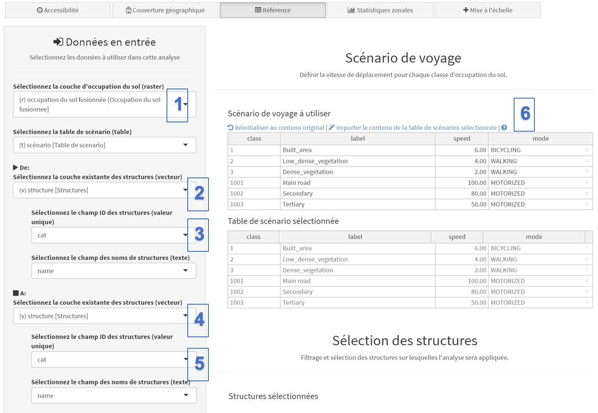
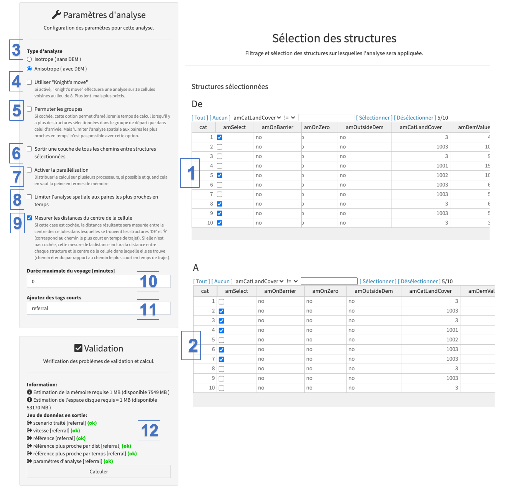
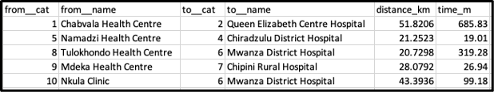

L’analyse de référence permet de calculer les temps de trajet et / ou les distances le long des trajets de moindre coût (c’est-à-dire un trajet entre deux lieux qui minimise la durée totale du trajet pour ceux qui le parcourent, voir Ray and Ebener, 2008) entre deux groupes de centres de santé. Ce chemin est différent d’une ligne droite car il prend en compte les contraintes du paysage ainsi que les modes et les vitesses de déplacement de la population.

Par exemple, on voudrait connaître la distance et la durée du trajet entre chaque établissement de soins de santé primaires et l’hôpital de référence le plus proche dans une province donnée, ou s’assurer que la durée du trajet entre chaque structure de soins obstétricaux d’urgence de base (SONUB) et la plus proche structure de soins obstétricaux d’urgence complets (SONUC) est inférieure à 2 heures dans un pays donné.

À partir de la version 5.3.2 d'AccessMod, le module Référence a été amélioré pour fonctionner en mode parallèle, ce qui signifie qu'il peut tirer parti de tous les processeurs alloués à la machine virtuelle AccessMod. Cela accélère le calcul de la référence (voir les détails à l’Annexe 5). Si vous exécutez une analyse de référence avec un grand nombre de ressources, il est donc préférable de configurer d'abord votre machine virtuelle avec un maximum de processeurs et de mémoire (voir Section 4.2).

Dans l'exercice suivant, vous allez calculer les temps de trajet et les distances entre les "centres de santé" et les "hôpitaux" à partir du jeu de données de démonstration.

Les deux captures d'écran suivantes expliquent comment remplir les sections utilisées pour saisir les différentes couches et paramètres permettant d'exécuter l'analyse:

{width="700"}

[Données en entrée:]{.underline}

\(1\) Sous “Sélectionnez la couche d'occupation du sol (raster)”, sélectionnez la couche raster contenant l'occupation du sol fusionnée, "Occupation du sol fusionnée". Sous «Sélectionnez la table de scénario (table)», sélectionnez la table de scénarios de voyage que vous souhaitez utiliser. Celle créée dans le module précédent dans le cas présent

\(2\) Dans le menu "De:", sous "Sélectionnez la couche existante des structures (vecteur)", sélectionnez la couche vecteur contenant l'emplacement de la structure de santé à utiliser comme points de départ (De). Dans cet exercice, c'est "structure".

\(3\) Dans le même menu, sous «Sélectionnez le champ ID des structures (valeur unique)» et «Sélectionnez le champ des noms de structures (texte)», sélectionnez le champ dans la table attributaire de la couche des structures de santé «De» qui contient les identifiants uniques, ainsi que le champ contenant le nom de chaque centre de santé.

\(4\) Dans le menu "A:", sous "Sélectionnez la couche existante des structures (vecteur)", sélectionnez la couche vecteur contenant l'emplacement des structures de santé à utiliser comme points d'arrivée ("A"). Dans cet exercice , c’est «hôpitaux». Dans notre cas, les deux types de structures de santé se trouvent dans la même couche, nous sélectionnons donc la même couche que pour le point (2) ci-dessus (veuillez noter qu’il est possible de sélectionner une autre couche de structures de santé si les points d'arrivée sont stockés dans une couche séparée).

\(5\) Dans le même menu, sous "Sélectionnez le champ ID des structures (valeur unique)" et "Sélectionnez le champ des noms de structures (texte)", sélectionnez le champ dans la table attributaire de la couche des structures de santé "A" qui contient les identifiants uniques ainsi que le champ contenant le nom de chaque hôpital.

[Scénario de déplacement:]{.underline}

\(6\)  Comme pour l'analyse d'accessibilité (voir la section 5.5.3), cette section permet d'importer le contenu d'une table de scénario externe et / ou de modifier manuellement les informations reportées dans les colonnes étiquette, vitesse et / ou mode. Nous allons simplement garder les mêmes valeurs que précédemment pour cet exercice.

Les sections de la deuxième partie du panneau d'analyse peuvent ensuite être remplies comme suit:

{width="700"}

[Sélection des structures de santé]{.underline}

\(1\) Dans la table «De», sélectionnez les structures que vous souhaitez utiliser comme points de départ («De»). Vous pouvez le faire «à la main» en cochant les enregistrements ayant la valeur «Health Centre» dans la colonne "hf_type" ou vous pouvez utiliser l'outil de filtrage en haut de la table pour sélectionner automatiquement ces centres. La deuxième option est particulièrement utile quand il y a un grand nombre de structures dans la couche et / ou à sélectionner.

\(2\) De même, dans le tableau «A», sélectionnez les structures que vous souhaitez utiliser comme points d'arrivée («A»). Cela signifie que les structures qui ont le type “Hospital” dans la colonne “hf_type” sont sélectionnés pour le présent exercice.

[Paramètres d'analyse:]{.underline}

\(3\) Sous "Type d'analyse", sélectionnez l'option permettant d'effectuer une analyse anisotrope comme vous l'avez fait pour l'analyse précédente.

\(4\) L'option "Knight's move" permet d'effectuer une analyse sur 16 cellules voisines au lieu de 8. L'analyse est alors plus lente, mais plus précise et permet d'obtenir des aires de captage plus arrondies dans les régions avec une occupation du sol uniforme. Nous n'allons pas utiliser cette option pour l'exercise.

\(5\) L'option "Permuter les groupes" permet d'améliorer le temps de calcul lorsqu'il y a plus de structures sélectionnées dans le groupe de départ que dans celui d'arrivée. Mais 'Limiter l'analyse spatiale aux paires les plus proches en temps' n'est pas possible si cette option est sélectionnée. Nous n'allons pas utiliser cette option pour l'exercise.

\(6\) L'option "Sortir une couche de tous les chemins entre structures sélectionnées", si sélectionnée, permet de sortir un shapefile polyline avec les chemins de moindre coût entre toutes les paires de points qui ont été considérées. Nous n'allons pas utiliser cette option pour l'exercise.

\(7\) L'option "Activer la parallélisation", si sélectionnée, permet de distribuer la charge de calcul sur plusieurs processeurs/coeurs, si possible et quand cela en vaut la peine en termes de mémoire. Si vous utilisez Virtual Box, le nombre de cœurs disponibles peut être modifié dans les paramètres de VirtualBox (voir [section 4.2](4-2-processus-d-installation-via-virtualbox.qmd)). L'utilisation de cette option peut réduire considérablement le temps de calcul global pour cette analyse. Nous n'allons pas utiliser cette option pour l'exercise.

\(8\) Sélectionnez l'option "Limiter l'analyse aux paires les plus proches en temps" si vous souhaitez limiter l'analyse et la table de sortie à la structure de santé la plus proche, en termes de temps de déplacement. Nous n'utiliserons pas cette restriction dans le présent exercice.

\(9\) Si l'option "Mesurer les distances du centre de la cellule" est sélectionné, la distance résultante sera mesurée entre le centre des cellules dans lesquelles se trouvent les structures 'DE' et 'À' (correspond au chemin le plus court en temps de trajet). Si elle n'est pas cochée, cette mesure de la distance inclura la distance entre chaque structure et le centre de la cellule dans laquelle elle se trouve (chemin étendu par rapport au chemin le plus court en temps de trajet). Cette option peut être cochée pour l'exercise.

\(10\) Si vous souhaitez limiter le temps de parcours pour l'analyse, vous pouvez spécifier ce temps de parcours maximum sous "Temps de voyage maximum (minutes)". Dans ce cas, les structures de santé pouvant être atteintes dans un délai supérieur au temps de déplacement maximal spécifié n'apparaîtront pas dans les tables en sortie. Nous n'utiliserons pas de temps de trajet maximum dans le présent exercice. Vous pouvez donc spécifier "0" dans le champ de saisie.

\(11\) Sous “Ajoutez des tags courts”, indiquez les tags à associer aux différentes sorties de l'analyse. Nous allons utiliser "référence" pour le présent exercice.

[Validation:]{.underline}

\(12\)  Le module de validation doit indiquer que tous les champs ont été correctement remplis (avec un «OK» vert). Si tel est le cas, vous pouvez cliquer sur le bouton "Calculer" pour lancer l'analyse. Si ce n'est pas le cas, le bouton "Calculer" sera toujours en rouge et vous devrez passer par le message d'avertissement et d'erreur pour déterminer ce qui doit être ajusté.

Une fenêtre transparente avec du texte et une barre de progression apparaîtra devant le panneau pendant l'analyse. Veuillez patienter jusqu'à ce que cette fenêtre disparaisse pour continuer à utiliser AccessMod. Cette analyse peut prendre beaucoup de temps, en particulier si le nombre de structures de santé à traiter est élevé.

Outre la table de scénario traitée, ainsi que les couches de distribution spatiale de vitesse et de frottement, cette analyse générera trois tables en sortie qui seront désormais répertoriées dans la section Couches disponibles du module Données, à savoir:

-   [classe "référence plus proche par dist":]{.underline} Table indiquant lequel des «hôpitaux» sélectionnés (structure «A») est le plus proche en distance de chacun des «centres de santé» sélectionnés (structure «De»).
-   [classe "référence plus proche par temps":]{.underline} Table indiquant lequel des «hôpitaux» sélectionnés (structure «A»)est le plus proche en temps de parcours de chacun des «centres de santé» sélectionnés
-   [classe "référence":]{.underline} Table contenant tous les résultats par paires, c’est-à-dire les distances et les temps de parcours de chaque paire "structure de santé" - "Hôpital"

Vous pouvez archiver ces trois tables, les exporter et les ouvrir dans Excel pour visualiser les résultats. Les trois tableaux présentent la même structure à 6 colonnes, comme dans l'exemple suivant (référence la plus proche par classe de temps): 

-   **from_cat:** identifiant unique de la structure de santé "De", selon le champ sélectionné dans la table attributaire de la couche des structures de santé.
-   **from_name**: nom de la structure de santé "De", selon le champ sélectionné dans la table attributaire de la couche des structures de santé.
-   **to_cat:** identifiant unique de la structure de santé "A" identifiée par l'analyse, conformément au champ sélectionné dans la table attributaire de la couche des structures de santé. Dans ce cas, cette colonne contient le code de l'hôpital le plus proche, en fonction du temps, de la structure de santé "De".
-   **to_name**: nom de la structure de santé "Vers" identifié par l'analyse, conformément au champ sélectionné dans la table attributaire de la couche des structures de santé. Dans ce cas, cette colonne contient le code de l'hôpital le plus proche, en fonction du temps, de la structure de santé "De".
-   **distance_km: **distance en kilometres entre les deux structures de santé ("De" et "A")
-   **time_m:** temps de trajet en minutes entre les deux formations sanitaires ("De" et "A")

Notez que, bien que les colonnes relatives à la distance et au temps de déplacement soient incluses dans les 3 tables, il est important de se rappeler que le contenu de ces colonnes n’est significatif que pour l’analyse que chacun de ces fichiers couvre (c’est-à-dire, le plus proche par la distance, plus proche par le temps ou toutes les combinaisons possibles). En d’autres termes, la table présentée à titre d’exemple ci-dessus indique que l’hôpital est le plus proche dans le temps de chacun des 5 centres de santé sélectionnés. La mention de la distance entre les deux installations n’est donc incluse qu’à titre d’information supplémentaire.

Dans le tableau ci-dessus, par exemple, vous remarquerez que rejoindre l’hôpital *Queen Elizabeth Centre* à partir du *Centre de santé de* *Chabvala* nécessite environ 700 minutes de trajet, mais que ces deux structures ne sont séparées que de 50 km. Si vous regardez les emplacements géographiques de ces deux centres dans un logiciel SIG, vous verrez qu’une rivière (c’est-à-dire un obstacle au mouvement) et le manque de routes dans cette région nécessitent un long temps de trajet avant d’atteindre l’hôpital. Si vous voulez visualiser le trajet entre ces deux structures, vous pouvez relancer l'analyse, cette fois en cochant l'option "Sortir une couche de tous les chemins entre structures sélectionnées" et en visualisant le shapefile généré dans votre logiciel SIG:

Cette paire de structures de santé illustre également l’impact qu’une barrière au mouvement peut avoir sur les résultats en sortie. Cela demande des considérations prudentes lors du choix des couches en entrée et de la définition d'obstacles aux mouvements. Par exemple, le fait de recourir à des bateaux pour traverser la rivière à un moment donné aurait pu réduire considérablement le temps de trajet entre les deux installations.

::: callout-warning
**L'en-tête des colonnes contenant l'identificateur unique et le nom des structures de santé correspondra à l'étiquette du champ que vous avez sélectionné dans la table attributaire des couches "DE" et "A".**

**Comme mentionné ci-dessus, les colonnes distance et temps de trajet sont incluses dans chacune des 3 tables, mais leur contenu est uniquement significatif pour l'analyse que couvre chacun des fichiers résultants (le plus proche par la distance, le plus proche par le temps ou toutes les combinaisons possibles). En d'autres termes:**

-   **La colonne "distance_km" n'est mentionnée que pour information dans le fichier Excel contenant les résultats de l'analyse par le temps le plus court (classe "référence plus proche par temps")**
-   **La colonne "time_m" est uniquement mentionnée à titre d'information dans le fichier Excel contenant les résultats de l'analyse par la plus proche distance (classe "référence plus proche par dist")**
-   **Les deux colonnes sont significatives dans le fichier Excel contenant toutes les combinaisons possibles (classe "référence")**

**AccessMod ne génère que deux tables lorsque l'on coche l'option "Limiter l'analyse à la destination la plus proche en terme de temps", à savoir:**

**1. Celui contenant la structure la plus proche dans un temps imparti pour chaque structure de santé "DE" (classe "référence plus proche par temps")**

**2. Celui contenant tous les résultats par paires (classe "référence")**

**Dans les deux tables:**

-   **Les cellules vides des colonnes "to_cat", "to name", "distance_km" et "time_m" indiquent qu'il n'y a pas de structure de santé dans le délai imparti pour la structure de santé "DE".**
-   **Une distance n’est signalée que "distance_km" pour les paires correspondant à la structure de santé la plus proche en fonction du temps.**

**À partir de la version 5.3.2. d’AccessMod (qui ne génère que des nombres entiers pour les temps de trajet), la probabilité d’avoir deux (ou plus) installations avec le même temps de trajet a augmenté. Si tel est le cas, les deux installations (ou plus) seront conservées dans les tables de sortie. Il appartient à l'utilisateur de les conserver toutes ou de n'en choisir qu'une.**

\
**Qu'advient-il si deux structures de santé sont également "plus proches en temps"?**\
À partir de la version 5.3.2. d’AccessMod (qui ne génère que des nombres entiers pour les temps de trajet), la probabilité d’avoir deux (ou plus) structures de santé avec le même temps de trajet a augmenté. Si tel est le cas, les deux structures (ou plus) seront conservées dans les tables de sortie. Il appartient à l'utilisateur de les conserver toutes ou de n'en choisir qu'une.
:::
