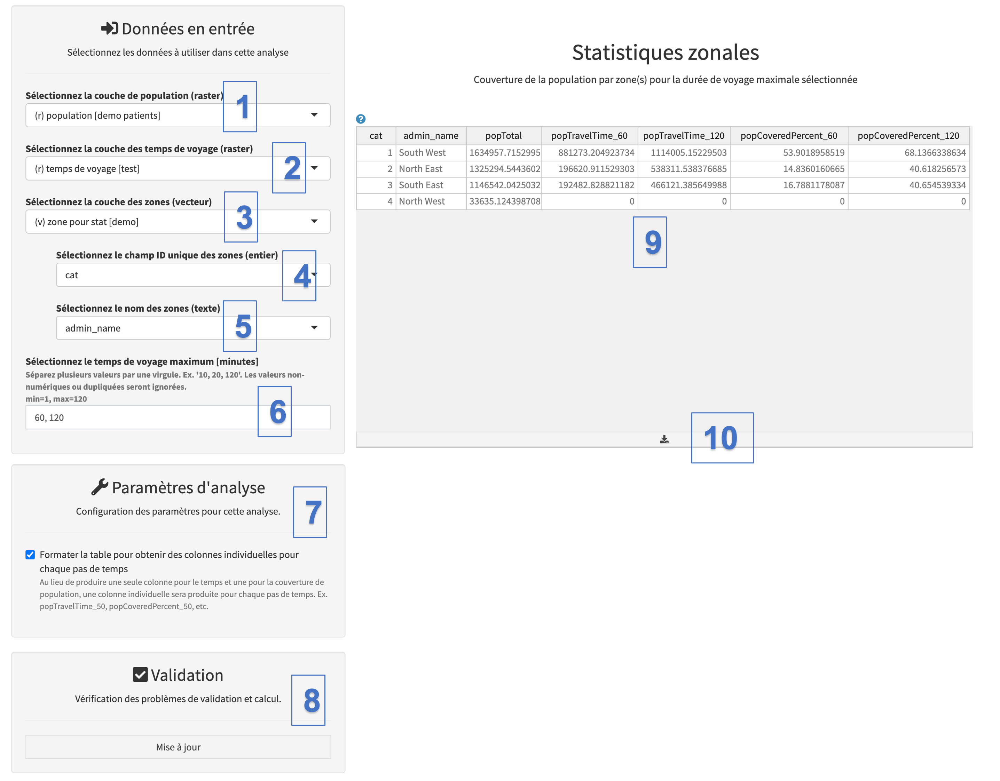

Les statistiques zonales permettent d’obtenir la couverture d’accessibilité de la population (exprimée en pourcentage de la population totale) au niveau des zones importées dans le projet (voir section 3.3.1.9), en combinant la grille de distribution des temps de parcours obtenue par l’utilisation de l’outil «analyse d’accessibilité», avec la répartition spatiale de la population cible et les limites des zones.

Cet outil est particulièrement intéressant car il permet d’obtenir de manière interactive la couverture pour différentes durées de trajet, à condition que ces durées se situent dans la durée de trajet maximale spécifiée lors de l’analyse de l’accessibilité (voir section 5.5.3). Cela signifie que vous ne pouvez pas obtenir les statistiques de zone pour une durée de trajet de 3 heures si l'analyse d'accessibilité a été effectuée pour une durée de trajet maximale de 2 heures.

Si vous souhaitez une flexibilité maximale pour explorer l’évolution de la couverture d’accessibilité pour différentes durées de trajet, vous devez effectuer une analyse de l’accessibilité sans restriction quant à la durée de trajet maximale (c’est-à-dire mettre «0» dans le champ «Sélectionnez le temps de voyage maximum \[minutes\]») et utiliser la grille de répartition du temps de trajet résultante dans le présent outil de statistiques par zone. Pour l'exercice suivant, nous utiliserons simplement la grille de distribution du temps de trajet de 120 minutes obtenue précédemment avec l'outil "Analyse d'accessibilité" (voir section 5.5.3).

Les captures d'écran suivantes expliquent comment remplir les sections permettant de saisir les différentes couches et paramètres permettant d'effectuer les statistiques par zone:

{width="700"}

[Données en entrée:]{.underline}

\(1\) Sous «Sélectionnez la couche de population (raster)», sélectionnez la couche raster contenant la distribution spatiale de la population cible - «population» - sur laquelle la statistique zonale sera appliquée.

\(2\) Sous “Sélectionnez la couche de temps de voyage (raster)”, sélectionnez la couche raster contenant la distribution spatiale du temps de parcours résultant de l'analyse d'accessibilité. Dans le contexte de cet exercice, veuillez utiliser celle intitulée "temps de voyage \[accessibilité 120 m\]".

\(3\) Sous “Sélectionnez la couche de zones (vecteur)”, sélectionnez la couche vectorielle contenant les limites des zones qui seront utilisées pour les statistiques zonales.

\(4\) Sous «Sélectionnez le champ ID unique des zones (entier)», sélectionnez le champ dans la table attributaire de la couche de limites de zone qui contient l'identificateur unique attribué à la zone.

\(5\) Sous "Sélectionner le nom des zones (texte)", sélectionnez le champ dans la table attributaire de la couche de limites de zone qui contient le nom attribué à chaque zone.

\(6\) Sous «Sélectionnez le temps de voyage maximum (minutes), sélectionnez le(s) temps de trajet maximal pour lequel vous souhaitez obtenir les statistiques par zone. (**Attention: vous ne pouvez pas entrer un nombre plus grand que le temps de trajet maximum trouvé dans le raster de distribution des temps de voyage.)**

\(7\) Le paramètre "Formater la table pour obtenir des colonnes individuelles pour chaque pas de temps" permet de formater la table de sortie avec des colonnes dédiées pour chaque temps de trajet maximal spécifié (par exemple, popTravelTime_60, popCoveredPercent_60, etc.). C'est l'option par défaut à considérer. Si vous décochez cette option, les résultats associés aux différents temps de trajet maximum se trouveront dans la même colonne.

[Validation et résultats]{.underline}

\(7\) Vous pouvez ensuite cliquer sur le bouton "Mise à jour", au cas où il n'y aurait pas de problème pour obtenir les résultats dans le tableau de section Statistiques zonales situé à droite du panneau (9).

Cette table contient les colonnes suivantes:

-   **cat:** identifiant unique de la zone, selon le champ sélectionné dans la table attributaire de la couche de limites de zones.
-   **admin_name**: nom de la zone, selon le champ sélectionné dans la table attributaire de la couche de limites de zones.
-   **popTotal:** population totale située dans la zone, extraite de la grille de distribution de la population.
-   **popTravelTime:** population située dans la durée de trajet maximale indiquée dans les données d'entrée.
-   **popCoveredPercent**: couverture d'accessibilité pour la durée de trajet maximale indiquée dans les données d'entrée. Obtenu en divisant **popTravelTime** par **popTotal**.

\(10\) Le contenu de la table des résultats peut alors être exporté comme fichier \*.csv en cliquant sur l'icône "flèche bas". Le fichier \*.csv peut être importé dans Excel si besoin.

Alternativement, le contenu du tableau de statistiques zonales peut aussi être copié-collé (Ctrl-C / Ctrl-V sous Windows, ⌘-C / ⌘-V sous Mac) comme suit:

1.  Sélectionner le contenu de la table de statistiques zonales en cliquant dessus et en maintenant le bouton enfoncé tout en faisant glisser le curseur sur tout le tableau.
2.  Copier le contenu sélectionné (Ctrl-C sous Windows, ⌘-C sous Mac)
3.  Coller les cellules copiées dans une feuille de calcul Excel (Ctrl-V sous Windows, ⌘-V sous Mac)
4.  Ajouter une ligne supplémentaire en haut, puis les en-têtes de colonne manuellement dans la feuille de calcul Excel, car elles ne sont malheureusement pas copiées lors de l'opération.

::: callout-warning
**L'en-tête des colonnes contenant l'identificateur unique et le nom de la zone correspond à l'étiquette du champ que vous avez sélectionné dans la table attributaire de la couche de limites de zone.**

**L'obtention des statistiques zonales pour différents niveaux sous-nationaux (ou au niveau national) nécessite d'importer une couche de limites de zone séparée pour chaque niveau dans le projet avant de poursuivre.**
:::
