L'analyse de mise à l'échelle permet de tester différents scénarios visant à étendre un réseau de fourniture de services existant ou de générer un réseau complet de fourniture de services s'il n'en existe pas déjà un.

Les scénarios pouvant être testés à l'aide de cet outil prennent en compte:

1.  Zones d'exclusion dans lesquelles il est interdit de créer de nouvelles formations sanitaires (voir section 3.3.1.5)
2.  Différents facteurs de pertinence répartis géographiquement qui sont combinés dans un indice de pertinence pour définir les sites les mieux adaptés à la localisation d'une nouvelle structure de santé. Ces facteurs peuvent être basés sur la distance par rapport à des éléments spécifiques, le temps de trajet entre ces éléments, la densité de la population ou la définition des zones dans lesquelles les structures de santé doivent être prioritaires par rapport aux autres (voir Section 3.3.1.10).

Une analyse de l'accessibilité physique est ensuite effectuée sur toutes les cellules raster présentant la valeur la plus élevée, en dehors des zones d'exclusion, dans la couche de distribution de pertinence.

Le site (cellule) couvrant la population la plus nombreuse est celui sélectionné pour l’emplacement d’une nouvelle structure de santé. Le type de structure placé sur ce site est ensuite décidé en fonction du contenu de la nouvelle table d’informations sur la structure de santé (voir section 3.3.2.3).

Ce qui précède est répété jusqu'à ce que:

1.  Le nombre de nouvelles structures de santé définies par l'utilisateur ait été localisé; ou,
2.  La couverture de population définie par l'utilisateur ait été atteinte.

La description ci-dessus n'est qu'un résumé du processus global appliqué lors de cette analyse. Veuillez vous référer à l’Annexe 7 pour plus de détails. 

::: callout-warning
**AccessMod n’a actuellement aucune fonction permettant de modifier et / ou d’optimiser automatiquement la capacité de couverture maximale de certaines structures de santé ou de simuler l’impact de ces changements sur la couverture de la population. Cela pourrait faire partie des futures fonctionnalités d'AccessMod.**

**En attendant, cette approche peut être mise en œuvre à travers les étapes suivantes:**

1.  **Modification des valeurs de capacité de couverture maximale dans la table attributaire de la couche d'emplacement des structures de santé**
2.  **Exécution d'une analyse de couverture géographique basée sur la couche récemment modifiée des structures de santé**
:::

L'ensemble des captures d'écran suivantes explique comment remplir les sections permettant de saisir les différentes couches et paramètres permettant d'effectuer l'analyse de mise à l'échelle:

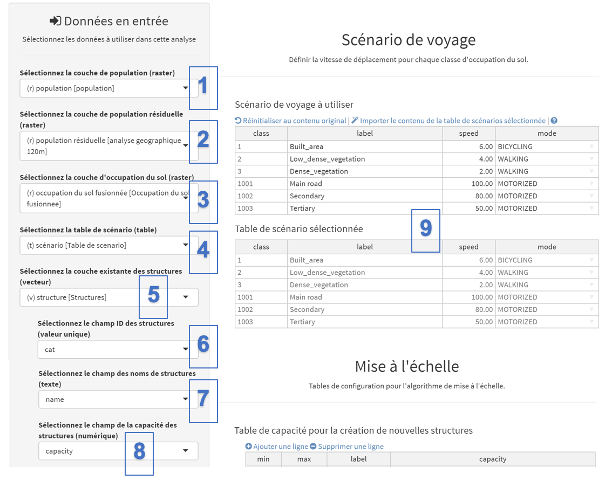{width="700"}

[Données en entrée:]{.underline}

 (1)  Sous “Sélectionnez la couche de population (raster)”, sélectionnez la couche de format raster contenant la distribution spatiale de la population cible d'origine - "population". Cette couche sera utilisée comme dénominateur pour le calcul de la couverture de population obtenue grâce à l'analyse de mise à l'échelle.

(2)  Sous “Sélectionnez la couche de population résiduelle (raster), sélectionnez la couche de format raster contenant la population cible à couvrir via l'analyse de mise à l'échelle. Cette couche servira également de numérateur pour calculer la couverture de population atteinte à chaque itération de l'analyse de mise à l' échelle. Pour l'exercice, sélectionnez la couche de format raster contenant la distribution spatiale de la population résiduelle obtenue après analyse de la couverture géographique - "\[geographic analysis 120m\]”.

::: callout-warning
**La valeur de la couverture de la population est supérieure à 0% au début du processus lors de la sélection d'une couche de population résiduelle différente de la distribution spatiale de la population cible d'origine car, dans ce cas, une partie de la population cible est déjà couverte par la réseau existant de structures de santé.**

**Il est néanmoins possible de sélectionner la même couche de distribution de la population dans les deux champs ci-dessus. Cela correspond par exemple à une situation dans laquelle vous souhaitez établir un nouveau réseau de fourniture de services. Dans ce cas, la valeur de la couverture de la population au début du processus est égale à 0% car aucune des populations cibles n’a été couverte au moment de la réalisation de l’analyse.**
:::

(3)  Sous “Sélectionnez la couche d'occupation du sol fusionnée (raster)”, sélectionnez la couche de format de raster contenant la couverture du sol fusionnée résultant de l'utilisation du premier outil (voir la section 0) - dénommé "occupation du sol fusionnée".

(4)  Sous “Sélectionnez la table de scénario (table)”, sélectionnez la table de scénario de voyage que vous souhaitez utiliser. Dans le présent exemple, il s’agit de celle utilisée pour l’analyse précédente.

(5)  Sous “Sélectionnez la couche existante des structures (vecteur)”, sélectionnez la couche vecteur contenant l'emplacement des structures de santé déjà existantes - ici, nommée "facilities". Veuillez noter que ce champ, ainsi que les champs suivants de cet outil, n'apparaîtront pas dans la liste si vous avez coché l'option "Commencer avec une couche vide" sous "Options for the output layer \[OUTPUT FACILITIES\]" dans le menu "Paramètres d'analyse" (voir après la figure suivante ci-dessous).

(6)  Dans “Sélectionnez le champ ID des structures (valeur unique)”, sélectionnez le champ dans la table attributaire de la couche des structures de santé qui contient les identificateurs uniques des structures de santé.

(7)  Dans “Sélectionnez le champ des noms de structures (texte)”, sélectionnez le champ dans la table attributaire des structures de santé qui contient le nom de chaque établissement de santé.

(8)  Dans “Sélectionnez le champ de la capacité des structures (numérique)”, sélectionnez le champ de la table attributaire de la couche des structures de santé qui contient la couverture maximale, la capacité de chaque structure de santé.

 [Scénario de voyage:]{.underline}

(9) Comme pour l'analyse d'accessibilité (voir section 5.5.3), la section "Table de scénario sélectionnée", à droite du panneau, permet d'importer le contenu de la table de scénario externe et / ou de modifier manuellement les informations indiquées dans les colonnes étiquette, vitesse et / ou mode.

Le reste de la section "données en entrée" ainsi que les sections "Tables de mise à l'échelle" du panneau peuvent ensuite être renseignées comme suit:

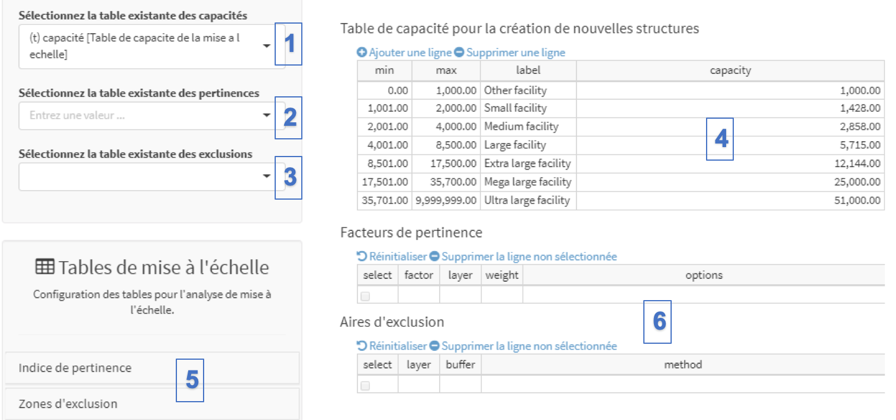{width="700"}

[Données en entrée:]{.underline}

(1)  Sous “Sélectionnez la table existante des capacités”, sélectionnez la nouvelle table d'informations sur les structures sanitaires (voir section 3.3.2.3) que vous avez importée dans le projet, celle qui est étiquetée "mise à l'échelle de la capacité". Veuillez noter que le contenu de cette table peut être créé manuellement, s'il n'est pas déjà importé dans le projet (voir le point (4) ci-dessous).

(2)  Le champ “Sélectionnez la table existante des pertinences” peut être utilisé pour sélectionner une table contenant les facteurs de pertinence utilisés dans une analyse de mise à l’échelle précédente. Ce champ indique \[NO DATA\] pour le moment, car nous n’avons effectué aucune analyse de mise à l’échelle pour le moment. 

(3)  Le champ “Sélectionnez la table existante des exclusions” peut être utilisé pour sélectionner une table contenant la liste des zones d’exclusion utilisées dans une analyse de mise à l’échelle précédente. Ce champ est vide pour le moment, aucune analyse de mise à l'échelle n'a été effectuée pour le moment.  

(4)  Les tables de la section “Table de capacité pour la création de nouvelles structures” affichent le contenu de la nouvelle table d’informations sur les structures de santé sélectionnées au point (1) ci-dessus - «mise à l'échelle de la capacité». Vous pouvez créer ou modifier cette table en cliquant dans chaque cellule de la table. Des lignes peuvent également être ajoutées ou supprimées via les boutons "Ajouter une ligne" et "Supprimer une ligne".

[Tables de mise à l'échelle:]{.underline}

\(5\) La section “Tables de mise à l'échelle” est utilisée pour définir les indices de pertinence et les zones d'exclusion à utiliser dans l'analyse. L'utilisation de cette section est décrite plus en détail ci-dessous. 

(6) Les deux tables, dans le coin inférieur droit de la figure ci-dessus (vide maintenant), contiennent la liste des facteurs de pertinence et des aires d'exclusion définies par l'utilisateur. La méthode pour remplir ces tables est expliquée dans les deux sections suivantes.

**Utilisation de la section "Tables de mise à l'échelle"**

Cette section permet de définir les facteurs de pertinence et les zones d’exclusion dans lesquelles aucune nouvelle structure ne sera située au cours de l’analyse de mise à l'échelle (voir la section 3.3.1.5). La section suivante décrit en détail comment définir ces facteurs et ces zones.

 *Indice de pertinence*

AccessMod définit le site le plus approprié pour localiser un nouveau centre de santé en combinant les distributions spatiales de différents facteurs de pertinence dans une seule couche d’indice de pertinence.

Les facteurs de pertinence accessibles à l'utilisateur sont les suivants:

-     *Somme de la population dans un rayon* (en kilomètres): cette option créera une nouvelle couche dans laquelle la somme de la population cible (originale ou résiduelle) située dans un rayon donné de chaque cellule sera attribuée à la cellule en question. Ce facteur de pertinence permet, par exemple, de considérer les sites avec la plus forte densité de population voisine comme les plus appropriés pour localiser une nouvelle structure.

-     *Distance euclidienne vers les autres structures *(ex: routes, structures *existantes*): cette option créera une nouvelle couche contenant la distribution spatiale de la distance euclidienne à partir d'entités stockées dans une couche vectorielle (point, ligne ou polygone). Cela permet, par exemple, de considérer les sites proches des routes comme les plus appropriés pour localiser une nouvelle installation.

-    Temps de trajet depuis/vers les autres structures*: *cette option est similaire à la précédente, mais utilise le temps de trajet au lieu de la distance euclidienne. Cela permet, par exemple, de considérer les sites situés loin des centres de santé existants comme les plus appropriés pour localiser un nouveau centre.

-     *Carte de priorité*: les couches de format raster contenant des valeurs entières peuvent être directement intégrées à l'index (voir la section 3.3.1.10). Cela donne un haut degré de flexibilité, la priorité pour la mise à l'échelle pouvant provenir de tout autre paramètre externe distribué dans l'espace, tel que les données sur la prévalence sous-nationale ou l'inégalité des revenus. Cela permet, par exemple, de considérer que les districts avec une prévalence particulière sont les plus appropriés pour localiser une nouvelle structure.

Pour chacun de ces facteurs, il est possible de définir si des valeurs plus élevées dans la couche de répartition des facteurs doivent être considérées comme plus ou moins pertinentes pour localiser une nouvelle installation. Cette option permet, par exemple, de s'assurer que les sites situés le plus près du réseau routier sont considérés comme les plus appropriés lors de l'utilisation du facteur de distance euclidien par rapport aux entités. Dans ce cas, ces sites présenteraient les valeurs les plus basses dans la couche de distribution des facteurs obtenue. 

AccessMod permet également l’attribution d’un poids spécifique à chacun des facteurs de pertinence à prendre en compte dans l’indice final. Cette possibilité offre un niveau de flexibilité supplémentaire à l'utilisateur qui souhaite combiner plusieurs facteurs de pertinence, tout en considérant que certains jouent un rôle plus important que d'autres lors de la définition des sites les plus appropriés pour la localisation d'une nouvelle structure de santé.

La table ci-dessous décrit les paramètres d’interface et d’entrée associés à chacun des facteurs de pertinence susmentionnés.

+--------------------------------------------------------------------------------------------------------------------------------------------------------------------------------------------------------------------+--------------------------------------------------------------------------------------------------------------------------------------------------------------------------------------------------------------------+-------------------------------------------------------------------------------------------------------------------------------------------------------------------------------------------------------------------------------------------------------------------------------------------------------------------------+--------------------------------------------------------------------------------------------------------------------------------------------------------------------------------------------------------------------+
| Somme de la population dans un rayon                                                                                                                                                                               | Distance euclidienne vers les autres structures                                                                                                                                                                    | Temps de trajet depuis/vers les autres structures                                                                                                                                                                                                                                                                       | Carte de priorité                                                                                                                                                                                                  |
|                                                                                                                                                                                                                    |                                                                                                                                                                                                                    |                                                                                                                                                                                                                                                                                                                         |                                                                                                                                                                                                                    |
| **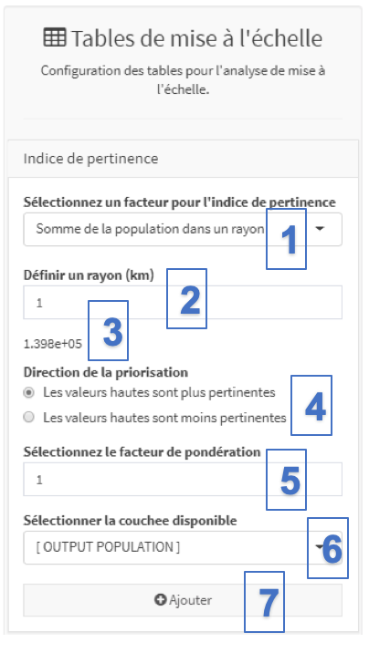\                                                                                                                                                                                 | 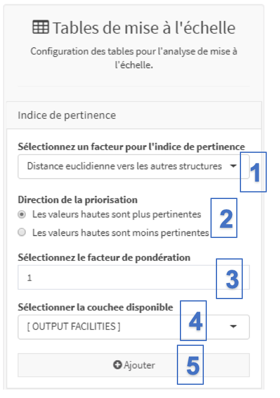{width="150"}\                                                                                                                                                                      | **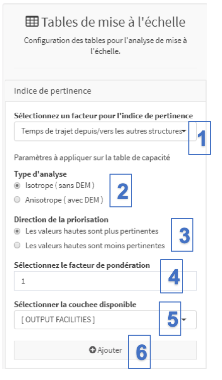\                                                                                                                                                                                                                                                                                      | **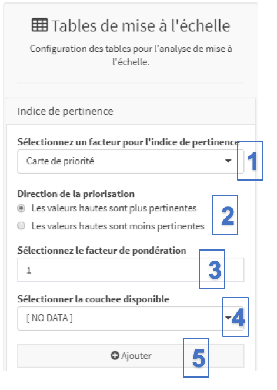{width="150"}\                                                                                                                                                                    |
| **                                                                                                                                                                                                                 |                                                                                                                                                                                                                    | **                                                                                                                                                                                                                                                                                                                      | **                                                                                                                                                                                                                 |
+====================================================================================================================================================================================================================+====================================================================================================================================================================================================================+=========================================================================================================================================================================================================================================================================================================================+====================================================================================================================================================================================================================+
| \(1\) Sous “Sélectionnez un facteur pour l'indice de pertinence”, sélectionnez l'option "Somme de la population dans un rayon" à partir de la liste déroulante.                                                    | \(1\)  Sous “Sélectionnez un facteur pour l'indice de pertinence”, sélectionnez l'option "Distance euclidienne vers les autres structures" à partir de la liste déroulante.                                        | (1) Sous “Sélectionnez un facteur pour l'indice de pertinence”, sélectionnez l'option "Temps de trajet depuis/vers les autres structures" à partir de la liste déroulante.                                                                                                                                              | \(1\) Le facteur “Sélectionnez un facteur pour l'indice de pertinence” prend en compte un jeu de données raster avec les priorités comme valeurs                                                                   |
|                                                                                                                                                                                                                    |                                                                                                                                                                                                                    |                                                                                                                                                                                                                                                                                                                         |                                                                                                                                                                                                                    |
| \(2\) Définissez le rayon (en kilomètres) à utiliser.                                                                                                                                                              | \(2\) “Direction de la priorisation” permet à l'analyste de définir si des valeurs plus élevées pour ce facteur sont **plus** appropriées ou **moins** appropriées pour localiser une nouvelle structure de santé. | \(2\) Le champ “Type d'analyse” permet à l'analyste de spécifier si le temps de trajet sera basé sur une approche isotrope ou anisotrope. La sélection de l'approche anisotrope entraînera l'ouverture d'un nouveau champ afin d'indiquer le sens de déplacement (à partir ou à destination des entités sélectionnées). | \(2\) “Direction de la priorisation” permet à l'analyste de définir si des valeurs plus élevées pour ce facteur sont **plus** appropriées ou **moins** appropriées pour localiser une nouvelle structure de santé. |
|                                                                                                                                                                                                                    |                                                                                                                                                                                                                    |                                                                                                                                                                                                                                                                                                                         |                                                                                                                                                                                                                    |
| (3) Un message indiquant combien de cellules seront traitées à chaque itération apparaîtra.                                                                                                                        | \(3\) “Sélectionnez le facteur de pondération” permet l’attribution d’un poids relatif au facteur.                                                                                                                 | (3) “Direction de la priorisation” permet à l'analyste de définir si des valeurs plus élevées pour ce facteur sont **plus** appropriées ou **moins** appropriées pour localiser une nouvelle structure de santé.                                                                                                        | \(3\) “Sélectionnez le facteur de pondération” permet l’attribution d’un poids relatif au facteur.                                                                                                                 |
|                                                                                                                                                                                                                    |                                                                                                                                                                                                                    |                                                                                                                                                                                                                                                                                                                         |                                                                                                                                                                                                                    |
| \(4\) “Direction de la priorisation” permet à l'analyste de définir si des valeurs plus élevées pour ce facteur sont **plus** appropriées ou **moins** appropriées pour localiser une nouvelle structure de santé. | \(4\) “Sélectionner la couche disponible” sélectionne la couche de format vectoriel qui sera utilisée pour générer la couche de distribution des facteurs (voir ci-dessous).                                       | \(4\) “Sélectionnez le facteur de pondération”permet l’attribution d’un poids relatif au facteur.                                                                                                                                                                                                                       | \(4\) “Sélectionner la couche disponible” sélectionne la couche de format raster contenant la carte de priorité                                                                                                    |
|                                                                                                                                                                                                                    |                                                                                                                                                                                                                    |                                                                                                                                                                                                                                                                                                                         |                                                                                                                                                                                                                    |
| \(5\) “Sélectionnez le facteur de pondération” permet l’attribution d’un poids relatif au facteur.                                                                                                                 | (5) Le bouton “Ajouter” permet d'ajouter le facteur à la liste des facteurs d'aptitude qui seront utilisés dans l'index final.                                                                                     | \(5\) “Sélectionner la couche disponible” sélectionne la couche de format vectoriel qui sera utilisée pour générer la couche de distribution des facteurs (voir ci-dessous).                                                                                                                                            | (5) Le bouton “Ajouter” permet d'ajouter le facteur à la liste des facteurs d'aptitude qui seront utilisés dans l'index final.                                                                                     |
|                                                                                                                                                                                                                    |                                                                                                                                                                                                                    |                                                                                                                                                                                                                                                                                                                         |                                                                                                                                                                                                                    |
| \(6\) Le champ “Sélectionner la couche disponible” sélectionne la distribution de la population au format raster qui sera utilisée pour générer la couche de distribution des facteurs (voir ci-dessous).          |                                                                                                                                                                                                                    | (6) Le bouton “Ajouter” permet d'ajouter le facteur à la liste des facteurs d'aptitude qui seront utilisés dans l'index final.                                                                                                                                                                                          |                                                                                                                                                                                                                    |
|                                                                                                                                                                                                                    |                                                                                                                                                                                                                    |                                                                                                                                                                                                                                                                                                                         |                                                                                                                                                                                                                    |
| \(7\) Le bouton “Ajouter” permet d'ajouter le facteur à la liste des facteurs d'aptitude qui seront utilisés dans l'index final.                                                                                   |                                                                                                                                                                                                                    |                                                                                                                                                                                                                                                                                                                         |                                                                                                                                                                                                                    |
+--------------------------------------------------------------------------------------------------------------------------------------------------------------------------------------------------------------------+--------------------------------------------------------------------------------------------------------------------------------------------------------------------------------------------------------------------+-------------------------------------------------------------------------------------------------------------------------------------------------------------------------------------------------------------------------------------------------------------------------------------------------------------------------+--------------------------------------------------------------------------------------------------------------------------------------------------------------------------------------------------------------------+

Chacun des facteurs de pertinence définis par l’utilisateur est stocké en tant qu’enregistrement séparé dans la table «Facteurs de pertinence» figurant dans la section Mise à l’échelle du panneau du module (partie centrale du panneau). Cette table ressemble à la figure suivante et contient les champs suivants:

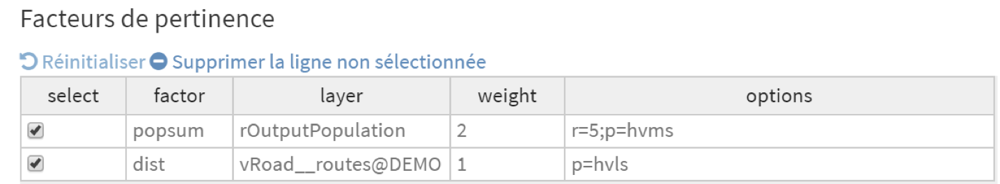{width="700"}

-   **select**: les entrées cochées dans cette colonne indiquent la liste des facteurs de pertinence pris en compte lors de la création de la couche de distribution d'indice de pertinence. Tout facteur non contrôlé ne sera pas pris en compte.
-   **factor:** facteur de pertinence qui a été sélectionné, comme suit:
    -   popsum: Somme de la population dans un rayon
    -   dist: Distances euclidiennes à aprtir des entitités
    -   traveltime: Temps de voyage à partir de/vers les entités
    -   priority: Carte de priorité générique
-   **layer:** informations identifiant la couche utilisée pour répartir spatialement le facteur de pertinence. Les informations rapportées dans ce champ peuvent être soit:
    -   "rOutputPopulation", lors de la sélection de la population cible qui sera mise à jour à chaque itération (voir l'encadré ci-dessous pour plus d'informations)
    -   "vOutputFacility", lors de la sélection de la couche d'emplacement de centre de santé qui sera mise à jour à chaque itération (voir l'encadré ci-dessous pour plus d'informations)
    -   xxx_yyy@zzz avec xxx=classe de données (voir la section 5.4.1); yyy= tag de données et zzz= nom du projet
-   **weight:** poids attribué à ce facteur d'aptitude particulier. Plus la valeur est élevée, plus l'influence du facteur est grande par rapport aux autres. Par exemple, le poids de "2" appliqué à la somme de population dans un facteur de rayon (popsum) dans la figure ci-dessus signifie que l'influence de ce facteur est deux fois plus importante dans l'indice final que l'influence de l'autre facteur considéré ici, les distances euclidiennes des entités (dist)
-   **options:** liste des options définies par l'utilisateur, avec:
    -   "r": Valeur du rayon défini pour la somme de la population dans un facteur d'aptitude du rayon
    -   "t": Type d'analyse défini pour le temps de parcours depuis / vers le facteur d'entités (iso = isotrope; aniso = anisotrope)
    -   "d": Sens de déplacement défini pour le temps de parcours depuis/vers le facteur d'entités (to = vers l'entité; depuis = depuis l'entité)
    -   "p": direction de priorisation (hvms = les valeurs les plus élevées conviennent mieux; hvls = les valeurs les plus hautes conviennent moins)

*Zones d'exclusion*

Les zones d'exclusion sont définies dans la sous-section "Zones d'exclusion" de la section "Tables de mise à l'échelle" du panneau de module, comme indiqué ci-dessous:

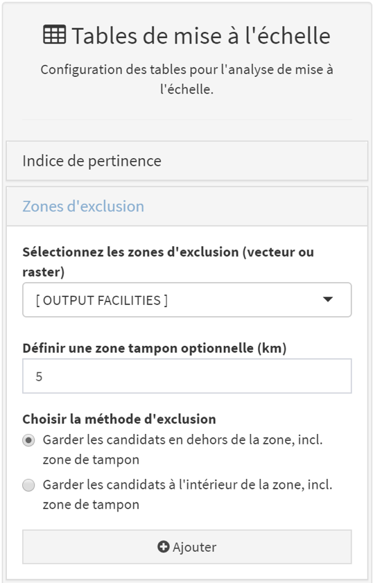

Les zones d'exclusion, utilisées dans le cadre de l'analyse de mise à l'échelle, peuvent être définies de deux manières, à savoir:

-   Les couches de format vectoriel ou raster importées en tant que zones d'exclusion dans le projet (voir la section 3.3.1.5).
-   L'emplacement des structures de santé, y compris les nouvelles étant localisées à chaque itération pendant l'analyse.

 Veuillez noter que, dans les deux cas, l'utilisateur peut définir:

1.  Une zone tampon optionnelle (exprimée en kilomètres) à définir autour des zones d'exclusion

2.  Si de nouveaux candidats doivent être conservés à l'intérieur ou à l'extérieur des zones d'exclusion finales (c'est-à-dire, les zones d'exclusion contenues dans le vecteur ou la couche raster sélectionnée, ainsi que la zone tampon définie)

Ce qui précède peut, par exemple, éviter de localiser de nouvelles structures de santé à une certaine distance de structures déjà existantes - une des contraintes utilisées au Burkina Faso.

Chacune des zones d'exclusion définies par l'utilisateur est stockée en tant qu'enregistrement séparé dans la table "Zones d'exclusion" figurant dans la section Mise à l'échelle du panneau de module. Cette table ressemble à la figure suivante et contient les champs suivants: 

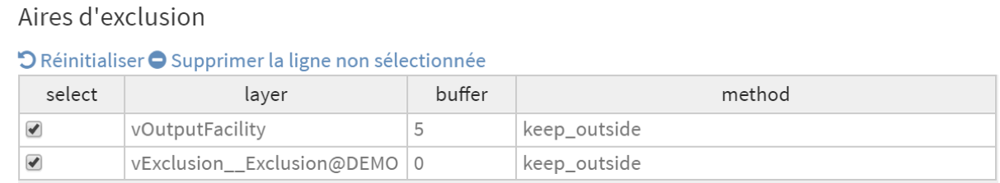{width="583"}

-   **select**: les entrées cochées dans cette colonne indiquent la liste des facteurs de pertinence pris en compte lors de la création de la couche de zones d'exclusion. Tout facteur non coché ne sera pas pris en compte.
-   **layer:** information identifiant la couche utilisée pour définir la ou les zones d'exclusion. Les informations reportées dans ce champ sont les mêmes que pour la table des facteurs de pertinence (voir ci-dessus).
-   **buffer: **taille de la zone tampon, exprimée en kilomètres, définie autour de la ou des zones d'exclusion sélectionnées
-   **method**: indique si les nouvelles installations doivent être situées à l'extérieur («keepOutside») ou à l'intérieur («keepInside») des zones d'exclusion définies

::: callout-warning
**Une partie de la population à couvrir pourrait vivre dans des zones d'exclusion ou pourrait devoir les traverser. La population en question, ainsi que ses mouvements, seront pris en compte lors de l'analyse (c'est-à-dire que l'étendue de l'aire de captage tiendra compte de ces populations), mais aucune nouvelle structure de santé ne sera située dans ces zones à travers la mise en œuvre l'analyse.**

**L’option \[OUTPUT POPULATION\] accessible dans les sections "Tables de mise à l’échelle" de ce module correspond à la couche de distribution de la population résiduelle au format raster mise à jour à chaque itération de l’analyse pour prendre en compte la population attachée à la structure de santé nouvellement positionnée.**

**L’option \[OUTPUT FACILITIES\] accessible dans les sections "Tables de mise à l’échelle" de ce module correspond à la couche de format vectoriel contenant la localisation des structures de santé qui est mise à jour à chaque itération de l'analyse pour tenir compte des nouvelles structures de santé positionnée au cours de l'analyse. Une telle couche:**

-   **contient les structures déjà existantes si l'option "Commencer avec une couche existante" a été cochée dans les "paramètres d'analyse";**
-   **est vide avant de lancer l'analyse au cas où l'option "Commencer avec une couche vide" a été cochée dans les "paramètres d'analyse".**
:::

Pour les besoins de cet exercice, nous allons considérer deux facteurs de pertinence et deux couches d'exclusion comme suit:

*Facteur de pertinence 1:*

Pour le premier facteur de pertinence, nous souhaiterions que les nouvelles installations soient situées dans les zones les plus peuplées de la couche de distribution de la population résiduelle. Pour les besoins de l'exercice, nous considérons également que ce facteur est deux fois plus important que l'autre facteur de pertinence (voir ci-dessous).

Pour cette priorité, nous allons utiliser le facteur de pertinence "Somme de la population dans un rayon" et définir les différents paramètres comme suit dans la sous-section "Indice de pertinence":

-      Nous utiliserons un rayon de 5 kilomètres

-      Pour la "Direction de priorisation", choisissez "Les valeurs hautes sont plus pertinentes"

-      Donnez une valeur de "2" pour "Sélectionnez le poids du facteur"

-      Sous "Sélectionner la couche disponible", choisissez \[OUTPUT POPULATION\] afin d'utiliser la couche de distribution de population résiduelle mise à jour après chaque itération.

Vous pouvez ensuite appuyer sur le bouton "Ajouter" pour ajouter cette combinaison de paramètres en tant que facteur de pertinence dans la table "Facteurs de pertinence".

*Facteur de pertinence 2:*

Pour le second facteur de pertinence, nous souhaitons également que les nouvelles installations soient situées le plus près possible du réseau routier. Pour cette priorité, nous utiliserons le facteur de pertinence "Distances euclidiennes vers les autres structures".

Pour entrer ces paramètres dans la sous-section "Indice de pertinence", procédez comme suit:

-     Pour la "Direction de la priorisation", choisissez "Les valeurs hautes sont plus pertinentes"

-     Donnez une valeur de "1" pour le poids de "Sélectionnez le facteur de pondération" 

-     Sous "Sélectionner la couche disponible", choisissez la couche vectorielle "Routes". 

Vous pouvez ensuite appuyer sur le bouton "Ajouter" pour ajouter cette combinaison de paramètres en tant que facteur de pertinence dans la table "Facteurs de pertinence".

La table "Facteurs de pertinence" doit ensuite résumer les facteurs et paramètres que vous avez choisis, comme indiqué ci-dessous:

{width="700"}

Nous passons maintenant à la section "Zones d'exclusion" pour définir les zones exclues dans lesquelles aucune nouvelle installation de santé ne devrait être située.

*Zone d'exclusion 1:*

Premièrement, nous aimerions empêcher les nouveaux établissements de santé d’être situés dans un rayon de 5 kilomètres d’un établissement de santé déjà existant.

Définissez les paramètres comme suit, dans la sous-section "Zones d'exclusion" de la section des tables de mise à l'échelle, pour inclure ces zones d'exclusion dans l'analyse de mise à l'échelle:

-      "Sélectionner les zones d'exclusion": Choisissez \[STRUCTURES EN SORTIE\] afin de tenir compte de chaque nouvelle structure de santé localisée après chaque itération     

-      "Définir un tampon optionnel (km)": Entrez "5"

-      "Choisir la méthode d'exclusion": Choisissez "Garder les candidats en dehors des zones + tampon"

Vous pouvez ensuite appuyer sur le bouton "Ajouter" pour ajouter cette combinaison de paramètres et donc inclure ces zones d'exclusion dans la table "Zones d'exclusion".

Il est important de souligner l'utilisation de l'option \[STRUCTURES EN SORTIE\], car la zone d'exclusion attachée à chaque nouvelle installation placée aura une influence sur l'emplacement de la prochaine installation récemment installée.

*Zone d'exclusion 2:*

Nous aimerions ensuite exclure toute nouvelle structure de santé du polygone inclus dans la couche vecteur "exclusion" précédemment importée dans le projet (voir la section 5.5.1).

Définissez les paramètres comme suit, dans la sous-section "Zones d'exclusion" de la "section des tables de mise à l'échelle", pour inclure cette zone d'exclusion dans l'analyse de mise à l'échelle:

-       "Sélectionnez les zones d'exclusion (vecteur ou raster)": Choisissez la couche vecteur "exclusion"

-       "Définir une zone tampon optionnelle (km)": Entrez "0"

-       "Choisir la méthode d'exclusion": Choisissez "Garder les candidats en dehors de la zone, incl. zone de tampon"

Vous pouvez ensuite appuyer sur le bouton "Ajouter" pour ajouter cette zone d'exclusion dans la table "Zones d'exclusion".

La table "Aires d'exclusion" devrait ensuite résumer les facteurs et paramètres que vous avez choisis, comme indiqué ci-dessous:

{width="700"}

Les captures d'écran suivantes décrivent la manière dont les sections relatives aux paramètres d'analyse et à la sélection des structures de santé doivent être renseignées afin d'exécuter l'analyse de mise à l'échelle:

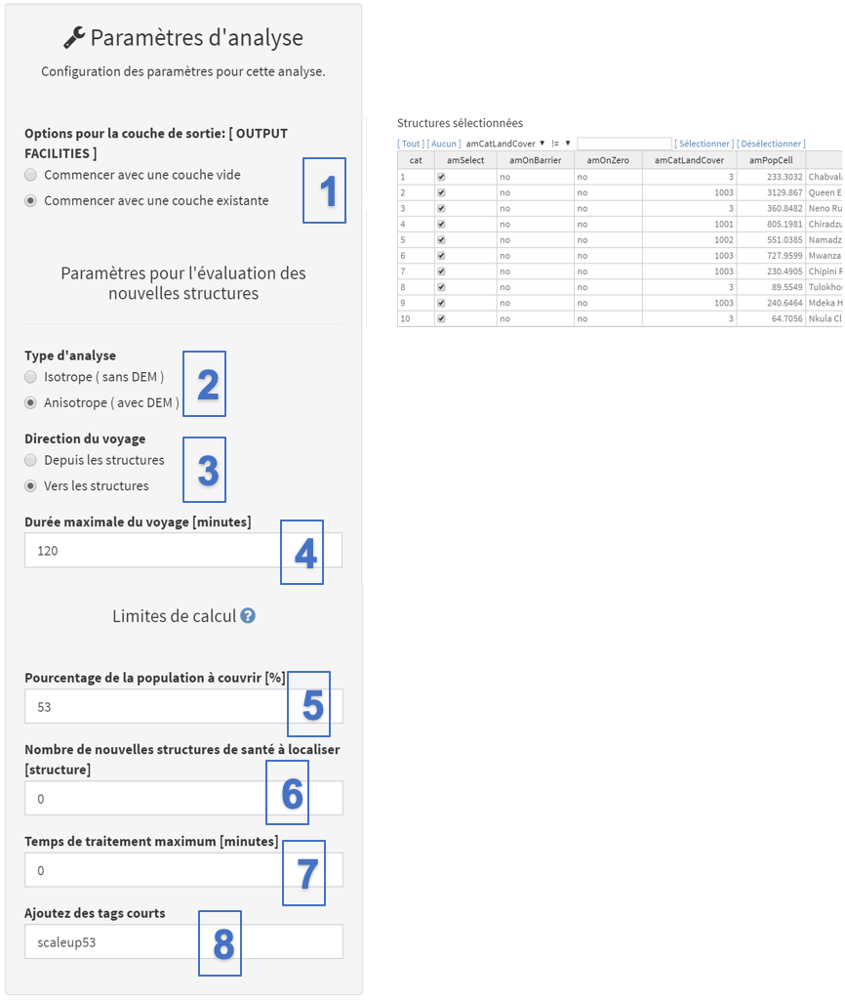{width="600"}

[Paramètres d'analyse]{.underline}

 (1) Sélectionnez, sous «Options pour la couche de sortie \[OUTPUT_FACILITIES\]», si vous souhaitez démarrer l'analyse de mise à l'échelle en utilisant des structures existantes sélectionnées ou avec une couche de structures de santé vide. La première option est cochée par défaut lors du démarrage de l'outil de mise à l'échelle. Si vous sélectionnez cette option, le champ "Sélectionner la couche des structures de santé existantes (vecteur)" et les autres champs associés disparaissent de la section des données en entrée.

::: callout-warning
**Pour que l'analyse soit cohérente, la couche de population résiduelle ne doit pas contenir la population couverte par les structures de santé existantes au cas où l'option "Commencer avec une couche existante" est sélectionnée.**
:::

[Paramètres pour l'évaluation de nouvelles structures]{.underline}

\(2\) Dans «Type d'analyse», indiquez si vous souhaitez appliquer une approche «anisotrope» ou «isotrope» lors de l'identification du type de structure devant être placé sur le site le plus approprié. Dans le présent exercice, nous choisirons «anisotropes» afin de prendre en compte l’impact de la pente sur la vitesse pour les modes de transport WALKING et BICYCLING.

(3) Dans «Direction du voyage», sélectionnez le sens du déplacement des patients. Comme pour les outils précédents, ce champ n'apparaît que si l'option "anisotrope" a été cochée au point précédent. Comme c'est le cas, pour l'exercice, choisissez "Vers les structures" afin de prendre en compte le temps de déplacement en direction des structures de santé.

\(4\) Sous «Durée maximale du voyage \[minutes\]», spécifiez la durée maximale (en minutes) qu'AccessMod utilisera pour dessiner la ou les aires de captage du ou des sites les plus appropriés identifiés à chaque itération. La population située dans l'aire de captage rattachée au site approprié final sera utilisée pour définir le type de structure de santé à implanter sur ce site. Nous utilisons 120 minutes pour cet exercice.

[Limites de calcul]{.underline}

Le calcul s'arrête dès que l'une des valeurs définies ici est atteinte. Veuillez noter qu'une valeur doit être indiquée dans chacun de ces champs pour qu'AccessMod puisse s'exécuter et qu'une valeur de zéro indiquée dans l'un de ces champs sera considérée comme "aucune limite".

(5) Dans «Pourcentage de la population à couvrir (%)», indiquez le pourcentage de la population (exprimé en%) que vous souhaitez que le nouveau réseau de structures de santé actualisé couvre à travers l’analyse de mise à l'échelle. Ces pourcentages sont calculés à chaque itération de l’étude en divisant la nouvelle couche de répartition de la population résiduelle par la couche de population initiale. Une valeur "0" signifie "aucune limite". Pour l'exercice, nous souhaitons élargir notre réseau d'installations de manière à couvrir au moins 53% de la population. Vous pouvez donc spécifier "53" dans ce champ. (Rappelez-vous que notre réseau d'installations actuel couvre environ 48% de la population dans un délai de déplacement de deux heures. Voir la fin de la section 5.5.4 pour plus de détails.)

(6) Dans «Nombre de nouvelles structures de santé à localiser \[structure\]», indiquez le nombre de nouvelles structures de santé à localiser lors de l'analyse. Ce nombre correspond au nombre maximal d'itérations qu'AccessMod effectuera avant d'arrêter l'analyse. Une valeur "0" signifie "aucune limite", ce que nous allons utiliser pour cet exercice.

(7) Sous «Temps de traitement maximum (minutes)», indiquez la durée maximale de traitement (en minutes) de l'analyse. Ce paramètre est fourni pour permettre à l'utilisateur de fixer une certaine limite de temps au calcul global. Une valeur "0" signifie "aucune limite", ce que nous allons utiliser pour l'exercice.

\(8\) Sous «Ajouter des tags courts», attribuez des tags courts aux différentes sorties de l'analyse. Nous allons utiliser "scaleup53" pour la présente analyse.

[Sélection des installations]{.underline}

 (9) Comme dans l'analyse précédente, vous pouvez sélectionner dans cette section les structures sur lesquelles l'analyse sera effectuée. Veuillez noter que:

-   ces sélections ne seront utilisées que si l'option "Commencer avec une couche existante" a été cochée auparavant (étape 1)
-   la table apparaîtra toujours dans le panneau, même si l'option "Commencer avec une couche vide" a été cochée

 Conservez toutes les structures sélectionnées aux fins du présent exercice.

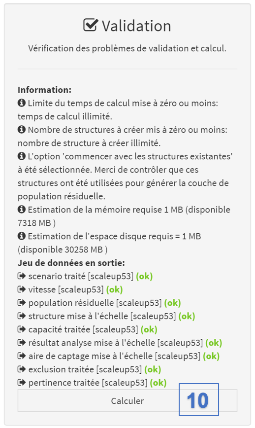{width="350"}

[Validation]{.underline}

(10) La section de validation (indiquée à droite) doit indiquer que tous les champs ont été correctement remplis (avec un «OK» vert). Si tel est le cas, vous pouvez cliquer sur le bouton "Calculer" pour lancer l'analyse. Si ce n'est pas le cas, le bouton "Calculer" sera toujours rouge et vous devrez passer par le message d'avertissement et d'erreur pour déterminer ce qui doit être ajusté.

Une fenêtre transparente avec du texte et une barre de progression apparaîtra devant le panneau pendant l'analyse. Veuillez patienter jusqu'à ce que cette fenêtre disparaisse pour continuer à utiliser AccessMod. Cette analyse peut prendre beaucoup de temps en raison de la méthode itérative de traitement de chaque structure de santé et dépend du nombre de facteurs de pertinence et des zones d'exclusion sélectionnées, ainsi que de la taille de la zone d'étude.

Une fois la fenêtre disparue et l'analyse terminée, revenez au module Données pour vérifier que les huit jeux de données en sortie générés sont les suivants:

1.  [classe "Scénario traité":]{.underline} Table contenant le scénario de voyage qui a été traité.
2.  [classe "population résiduelle":]{.underline} Couche de format raster contenant la population résiduelle. C'est la population qui n'est toujours pas couverte par le réseau de mise à l'échelle obtenu dans cette analyse.
3.  [classe "structure mise à l'échelle":]{.underline} Couche de format vectoriel contenant les nouvelles structures de santé qui ont été calculées et localisée, ainsi que ceux d'origine au cas où l'option "Commencer avec une couche existante" a été cochée dans les paramètres d'analyse.
4.  [classe "capacité traitée":]{.underline} Table contenant les valeurs de la table de capacité traitée.
5.  [classe "résultat analyse mise à l'échelle":]{.underline} Table contenant les résultats de l'analyse de mise à l'échelle.
6.  [classe "aire de captage mise à l'échelle":]{.underline} Couche vectorielle contenant l'étendue de l'aire de captage de chaque nouvelle structure établie
7.  [classe "exclusion traitée":]{.underline} Table contenant les paramètres et les valeurs de paramètre inclus dans la table d'exclusion.
8.  [classe "pertinence traitée":]{.underline} Table contenant les paramètres et les valeurs de paramètre inclus dans la table de pertinence.

Comme vous l'avez fait pour l'analyse précédente, archivez tous ces résultats, exportez-les et décompressez-les afin d'ouvrir et de visualiser les résultats.

Nous nous concentrerons ici sur les principaux résultats de cette analyse de mise à l'échelle, à savoir la localisation et les types de nouvelles structures de santé établis, ainsi que les statistiques associées à l'analyse de mise à l'échelle.

Tout d'abord, ouvrez dans votre logiciel SIG:

-   La couche de format vectoriel contenant les emplacements des nouvelles structures de santé établies lors de l'analyse ainsi que celles d'origine au cas où l'option "Commencer avec une couche existante" a été cochée dans les paramètres d'analyse. Cette couche se trouve dans le dossier de sortie nommé "vector_structure_mise_a_lechelle_scaleup53".
-   La couche de format vectoriel contenant les aires de captage des nouvelles structures de santé établies au cours de l’analyse. Elle se trouve dans le dossier nommé "shape_aire_de_captage_mise_a_lechelle_scaleup53".

Dans la Figure ci-dessous nous voyons une composition de couches (réalisée dans QGIS) montrant la couche de structures de santé résultante contenant les 10 établissements de santé d’origine (en rouge) et les 7 nouveaux établissements de santé (en bleu), ainsi que leurs aires de captage respectives (bleu clair). Le réseau routier et la zone d’exclusion utilisés lors de l’analyse ont également été ajoutés pour faciliter la visualisation des résultats. On peut voir sur cette figure que sept nouvelles structures de santé ont été établies dans la partie sud-est de la région et une structure de santé dans la partie nord. Pour la dernière structure, nous pouvons voir qu’elle a été établie à l’extérieur de la zone d’exclusion, alors que son aire de captage s’étend sur cette zone d’exclusion.\
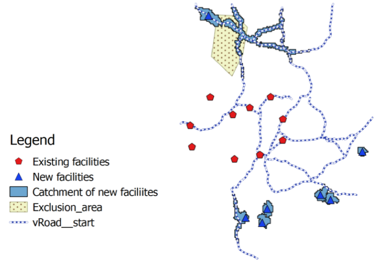

Si vous ouvrez la table attributaire du nouveau fichier de vecteur de structures de santé dans votre logiciel SIG, vous obtiendrez la table suivante (affichée ici dans QGIS):

Dans cette table, vous pouvez voir que les 10 premières lignes contiennent les informations relatives aux structures de santé existantes, tandis que les 7 lignes suivantes contiennent les informations relatives aux nouvelles structures de santé établies au cours de l'analyse. Par rapport à la table d'attributs d'origine de la couche existantes des structures de santé, 4 nouvelles colonnes ont été ajoutées. Il s'agit des 4 colonnes les plus à droite de la capture d'écran ci-dessus:

-   **amName**: Nom temporaire attribué à chaque nouvelle structure de santé par AccessMod.
-   **amid**: Identifiant unique attribué à chaque nouvelle structure de santé par AccessMod. Veuillez noter que cet identifiant correspond également à l'ordre dans lequel les nouvelles structures de santé ont été localisées lors de l'analyse.
-   **amCapacity**: Capacité de couverture maximale associée à la nouvelle structure de santé grâce à l'analyse, en fonction du champ sélectionné dans la table d'informations sur les nouvelles structures de santé (voir section 3.3.2.3).
-   **amLabel**: Le type de structure de santé attaché à la nouvelle structure de santé de santé par le biais de l'analyse, en fonction du champ sélectionné dans la table d'informations sur les nouvelles structures de santé (voir section 3.3.2.3).

Les résultats statistiques de l'analyse de mise à l'échelle se trouvent dans le fichier Excel nommé "table_resultat_analyse_mise_a_lechelle_scaleup53". Cette table contient les colonnes suivantes. (Notez que le tableau est divisé en deux parties dans la capture d'écran suivante.) 

-   **amid:** Identifiant unique attribué à chaque nouvelle structure de santé par AccessMod. Veuillez noter que cet identifiant correspond à celui indiqué dans la colonne "amid" de la couche des structures de santé résultante.
-   **amRankComputed:** Ordre dans lequel les nouvelles structures de santé ont été établies lors de l'analyse de mise à l'échelle
-   **amName**: Nom temporaire de la nouvelle structure de santé attribué par AccessMod et correspondant au nom indiqué dans la colonne "amName" de la couche des structures de santé obtenue.
-   **amTravelTimeMax:** Durée maximale du trajet, en minutes, définie pour l'analyse
-   **amPopTravelTimeMax:** Population totale située dans la durée de trajet maximale définie pour l'analyse (amTravelTimeMax)
-   **amCorrPopTime:** Coefficient de corrélation de Pearson entre l'ensemble des temps de parcours (t, de 0 au temps de parcours maximal) et la population couverte correspondante au cours de ce temps (c'est-à-dire la somme de la population de toutes les cellules situées entre t et t + 1 du temps de trajet). La corrélation peut donner une estimation approximative de la répartition de la population dans l’espace lorsque nous sortons du centre de santé. Par exemple, une valeur positive élevée (par exemple, 0,421 dans la première ligne de la table ci-dessus) signifie que la population est répartie de manière relativement uniforme à mesure que vous vous développez à partir de la structure de santé. Une forte valeur négative signifierait qu'il y a plus de population plus proche du centre de santé que loin de là. Une corrélation proche de zéro signifie qu'il n'y a pas de tendance dans la répartition de la population dans le bassin versant. Par conséquent, cette corrélation doit être utilisée comme un indicateur relatif, car nous ne fournissons pas la signification de la corrélation dans AccessMod (vous devez utiliser une analyse SIG appropriée en dehors d'AccessMod si vous avez besoin d'informations statistiques sur la répartition spatiale de la population dans les aires de captage).
-   **amLabel:** Type de structure de santé associé à la nouvelle structure de santé via l'analyse, en fonction du champ sélectionné dans la nouvelle table d'informations sur la structure de santé. Ce champ contient les mêmes informations que la colonne "amLabel" de la couche des centres de santé résultante.
-   **amCapacity:** Capacité de couverture maximale associée à la nouvelles structure de santé grâce à l'analyse, en fonction du champ sélectionné dans la table d'informations sur les nouvelles structures de santé. Ce champ contient les mêmes informations que la colonne "amCapacity" de la couche des centres de santé résultante.
-   **amTravelTimeCatchment:** Temps de trajet pour atteindre l'étendue maximale de l'aire de captage rattachée à la formation sanitaire. Cette valeur est soit:
    -   Égale au temps de trajet maximal défini pour l'analyse (amTravelTimeMax) lorsque la capacité de couverture maximale de la structure de santé n'a pas été atteinte dans le délai imparti (120 minutes dans ce cas); ou,
    -   Plus courte que le temps de trajet maximal défini pour l'analyse (amTravelTimeMax) lorsque la capacité de couverture maximale de la structure est atteinte avant d'atteindre amTravelTimeMax
-   **amPopCatchmentTotal:** Population située dans l'aire de captage pour la durée du trajet indiquée dans le champ amTravelTimeCatchment
-   **amCapacityRealised**: Partie de la capacité de couverture maximale de la structure de santé qui est réalisée (utilisée) sur la base de la population totale située dans l'aire de captage pour la durée du trajet. Cette valeur est:
    -   Égale à la capacité de couverture maximale de la structure de santé (capacité) lorsque cette valeur est atteinte avant la durée maximale du trajet (amTravelTimeMax).
    -   Inférieure à la capacité de couverture maximale de la structure de santé (capacité) lorsque cette capacité n'est pas atteinte dans le délai de déplacement maximal (amTravelTimeMax).
-   **amCapacityResidual: **Partie de la capacité de couverture maximale de la structure de santé qui n'est pas utilisée. Cette valeur est définie en calculant la différence entre la capacité de couverture maximale (capacité) et la capacité réalisée (amCapacityRealised). Cette valeur est donc égale à 0 lorsque la capacité de couverture maximale est atteinte dans le délai imparti.
-   **amPopCatchmentDiff**: Partie de la population totale située dans le bassin versant final (amPopCatchmentTotal), qui n'est pas couverte par la structure de santé en raison d'un manque de capacité de couverture. Cette valeur est déterminée en calculant la différence entre la population totale dans l'aire de captage (amPopCatchmentTotal) et la capacité réalisée (amCapacityRealised). Cette valeur est donc:\
    -   Égale à 0 lorsque la capacité de couverture maximale n'est pas atteinte dans le délai imparti; ou
    -   Supérieure à 0 lorsque la capacité de couverture maximale est atteinte dans le délai imparti
-   **amPopCoveredPercent**: Couverture géographique cumulative exprimée en pourcentage. Cette valeur correspond au pourcentage de la grille de distribution de la population initiale qui est couverte après chaque itération (c'est-à-dire après la localisation de chaque nouvelle structure de santé).

Les valeurs de la couverture géographique cumulée figurant dans la colonne "amPopCoveredPercent" sont particulièrement intéressantes après l’analyse de mise à l'échelle. Le contenu de cette colonne permet d’identifier le pourcentage de la population couverte après chaque itération, c’est-à-dire après avoir localisé une structure de santé supplémentaire dans la zone d’étude, en tenant compte des facteurs de pertinence et des zones d’exclusion.

Comme nous avons précisé que nous voulions atteindre 53% de la couverture géographique de la population totale dans cette analyse, l'analyse de mise à l'échelle devait localiser 7 nouvelles structures de santé avant d'atteindre 53%. Avec ces 7 nouvelles structures de santé, le réseau actualisé de structures de santé couvre désormais 53,19% de la population (entouré en rouge dans le graphique précédent).
