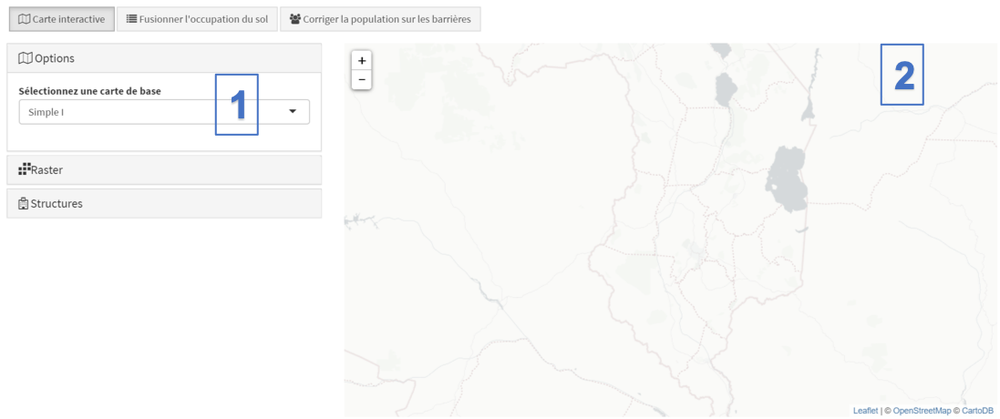
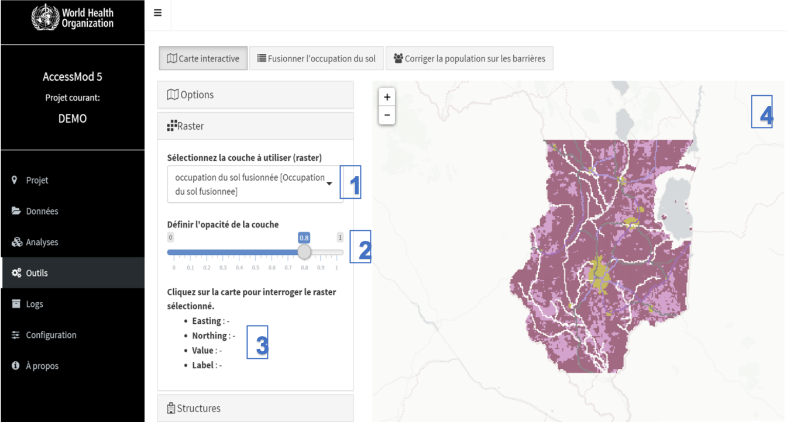
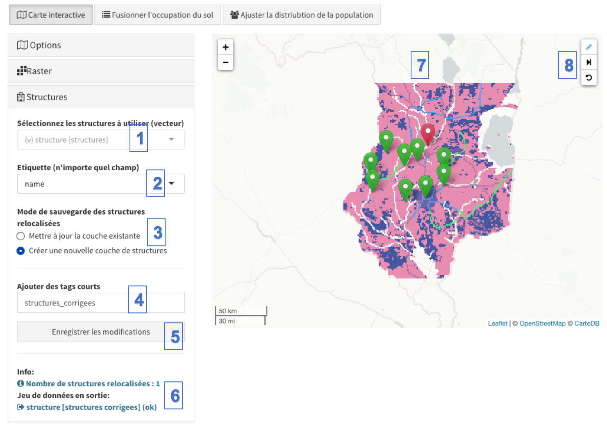

L'outil "Carte interactive" se trouve dans le module "Outils" et il est utile pour **prévisualiser les couches de format raster** importées ou créées à l'aide de différents outils dans AccessMod. Avec cet outil, la couche au format raster sélectionnée peut être explorée à l'aide des fonctionnalités de zoom et de déplacement, et les valeurs raster peuvent être interrogées en un clic de souris. Un fond de carte peut également être affiché.

Avec cet outil, vous pouvez également **modifier les localisations des structures**, par exemple pour éviter qu'elles ne tombent sur des barrières.

Trois panneaux sont associés à cet outil et leurs fonctionnalités sont les suivantes:

[Options]{.underline}:

\(1\) Sous “Sélectionnez une carte de base”, vous pouvez sélectionner le fonds de carte à afficher à l'arrière-plan de la zone de carte. Vous avez les choix suivants: Simple 1 (cartographie simple OSM), Dark (thème OSM sombre), Outdoors (OSM extérieur), Terrain (Terrain de ESRI), Satellite 1 (service d’image satellite de ESRI), Empty (aucune information).

\(2\) La zone de carte principale affiche la carte de base sélectionnée et la couche de raster sélectionnée dans le panneau suivant, le raster étant affiché par dessus la carte de base.

[Raster:]{.underline}

\(1\) Le menu déroulant "Sélectionner la couche à utiliser (raster)" vous permet de sélectionner la couche raster à afficher (dans cet exemple, le raster de l'occupation du sol fusionnée).

\(2\) Sous "Définir l'opacité de le couche", le curseur vous permet de définir le niveau d'opacité du calque du raster sélectionné. Si vous définissez la valeur sur une valeur inférieure, la couche raster deviendra davantage transparente afin de mieux voir la carte d’arrière-plan sous-jacente.

\(3\) Cette zone contient des informations sur la cellule raster sur laquelle l'utilisateur a cliqué dans la zone d'affichage (4). Ces informations contiennent les coordonnées longitude (Easting), latitude (Northing), la valeur du raster de la cellule sur laquelle vous avez cliqué (Value) et, le cas échéant, l’étiquette associée (Label). Veuillez noter que le fait de cliquer en dehors de la zone couverte par la couche raster sélectionnée entraînera toujours l'affichage des coordonnées, mais ne fournira ni valeur ni étiquette.

::: callout-warning
**Les cartes de base sont accessibles à partir des services de carte/images disponibles gratuitement. Cependant, ils ont besoin d’une connexion Internet pour fonctionner correctement. Sans connexion Internet, l'arrière-plan de la zone de carte restera vide. La palette de couleurs est sélectionnée automatiquement par GRASS et il n’est pas possible de la modifier.**
:::

[Structures]{.underline}:

Le panneau "Structures" est utilisé pour afficher une couche vectorielle de classe "Structure" et, le cas échéant, **pour corriger les localisations des structures qui tombent sur des cellules barrières**, car dans de tels cas, ces installations ne sont pas prises en compte dans aucune des analyses. Vous pouvez décider de mettre à jour une couche de structures existantes déjà importée dans AccessMod ou d'enregistrer vos corrections dans une nouvelle couche de structures. Comme indiqué dans l'exemple de la figure ci-dessous, les structures situées sur des pixels de barrière (pixels NoData dans le raster de l'occupation du sol fusionnée) apparaissent avec une icône de localisation rouge, tandis que les structures situées à l'extérieur des barrières apparaissent en vert. Vous pouvez alors facilement repérer les structures sur les barrières et corriger leur emplacement. Un bouton "Suivant" vous permet de parcourir toutes les structures "rouges" restantes, ce qui est très utile si votre couche de structures contient un grand nombre de structures sur les barrières.

{width="650"}

\(1\) Le menu déroulant "Sélectionner les structures à utiliser (vecteur)" vous permet de sélectionner la couche des structures que vous souhaitez visualiser au-dessus de la couche raster sélectionnée dans le panneau "Raster".

\(2\) Le menu déroulant "Etiquette" permet de choisir une colonne de la table attributaire des structures qui permettra d'afficher la valeur correspondante de cette colonne lorsque le curseur passe par dessus une des icônes de la carte.

\(3\) Le "mode de sauvegarde des structures relocalisées" vous permet de choisir si la couche de ressources modifiée mettra à jour la couche de ressources sélectionnée ("Mettre à jour la couche existante") ou si la couche modifiée sera enregistrée dans AccessMod en tant que nouvelle couche de structures ("Créer une nouvelle couche de structures").

\(4\) La zone "Ajouter des tags coures" vous permet de nommer la couche d’installation en sortie.

\(5\) Le bouton "Enregistrer les modifications" vous permet de sauvegarder vos modifications. Dans le cas où vous mettez à jour une couche de structures existantes, vous pouvez cliquer plusieurs fois sur ce bouton pendant le processus de correction des emplacements des structures.

\(6\) La zone d'information donne des informations, des erreurs potentielles et des avertissements.

\(7\) La zone de la carte est l'endroit où vous pouvez interagir avec les emplacements des structures et modifier leurs coordonnées en faisant glisser une icône de structure vers un nouvel emplacement. Dans l'exemple ci-dessus, une structure est située sur des barrières (l'icône rouge). Vous pouvez donc choisir de déplacer son emplacement en cliquant d'abord sur le bouton "éditer" dans la boîte à outils de la carte (7), puis en cliquant et en faisant glisser l'icône d'installation rouge vers un nouvel emplacement. Si ce nouvel emplacement n'est pas un pixel barrière dans votre couche raster sélectionnée, l'icône deviendra verte. Vous pouvez continuer à changer les emplacements du même établissement ou d’autres, ou enregistrer vos modifications.

\(8\) La description de la boîte à outils de la carte est la suivante:

\(a\) Bouton "Editer" pour passer en mode édition afin de changer les emplacements des structures

\(b\) Bouton "Suivant" qui permet le déplacement automatiquement et le zoom sur la prochaine structure restante située sur une barrière

\(c\) Bouton "Annuler" qui vous permet d'annuler la dernière action de relocalisation de votre structure. En cliquant dessus, la structure retournera à son emplacement précédent. Vous pouvez cliquer plusieurs fois dessus pour annuler une série de déplacements, mais uniquement jusqu'au dernier état dans lequel vous avez enregistré le fichier pour la dernière fois.

::: callout-warning
**Changer l'emplacement des structures doit être fait avec beaucoup de prudence. Le cas typique est celui où une installation tombe sur une rivière, définie généralement comme une barrière dans la couche d'occupation du sol fusionnée. Dans ce cas, vous devez décider de quel côté de la rivière la structure doit être déplacée. Ce choix peut avoir un impact sur vos résultats. Une façon d’aider à prendre cette décision consiste à placer l’image satellite en l’arrière-plan de la carte, afin de voir plus en détail la situation des coordonnées de la structure avant de la déplacer.**
:::
