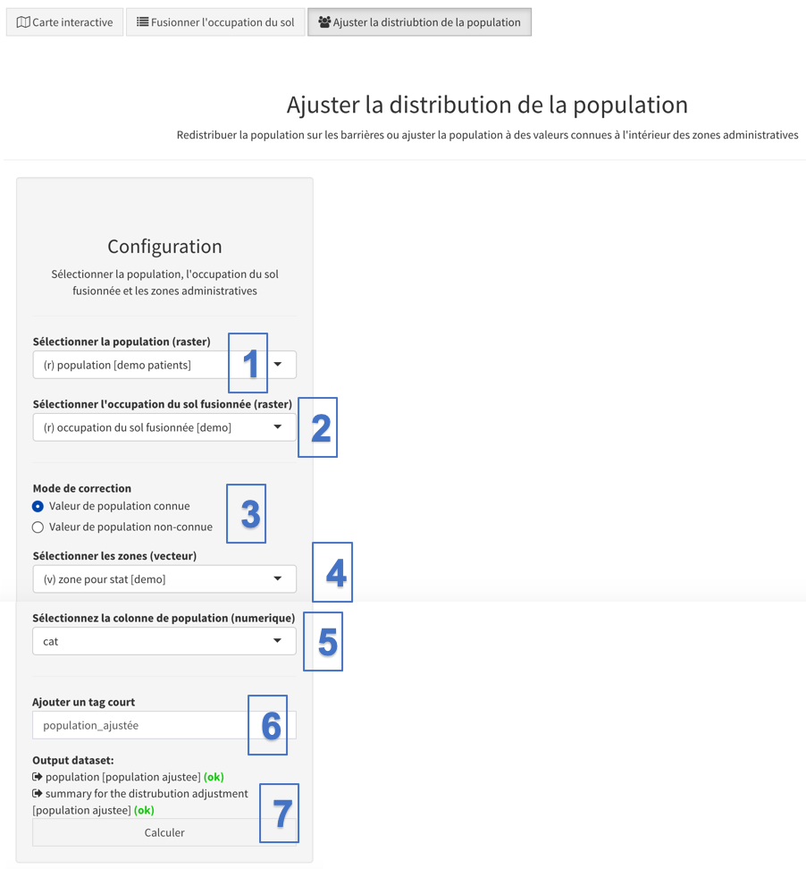

Cet outil permet d’ajuster le raster de distribution de la population afin que la population se trouvant dans des pixels barrière (comme spécifié dans la couverture du sol fusionnée) soit redistribuée en dehors de ces barrières. La redistribution est effectuée uniformément sur tous les pixels non barrières présents dans chacune des sous-unités administratives spécifiées par l'utilisateur. La correction de la population sur les barrières est importante lorsque vous souhaitez vous assurer que vos statistiques (par exemple, le pourcentage de couverture, le nombre de populations présentes dans chaque bassin, etc.) en tiennent compte.

L’hypothèse sous-jacente à l’utilisation de cet outil est que la méthodologie utilisée pour obtenir le raster de densité de population a mal réparti une partie de la population dans des endroits où il ne devrait pas y avoir de population (par exemple, sur certains fleuves, aéroports, zones humides, etc.).

Veuillez vous reporter à l’Annexe 1 pour plus de détails sur l’algorithme implémenté dans cet outil.

Il y a deux modes de correction disponibles (depuis la version 5.6.25):

-   "Valeur de population connue": avec cette option, il est attendu que la table attributaire du shapefile des zones administratives contient une colonne qui informe sur le total officiel de la population dans chaque zone administrative. AccessMod va donc s'assurer que dans chaque zone administrative, le total de la population redistribuée en dehors des barrières soit égal au total officiel de la zone en question. Notez que cette option peut aussi être utilisée si l'on veut simplement corriger par un facteur toute la population (par exemple avoir la population des femmes enceinte, en multipliant la population totale par un facteur de 5%).
-   "Valeur de population non-connue": avec cette option, les nombres de population officielle ne sont pas connus. AccessMod va donc considérer que les totaux de population du raster de population dans chaque zone administrative sont correctes, et va redistribuer ces totaux en dehors des barrières.

Avant d'exécuter l'outil, il est supposé que les trois couches suivantes sont déjà chargées dans AccessMod et qu'elles ont toutes le même système de projection, la même étendue et la même résolution que le DEM:

-   Raster de distribution de population ;
-   Le raster d'occupation du sol fusionnée;
-   Le shapefile des frontières administratives jusqu'au niveau sous-national (avec une colonne attributaire contenant les nombres de population officiels, si besoin).

Les étapes automatiquement appliquées par l'outil pour corriger la population sont les suivantes: 

1.  La grille de répartition de la population ("population totale") est d'abord masquée par la grille d'occupation du sol fusionnée afin d'extraire la population en dehors des barrières, ce qui donne une grille de "population partielle", dont la somme des pixels donne la "population partielle".
2.  Le ratio entre la population totale et partielle est calculé.
3.  La grille "population partielle" est multipliée par ce ratio. Ce processus produit une grille "population corrigée" qui n'a pas de population sur des pixels barrière mais dont la somme de population est égale à la somme de la population de la grille de répartition de la population d'origine. Si le mode de correction "Valeur de population connue" a été choisi, un facteur additionnel est appliqué pour s'assurer que la somme de population corresponds à la valeur trouvée dans la table attributaire des zones administratives.

Ces trois étapes sont effectuées pour chaque unité administrative trouvée dans le shapefile des limites administratives en entrée. Il est donc recommandé d'utiliser le niveau administratif 3 ou 4 (plutôt que 1 ou 2) afin que la population sur les barrières soit redistribuée à proximité des barrières au sein d'une petite unité administrative. 

Le panneau pour cet outil et ses fonctionnalités est le suivant:

{width="500"}

\(1\) “Sélectionner la population (raster)”: sélectionnez la couche au raster contenant la distribution spatiale de la population cible

\(2\) “Sélectionner l'occupation du sol fusionnée (raster)”, sélectionnez la couche raster contenant la couverture du sol fusionnée résultant de l'utilisation du premier outil (voir la section 5.5.2) - nommée "occupation du sol fusionnée"

[(3) Sous "Mode de correction", sélectionnez le mode de correction à appliquer]{.c-blue}

\(4\) Sous “Sélectionner les zones (vecteur)", sélectionnez le champ dans la couche de limites de zone

[(5) Sélectionner la colonne de population qui contient le nombre de population à obtenir, si le mode de correction "Valeur de population connue" a été sélectionné]{.c-blue}

\(6\) Sous “Ajouter un tag court”, donnez des tags courts, nous allons utiliser "population_ajustee" pour le présent exercice

(7) Vous pouvez ensuite cliquer sur le bouton "Calculer", au cas où il n'y a pas de problèmes, pour lancer le calcul
