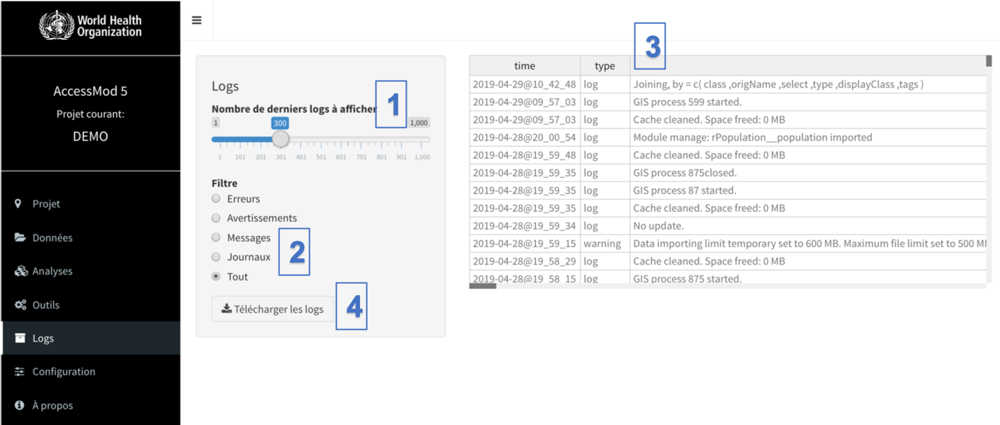

Le module de logs stocke tous les événements majeurs (logs) se produisant pendant une session AccessMod, tels que l’ouverture d’un projet, l’importation de données ou la réalisation d’analyses. Un tel journal de logs constitue une excellente source d'informations pour l'équipe AccessMod en cas de problème, et doit donc être inclus dans tout courrier électronique signalant un problème dans AccessMod.

Quatre types de logs peuvent être affichés:

1.  *Les erreurs.* Ce type de log rapporte les événements critiques qui ont empêché AccessMod de fonctionner correctement. Cela pourrait être lié à un bug ou à un événement inattendu. Étant donné le niveau élevé de complexité des données spatiales, cela peut arriver de temps en temps. Il s’agit généralement d’une erreur de la part de l'utilisateur. L'examen du texte du log peut aider l'utilisateur à résoudre le problème. Si vous pensez que ceci est un bug dans AccessMod, vous pouvez le signaler dans GitHub (voir ci-dessous).*\
    *
2.  *Avertissements*. Ce type de log représente des événements susceptibles d'entraîner un comportement inattendu, tel que la mise à niveau d'AccessMod, l'importation de données non standard ou l'exécution de tâches inattendues. Il répertorie également les événements inattendus, tels que des données internes manquantes ou des paramètres de métadonnées incorrects, qui empêchent l'application de continuer à s'exécuter.
3.  *Messages*. Il s'agit d'un type de log spécial, utilisé principalement pour le déboggage de l'application et pouvant représenter de nombreux événements différents. Son but est de souligner les événements peu fréquents.
4.  *Journaux (logs)*. Ce type de log contient la liste de tous les messages de routine concernant ce qui se passe dans AccessMod. C'est comme un "mode verbeux" dans la plupart des systèmes informatiques.

Le module Logs et ses fonctionnalités sont les suivants:

(1) Dans «Nombre de derniers logs à afficher», vous pouvez sélectionner le nombre de derniers logs que vous souhaitez voir avec le curseur de déplacement.

(2) Le bouton radio "Filtre" vous permet de choisir le type de logs à afficher (Erreurs, Avertissements, Messages, Journaux, ou tout. Voir ci-dessus pour obtenir des explications).

(3) La table log, à droite de l'écran, indique l'endroit où l'heure, le type et le contenu de chaque log pour la sélection définie aux étapes 1 et 2 sont affichés.

(4) Le bouton "Télécharger les logs" vous permet de télécharger un tableau (\*.csv), avec tous les logs affichés dans la table

Les utilisateurs peuvent signaler des bugs potentiels en ajoutant un nouveau problème ou en mettant à jour un problème existant dans le projet AccessMod sur Github à l'adresse suivante: <https://github.com/fxi/AccessMod_shiny/issues>. Veuillez noter que vous devez d'abord avoir un compte Github (gratuit) avant d'utiliser ce site Web. 

Lorsque vous signalez un bug, veuillez:

-   Indiquer le numéro de révision locale de la version que vous utilisiez lorsque le bug s'est produit (voir Section 5.9.2 pour trouver ce numéro).
-   Etre aussi précis que possible en indiquant le module et, le cas échéant, le ou les outils, le problème exact dans le titre du problème et indiquer autant d'informations que possible dans la section texte libre du problème.
-   Copier les dernières lignes de tous les logs dans le rapport de problème, car cela pourrait grandement faciliter la résolution du problème.
-   Inclure un lien vers le jeu de données que vous utilisiez au moment du bug. Si le jeu de données est trop volumineux pour être partagé ou si l'accès est restreint, un échantillon de ce dernier serait déjà très utile.

Le dossier AccessMod Github peut également être utilisé pour partager les fonctionnalités souhaitées avec l'équipe AccessMod. 

Lorsque vous soumettez une demande pour qu'une nouvelle fonctionnalité soit considérée pour une prochaine version d'AccessMod, veuillez:

-   Indiquer qu'il s'agit d'une demande d'amélioration dans le titre de la publication.
-   Etre aussi précis que possible et indiquer le contexte dans lequel de telles améliorations seraient utiles dans la section texte libre du problème.
